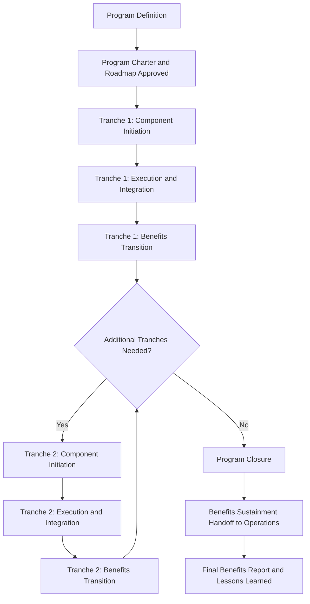

## Program Life Cycle

### Overview

The program life cycle defines the sequence of phases through which a program progresses from initial strategic conception through the delivery and sustainment of benefits, and ultimately to program closure. Unlike a project life cycle, which centers on producing a defined deliverable, the program life cycle centers on the ongoing realization and eventual transition of strategic benefits, and typically spans a longer, more iterative timeframe.

### Core Phases of the Program Life Cycle

#### 1. Program Definition

Establishes the program's strategic rationale, high-level scope, and business case. Includes formulating the program charter, identifying the program's alignment to organizational strategy, and securing initial sponsorship and funding authorization.

#### 2. Program Benefits Delivery

The iterative, often cyclical phase in which constituent projects and program activities are planned, authorized, executed, and transitioned to deliver incremental benefits. This phase may repeat across multiple tranches or waves as new component projects are added and completed.

#### 3. Program Closure

Formal transition of the program to ongoing operations, confirmation that intended benefits have been realized (or a documented rationale if not), release of program resources, and organizational learning capture.

**Key Points**

- The program life cycle is often depicted as three interconnected phases rather than a strict linear sequence: Program Definition, Program Benefits Delivery, and Program Closure.
- Program Benefits Delivery is typically iterative and may involve multiple tranches (waves of component projects) rather than a single execution pass.
- Benefits realization can continue after formal program closure, requiring a transition plan to operations or business-as-usual ownership.

### Program Life Cycle Diagram (svg_diagram)

<svg xmlns="http://www.w3.org/2000/svg" viewBox="0 0 760 320">
<text x="380" y="30" text-anchor="middle" font-size="20" font-weight="bold" fill="#1a1a1a">Program Life Cycle Phases (svg_diagram)</text>
<rect x="40" y="120" width="180" height="80" rx="10" fill="#2c5aa0" />
<text x="130" y="155" text-anchor="middle" font-size="14" fill="#fff" font-weight="bold">Program</text>
<text x="130" y="175" text-anchor="middle" font-size="14" fill="#fff" font-weight="bold">Definition</text>
<rect x="290" y="100" width="220" height="120" rx="10" fill="#4c8bf5" />
<text x="400" y="140" text-anchor="middle" font-size="14" fill="#fff" font-weight="bold">Program Benefits</text>
<text x="400" y="160" text-anchor="middle" font-size="14" fill="#fff" font-weight="bold">Delivery</text>
<text x="400" y="185" text-anchor="middle" font-size="12" fill="#fff">(Iterative Tranches)</text>
<rect x="580" y="120" width="150" height="80" rx="10" fill="#5cb85c" />
<text x="655" y="155" text-anchor="middle" font-size="14" fill="#fff" font-weight="bold">Program</text>
<text x="655" y="175" text-anchor="middle" font-size="14" fill="#fff" font-weight="bold">Closure</text>
<path d="M 220 160 L 285 160" stroke="#333" stroke-width="2" fill="none" marker-end="url(#arrow)" />
<path d="M 510 160 L 575 160" stroke="#333" stroke-width="2" fill="none" marker-end="url(#arrow)" />
<path d="M 400 100 C 400 60, 320 60, 320 100" stroke="#333" stroke-width="2" fill="none" marker-end="url(#arrow)" />
<text x="360" y="55" text-anchor="middle" font-size="11" fill="#555">Iterate Across Tranches</text>
</svg>

### Detailed Phase Breakdown

#### Program Definition Phase

- **Program Formulation**: Develop the program business case, articulate the strategic rationale, and define expected benefits at a high level.
- **Program Preparation**: Develop the program charter, roadmap, governance structure, and initial program management plan; identify constituent projects and their sequencing.
- **Exit criteria**: Formal approval and authorization to proceed, typically via a governance board or executive sponsor sign-off.

#### Program Benefits Delivery Phase

- **Component Initiation**: Constituent projects and subprograms are authorized, chartered, and initiated in planned sequence or tranche.
- **Component Planning and Authorization**: Each component's scope, schedule, and resources are planned and approved within the context of overall program constraints.
- **Component Oversight and Integration**: The program manager monitors cross-project dependencies, shared resources, and risks; integrates outputs from completed components.
- **Benefits Transition**: As components complete, their outputs are transitioned into operational use to begin generating measurable benefit.
- This phase is often **iterative** — subsequent tranches of component projects may be planned based on lessons learned and evolving strategic priorities from earlier tranches.

#### Program Closure Phase

- **Benefits Sustainment Planning**: Establish how realized benefits will be sustained and measured after the program organization disbands.
- **Program Transition**: Transition remaining ongoing activities and any unrealized benefit tracking to operational or business-as-usual ownership.
- **Program Closure**: Formal closure includes final benefits reporting, financial closure, resource release, contract closure (if applicable), and lessons learned documentation.

### Program Life Cycle Flow with Tranches

### Comparison: Program Life Cycle vs. Project Life Cycle

| Aspect | Project Life Cycle | Program Life Cycle |
| --- | --- | --- |
| Structure | Typically linear (Initiate → Plan → Execute → Close) | Iterative, tranche-based, with overlapping component life cycles |
| Duration | Fixed and bounded | Often extended, sometimes multi-year |
| Success Confirmation | At project closure | May extend beyond program closure into benefits sustainment |
| Change Handling | Formal change control to protect baseline | Ongoing strategic realignment expected across tranches |
| Closure Trigger | Deliverable accepted | Benefits realized or program rationale no longer valid |

### Example: Program Life Cycle in Practice

**Scenario**: A financial services firm launches a "Regulatory Compliance Modernization" program.

- **Program Definition**: Business case built around new regulatory requirements; program charter approved by the executive risk committee; roadmap identifies three tranches of component projects (data infrastructure, reporting automation, audit trail systems).
- **Tranche 1 (Benefits Delivery)**: Data infrastructure project and initial reporting automation project execute concurrently; program manager resolves a resource contention between them over shared database engineers; first measurable benefit (reduced manual reporting hours) is realized upon Tranche 1 completion.
- **Tranche 2 (Benefits Delivery)**: Based on lessons learned from Tranche 1, the audit trail systems project is re-scoped before initiation to leverage the now-completed data infrastructure, altering its original plan.
- **Program Closure**: After all tranches complete, the program transitions ongoing compliance monitoring to the operations team, confirms the target reduction in audit findings has been achieved, and formally closes with a lessons-learned report.

This demonstrates the iterative, benefit-oriented nature of the program life cycle as distinct from a single linear project execution.

### Governance Touchpoints Across the Life Cycle

| Phase | Typical Governance Activity |
| --- | --- |
| Program Definition | Charter approval, initial funding authorization |
| Tranche Initiation | Tranche-level business case review and go/no-go decision |
| Benefits Delivery | Periodic program governance board reviews; risk and dependency escalation |
| Benefits Transition | Formal benefit sign-off by business owner |
| Program Closure | Final governance review, resource release approval, closure sign-off |

### Common Pitfalls

- Treating the program life cycle as strictly linear, causing rigid planning that cannot adapt across tranches as strategic context evolves.
- Failing to plan for benefits sustainment before program closure, resulting in benefit erosion once the program organization disbands.
- Closing a program prematurely based on component completion rather than confirmed benefit realization.
- Underestimating the governance overhead required to manage tranche-to-tranche transitions and cross-tranche lessons learned.
- Not revisiting the program business case periodically, leading to continued investment in a program whose original strategic rationale has become obsolete.

### Conclusion

The program life cycle — spanning Program Definition, Program Benefits Delivery, and Program Closure — provides the structural framework for coordinating multiple related projects toward a strategic outcome over an extended, often iterative timeframe. Its tranche-based, benefit-oriented nature distinguishes it fundamentally from the more linear, deliverable-oriented project life cycle, and requires governance mechanisms capable of managing ongoing realignment as the program progresses.

**Related Topics**

- Program versus Project Management
- Benefit Realization Management
- Program Governance Structures
- Tranche Planning and Component Sequencing
- Program Roadmap Development
- Managing Interdependencies Across Projects
- Organizational Change Management in Programs
- Portfolio Management Fundamentals