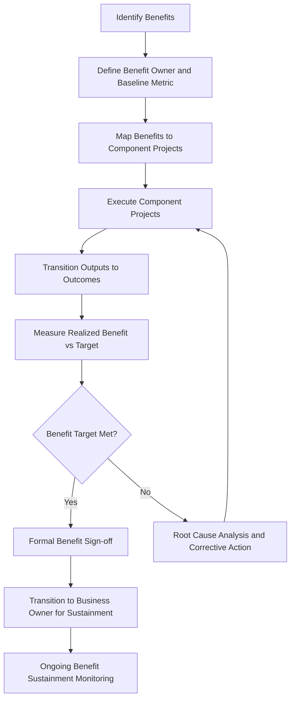

## Program Governance and Benefits Management


### Overview

Program governance is the framework of roles, structures, policies, and decision-making processes that guide a program throughout its life cycle, ensuring alignment with organizational strategy and effective oversight of constituent components. Benefits management is the discipline of identifying, defining, tracking, realizing, and sustaining the benefits a program was chartered to deliver. Together, they form the mechanism by which a program is steered toward its strategic purpose and held accountable for delivering real value, not just completed deliverables.

### Program Governance

#### Purpose of Program Governance

Program governance provides the decision-making authority, oversight structures, and accountability mechanisms needed to manage a program's complexity — multiple stakeholders, interdependent components, shared resources, and evolving strategic context — in a consistent and controlled manner.

**Key Points**

- Governance defines who can make what decisions, at what level, and under what authority.
- Effective program governance balances central control with enough flexibility for constituent project managers to operate autonomously within their scope.
- Governance structures typically operate in tiers: strategic (executive sponsor/steering committee), program (program governance board), and component (individual project governance).

#### Core Governance Structures

**Program Sponsor / Executive Sponsor**: Provides strategic direction, secures funding, and has ultimate accountability for the program's success and benefit realization.

**Program Governance Board (Program Steering Committee)**: A cross-functional body, often including business unit leaders and key stakeholders, that reviews program progress, approves major decisions, resolves cross-project conflicts, and authorizes tranche transitions.

**Program Management Office (PgMO)**: Provides standardized processes, tools, reporting templates, and support functions across the program and its components; may also directly support benefits tracking and governance reporting.

**Program Manager**: Executes governance decisions, manages day-to-day program coordination, escalates issues requiring governance board attention, and manages cross-component risk and dependency.

**Component (Project) Governance**: Each constituent project retains its own governance layer (e.g., project sponsor, change control board) that operates within the boundaries set by program governance.

#### Governance Structure Diagram (svg_diagram)

<svg xmlns="http://www.w3.org/2000/svg" viewBox="0 0 760 400">
<text x="380" y="30" text-anchor="middle" font-size="20" font-weight="bold" fill="#1a1a1a">Program Governance Structure (svg_diagram)</text>
<rect x="260" y="55" width="240" height="55" rx="8" fill="#2c5aa0" />
<text x="380" y="88" text-anchor="middle" font-size="14" fill="#fff" font-weight="bold">Executive Sponsor</text>
<rect x="240" y="140" width="280" height="55" rx="8" fill="#4c8bf5" />
<text x="380" y="173" text-anchor="middle" font-size="14" fill="#fff" font-weight="bold">Program Governance Board</text>
<rect x="290" y="225" width="180" height="55" rx="8" fill="#5cb85c" />
<text x="380" y="258" text-anchor="middle" font-size="14" fill="#fff" font-weight="bold">Program Manager</text>
<g font-size="12" fill="#fff">
<rect x="60" y="320" width="160" height="55" rx="8" fill="#f0ad4e" />
<text x="140" y="350" text-anchor="middle" font-weight="bold">Project A Governance</text>



```
<rect x="300" y="320" width="160" height="55" rx="8" fill="#f0ad4e" />
<text x="380" y="350" text-anchor="middle" font-weight="bold">Project B Governance</text>

<rect x="540" y="320" width="160" height="55" rx="8" fill="#f0ad4e" />
<text x="620" y="350" text-anchor="middle" font-weight="bold">Project C Governance</text>
```

</g>
<g stroke="#999" stroke-width="1.5" opacity="0.6">
<line x1="380" y1="110" x2="380" y2="140" />
<line x1="380" y1="195" x2="380" y2="225" />
<line x1="380" y1="280" x2="140" y2="320" />
<line x1="380" y1="280" x2="380" y2="320" />
<line x1="380" y1="280" x2="620" y2="320" />
</g>
</svg>

#### Governance Decision Rights (RACI-Style Example)

| Decision Type | Program Manager | Governance Board | Component Project Manager |
| --- | --- | --- | --- |
| Program charter approval | Recommends | Approves | Informed |
| Cross-project resource reallocation | Recommends | Approves (if significant) | Consulted |
| Component-level scope change (within baseline) | Informed | Informed | Approves |
| Tranche transition go/no-go | Recommends | Approves | Informed |
| Program-level risk escalation response | Recommends | Approves | Responsible for reporting risk |
| Benefit realization sign-off | Recommends | Approves | Consulted |

### Benefits Management

#### Purpose of Benefits Management

Benefits management ensures that the strategic value a program was created to deliver is explicitly defined, actively tracked throughout execution, and formally confirmed and sustained after component delivery — closing the gap between "projects completed" and "value achieved."

**Key Points**

- A benefit is a measurable improvement resulting from an outcome perceived as an advantage by a stakeholder (e.g., cost reduction, revenue growth, risk reduction, customer satisfaction improvement).
- Benefits realization often occurs after the program's constituent projects have completed, requiring ongoing tracking beyond program closure in some cases.
- Benefits management requires a named benefit owner (typically a business stakeholder) who is accountable for realizing and sustaining the benefit, distinct from the program manager who is accountable for delivery.

#### Benefits Management Life Cycle

1. **Identify**: Define the target benefits during program formulation, linking each to a strategic objective.
2. **Analyze and Plan**: Quantify each benefit, define measurement methods and baselines, and assign a benefit owner.
3. **Deliver (Execute and Transition)**: Constituent projects deliver outputs; outputs are transitioned into outcomes as they enter operational use.
4. **Transition**: Formally hand off responsibility for sustaining the benefit to the business owner/operations.
5. **Sustain**: Monitor the benefit over time to confirm it persists and does not erode after program closure.

#### Benefits Management Flow



#### The Benefits Register

A benefits register is the primary artifact for tracking benefits throughout the program life cycle.

| Field | Description |
| --- | --- |
| Benefit ID | Unique identifier |
| Benefit Description | What the benefit is and why it matters strategically |
| Benefit Owner | Business stakeholder accountable for realization |
| Baseline Metric | Current-state measurement before program delivery |
| Target Metric | Expected measurement after realization |
| Measurement Method | How and how often the benefit is measured |
| Contributing Components | Which projects/subprograms contribute to this benefit |
| Realization Date (Planned/Actual) | When the benefit is expected/confirmed realized |
| Status | Not started, in progress, realized, at risk, not realized |

#### Example: Benefits Management in Practice

**Scenario**: A healthcare organization runs a "Patient Wait Time Reduction" program.

- **Identify**: Target benefit defined as "reduce average emergency department wait time from 90 minutes to 45 minutes within 12 months of program completion."
- **Analyze and Plan**: Benefit owner assigned (Chief Nursing Officer); baseline of 90 minutes confirmed via 6-month historical data; three contributing projects identified (triage process redesign, staffing model project, patient tracking system project).
- **Deliver**: All three projects execute; the patient tracking system project experiences a two-month delay, prompting the program governance board to assess impact on the overall benefit timeline.
- **Transition**: As each project completes, its output (e.g., new triage protocol) is handed to operations for live use.
- **Sustain**: Six months after full transition, wait times average 48 minutes — close to target. The benefit owner and program manager conduct a root cause review of the 3-minute gap and identify a staffing shortfall on weekends as a contributing factor, triggering a corrective operational action outside the formal program structure.

This illustrates that benefit realization is confirmed through ongoing operational measurement, not simply through project completion, and that benefit ownership persists into the sustainment period.

### Governance and Benefits Management Integration

Program governance and benefits management are interdependent: governance provides the decision authority to make trade-offs (e.g., re-sequencing components, reallocating resources) specifically in service of protecting benefit realization, while benefits management provides the data and rationale that governance decisions rely on.

$$Benefit\ Realization\ Rate = \frac{Actual\ Benefit\ Achieved}{Target\ Benefit\ Planned} \times 100$$


$$Benefit\ Realization\ Index\ (per\ component) = \frac{Benefit\ Attributable\ to\ Component}{Total\ Program\ Benefit\ Target}$$

### Common Governance and Benefits Management Pitfalls

- Establishing governance structures without clear decision rights, leading to slow or contested decisions.
- Failing to appoint a named benefit owner distinct from the program manager, leaving no one accountable once the program organization disbands.
- Treating benefits management as a one-time calculation at program closure rather than an ongoing tracking discipline.
- Governance boards focusing exclusively on schedule/budget status of constituent projects while losing sight of benefit realization progress.
- Not adjusting the benefits register as scope or strategic context evolves across tranches, leaving stale or irrelevant benefit targets in place.
- Underestimating the organizational change management required to actually realize a benefit (e.g., a new system delivered does not automatically produce adoption or efficiency gains without accompanying process and behavior change).

### Conclusion

Program governance provides the structured decision-making authority and oversight necessary to manage a program's complexity and cross-component interdependencies, while benefits management provides the disciplined tracking mechanism that ensures the program's strategic purpose — realized value, not just completed deliverables — is actually achieved and sustained. Effective programs treat these as tightly integrated disciplines, with governance decisions consistently anchored to benefit realization data throughout the program life cycle and beyond formal closure.

**Related Topics**

- Program versus Project Management
- Program Life Cycle
- Program Risk Management
- Stakeholder Engagement at the Program Level
- Organizational Change Management in Programs
- Portfolio Governance and Strategic Alignment
- Business Case Development
- Program Management Office (PgMO) Structures