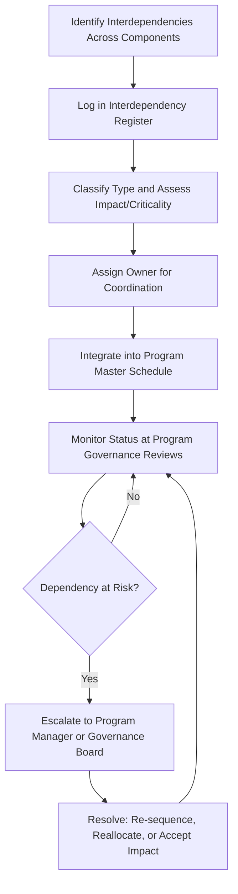

## Managing Interdependencies Across Projects

### Overview

Interdependency management is the discipline of identifying, tracking, and coordinating the relationships between projects within a program (or across a portfolio) where the output, timing, resources, or risk profile of one project affects another. Because a program's value often derives specifically from the coordinated delivery of interrelated projects, managing these interdependencies effectively is a defining responsibility of program management, distinct from what any single project manager can address in isolation.

### Why Interdependency Management Matters

Individual project managers optimize for their own project's scope, schedule, and budget. Without a coordinating mechanism, interdependencies between projects — shared resources, sequential deliverables, common risks — can be invisible to any one project manager until they cause a disruption. Interdependency management provides the visibility and authority to resolve these conflicts proactively.

**Key Points**

- Interdependencies are a primary source of program-level risk that does not exist at the individual project level.
- Left unmanaged, interdependencies tend to surface as late-discovered blockers rather than planned coordination points.
- The program manager (or a program management office) typically owns the interdependency management process, since no single project manager has visibility or authority across all components.

### Types of Interdependencies

#### Sequential (Finish-to-Start) Dependencies

One project's deliverable is required before another project can begin or complete a phase (e.g., a data platform project must deliver infrastructure before an analytics project can build on it).

#### Resource Dependencies

Multiple projects require the same limited resource (personnel with specific skills, shared equipment, budget allocation) at overlapping times, creating contention.

#### Technical/Architectural Dependencies

Projects share or must integrate with a common technical component, standard, or architecture (e.g., multiple projects integrating with the same API or data model).

#### Deliverable/Output Dependencies

One project's output is a direct input to another (e.g., a requirements-gathering project's output feeds a design project).

#### Risk Dependencies

A risk materializing in one project has cascading impact on another (e.g., a vendor delay in Project A introduces schedule risk to Project B, which depends on Project A's vendor deliverable).

#### Financial/Budget Dependencies

Projects draw from a shared program budget pool, such that overspend in one project constrains funding available to another.

#### Stakeholder Dependencies

Projects share key stakeholders or decision-makers whose availability or competing priorities affect multiple projects simultaneously.

### Interdependency Types Diagram (svg_diagram)

<svg xmlns="http://www.w3.org/2000/svg" viewBox="0 0 760 420">
<text x="380" y="30" text-anchor="middle" font-size="20" font-weight="bold" fill="#1a1a1a">Types of Cross-Project Interdependencies (svg_diagram)</text>
<circle cx="380" cy="230" r="65" fill="#2c5aa0" opacity="0.15" stroke="#2c5aa0" stroke-width="2" />
<text x="380" y="225" text-anchor="middle" font-size="14" font-weight="bold" fill="#1a1a1a">Program</text>
<text x="380" y="245" text-anchor="middle" font-size="14" font-weight="bold" fill="#1a1a1a">Coordination</text>
<g font-size="12" fill="#fff">
<circle cx="380" cy="90" r="52" fill="#4c8bf5" opacity="0.9" />
<text x="380" y="94" text-anchor="middle">Sequential</text>



```
<circle cx="560" cy="150" r="52" fill="#5cb85c" opacity="0.9" />
<text x="560" y="154" text-anchor="middle">Resource</text>

<circle cx="590" cy="320" r="52" fill="#f0ad4e" opacity="0.9" />
<text x="590" y="316" text-anchor="middle">Technical /</text>
<text x="590" y="332" text-anchor="middle">Architectural</text>

<circle cx="440" cy="400" r="52" fill="#d9534f" opacity="0.9" />
<text x="440" y="404" text-anchor="middle">Deliverable</text>

<circle cx="270" cy="400" r="52" fill="#5bc0de" opacity="0.9" />
<text x="270" y="404" text-anchor="middle">Risk</text>

<circle cx="150" cy="320" r="52" fill="#9370db" opacity="0.9" />
<text x="150" y="316" text-anchor="middle">Financial /</text>
<text x="150" y="332" text-anchor="middle">Budget</text>

<circle cx="180" cy="150" r="52" fill="#e07bb0" opacity="0.9" />
<text x="180" y="146" text-anchor="middle">Stakeholder</text>
```

</g>
</svg>

### Interdependency Management Process



### The Interdependency Register

A structured log is the core artifact for tracking cross-project dependencies.

| Field | Description |
| --- | --- |
| Dependency ID | Unique identifier |
| Description | Nature of the dependency |
| Type | Sequential, Resource, Technical, Deliverable, Risk, Financial, Stakeholder |
| Source Project | The project the dependency originates from |
| Target Project | The project affected by the dependency |
| Criticality | Impact level if the dependency is not met (e.g., High/Medium/Low) |
| Owner | Person responsible for monitoring/resolving |
| Status | On track, at risk, breached, resolved |
| Resolution Plan | Action plan if the dependency is at risk |

### Techniques for Managing Interdependencies

#### Program Master Schedule (Integrated Schedule)

A consolidated schedule view that aggregates key milestones and dependency points across all constituent projects, allowing the program manager to see cross-project impacts that are invisible in any single project's schedule.

#### Dependency Mapping / Network Diagrams

Visual mapping of which projects feed into or depend on others, similar in concept to a project-level network diagram but at the program level, to identify critical paths that span multiple projects.

#### Resource Capacity Planning at the Program Level

Centralized visibility into shared resource pools (e.g., a shared engineering team) to detect and resolve contention before it causes schedule slippage in multiple projects simultaneously.

#### Regular Cross-Project Coordination Forums

Recurring meetings (e.g., a "Program Sync" or "Scrum of Scrums" in agile-scaled contexts) where project managers or representatives surface emerging dependency risks to the program manager.

#### Risk Interdependency Analysis

Explicitly reviewing whether risks identified in one project's risk register have downstream impact on other components, and logging those as program-level risks.

### Example: Managing a Resource Interdependency

**Scenario**: A program includes Project A (core platform migration) and Project B (new reporting module), both requiring the same three senior database engineers during overlapping weeks.

- **Identification**: During program schedule integration, the program manager notices both projects have flagged the same database engineers as critical resources for weeks 5–8.
- **Logging**: The resource dependency is logged in the interdependency register with High criticality, since both projects would be blocked without resolution.
- **Escalation and Resolution**: The program manager brings the conflict to the program governance board rather than leaving Project A and Project B managers to negotiate independently, since a suboptimal local resolution (e.g., Project B manager informally "borrowing" the engineers) could jeopardize Project A's critical path.
- **Decision**: Governance board approves temporarily bringing in a contracted database engineer to relieve contention, funded from program-level contingency reserve, avoiding delay to either project's milestone.

This illustrates why resource interdependencies typically require program-level authority to resolve — a decision affecting a shared, finite resource across two projects exceeds what either project manager can unilaterally solve.

### Example: Managing a Sequential Interdependency

**Scenario**: Project A (customer data platform) must deliver a validated data model before Project B (analytics dashboard) can begin its design phase.

- The program manager tracks this as a Finish-to-Start dependency in the program master schedule, with Project A's "data model validated" milestone as the trigger for Project B's design phase start.
- When Project A's data model validation slips by three weeks due to unresolved data quality issues, the program manager immediately assesses downstream impact on Project B rather than waiting for Project B's manager to notice a missing input.
- The program manager negotiates a mitigation: Project B begins preliminary design work using a subset of already-validated data fields, partially decoupling the strict sequential dependency and minimizing schedule impact.

### Governance's Role in Interdependency Resolution

| Escalation Level | Typical Trigger | Resolution Authority |
| --- | --- | --- |
| Project-to-project (informal) | Low-criticality, easily negotiated dependency | Project managers directly |
| Program manager | Medium-to-high criticality, cross-project trade-off needed | Program manager |
| Program governance board | High criticality, affects program benefit realization or requires resource/budget reallocation beyond program manager's authority | Governance board |

### Common Pitfalls

- Relying solely on individual project schedules without an integrated program master schedule, causing dependencies to be discovered only when a downstream project is already blocked.
- Treating interdependency management as a one-time planning exercise rather than an ongoing tracked discipline throughout program execution.
- Allowing project managers to resolve significant cross-project resource conflicts informally, leading to inconsistent prioritization decisions that favor whichever project manager escalates loudest.
- Failing to log risk interdependencies, so a risk realized in one project catches a dependent project entirely by surprise.
- Underestimating stakeholder dependency — key decision-makers shared across projects becoming a bottleneck that is not tracked as a formal interdependency.

### Conclusion

Managing interdependencies across projects is a core value driver of program management, addressing the coordination challenges — sequential dependencies, resource contention, shared technical architecture, and cascading risk — that exist specifically because projects are related, not in spite of it. A disciplined interdependency register, an integrated program master schedule, and clear escalation authority allow a program manager to proactively resolve conflicts that would otherwise surface as late-discovered blockers within individual projects.

**Related Topics**

- Program versus Project Management
- Program Life Cycle
- Program Governance and Benefits Management
- Program Risk Management
- Resource Management Across a Program
- Program Master Scheduling Techniques
- Scaled Agile Coordination (Scrum of Scrums, SAFe)
- Critical Path and Critical Chain Analysis