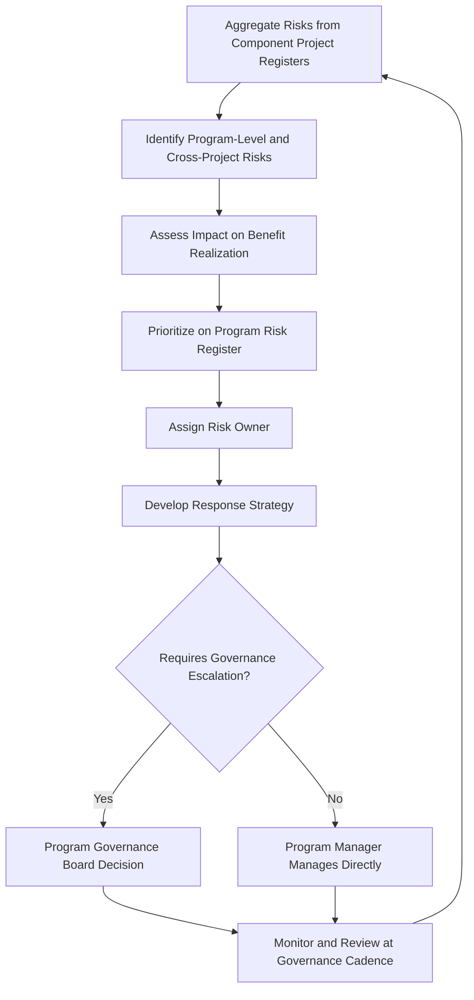

## Program Risk and Stakeholder Management


### Overview

Program risk management is the discipline of identifying, analyzing, and responding to uncertainties that threaten benefit realization at the program level — including risks that emerge from the interaction of constituent projects, not just risks internal to any single project. Program stakeholder management is the discipline of identifying, analyzing, and engaging the broader and more complex set of stakeholders whose interests, influence, and expectations span multiple components and the strategic outcome of the program as a whole. Both disciplines operate at a higher level of complexity and consequence than their project-level counterparts.

### Program Risk Management

#### Distinguishing Program Risk from Project Risk

Project risk management focuses on threats and opportunities affecting a single project's scope, schedule, cost, and quality. Program risk management additionally addresses risks that:

- Arise from the interaction or interdependency between multiple projects (e.g., a risk in one project cascading into another).
- Threaten the program's overall benefit realization even if individual projects succeed technically.
- Originate at the program level itself (e.g., loss of executive sponsorship, shifting organizational strategy, funding cuts across the program).
- Are aggregated from multiple project-level risk registers into a consolidated program risk view.

**Key Points**

- A risk that is low-impact within a single project's scope can become high-impact when its cascading effect on dependent projects is considered.
- Program risk management requires visibility across all constituent project risk registers, which no individual project manager possesses.
- Program-level risks often relate to strategic alignment, funding continuity, and organizational change, not solely technical or delivery risk.

#### Categories of Program-Level Risk

| Category | Example |
| --- | --- |
| Interdependency Risk | Delay in one project cascades to block another |
| Resource Risk | Program-wide contention for scarce specialized skills |
| Strategic/Alignment Risk | Organizational priorities shift, threatening program rationale |
| Sponsorship Risk | Loss of executive sponsor reduces program funding or priority |
| Benefit Realization Risk | Component outputs delivered but benefits fail to materialize |
| Integration Risk | Technical incompatibility between component project outputs |
| External/Environmental Risk | Regulatory, market, or economic changes affecting the program's business case |

#### Program Risk Management Process



#### The Program Risk Register

| Field | Description |
| --- | --- |
| Risk ID | Unique identifier |
| Description | Nature of the risk |
| Category | Interdependency, Resource, Strategic, Sponsorship, Benefit Realization, Integration, External |
| Source | Which component(s) or program-level factor originated the risk |
| Probability / Impact | Standard risk scoring, assessed at program (not just project) impact scale |
| Affected Components | Which projects/benefits are affected if realized |
| Owner | Accountable individual |
| Response Strategy | Avoid, mitigate, transfer, accept (or exploit/enhance for opportunities) |
| Status | Open, monitored, realized, closed |

#### Example: Program Risk Escalation

**Scenario**: In a program with four constituent projects, Project C's risk register flags a "Medium" probability, "Medium" impact risk that its primary technology vendor may miss a delivery date.

- At the project level, this risk appears manageable with standard contingency.
- During program risk aggregation, the program manager identifies that Project D's start date is contractually tied to Project C's vendor deliverable, and Project D's delay would, in turn, threaten the program's flagship benefit (a Q4 regulatory compliance deadline with financial penalties for non-compliance).
- Reassessed at the program level, this risk is reclassified as "High" impact due to its cascading effect on benefit realization, and escalated to the governance board, which authorizes an accelerated vendor contract clause and contingency budget to mitigate.

This illustrates why program-level risk assessment must reassess project-level risks in the context of cross-project impact and benefit realization, rather than simply aggregating raw project risk scores.

### Program Stakeholder Management

#### Distinguishing Program Stakeholders from Project Stakeholders

Program stakeholders often span multiple business units, external partners, regulatory bodies, and executive leadership — a broader and typically more politically complex group than a single project's stakeholders. Their interests may be in tension across different components of the program (e.g., one business unit benefiting from a component that another must fund or resource).

**Key Points**

- Program stakeholder management requires reconciling potentially conflicting interests across multiple business units or components.
- Executive-level engagement is more central and sustained in program stakeholder management than typically required at the project level.
- Stakeholder influence and interest can shift across tranches as different components become active, requiring ongoing reassessment rather than a one-time analysis.

#### Program Stakeholder Categories

- **Program Sponsor / Executive Steering Committee**: Primary source of authority and strategic direction.
- **Benefit Owners**: Business stakeholders accountable for realizing specific program benefits.
- **Component Project Sponsors/Managers**: Stakeholders within each constituent project who also have program-level visibility needs.
- **Impacted Business Units**: Groups whose operations will change as a result of program outputs.
- **External Stakeholders**: Regulators, vendors, partners, or customers affected by or influencing the program.
- **Resource-Providing Functions**: Shared services (IT, finance, HR) that supply resources across multiple components and have their own competing priorities.

#### Program Stakeholder Engagement Diagram (svg_diagram)

<svg xmlns="http://www.w3.org/2000/svg" viewBox="0 0 760 380">
<text x="380" y="30" text-anchor="middle" font-size="20" font-weight="bold" fill="#1a1a1a">Program Stakeholder Landscape (svg_diagram)</text>
<circle cx="380" cy="210" r="60" fill="#2c5aa0" opacity="0.2" stroke="#2c5aa0" stroke-width="2" />
<text x="380" y="205" text-anchor="middle" font-size="14" font-weight="bold" fill="#1a1a1a">Program</text>
<text x="380" y="225" text-anchor="middle" font-size="14" font-weight="bold" fill="#1a1a1a">Manager</text>
<g font-size="12" fill="#fff">
<rect x="290" y="60" width="180" height="55" rx="8" fill="#4c8bf5" />
<text x="380" y="93" text-anchor="middle" font-weight="bold">Executive Sponsor</text>



```
<rect x="530" y="140" width="180" height="55" rx="8" fill="#5cb85c" />
<text x="620" y="173" text-anchor="middle" font-weight="bold">Benefit Owners</text>

<rect x="520" y="290" width="190" height="55" rx="8" fill="#f0ad4e" />
<text x="615" y="313" text-anchor="middle" font-weight="bold">External</text>
<text x="615" y="330" text-anchor="middle" font-weight="bold">Stakeholders</text>

<rect x="290" y="300" width="180" height="55" rx="8" fill="#d9534f" />
<text x="380" y="333" text-anchor="middle" font-weight="bold">Component PMs</text>

<rect x="50" y="290" width="190" height="55" rx="8" fill="#5bc0de" />
<text x="145" y="313" text-anchor="middle" font-weight="bold">Impacted</text>
<text x="145" y="330" text-anchor="middle" font-weight="bold">Business Units</text>

<rect x="30" y="140" width="190" height="55" rx="8" fill="#9370db" />
<text x="125" y="173" text-anchor="middle" font-weight="bold">Shared Services</text>
```

</g>
<g stroke="#999" stroke-width="1.5" opacity="0.6">
<line x1="380" y1="150" x2="380" y2="115" />
<line x1="440" y1="180" x2="530" y2="165" />
<line x1="440" y1="250" x2="520" y2="300" />
<line x1="380" y1="270" x2="380" y2="300" />
<line x1="320" y1="250" x2="240" y2="300" />
<line x1="320" y1="180" x2="220" y2="165" />
</g>
</svg>

#### Program Stakeholder Engagement Process

- **Identify and Map**: Build a stakeholder register spanning all components, categorizing by influence, interest, and which specific benefit(s) they are tied to.
- **Analyze Cross-Component Tensions**: Explicitly assess where stakeholder interests may conflict across components (e.g., a business unit funding a component that primarily benefits another unit).
- **Engagement Planning**: Develop tailored engagement strategies per stakeholder group, with more frequent and senior engagement for high-influence/high-interest stakeholders (e.g., executive steering committee).
- **Communication Cadence**: Establish program-level communication (e.g., quarterly business reviews) distinct from and complementary to component-level project communications.
- **Ongoing Reassessment**: Revisit stakeholder analysis at each tranche transition, since stakeholder relevance and influence shift as different components become active.

#### Example: Managing Conflicting Stakeholder Interests

**Scenario**: A program to consolidate regional data centers includes a benefit owner in Finance (targeting cost reduction) and a benefit owner in IT Operations (targeting improved system reliability), both drawing from the same program budget.

- Early in the program, the Finance benefit owner pushes for accelerated timeline and minimal redundant infrastructure to maximize near-term cost savings.
- The IT Operations benefit owner advocates for additional redundancy investment to protect reliability targets, which increases cost and timeline.
- The program manager facilitates a joint governance board session, using the benefits register to quantify the trade-off (e.g., specific dollar cost of each additional redundancy increment against reliability improvement), enabling the governance board to make an informed trade-off decision rather than the program manager unilaterally favoring one stakeholder's priority.

This illustrates the program manager's role as a facilitator surfacing stakeholder tensions to appropriate governance authority, rather than attempting to resolve competing strategic priorities independently.

### Integration of Risk and Stakeholder Management

Program risk and stakeholder management are closely linked: many program-level risks (sponsorship loss, benefit realization risk, strategic misalignment) are fundamentally stakeholder-driven, and effective stakeholder engagement is itself a primary risk mitigation strategy. Regular, transparent communication with key stakeholders — particularly the executive sponsor and benefit owners — reduces the likelihood of late-discovered risks tied to shifting priorities or waning support.

### Common Pitfalls

- Treating program risk as simply the sum of project risk registers without reassessing cross-project cascading impact.
- Failing to maintain a program-level risk register distinct from and aggregating component project risks.
- Underestimating the political complexity of program stakeholders, particularly across business units with competing interests.
- Conducting stakeholder analysis once at program initiation without revisiting it as tranches and components change.
- Allowing the program manager to absorb stakeholder conflict resolution that properly belongs at the governance board level, creating perceived bias or overreach.
- Neglecting sponsorship risk — assuming executive support is static rather than actively monitoring and reinforcing it throughout the program.

### Conclusion

Program risk management extends beyond aggregating project-level risks to explicitly address cross-project cascading impact, benefit realization threats, and program-level strategic and sponsorship risk. Program stakeholder management similarly extends beyond project-level stakeholder engagement to reconcile competing interests across business units and sustain executive-level support throughout an extended, multi-component life cycle. Both disciplines rely on the program manager's visibility across the full program and on governance structures to resolve conflicts and risks that exceed any single project's authority.

**Related Topics**

- Program Governance and Benefits Management
- Managing Interdependencies Across Projects
- Program Life Cycle
- Stakeholder Analysis Techniques (Power/Interest Grid)
- Risk Response Strategies (Avoid, Mitigate, Transfer, Accept)
- Organizational Change Management in Programs
- Executive Communication and Reporting for Programs
- Conflict Resolution in Cross-Functional Governance