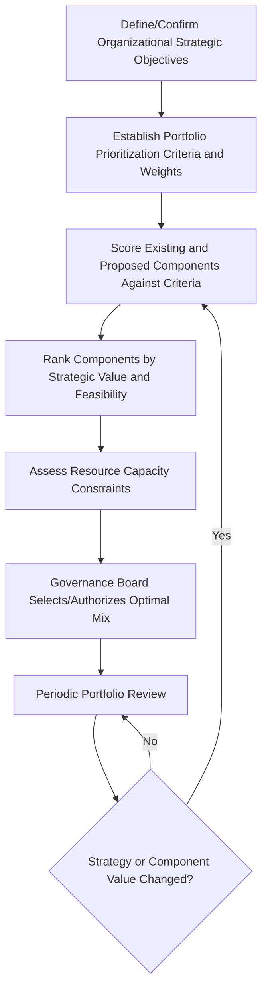

## Portfolio Governance and Strategy Alignment


### Overview

Portfolio governance is the framework of decision-making structures, policies, and processes used to select, prioritize, authorize, and oversee the collection of programs, projects, and operational work that make up an organization's portfolio. Strategy alignment is the ongoing discipline of ensuring that every component within the portfolio directly supports the organization's strategic objectives, and that the portfolio as a whole reflects the optimal allocation of constrained resources toward those objectives. Together, they form the highest-level governance layer in the portfolio-program-project hierarchy.

### Portfolio Governance

#### Purpose of Portfolio Governance

Portfolio governance provides the authority and structured process by which an organization decides what work to invest in, how much to invest, and when to start, continue, or stop that investment — based on strategic value and capacity rather than component-level advocacy alone.

**Key Points**

- Portfolio governance operates at the organizational/enterprise level, above program and project governance.
- Its primary output is authoritative decisions about component selection, prioritization, and resource allocation.
- Portfolio governance is inherently comparative — it evaluates components against each other and against strategic criteria, not against their own internal baselines alone.

#### Core Governance Structures

**Portfolio Sponsor / Executive Leadership**: Ultimate accountability for the portfolio's contribution to organizational strategy; typically the CEO, a business unit executive, or an equivalent senior leader.

**Portfolio Governance Board (Investment Committee)**: A cross-functional executive body responsible for reviewing, prioritizing, authorizing, and terminating portfolio components based on strategic fit, value, and capacity.

**Portfolio Manager**: Maintains the portfolio inventory, facilitates prioritization analysis, monitors aggregate portfolio performance, and prepares decision recommendations for the governance board.

**Portfolio Management Office (PfMO)**: Provides standardized governance processes, portfolio-level reporting, and supports the portfolio manager and governance board with data and analysis.

#### Portfolio Governance Structure Diagram (svg_diagram)

<svg xmlns="http://www.w3.org/2000/svg" viewBox="0 0 760 380">
<text x="380" y="30" text-anchor="middle" font-size="20" font-weight="bold" fill="#1a1a1a">Portfolio Governance Hierarchy (svg_diagram)</text>
<rect x="270" y="55" width="220" height="55" rx="8" fill="#2c5aa0" />
<text x="380" y="88" text-anchor="middle" font-size="14" fill="#fff" font-weight="bold">Executive Leadership</text>
<rect x="250" y="140" width="260" height="55" rx="8" fill="#4c8bf5" />
<text x="380" y="173" text-anchor="middle" font-size="14" fill="#fff" font-weight="bold">Portfolio Governance Board</text>
<rect x="290" y="225" width="180" height="55" rx="8" fill="#5cb85c" />
<text x="380" y="258" text-anchor="middle" font-size="14" fill="#fff" font-weight="bold">Portfolio Manager</text>
<g font-size="12" fill="#fff">
<rect x="40" y="310" width="150" height="55" rx="8" fill="#f0ad4e" />
<text x="115" y="342" text-anchor="middle" font-weight="bold">Program A</text>



```
<rect x="230" y="310" width="150" height="55" rx="8" fill="#f0ad4e" />
<text x="305" y="342" text-anchor="middle" font-weight="bold">Program B</text>

<rect x="420" y="310" width="150" height="55" rx="8" fill="#d9534f" />
<text x="495" y="342" text-anchor="middle" font-weight="bold">Project X</text>

<rect x="590" y="310" width="150" height="55" rx="8" fill="#d9534f" />
<text x="665" y="342" text-anchor="middle" font-weight="bold">Project Y</text>
```

</g>
<g stroke="#999" stroke-width="1.5" opacity="0.6">
<line x1="380" y1="110" x2="380" y2="140" />
<line x1="380" y1="195" x2="380" y2="225" />
<line x1="380" y1="280" x2="115" y2="310" />
<line x1="380" y1="280" x2="305" y2="310" />
<line x1="380" y1="280" x2="495" y2="310" />
<line x1="380" y1="280" x2="665" y2="310" />
</g>
</svg>

#### Portfolio Governance Decision Rights

| Decision Type | Portfolio Manager | Governance Board | Component Sponsor |
| --- | --- | --- | --- |
| New component intake/screening | Recommends | Approves | Requests |
| Component prioritization ranking | Facilitates analysis | Approves | Consulted |
| Resource allocation across components | Recommends | Approves | Informed |
| Component termination (kill decision) | Recommends | Approves | Informed |
| Portfolio strategic review cadence | Schedules and reports | Reviews and directs | Participates |

### Strategy Alignment

#### Purpose of Strategy Alignment

Strategy alignment ensures that the collective set of portfolio components reflects and advances the organization's strategic plan, and provides a defensible, criteria-based method for prioritizing and selecting among competing investment options.

**Key Points**

- Every portfolio component should be traceable to at least one strategic objective; components without clear strategic linkage are candidates for reassessment or termination.
- Strategic alignment is not a one-time filter at intake — it must be periodically reassessed as organizational strategy evolves.
- Alignment scoring typically uses a weighted, multi-criteria model rather than a single metric, since strategic value is multidimensional (financial return, risk reduction, market positioning, regulatory necessity, etc.).

#### Strategic Alignment Process



#### Common Prioritization Criteria

| Criterion | Example Metric |
| --- | --- |
| Strategic Fit | Weighted score against named strategic objectives |
| Financial Value | NPV, ROI, payback period |
| Risk Profile | Aggregate risk score, regulatory/compliance necessity |
| Resource Feasibility | Availability of required skills/capacity |
| Urgency/Time Sensitivity | Market window, contractual or regulatory deadline |
| Interdependency Value | Enables or is enabled by other high-value components |

#### Weighted Scoring Example

$$Strategic\ Alignment\ Score = \sum_{i=1}^{n} (Weight_i \times Criterion\ Score_i)$$

**Example calculation** for a proposed project scored against four weighted criteria (scores on a 1–5 scale):

| Criterion | Weight | Score | Weighted Value |
| --- | --- | --- | --- |
| Strategic Fit | 0.40 | 4 | 1.60 |
| Financial Value | 0.30 | 3 | 0.90 |
| Risk Profile | 0.15 | 5 | 0.75 |
| Resource Feasibility | 0.15 | 2 | 0.30 |
| **Total** | 1.00 | — | **3.55** |

This composite score is then compared against other candidate components competing for the same limited investment capacity, providing a defensible basis for governance board prioritization decisions.

### Balancing the Portfolio

Portfolio governance is also responsible for maintaining an appropriate balance across the portfolio as a whole, not just selecting the highest-scoring individual components. Common balancing dimensions include:

- **Risk balance**: Mix of high-risk/high-reward initiatives against lower-risk, stable-return initiatives.
- **Time horizon balance**: Mix of short-term wins and long-term strategic investments.
- **Innovation vs. run-the-business balance**: Allocation between transformative initiatives and operational/maintenance work.
- **Resource/capacity balance**: Ensuring the aggregate resource demand of selected components does not exceed organizational capacity.

### Example: Portfolio Governance in Practice

**Scenario**: A manufacturing company's portfolio governance board conducts its quarterly review with twelve active and proposed components competing for a fixed capital budget.

- The portfolio manager presents each component's updated strategic alignment score, current performance status, and resource consumption.
- Two components — a plant automation program and a legacy ERP upgrade project — score similarly on strategic fit, but the automation program has significantly higher financial value and lower resource feasibility risk.
- A third component, a customer portal project, scores well individually but its business sponsor's underlying strategic objective (a specific market expansion) was deprioritized in the organization's updated strategic plan the previous month.
- The governance board authorizes continued funding for the automation program, approves a phased (reduced-scope) continuation of the ERP upgrade due to resource constraints, and formally terminates the customer portal project, redirecting its allocated budget and resources to the higher-priority automation program.

This illustrates portfolio governance functioning as a comparative, capacity-constrained decision process explicitly tied to current strategic priorities — including the willingness to terminate a technically sound project when strategic alignment has shifted.

### Portfolio Governance Review Cadence

| Review Type | Frequency | Focus |
| --- | --- | --- |
| Component Intake Review | As proposals arise | Initial strategic fit and feasibility screening |
| Portfolio Performance Review | Monthly/Quarterly | Aggregate status, risk, resource utilization across components |
| Strategic Realignment Review | Annually or upon major strategy change | Re-score entire portfolio against updated strategic objectives |
| Component Continuation/Kill Review | Quarterly or at defined stage gates | Go/no-go decisions on individual components |

### Common Pitfalls

- Approving components based on sponsor influence or advocacy rather than consistent, criteria-based scoring.
- Treating strategic alignment as a one-time intake filter rather than an ongoing reassessment discipline.
- Failing to terminate underperforming or misaligned components due to sunk cost bias, consuming capacity better allocated elsewhere.
- Overloading the portfolio beyond actual resource capacity, causing systemic delays across all components rather than a smaller number of well-resourced ones.
- Using a single financial metric (e.g., ROI alone) rather than a balanced, multi-criteria model that reflects the full range of strategic value.
- Insufficient governance board diversity or authority, resulting in decisions that reflect departmental politics rather than enterprise-wide strategic priorities.

### Conclusion

Portfolio governance provides the enterprise-level decision-making authority to select, prioritize, balance, and terminate the programs and projects that constitute an organization's investment portfolio, while strategy alignment ensures that these decisions are consistently anchored to current organizational objectives through defensible, criteria-based evaluation. Together, they ensure that constrained organizational resources are directed toward the mix of initiatives that deliver the greatest strategic value, and that this alignment is actively maintained — not merely assumed — as strategy and component performance evolve over time.

**Related Topics**

- Program versus Project Management
- Program Governance and Benefits Management
- Portfolio Prioritization Techniques
- Business Case Development and Value Scoring
- Resource Capacity Planning at the Portfolio Level
- Strategic Planning and Objective Setting (OKRs)
- Portfolio Risk Management
- Stage-Gate and Kill Decision Frameworks