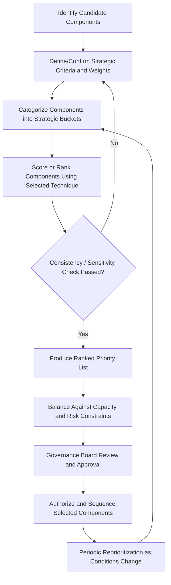

## Portfolio Prioritization Techniques

### Overview

Portfolio prioritization techniques are the structured methods by which organizations rank, select, and sequence candidate projects and programs within a portfolio to maximize strategic value while operating under constraints of budget, capacity, risk tolerance, and time. These techniques translate strategic objectives into an actionable, ranked list of components (projects, programs, or other work) so that limited resources are directed toward the highest-value, best-aligned initiatives.

Portfolio prioritization sits within the broader portfolio management lifecycle: identify components → categorize → evaluate → select → prioritize → balance → authorize. Prioritization specifically addresses the "which comes first" question once components have been evaluated against defined criteria.

### Why Prioritization Matters

- **Resource scarcity**: Organizations rarely have enough capital, staff, or time to execute every proposed initiative simultaneously.
- **Strategic alignment**: Prioritization ensures that work most closely tied to organizational strategy is funded and staffed first.
- **Risk-adjusted value**: Not all high-value projects carry equal risk; prioritization frameworks often blend value and risk to avoid overexposure.
- **Transparency and defensibility**: A documented, criteria-based prioritization process reduces political influence and makes trade-off decisions defensible to stakeholders.
- **Dynamic rebalancing**: Portfolios are reprioritized periodically as market conditions, strategy, or component performance change.

### Core Prioritization Techniques

#### 1. Weighted Scoring Models

Each candidate component is scored against a set of weighted criteria (e.g., strategic fit, financial return, risk, resource availability, regulatory necessity). Scores are multiplied by criterion weights and summed to produce a total score used for ranking.

$$Score_i = \sum_{j=1}^{n} w_j \cdot s_{ij}$$

Where $w_j$ is the weight of criterion $j$ (weights typically sum to 1 or 100) and $s_{ij}$ is the score of component $i$ on criterion $j$ (often on a 1–5 or 1–10 scale).

**Example**

| Criterion | Weight | Project A Score | Project A Weighted | Project B Score | Project B Weighted |
| --- | --- | --- | --- | --- | --- |
| Strategic Alignment | 0.35 | 8 | 2.80 | 5 | 1.75 |
| Financial ROI | 0.30 | 6 | 1.80 | 9 | 2.70 |
| Risk (inverted, lower risk = higher score) | 0.20 | 7 | 1.40 | 4 | 0.80 |
| Resource Availability | 0.15 | 5 | 0.75 | 8 | 1.20 |
| **Total** |  |  | **6.75** |  | **6.45** |

Project A ranks above Project B despite a lower ROI score, because it scores higher on the heavily weighted strategic alignment criterion.

**Key Points**

- Weights should be set and validated by governance bodies (e.g., a Portfolio Review Board) before scoring, not adjusted afterward to fit a desired outcome.
- Scoring criteria must be operationally defined (with rubrics) to reduce inter-rater variability.
- Sensitivity analysis (varying weights slightly) is recommended to test the robustness of rankings. [Inference: the degree of ranking volatility under weight perturbation is portfolio-specific and cannot be generalized without testing.]

#### 2. Cost-Benefit Analysis and Financial Ranking Metrics

Financial metrics rank components by quantifiable economic return. Common metrics include:

- **Net Present Value (NPV)**: $$NPV = \sum_{t=0}^{T} \frac{CF_t}{(1+r)^t}$$ where $CF_t$ is the cash flow at time $t$ and $r$ is the discount rate.
- **Internal Rate of Return (IRR)**: the discount rate at which $NPV = 0$.
- **Payback Period**: time required to recoup initial investment.
- **Benefit-Cost Ratio (BCR)**: $$BCR = \frac{PV(\text{benefits})}{PV(\text{costs})}$$
- **Return on Investment (ROI)**: $$ROI = \frac{\text{Net Benefit}}{\text{Cost}} \times 100%$$

**Example**

Two projects, both costing $500,000:

- Project X: NPV = $220,000, Payback = 2.1 years
- Project Y: NPV = $180,000, Payback = 1.4 years

If the organization's priority is long-term value creation, Project X ranks higher via NPV. If liquidity and short-term capital recovery are paramount, Project Y ranks higher via payback period. This illustrates why single-metric ranking can mislead; portfolios commonly combine financial metrics with strategic scoring.

#### 3. Forced Ranking / Paired Comparison

Also called pairwise comparison, each component is compared directly against every other component, one pair at a time, with the higher-priority item receiving a point. Total points determine rank. This avoids the ambiguity of absolute scoring scales by forcing relative judgments.

For $n$ components, the number of comparisons is:

$$C = \frac{n(n-1)}{2}$$

**Example**

With 4 projects (A, B, C, D), 6 pairwise comparisons are needed. If A beats B, C, and D; B beats C and D; C beats D — final ranking is A > B > C > D.

**Key Points**

- Effective for small portfolios (typically under 15–20 components) since comparisons grow quadratically.
- The Analytic Hierarchy Process (AHP) is a formalized extension of pairwise comparison that produces mathematically consistent weight derivations using eigenvector calculations, and includes a Consistency Ratio to detect illogical judgments (e.g., A > B, B > C, but C > A).

#### 4. Weighted Shortest Job First (WSJF)

Originating from the Scaled Agile Framework (SAFe), WSJF prioritizes work by dividing the Cost of Delay by the job duration (job size), favoring items that deliver the most value relative to the time invested.

$$WSJF = \frac{Cost\ of\ Delay}{Job\ Size}$$

Cost of Delay is typically decomposed as:

$$Cost\ of\ Delay = User/Business\ Value + Time\ Criticality + Risk\ Reduction/Opportunity\ Enablement$$

**Example**

| Feature | Business Value | Time Criticality | Risk/Opportunity | Cost of Delay | Job Size | WSJF |
| --- | --- | --- | --- | --- | --- | --- |
| Feature 1 | 8 | 5 | 3 | 16 | 5 | 3.2 |
| Feature 2 | 3 | 3 | 2 | 8 | 2 | 4.0 |

Feature 2 is prioritized first despite lower absolute value, because its smaller size yields a faster return relative to delay cost. [Inference: WSJF's relative-value ranking assumes accurate, consistently-scaled team estimates of value and size; miscalibrated estimates distort results.]

**Key Points**

- Common in SAFe-based Agile Release Trains for prioritizing epics and features across a portfolio-level backlog (Portfolio Kanban).
- Uses relative sizing (e.g., Fibonacci-like scales) rather than absolute financial figures, making it faster to apply than full financial modeling.

#### 5. Risk-Value Matrix (Bubble/Portfolio Matrix)

Components are plotted on a two-axis (sometimes bubble/three-variable) matrix, typically Value vs. Risk, or Strategic Fit vs. Ease of Implementation. Quadrants guide categorical prioritization decisions.

Below is an SVG illustration of a standard Risk-Value prioritization matrix (svg_diagram).

<svg xmlns="http://www.w3.org/2000/svg" viewBox="0 0 560 460">
<text x="280" y="24" text-anchor="middle" font-size="16" font-weight="bold" fill="#1a1a1a">Risk-Value Prioritization Matrix (svg_diagram)</text>

<line x1="80" y1="400" x2="520" y2="400" stroke="#333" stroke-width="2" />
<line x1="80" y1="400" x2="80" y2="60" stroke="#333" stroke-width="2" />

<text x="300" y="430" text-anchor="middle" font-size="13" fill="#333">Risk (Low → High)</text>

<text x="30" y="230" text-anchor="middle" font-size="13" fill="#333" transform="rotate(-90 30 230)">Value (Low → High)</text>

<line x1="300" y1="60" x2="300" y2="400" stroke="#999" stroke-width="1" stroke-dasharray="4,4" />
<line x1="80" y1="230" x2="520" y2="230" stroke="#999" stroke-width="1" stroke-dasharray="4,4" />

<rect x="80" y="60" width="220" height="170" fill="#d4f4dd" opacity="0.6" />
<rect x="300" y="60" width="220" height="170" fill="#fff3cd" opacity="0.6" />
<rect x="80" y="230" width="220" height="170" fill="#e2e3e5" opacity="0.6" />
<rect x="300" y="230" width="220" height="170" fill="#f8d7da" opacity="0.6" />

<text x="190" y="100" text-anchor="middle" font-size="13" font-weight="bold" fill="`#155724`">Quick Wins</text>

<text x="190" y="118" text-anchor="middle" font-size="11" fill="`#155724`">High Value / Low Risk</text>

<text x="190" y="134" text-anchor="middle" font-size="11" fill="`#155724`">Prioritize First</text>

<text x="410" y="100" text-anchor="middle" font-size="13" font-weight="bold" fill="`#856404`">Strategic Bets</text>

<text x="410" y="118" text-anchor="middle" font-size="11" fill="`#856404`">High Value / High Risk</text>

<text x="410" y="134" text-anchor="middle" font-size="11" fill="`#856404`">Evaluate Carefully</text>

<text x="190" y="270" text-anchor="middle" font-size="13" font-weight="bold" fill="`#383d41`">Fill-Ins</text>

<text x="190" y="288" text-anchor="middle" font-size="11" fill="`#383d41`">Low Value / Low Risk</text>

<text x="190" y="304" text-anchor="middle" font-size="11" fill="`#383d41`">Do If Capacity Allows</text>

<text x="410" y="270" text-anchor="middle" font-size="13" font-weight="bold" fill="`#721c24`">Avoid</text>

<text x="410" y="288" text-anchor="middle" font-size="11" fill="`#721c24`">Low Value / High Risk</text>

<text x="410" y="304" text-anchor="middle" font-size="11" fill="`#721c24`">Deprioritize or Reject</text>

<circle cx="160" cy="150" r="14" fill="#28a745" opacity="0.85" />
<text x="160" y="154" text-anchor="middle" font-size="10" fill="#fff">A</text>
<circle cx="440" cy="110" r="18" fill="#ffc107" opacity="0.85" />
<text x="440" y="115" text-anchor="middle" font-size="10" fill="#333">B</text>
<circle cx="200" cy="330" r="10" fill="#6c757d" opacity="0.85" />
<text x="200" y="334" text-anchor="middle" font-size="9" fill="#fff">C</text>
<circle cx="460" cy="340" r="12" fill="#dc3545" opacity="0.85" />
<text x="460" y="344" text-anchor="middle" font-size="10" fill="#fff">D</text>
</svg>

**Key Points**

- Bubble size can encode a third variable, commonly cost or resource consumption.
- Simple to communicate to executives but relies on subjective placement unless underpinned by the scoring models above.

#### 6. Strategic Bucket Model (Budget Allocation by Category)

Rather than ranking all components on one universal scale, the portfolio budget is first divided into strategic "buckets" (e.g., Growth, Maintenance, Innovation, Compliance) based on strategic priorities, and components compete for funding only within their bucket.

**Example**

A $10M portfolio budget might be split: 50% Growth ($5M), 30% Maintenance ($3M), 20% Innovation ($2M). Projects are then ranked and selected within each bucket using weighted scoring or financial metrics, ensuring compliance or maintenance work isn't starved by growth initiatives competing on ROI alone.

**Key Points**

- Prevents high-ROI growth projects from crowding out necessary but lower-ROI mandatory/compliance work.
- Bucket allocations themselves should map directly to strategic plan weightings, reviewed at least annually.

#### 7. Multi-Criteria Decision Analysis (MCDA) / Analytic Hierarchy Process (AHP)

MCDA is an umbrella term for structured techniques (including weighted scoring and AHP) that evaluate components against multiple, often conflicting, criteria simultaneously. AHP specifically:

1. Structures the decision into a hierarchy (goal → criteria → sub-criteria → alternatives).
2. Uses pairwise comparisons at each level to derive priority weights via eigenvector computation.
3. Calculates a Consistency Ratio (CR) to validate judgment coherence; a CR above 0.10 typically indicates judgments should be revisited.

**Key Points**

- More rigorous and defensible than simple weighted scoring for high-stakes or contentious portfolio decisions.
- Requires more time and facilitation skill; often supported by specialized software.

#### 8. Kano Model (Adapted for Portfolio Use)

Originally a product-feature technique, the Kano Model classifies components by the relationship between their implementation and stakeholder satisfaction:

- **Must-be/Basic**: Expected; absence causes dissatisfaction, presence doesn't increase satisfaction (e.g., regulatory compliance projects).
- **Performance/One-dimensional**: Satisfaction scales linearly with delivery (e.g., capacity expansion).
- **Attractive/Delighters**: Unexpected value that significantly boosts satisfaction (e.g., innovative capabilities).
- **Indifferent**: Little to no impact on satisfaction.

**Key Points**

- Useful for balancing a portfolio so it isn't composed entirely of "safe" must-be projects at the expense of differentiating, attractive initiatives.

### Comparison of Techniques

| Technique | Best Suited For | Complexity | Output Type |
| --- | --- | --- | --- |
| Weighted Scoring Model | General-purpose portfolios with multiple qualitative/quantitative criteria | Medium | Ranked numeric list |
| Financial Ranking (NPV/IRR/BCR) | Portfolios where financial return is the dominant driver | Medium-High | Ranked numeric list |
| Paired Comparison / AHP | Small portfolios, high-stakes or politically sensitive decisions | Medium (AHP: High) | Ranked list with consistency validation |
| WSJF | Agile/SAFe environments with frequent backlog reprioritization | Low-Medium | Relative ranking |
| Risk-Value Matrix | Executive communication, quick visual triage | Low | Quadrant categorization |
| Strategic Buckets | Portfolios spanning multiple strategic themes (growth, maintenance, compliance) | Medium | Budget-constrained ranked sublists |
| Kano Model | Balancing satisfaction-driving vs. baseline-expected work | Low-Medium | Categorical classification |

### Process Flow for Applying Prioritization Techniques

### Common Pitfalls

- **Criteria overload**: Using too many weighted criteria dilutes discriminatory power and increases scoring subjectivity.
- **Weight manipulation**: Adjusting weights retroactively to justify a pre-decided outcome undermines governance credibility.
- **Ignoring interdependencies**: Prioritizing components independently without accounting for shared resources or sequencing dependencies can produce an infeasible portfolio even if each item is individually well-ranked.
- **Static prioritization**: Treating prioritization as a one-time event rather than a recurring cycle causes the portfolio to drift out of strategic alignment. [Inference: the appropriate reprioritization cadence — quarterly, semi-annual, event-driven — is organization- and industry-specific.]
- **Over-reliance on financial metrics alone**: Ignoring qualitative strategic fit or risk can lead to a portfolio optimized for short-term ROI but misaligned with long-term strategy.

### Related Topics

- Portfolio Balancing and Capacity Constraint Analysis
- Strategic Alignment Frameworks (Balanced Scorecard, OKRs linkage)
- Portfolio Governance and Review Boards
- Benefits Realization Management
- Portfolio Risk Management
- Resource Capacity Planning in Portfolio Management
- Agile Portfolio Management and SAFe Portfolio Kanban
- Business Case Development and Value Scoring