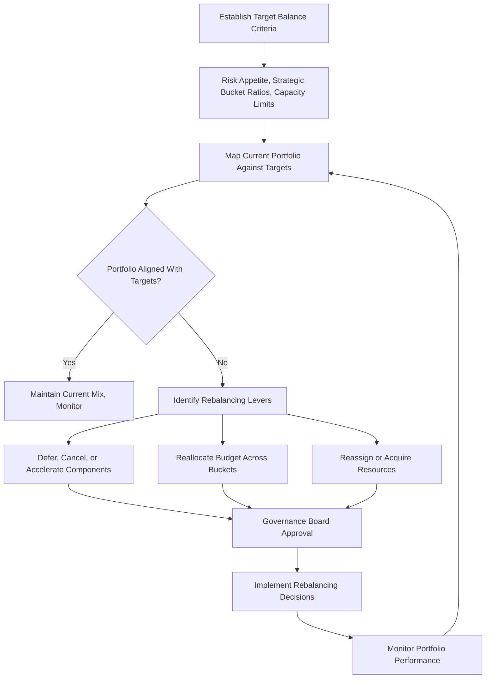

## Balancing the Portfolio

### Overview

Portfolio balancing is the process of adjusting the mix of selected components (projects, programs, and operational work) within a portfolio to optimize the aggregate alignment with organizational strategy while respecting constraints on resources, risk exposure, and capacity. Where prioritization ranks components by value, balancing addresses the composition of the portfolio as a whole — ensuring that the collection of active and proposed work is diversified appropriately across risk levels, time horizons, strategic categories, and resource types rather than skewed toward a single dimension.

Balancing is iterative and continuous: it does not end once a portfolio is authorized, but recurs as components complete, new proposals emerge, market conditions shift, and resource availability changes.

### Why Balancing Is Distinct from Prioritization

Prioritization produces a ranked list. Balancing asks whether executing the top of that ranked list, as a set, actually produces a healthy portfolio. A portfolio consisting entirely of the ten highest-scored projects could still be unbalanced if, for example, all ten are high-risk R&D initiatives with no near-term revenue, or all ten compete for the same specialized engineering team.

**Key Points**

- Prioritization answers "what is most valuable individually?"
- Balancing answers "does this combination serve the organization holistically?"
- Both activities feed into the selection/authorization decision and are typically performed together in governance reviews, not sequentially in isolation.

### Dimensions of Portfolio Balance

#### 1. Risk vs. Return Balance

Portfolios should distribute risk exposure deliberately, analogous to financial portfolio theory. A common approach maps components on a risk-return spectrum and ensures the aggregate risk profile matches the organization's risk appetite and tolerance.

$$Portfolio\ Risk\ Exposure = \sum_{i=1}^{n} (Risk\ Score_i \times Investment_i)$$

**Example**

An organization with a moderate risk appetite might target: 60% low-risk/steady-return initiatives (infrastructure upgrades, regulatory compliance), 30% medium-risk (market expansion), and 10% high-risk/high-reward (experimental R&D). If current holdings show 80% low-risk and only 5% high-risk, the portfolio is unbalanced toward safety and may underinvest in future growth.

#### 2. Strategic Category Balance (Strategic Buckets)

As in prioritization, buckets (e.g., Run-the-Business, Grow-the-Business, Transform-the-Business) allocate budget by strategic intent. Balancing verifies that actual spend and component counts track against these target allocations over time, not just at initial selection.

**Example**

| Strategic Bucket | Target Allocation | Current Allocation | Variance |
| --- | --- | --- | --- |
| Run (Maintenance/Ops) | 40% | 52% | +12% (over-invested) |
| Grow (Market Expansion) | 35% | 30% | -5% (under-invested) |
| Transform (Innovation) | 25% | 18% | -7% (under-invested) |

This variance signals the portfolio has drifted toward operational maintenance at the expense of growth and transformation work, prompting rebalancing action (e.g., deferring a maintenance project to fund a transformation initiative).

#### 3. Time Horizon Balance

Distinguishes short-term (tactical, quick payback), medium-term, and long-term (strategic, delayed payback) components. A portfolio overloaded with short-term wins may lack sustained future value; one overloaded with long-term bets may starve near-term cash flow and stakeholder confidence.

#### 4. Resource and Capacity Balance

Ensures that the aggregate resource demand (people, specialized skills, equipment, budget) across all selected components does not exceed available capacity, and that demand is not concentrated on a single scarce resource pool (a common cause of portfolio-level bottlenecks even when individual projects are well-resourced on paper).

**Key Points**

- Resource capacity balancing often uses resource heat maps or capacity/demand charts across time periods.
- Overallocation on a shared constrained resource (e.g., a single enterprise architecture team) can silently invalidate an otherwise well-prioritized portfolio.

#### 5. Interdependency and Sequencing Balance

Some components depend on outputs of others (e.g., a data migration project must precede an analytics platform rollout). Balancing considers whether the mix and sequencing of components is technically and operationally feasible, not just individually justified.

#### 6. Life Cycle Stage Balance

Distinguishes new/initiation-stage components from those in execution or closing. An organization launching too many new initiatives simultaneously (all in the resource-intensive planning/initiation phase) can create resourcing spikes; balancing staggers initiation to smooth demand.

### The Efficient Frontier Concept (Adapted from Modern Portfolio Theory)

Adapted from financial portfolio theory, the efficient frontier concept plots portfolios by risk (x-axis) against expected value/return (y-axis). An "efficient" portfolio mix is one where no higher return is achievable at the same risk level, and no lower risk is achievable at the same return level.

Below is an SVG illustration of the efficient frontier concept applied to portfolio component selection (svg_diagram).

<svg xmlns="http://www.w3.org/2000/svg" viewBox="0 0 560 420">
<text x="280" y="24" text-anchor="middle" font-size="16" font-weight="bold" fill="#1a1a1a">Portfolio Efficient Frontier (svg_diagram)</text>

<line x1="80" y1="360" x2="520" y2="360" stroke="#333" stroke-width="2" />
<line x1="80" y1="360" x2="80" y2="50" stroke="#333" stroke-width="2" />
<text x="300" y="390" text-anchor="middle" font-size="13" fill="#333">Risk</text>
<text x="30" y="205" text-anchor="middle" font-size="13" fill="#333" transform="rotate(-90 30 205)">Expected Value</text>

<path d="M 110 330 Q 200 200 320 130 Q 400 90 480 75" fill="none" stroke="#28a745" stroke-width="3" />
<text x="430" y="60" font-size="11" fill="#28a745" font-weight="bold">Efficient Frontier</text>

<circle cx="220" cy="290" r="8" fill="#dc3545" />
<text x="235" y="294" font-size="10" fill="#721c24">Suboptimal Mix P1</text>
<circle cx="350" cy="230" r="8" fill="#dc3545" />
<text x="365" y="234" font-size="10" fill="#721c24">Suboptimal Mix P2</text>

<circle cx="200" cy="205" r="9" fill="#28a745" />
<text x="150" y="195" font-size="10" fill="#155724">Optimal Mix A</text>
<circle cx="340" cy="120" r="9" fill="#28a745" />
<text x="290" y="105" font-size="10" fill="#155724">Optimal Mix B</text>
<circle cx="460" cy="80" r="9" fill="#28a745" />
<text x="410" y="65" font-size="10" fill="#155724">Optimal Mix C</text>
</svg>

**Key Points**

- Suboptimal mixes (P1, P2) carry risk that isn't compensated by proportionate expected value; rebalancing should shift the portfolio composition toward the frontier.
- This is a conceptual adaptation, not a literal financial calculation; portfolio management typically uses qualitative or semi-quantitative risk/value scoring rather than statistical variance-covariance matrices used in true financial portfolio theory. [Inference: applicability of strict Modern Portfolio Theory mathematics to project portfolios is limited by the difficulty of quantifying project return variance and covariance with the same rigor as tradable securities.]

### Balancing Process

### Rebalancing Levers

| Lever | Action | When Used |
| --- | --- | --- |
| Deferral | Delay a component's start date | Capacity or budget temporarily exceeded |
| Cancellation/Termination | Remove a component entirely | Component no longer aligns with strategy or shows poor performance |
| Acceleration | Fast-track a high-value component | Frontier gap identified; strategic opportunity window closing |
| Reallocation | Shift budget/resources between buckets or components | Bucket variance exceeds tolerance threshold |
| Scope Adjustment | Modify a component's scope to change its resource/risk footprint | Component contributes to overallocation but retains strategic value |
| Resource Acquisition | Hire, contract, or train to expand constrained capacity | Structural (not temporary) capacity shortfall identified |

### Governance and Cadence

Portfolio balancing decisions are typically made by a Portfolio Governance Board (or equivalent steering committee) during scheduled portfolio reviews. Common cadences include:

- **Quarterly strategic reviews**: Full reassessment of strategic bucket allocation and risk-return balance.
- **Monthly operational reviews**: Resource capacity and near-term sequencing checks.
- **Event-triggered reviews**: Major market shifts, mergers/acquisitions, regulatory changes, or significant component failures that necessitate off-cycle rebalancing.

**Key Points**

- Balancing decisions should be documented with rationale to preserve organizational learning and support audits or stakeholder inquiries.
- Overly frequent rebalancing can introduce thrashing (starting/stopping work repeatedly), which carries its own cost in team morale and sunk setup costs; cadence should match the actual rate of environmental change. [Inference: the specific point at which rebalancing frequency becomes counterproductive varies by organizational agility and industry volatility.]

### Common Pitfalls

- **Balancing only at initial selection**: Treating balance as a one-time snapshot rather than an ongoing discipline allows drift as components progress at different rates.
- **Optimizing single dimension**: Focusing exclusively on financial return balance while ignoring resource or risk balance creates hidden portfolio fragility.
- **Sunk cost bias**: Reluctance to defer or cancel underperforming components because of prior investment, which distorts the balancing decision away from forward-looking value.
- **Ignoring qualitative strategic value**: Overcorrecting toward quantifiable metrics (cost, schedule) while under-weighting harder-to-measure strategic contributions.
- **Static risk appetite assumptions**: Failing to revisit organizational risk appetite as external conditions (economic cycles, competitive pressure) change, leading to a balance target that is itself outdated.

### Related Topics

- Portfolio Prioritization Techniques
- Resource Capacity Planning in Portfolio Management
- Portfolio Risk Management
- Portfolio Governance and Review Boards
- Strategic Alignment Frameworks (Balanced Scorecard, OKRs linkage)
- Benefits Realization Management
- Program and Project Interdependency Management
- Portfolio Performance Monitoring and Reporting