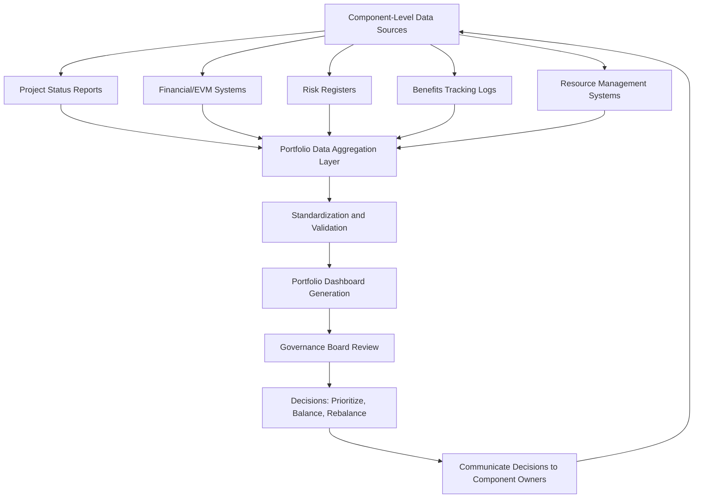

## Portfolio Performance Reporting

### Overview

Portfolio performance reporting is the systematic collection, aggregation, and communication of data that reflects how well the portfolio, as a whole, is delivering against strategic objectives, financial targets, resource plans, and risk tolerances. Unlike project-level reporting, which tracks a single initiative's scope, schedule, and cost, portfolio performance reporting synthesizes information across all components to give executives and governance bodies a consolidated view of portfolio health, value realization, and strategic alignment.

Effective portfolio reporting serves as the primary feedback mechanism that informs prioritization and balancing decisions, closing the loop between strategy formulation and execution.

### Objectives of Portfolio Performance Reporting

- **Strategic alignment visibility**: Demonstrate how portfolio investments map to and advance organizational strategy.
- **Value and benefits tracking**: Monitor whether promised benefits (financial and non-financial) are being realized, not just whether projects are on schedule.
- **Resource utilization insight**: Reveal capacity bottlenecks, overallocation, or underutilization across the portfolio.
- **Risk exposure awareness**: Aggregate risk data across components to reveal portfolio-level risk concentrations invisible at the individual project level.
- **Decision support**: Provide the evidentiary basis for prioritization, balancing, deferral, acceleration, or termination decisions.
- **Stakeholder accountability and transparency**: Give sponsors, executives, and governance boards confidence that investments are being managed responsibly.

### Levels and Types of Portfolio Reports

#### 1. Portfolio Dashboard (Status Summary)

A high-level, typically visual, snapshot of all active components using standardized indicators (commonly RAG — Red/Amber/Green — status) across dimensions such as schedule, cost, scope, risk, and benefits realization.

**Example**

| Component | Strategic Bucket | Schedule | Cost | Risk | Benefits Realization | Overall |
| --- | --- | --- | --- | --- | --- | --- |
| ERP Modernization | Transform | Amber | Green | Amber | Green | Amber |
| Regulatory Compliance Upgrade | Run | Green | Green | Green | Green | Green |
| Market Expansion Phase 2 | Grow | Red | Amber | Red | Amber | Red |
| Data Center Consolidation | Run | Green | Amber | Green | Green | Green |

**Key Points**

- RAG thresholds must be explicitly defined (e.g., "Amber = 5-10% schedule variance") to avoid inconsistent, subjective color assignment across program managers.
- Dashboards should highlight only exceptions/at-risk components prominently, since executives typically need attention directed to Red/Amber items rather than an undifferentiated full list.

#### 2. Financial Performance Reports

Track budgeted vs. actual spend, forecast-to-complete, and realized/projected return metrics across the portfolio.

Common metrics include:

$$Cost\ Performance\ Index\ (CPI) = \frac{Earned\ Value\ (EV)}{Actual\ Cost\ (AC)}$$

$$Schedule\ Performance\ Index\ (SPI) = \frac{Earned\ Value\ (EV)}{Planned\ Value\ (PV)}$$

Aggregated at the portfolio level:

$$Portfolio\ CPI = \frac{\sum_{i=1}^{n} EV_i}{\sum_{i=1}^{n} AC_i}$$

**Example**

If a portfolio's aggregated EV across 8 active projects is $4.2M against an aggregated AC of $4.8M, Portfolio CPI = 0.875, indicating the portfolio collectively is over budget relative to work performed, even if some individual projects are under budget.

**Key Points**

- Aggregating EVM (Earned Value Management) metrics across projects assumes consistent EVM methodology and baseline discipline across all components; inconsistent application undermines aggregate accuracy. [Inference: the degree of distortion from inconsistent EVM practices across a portfolio is organization-specific and not quantifiable in general terms.]
- Financial reports typically also track portfolio-level cash flow forecasts against approved capital budgets by fiscal period.

#### 3. Benefits Realization Reports

Track whether the qualitative and quantitative benefits identified in each component's business case are actually materializing post-implementation, often extending reporting beyond project closure into an operational benefits-tracking period.

**Example**

| Component | Projected Annual Benefit | Benefit Type | Realization Status (12 months post-launch) |
| --- | --- | --- | --- |
| Automation Initiative | $1.2M cost savings | Financial | $950K realized (79%) |
| Customer Portal Redesign | 15% reduction in support tickets | Operational | 11% reduction achieved |
| Compliance System | Avoided regulatory penalty exposure | Risk avoidance | No incidents (on track) |

**Key Points**

- Benefits realization reporting requires a defined baseline and measurement period established before project closure, ideally embedded in the original business case.
- Gaps between projected and realized benefits should feed back into future business case scrutiny and prioritization scoring calibration.

#### 4. Risk Aggregation Reports

Consolidate risk registers across components to identify systemic risks, risk concentration in specific strategic buckets, and cumulative risk exposure exceeding organizational tolerance.

**Key Points**

- A risk that is "low" at an individual project level (e.g., dependency on a single vendor) can become a portfolio-level concern if multiple components share that same dependency.
- Portfolio risk reports commonly use a heat map aggregating probability and impact scores across all open component-level risks.

#### 5. Resource Utilization Reports

Show actual vs. planned resource consumption across the portfolio, typically broken down by role, skill category, or organizational unit, to reveal capacity constraints affecting delivery.

#### 6. Strategic Alignment / Value Contribution Reports

Show how portfolio spend and component count map against strategic bucket targets (see Portfolio Balancing) and against strategic objectives or OKRs, often visualized as a strategy map or contribution matrix.

### Portfolio Reporting Data Flow

### Reporting Cadence and Audience Matrix

| Report Type | Audience | Typical Frequency |
| --- | --- | --- |
| Executive Portfolio Dashboard | C-suite, Portfolio Governance Board | Monthly / Quarterly |
| Financial Performance Report | PMO, Finance, Governance Board | Monthly |
| Benefits Realization Report | Sponsors, Governance Board | Quarterly / Post-launch milestones |
| Risk Aggregation Report | PMO, Risk Committee, Governance Board | Monthly / As triggered |
| Resource Utilization Report | Resource/Capacity Managers, PMO | Bi-weekly / Monthly |
| Strategic Alignment Report | Executive Leadership, Strategy Office | Quarterly / Annually |

### Key Design Principles for Effective Reports

- **Consistency**: Use standardized metrics, definitions, and thresholds across all components so aggregation is meaningful rather than comparing incompatible data.
- **Exception-based focus**: Surface deviations and risks prominently rather than presenting undifferentiated status for every component.
- **Traceability to strategy**: Every report should be able to answer "how does this connect to our strategic objectives?"
- **Actionability**: Reports should support specific governance decisions, not merely describe status passively.
- **Appropriate granularity by audience**: Executive reports aggregate and summarize; operational reports (for PMO staff) retain more component-level detail.
- **Timeliness**: Reporting cadence should match the decision cycle it supports — reporting too infrequently delays corrective action; excessive frequency creates reporting overhead without proportionate decision value. [Inference: the optimal cadence balance point depends on organizational decision-making speed and portfolio volatility.]

### Common Pitfalls

- **Vanity metrics**: Reporting metrics that are easy to collect (e.g., percent tasks complete) rather than metrics that reflect actual value delivery or strategic contribution.
- **Status report aggregation without validation**: Simply rolling up self-reported component statuses without independent validation can mask underlying issues (optimism bias at the project level compounding at the portfolio level).
- **Inconsistent RAG definitions across program managers**: Undermines comparability and trust in the dashboard.
- **Reporting benefits only during the project, not after closure**: Misses whether the business case's promised value was actually achieved.
- **Information overload**: Presenting excessive granular data to executive audiences, obscuring the few decisions that actually require their attention.
- **Backward-looking only reporting**: Focusing solely on historical/actual performance without forecast-to-complete or trend-based projections limits the report's decision-support value.

### Related Topics

- Portfolio Prioritization Techniques
- Balancing the Portfolio
- Benefits Realization Management
- Portfolio Risk Management
- Portfolio Governance and Review Boards
- Earned Value Management (EVM) Fundamentals
- Resource Capacity Planning in Portfolio Management
- Portfolio Management Information Systems (PMIS) for Portfolios