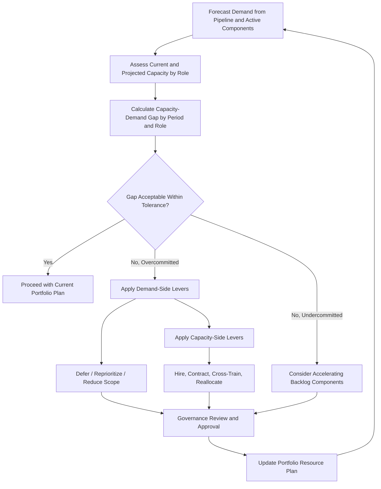

## Capacity and Demand Management

### Overview

Capacity and demand management is the discipline of matching the portfolio's aggregate resource capacity — people, skills, equipment, and budget — against the aggregate demand generated by proposed and active components. It ensures that portfolio decisions (selection, prioritization, balancing) are grounded in realistic resource constraints rather than treated as purely financial or strategic exercises. A portfolio can be perfectly prioritized and balanced on paper yet fail entirely if the organization lacks the actual capacity to execute the selected work.

Capacity and demand management operates continuously, feeding data into prioritization and balancing decisions while also receiving decisions back from governance bodies that adjust demand (deferrals, cancellations) or capacity (hiring, reallocation).

### Core Concepts

#### Capacity

The total available supply of a resource type over a given time period, typically expressed in units such as full-time equivalents (FTEs), person-hours, person-days, or specialized-skill-hours.

$$Capacity_{r,t} = \sum_{k=1}^{m} Availability_{k,r,t}$$

Where $r$ is a resource type/role, $t$ is a time period, and $Availability_{k,r,t}$ is the available time of individual resource $k$ possessing role $r$ in period $t$ (net of planned leave, training, and non-project allocations).

#### Demand

The total resource requirement generated by all proposed and active portfolio components for a given resource type over a given time period.

$$Demand_{r,t} = \sum_{i=1}^{n} Requirement_{i,r,t}$$

Where $Requirement_{i,r,t}$ is component $i$'s resource requirement for role $r$ in period $t$.

#### Capacity-Demand Gap

$$Gap_{r,t} = Capacity_{r,t} - Demand_{r,t}$$

A negative gap indicates over-demand (a bottleneck); a positive gap indicates under-utilized capacity (potential slack or an opportunity to accelerate additional work).

**Example**

| Resource Role | Period | Capacity (person-days) | Demand (person-days) | Gap |
| --- | --- | --- | --- | --- |
| Senior Data Engineers | Q1 | 240 | 310 | -70 (bottleneck) |
| UX Designers | Q1 | 180 | 140 | +40 (slack) |
| Enterprise Architects | Q1 | 60 | 95 | -35 (bottleneck) |

This table reveals that even if overall portfolio budget is sufficient, the Senior Data Engineer and Enterprise Architect roles are structurally overcommitted in Q1, which will delay every component depending on those roles regardless of financial approval status.

### Capacity Planning Approaches

#### 1. Top-Down (Aggregate) Capacity Planning

Estimates capacity and demand at a coarse level (e.g., total FTEs by department) without granular task-level detail. Useful for early portfolio-level feasibility screening before detailed project plans exist.

#### 2. Bottom-Up (Detailed) Capacity Planning

Aggregates detailed, task-level resource estimates from individual project schedules into a portfolio-wide resource model. More accurate but requires mature project planning discipline across all components to produce consistent, comparable estimates.

#### 3. Rolling Wave / Time-Phased Capacity Planning

Combines both approaches: near-term periods (e.g., next quarter) are planned bottom-up with detailed estimates, while further-out periods use top-down rough-order estimates that are refined as they approach.

**Key Points**

- Rolling wave planning acknowledges that granular estimation accuracy degrades with time horizon, so precision is front-loaded to the near term. [Inference: the appropriate rolling wave window length is context-dependent on planning volatility and typically ranges from one to a few reporting periods.]

### Demand Management Techniques

- **Demand intake governance**: A formal intake process (e.g., a Project Proposal or Demand Board) that screens, categorizes, and sizes incoming requests before they compete for capacity, preventing informal or unsanctioned work from silently consuming resource pools.
- **Demand shaping**: Actively adjusting the timing or scope of demand — deferring lower-priority requests, splitting large initiatives into phases, or combining overlapping requests — to smooth demand peaks.
- **Demand forecasting**: Using historical intake rates and pipeline data to project future demand, allowing proactive capacity planning (e.g., hiring lead time) rather than purely reactive responses.

### Capacity Management Techniques

- **Resource pooling**: Organizing specialized skills into shared pools (e.g., a central data engineering pool) allocated across projects on demand, rather than permanently assigning individuals to single projects, improving utilization flexibility.
- **Cross-training / skill flexibility**: Reducing single-role bottlenecks by developing overlapping skill capability across team members.
- **Flexible capacity levers**: Contractors, managed services, or outsourcing used to absorb temporary demand spikes without permanent headcount changes.
- **Capacity buffers**: Deliberately reserving a percentage of capacity (commonly 10–20%) unallocated to absorb unplanned urgent work, reducing the risk of schedule cascading delays from every new priority interrupt. [Inference: buffer sizing recommendations vary significantly by industry and portfolio volatility; there is no universally correct percentage.]

### Capacity vs. Demand Visualization

Below is an SVG illustration of a typical capacity-demand heat map across time periods (svg_diagram).

<svg xmlns="http://www.w3.org/2000/svg" viewBox="0 0 600 380">
<text x="300" y="24" text-anchor="middle" font-size="16" font-weight="bold" fill="#1a1a1a">Capacity vs. Demand by Role and Quarter (svg_diagram)</text>

<text x="200" y="55" text-anchor="middle" font-size="12" font-weight="bold" fill="#333">Q1</text>

<text x="320" y="55" text-anchor="middle" font-size="12" font-weight="bold" fill="#333">Q2</text>

<text x="440" y="55" text-anchor="middle" font-size="12" font-weight="bold" fill="#333">Q3</text>

<text x="560" y="55" text-anchor="middle" font-size="12" font-weight="bold" fill="#333">Q4</text>

<text x="60" y="95" font-size="12" fill="#333">Data Engineers</text>

<text x="60" y="145" font-size="12" fill="#333">UX Designers</text>

<text x="60" y="195" font-size="12" fill="#333">Architects</text>

<text x="60" y="245" font-size="12" fill="#333">QA Engineers</text>

<text x="60" y="295" font-size="12" fill="#333">PMs</text>

<rect x="160" y="70" width="80" height="35" fill="#dc3545" opacity="0.75" />
<rect x="280" y="70" width="80" height="35" fill="#dc3545" opacity="0.75" />
<rect x="400" y="70" width="80" height="35" fill="#ffc107" opacity="0.75" />
<rect x="520" y="70" width="80" height="35" fill="#28a745" opacity="0.75" />

<rect x="160" y="120" width="80" height="35" fill="#28a745" opacity="0.75" />
<rect x="280" y="120" width="80" height="35" fill="#28a745" opacity="0.75" />
<rect x="400" y="120" width="80" height="35" fill="#ffc107" opacity="0.75" />
<rect x="520" y="120" width="80" height="35" fill="#28a745" opacity="0.75" />

<rect x="160" y="170" width="80" height="35" fill="#dc3545" opacity="0.75" />
<rect x="280" y="170" width="80" height="35" fill="#ffc107" opacity="0.75" />
<rect x="400" y="170" width="80" height="35" fill="#ffc107" opacity="0.75" />
<rect x="520" y="170" width="80" height="35" fill="#dc3545" opacity="0.75" />

<rect x="160" y="220" width="80" height="35" fill="#ffc107" opacity="0.75" />
<rect x="280" y="220" width="80" height="35" fill="#28a745" opacity="0.75" />
<rect x="400" y="220" width="80" height="35" fill="#28a745" opacity="0.75" />
<rect x="520" y="220" width="80" height="35" fill="#28a745" opacity="0.75" />

<rect x="160" y="270" width="80" height="35" fill="#28a745" opacity="0.75" />
<rect x="280" y="270" width="80" height="35" fill="#ffc107" opacity="0.75" />
<rect x="400" y="270" width="80" height="35" fill="#28a745" opacity="0.75" />
<rect x="520" y="270" width="80" height="35" fill="#28a745" opacity="0.75" />

<rect x="160" y="330" width="20" height="16" fill="#28a745" opacity="0.75" />
<text x="185" y="343" font-size="11" fill="#333">Balanced (Capacity ≥ Demand)</text>
<rect x="360" y="330" width="20" height="16" fill="#ffc107" opacity="0.75" />
<text x="385" y="343" font-size="11" fill="#333">Tight (within 10%)</text>
<rect x="500" y="330" width="20" height="16" fill="#dc3545" opacity="0.75" />
<text x="525" y="343" font-size="11" fill="#333">Overcommitted</text>
</svg>

**Key Points**

- Persistent red cells across multiple periods for the same role indicate a structural (not temporary) capacity shortfall requiring hiring, outsourcing, or portfolio-level demand reduction rather than short-term reshuffling.
- Heat maps make role-specific bottlenecks visible in a way that aggregate FTE totals across the whole organization typically obscure.

### Capacity and Demand Management Process

### Integration with Prioritization and Balancing

Capacity and demand data functions as a hard constraint layer applied after or alongside prioritization scoring: a highly ranked component cannot be authorized to start if it requires a resource role that is already fully committed, unless the portfolio governance board deliberately reallocates capacity from a lower-priority component. This makes capacity/demand management a critical validation gate rather than a purely informational report.

**Key Points**

- Mature portfolio management practices integrate capacity constraints directly into the prioritization/selection algorithm (e.g., using resource-constrained optimization) rather than treating capacity as an afterthought validation step.
- Capacity and demand management is one of the primary inputs used during portfolio balancing to decide which components to defer, accelerate, or resource-shift.

### Common Pitfalls

- **Ignoring role-specific granularity**: Reporting only total FTE capacity/demand at an organizational level masks critical shortages in specialized, non-substitutable roles.
- **Optimistic resource estimates**: Project teams underestimating true resource needs (or failing to account for non-project time such as support, meetings, and administrative overhead) leads to systematically overstated available capacity.
- **No visibility into informal/shadow work**: Unsanctioned or under-the-radar work consuming resource capacity without appearing in formal demand tracking.
- **Static capacity assumptions**: Failing to account for attrition, planned leave, or seasonal variation in available capacity.
- **Treating capacity constraints as fixed rather than a lever**: Failing to consider capacity-side interventions (hiring, outsourcing, cross-training) as legitimate rebalancing options alongside demand-side deferral.
- **Siloed capacity data**: Resource capacity tracked independently within each department or project without portfolio-level aggregation, preventing detection of cross-project contention for the same specialized resource.

### Related Topics

- Portfolio Prioritization Techniques
- Balancing the Portfolio
- Portfolio Performance Reporting
- Resource Leveling and Resource Smoothing
- Portfolio Governance and Review Boards
- Demand Intake and Project Proposal Processes
- Workforce Planning and Skills Gap Analysis