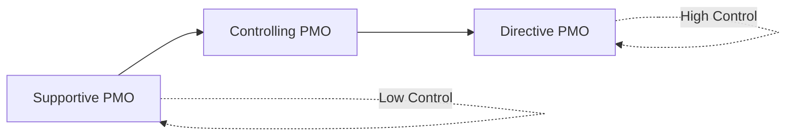
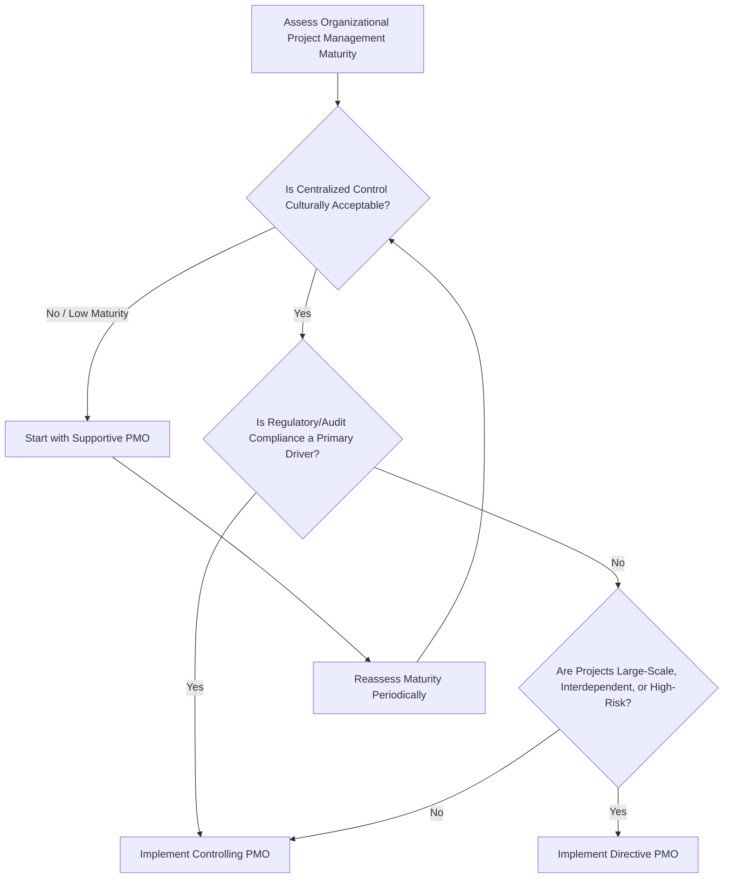

## Supportive, Controlling, and Directive PMO Types

### Overview

A Project Management Office (PMO) is an organizational structure that standardizes project-related governance processes and facilitates the sharing of resources, methodologies, tools, and techniques. PMI's *PMBOK Guide* identifies three primary PMO types, distinguished by the degree of control and authority the PMO exercises over projects within the organization: **Supportive**, **Controlling**, and **Directive**. These types exist on a spectrum of increasing organizational authority and involvement, from advisory (lowest control) to fully managing projects directly (highest control).

Organizations may operate a single PMO type, blend elements across types, or maintain multiple PMOs at different organizational levels (e.g., a directive Enterprise PMO alongside supportive departmental PMOs).

### The Control Spectrum

### 1. Supportive PMO

#### Definition

A Supportive PMO provides a consultative role, supplying templates, best practices, training, access to information, and lessons learned from other projects. It has low control over projects and functions primarily as a repository and advisory resource.

#### Characteristics

- Acts as a project repository (templates, historical data, methodology documentation).
- Provides on-demand support and expert consultation to project managers who choose to engage it.
- Project managers retain full authority over their projects; PMO involvement is optional and non-enforced.
- Low administrative overhead and low organizational disruption to implement.

#### When Used

- Organizations with strong existing project management maturity where standardization is desired but centralized control is unnecessary or culturally unwelcome.
- Organizations just beginning to formalize project management practices, using the Supportive model as a low-friction entry point before evolving toward greater control.

**Example**

A mid-sized software company establishes a Supportive PMO that maintains a shared repository of project charter templates, a risk register template, and a library of retrospective reports from past projects. Project managers are free to use these resources or develop their own approaches; the PMO has no authority to enforce compliance and does not review or approve project decisions.

**Key Points**

- Because compliance is voluntary, the consistency and quality benefits of a Supportive PMO are highly dependent on organic buy-in from project managers rather than mandate.
- Lowest implementation cost and lowest organizational resistance among the three types, but also delivers the weakest standardization and governance benefit.

### 2. Controlling PMO

#### Definition

A Controlling PMO provides support and requires compliance through various means. Compliance requirements may include adopting specific project management frameworks or methodologies, using standardized templates, tools, and governance forms, and conforming to defined governance structures. This represents a moderate degree of control.

#### Characteristics

- Mandates adherence to specific methodologies (e.g., a standardized stage-gate process, a defined Agile framework implementation, or a specific PMBOK-aligned process set).
- Requires use of standardized documentation, templates, and reporting formats across projects.
- Conducts periodic project audits, health checks, or governance reviews to verify compliance.
- Project managers retain day-to-day authority over their projects but must operate within PMO-defined frameworks and reporting structures.

#### When Used

- Organizations seeking improved consistency, comparability, and governance across projects without fully centralizing project execution authority.
- Regulated industries or organizations where standardized documentation and audit trails are necessary for compliance purposes.

**Example**

A regional bank's Controlling PMO mandates that every project over $250,000 use a standardized project charter template, follow a defined five-stage gate review process, and submit monthly status reports in a prescribed format to the PMO for aggregation into portfolio dashboards. Project managers still run their own projects and make day-to-day decisions but must comply with these structural requirements, and the PMO conducts quarterly compliance audits.

**Key Points**

- The most commonly implemented PMO type in medium-to-large organizations, balancing governance benefit against organizational autonomy. [Inference: prevalence claims of this kind are based on general industry commentary rather than a single authoritative census of PMO types across all organizations.]
- Compliance enforcement mechanisms (audits, gate reviews) require dedicated PMO staff capacity and executive backing to be effective; without enforcement teeth, a Controlling PMO can drift toward de facto Supportive behavior.

### 3. Directive PMO

#### Definition

A Directive PMO takes control of projects by directly managing them. Project managers are typically assigned by, and report directly to, the PMO itself, rather than to a functional or line manager. This represents the highest degree of PMO control.

#### Characteristics

- The PMO directly provides project managers to run projects; PMs are PMO staff, not borrowed from functional departments.
- Centralized authority over project prioritization, resource assignment, and methodology.
- Strong consistency across projects since the same organizational unit directly executes them.
- Typically associated with a strong matrix or projectized organizational structure.

#### When Used

- Organizations running large, complex, or highly interdependent project portfolios where centralized control significantly reduces risk (e.g., large capital construction programs, major transformation initiatives, defense and aerospace programs).
- Organizations that have matured through Supportive and Controlling PMO stages and now require tighter central coordination, or that are established from the outset with a strongly centralized delivery model.

**Example**

A national infrastructure agency's Directive PMO employs all project managers as permanent PMO staff. When a new highway construction project is approved, the PMO assigns one of its project managers to lead it; that PM reports to the PMO director, not to an engineering department head, and the PMO retains authority to reassign the PM or reallocate project resources across the portfolio as priorities shift.

**Key Points**

- Requires the most significant organizational restructuring and the greatest concentration of budget and headcount within the PMO, making it the most disruptive and expensive to implement of the three types.
- Provides the strongest standardization and control but can encounter resistance from functional managers who lose authority over project staff and from project managers who may feel less connected to the technical/functional domain of their projects.

### Comparative Summary

| Dimension | Supportive | Controlling | Directive |
| --- | --- | --- | --- |
| Degree of Control | Low | Moderate | High |
| Compliance | Optional | Mandatory | Mandatory (PMO manages directly) |
| PM Reporting Line | Functional/Line Manager | Functional/Line Manager | PMO |
| Primary Role | Advisory/Repository | Governance/Standardization | Direct Execution |
| Implementation Cost/Disruption | Low | Moderate | High |
| Typical Organizational Fit | Mature, autonomous PM culture; early-stage PMO adoption | Organizations needing consistency and audit trails | Large, complex, or highly regulated/centralized programs |
| Risk if Poorly Executed | Weak standardization, inconsistent quality | Bureaucratic overhead without genuine enforcement | Organizational resistance, functional/PMO authority conflict |

### Decision Framework for Selecting a PMO Type

**Key Points**

- PMO type selection is not permanent; organizations commonly evolve from Supportive toward Controlling or Directive as project management maturity and strategic complexity increase.
- The choice should be driven by organizational culture, project complexity/risk, regulatory environment, and strategic importance of the project portfolio rather than a one-size-fits-all default.

### Common Pitfalls

- **Mismatched control level to culture**: Imposing a Directive PMO on an organization with a strongly autonomous functional culture without adequate change management often generates significant resistance and covert non-compliance.
- **Controlling PMO without enforcement**: Establishing mandatory standards without genuine audit or consequence mechanisms results in a Controlling PMO that functions as a Supportive PMO in practice, undermining credibility.
- **Treating PMO type as static**: Failing to reassess and evolve the PMO's control level as the organization's project management maturity and strategic needs change over time.
- **Underestimating Directive PMO cost**: Organizations sometimes underestimate the staffing, budget, and change-management investment required to sustain a Directive PMO's direct project execution model.
- **Conflating PMO type with PMO scope**: PMO type (support level) is a separate dimension from PMO scope (departmental, divisional, enterprise); conflating them can lead to poorly designed governance structures.

### Related Topics

- PMO Functions and Value Proposition
- Organizational Structures (Functional, Matrix, Projectized) and PMO Fit
- Project Governance Frameworks
- PMO Maturity Models
- Portfolio Governance and Review Boards
- Change Management for PMO Implementation
- PMO Metrics and Value Measurement