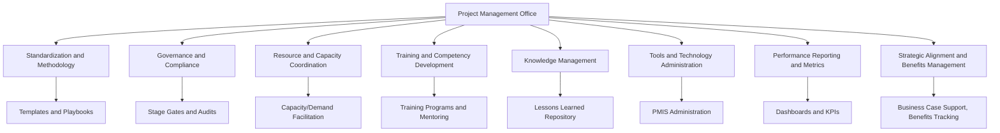

## Core PMO Functions and Services

### Overview

A Project Management Office (PMO) exists to deliver a set of centralized functions and services that improve project delivery consistency, efficiency, and strategic alignment across an organization. While a PMO's degree of authority varies by type (Supportive, Controlling, or Directive), the underlying functional catalog it can provide is broadly consistent: standardization, governance support, resource coordination, knowledge management, training, and strategic alignment. The specific mix and depth of these functions a given PMO performs depends on organizational maturity, PMO type, and strategic mandate.

### Categories of PMO Functions

#### 1. Standardization and Methodology Governance

The PMO defines and maintains standardized project management processes, methodologies, templates, and tools used across the organization, ensuring a consistent approach to planning, execution, and control.

**Services typically included:**

- Developing and maintaining a project management methodology (waterfall, Agile, hybrid) appropriate to organizational context.
- Producing and curating standardized templates (charters, risk registers, status reports, business cases).
- Establishing common terminology and definitions to reduce miscommunication across projects and departments.
- Defining tailoring guidelines for how standard processes may be adapted to project size or complexity.

**Example**

A PMO publishes a "Project Lifecycle Playbook" specifying five standard project types by size/complexity tier, each with a prescribed set of required deliverables (e.g., Tier 1 small projects require only a one-page charter and monthly status update; Tier 3 large projects require a full business case, detailed WBS, and bi-weekly governance reviews).

#### 2. Governance and Compliance Oversight

The PMO establishes and administers governance structures that ensure projects proceed through appropriate decision gates, approvals, and oversight checkpoints.

**Services typically included:**

- Administering stage-gate or phase-gate review processes.
- Facilitating project selection and prioritization within the portfolio (in coordination with portfolio management functions).
- Conducting project health checks, audits, and compliance reviews.
- Managing escalation paths for project issues requiring executive decision-making.

**Key Points**

- Governance oversight is the primary differentiator between a Supportive PMO (no enforcement) and a Controlling/Directive PMO (enforced compliance).
- Effective governance requires clearly defined decision rights (who approves what, at which threshold) to avoid ambiguity or bypassed reviews.

#### 3. Resource and Capacity Coordination

The PMO facilitates the allocation, tracking, and optimization of shared resources across multiple concurrent projects, working closely with functional/resource managers.

**Services typically included:**

- Maintaining a centralized view of resource capacity and demand across the project portfolio.
- Facilitating resource allocation and conflict resolution when multiple projects compete for the same resources.
- Supporting resource forecasting to inform hiring, contracting, or reallocation decisions.

**Example**

When two concurrent projects both require the organization's single database migration specialist in the same sprint, the PMO facilitates a resolution meeting between the two project sponsors, using portfolio priority ranking to determine which project receives the resource first and adjusting the other project's schedule accordingly.

#### 4. Training, Mentoring, and Competency Development

The PMO builds organizational project management capability by providing training, mentoring, and career development support for project managers and team members.

**Services typically included:**

- Delivering or coordinating project management training programs (methodology training, tool training, soft-skills development).
- Mentoring junior or new project managers.
- Supporting professional certification pursuit (e.g., PMP, PRINCE2, CAPM, Agile certifications).
- Defining competency frameworks and career progression paths for project management roles.

**Key Points**

- Training and mentoring functions are especially critical in organizations with a Directive PMO model, since the PMO directly owns project manager staffing and career development.

#### 5. Knowledge Management and Lessons Learned

The PMO captures, organizes, and disseminates organizational knowledge gained from past projects to improve future project outcomes.

**Services typically included:**

- Maintaining a centralized repository of project artifacts, historical data, and lessons learned.
- Facilitating post-project reviews and retrospectives, and ensuring findings are captured and shared.
- Curating a library of estimation benchmarks and historical performance data to improve future planning accuracy.

**Example**

After a product launch project experiences significant scope creep due to unclear requirements sign-off, the PMO captures this in a lessons-learned repository and updates the standard requirements template to include a mandatory formal sign-off step, applying the learning proactively to future projects.

#### 6. Tools and Technology Administration

The PMO selects, administers, and supports project management information systems (PMIS) and related tools used across the organization.

**Services typically included:**

- Selecting, configuring, and administering project/portfolio management software.
- Providing tool training and user support.
- Ensuring consistent data structures across projects to enable portfolio-level reporting and aggregation.
- Integrating PM tools with adjacent systems (financial systems, resource management systems, collaboration platforms).

#### 7. Performance Reporting and Metrics

The PMO aggregates and reports on project and portfolio performance to inform executive decision-making, as detailed further under portfolio performance reporting.

**Services typically included:**

- Producing standardized project status reports and portfolio dashboards.
- Defining and tracking key performance indicators (KPIs) for project delivery (e.g., schedule/cost variance, benefits realization).
- Facilitating executive/governance board reporting cadences.

#### 8. Strategic Alignment and Benefits Management

The PMO helps ensure that the organization's project investments remain aligned with strategic objectives and that anticipated benefits are tracked through to realization.

**Services typically included:**

- Supporting business case development and value scoring for proposed projects.
- Facilitating alignment reviews between project objectives and organizational strategy.
- Coordinating benefits realization tracking post-project-closure (often extending PMO involvement beyond traditional project boundaries).

### PMO Function Map by Category

### Function Depth by PMO Type

| Function | Supportive PMO | Controlling PMO | Directive PMO |
| --- | --- | --- | --- |
| Standardization and Methodology | Available, optional adoption | Mandated adoption | Mandated and directly enforced through PMO-owned PMs |
| Governance and Compliance | Advisory only | Audited, enforced | Fully administered by PMO |
| Resource Coordination | Informational support | Facilitated allocation | Directly controlled by PMO |
| Training and Mentoring | Available on request | Structured programs, often required | Core PMO responsibility for owned staff |
| Knowledge Management | Repository maintained, voluntary use | Repository maintained, referenced in audits | Directly integrated into PMO-managed project execution |
| Tools/PMIS Administration | Provided, optional use | Mandated tool/data standards | Fully owned and enforced |
| Performance Reporting | Aggregated if data is voluntarily submitted | Mandatory standardized reporting | Directly generated from PMO-managed projects |
| Strategic Alignment | Advisory input | Structured review and scoring | Directly integrated into PMO-led prioritization and execution |

### Common Pitfalls

- **Function sprawl without prioritization**: Attempting to implement all functions simultaneously without phasing, overextending limited PMO staff and diluting the quality of each service delivered.
- **Tool-first implementation**: Selecting and rolling out PMIS software before defining the underlying methodology and governance processes it should support, resulting in a tool that enforces the wrong workflow.
- **Neglecting training/mentoring in favor of pure oversight**: A PMO perceived purely as an auditing/compliance function (rather than also providing genuine support and capability-building) often faces stakeholder resistance and low voluntary engagement.
- **Knowledge repository without active curation**: Building a lessons-learned repository that is never actively referenced or updated becomes a stale, low-value archive rather than a living organizational asset.
- **Reporting without decision linkage**: Producing performance reports and dashboards that are not clearly tied to specific governance decisions, reducing perceived value and stakeholder engagement with the reporting function.

### Related Topics

- Supportive, Controlling, and Directive PMO Types
- PMO Maturity Models
- Portfolio Performance Reporting
- Portfolio Governance and Review Boards
- Project Management Information Systems (PMIS)
- Benefits Realization Management
- Organizational Process Assets and Enterprise Environmental Factors
- Change Management for PMO Implementation