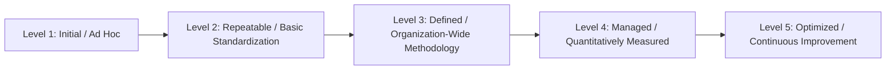
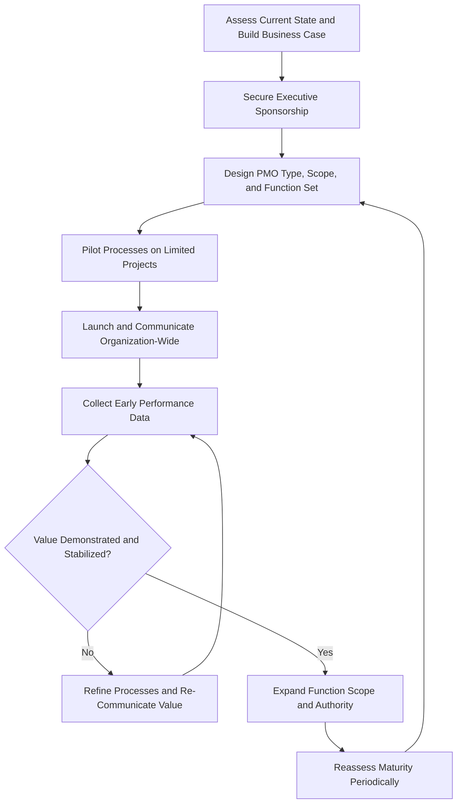

## Establishing and Maturing a PMO

### Overview

Establishing and maturing a Project Management Office (PMO) is the organizational change process of designing, launching, and progressively evolving centralized project management capability. This is not a one-time implementation project but a multi-year organizational journey that moves through recognizable maturity stages, each requiring deliberate change management, executive sponsorship, and incremental value demonstration to sustain momentum and organizational buy-in.

A poorly established PMO — one launched without clear mandate, executive support, or phased scope — is one of the most common causes of PMO failure and subsequent disbandment.

### Phase 1: Assessment and Business Case

Before launching a PMO, the organization must establish why it is needed and what problem it solves.

**Key activities:**

- Conduct a current-state assessment of existing project management practices, pain points, and organizational maturity (often using a maturity model as a diagnostic baseline — see Related Topics).
- Identify the specific organizational problems the PMO is intended to solve (e.g., inconsistent project outcomes, lack of portfolio visibility, resource conflicts, poor strategic alignment).
- Secure executive sponsorship; a PMO without visible, sustained senior leadership backing typically lacks the authority to enforce standards or resolve cross-functional conflicts.
- Develop a business case defining the PMO's scope, expected value, functions, type (Supportive/Controlling/Directive), and success metrics.

**Key Points**

- Executive sponsorship is frequently cited as the single most decisive factor in PMO survival and effectiveness, since the PMO's authority to standardize practices and resolve resource conflicts across functional silos depends on visible senior backing. [Inference: while widely reported in PM practitioner literature, the precise causal weight of sponsorship relative to other success factors is not independently quantifiable across organizations.]
- The business case should define clear, measurable success criteria upfront, since a PMO without demonstrable value is vulnerable to being deprioritized or disbanded during budget reviews.

### Phase 2: Design

Translate the business case into a concrete organizational design.

**Key activities:**

- Determine the PMO type (Supportive, Controlling, or Directive) appropriate to organizational culture and strategic needs.
- Define organizational placement (reporting line — e.g., reporting to a CIO, COO, or directly to the CEO — significantly affects the PMO's cross-functional authority).
- Define scope (departmental, divisional, or enterprise-wide).
- Design the initial function set (see Core PMO Functions and Services), phased for incremental rollout rather than attempting full-scope launch immediately.
- Define staffing structure, roles, and required competencies.
- Select or plan for supporting tools (PMIS), though tool selection should follow process design, not precede it.

**Key Points**

- Starting with a narrow, high-value function set (e.g., standardized status reporting and a single governance gate) and expanding incrementally is generally lower-risk than launching a full-scope PMO with all eight core function categories simultaneously.

### Phase 3: Implementation (Launch)

Roll out the designed PMO with a deliberate change management approach.

**Key activities:**

- Communicate the PMO's mandate, scope, and value proposition clearly to affected stakeholders (project managers, functional managers, executives) to build understanding and reduce resistance.
- Pilot new processes or governance requirements on a limited set of projects before organization-wide rollout.
- Provide training on new templates, tools, and processes to affected staff.
- Establish initial metrics collection to track early value delivery.

**Example**

A newly formed Controlling PMO pilots its new stage-gate review process on three medium-complexity projects for one quarter before mandating it organization-wide, using pilot feedback to refine gate criteria and reduce unnecessary documentation burden identified by pilot project managers.

**Key Points**

- Piloting reduces the risk of organization-wide resistance to a process that has not been field-tested, and generates early advocates among pilot participants who can support broader rollout.

### Phase 4: Stabilization and Value Demonstration

Consolidate the initial implementation and demonstrate tangible value to sustain organizational support.

**Key activities:**

- Collect and report early performance data showing the PMO's impact (e.g., improved schedule predictability, reduced project failure rate, improved resource utilization).
- Address early friction points and refine processes based on organizational feedback.
- Formalize governance structures and decision rights that may have been provisional during pilot/launch.

**Key Points**

- Early, visible wins (sometimes called "quick wins") are important for sustaining executive and stakeholder confidence during the vulnerable early period before the PMO's longer-term value (e.g., improved strategic alignment) becomes measurable.

### Phase 5: Maturation and Expansion

Progressively expand scope, authority, and function depth as organizational trust and project management maturity grow.

**Key activities:**

- Expand function coverage (e.g., adding benefits realization tracking after standardization and reporting functions are established).
- Increase PMO type/authority level if warranted (e.g., evolving from Supportive to Controlling as compliance value is demonstrated).
- Integrate PMO processes more deeply with portfolio management, strategic planning, and enterprise governance.
- Continuously reassess PMO structure against evolving organizational strategy and scale.

### PMO Maturity Models

Several maturity models are used to benchmark and guide PMO evolution, most structured as staged frameworks (commonly 4–5 levels) describing progression from ad hoc/inconsistent practices to fully optimized, strategically integrated project management capability. A generalized maturity progression is illustrated below.

**Key Points**

- Widely referenced maturity frameworks include OPM3 (Organizational Project Management Maturity Model, published by PMI) and various CMMI-derived or vendor-specific models; organizations should select or adapt a model consistent with their industry and PM methodology rather than assuming a single universal standard. [Unverified: the relative prevalence or superiority of one named maturity model over others across industries is not something that can be stated as settled fact without current comparative research.]
- Maturity progression is rarely linear or uniform across all functions simultaneously; an organization may be highly mature in standardized reporting while remaining immature in benefits realization tracking.

### Establishment and Maturity Roadmap

### Critical Success Factors

- **Sustained executive sponsorship**: Ongoing, not just initial, senior leadership backing to maintain authority for enforcement and cross-functional conflict resolution.
- **Clear mandate and scope**: Explicit definition of what the PMO does and does not control, reducing ambiguity and territorial conflict with functional management.
- **Phased implementation**: Incremental rollout of functions and authority rather than attempting comprehensive scope from day one.
- **Demonstrable value metrics**: Defined success measures established before launch, tracked and communicated regularly.
- **Cultural fit of PMO type**: Alignment between the chosen PMO type (Supportive/Controlling/Directive) and organizational culture/tolerance for centralized control.
- **Adequate staffing and competency**: Sufficient, appropriately skilled PMO staff to deliver the committed function set without over-extension.

### Common Pitfalls

- **Launching without executive sponsorship**: A PMO established purely at a mid-management level frequently lacks the authority to enforce standards across functional boundaries and struggles to survive organizational change.
- **Full-scope launch ("boil the ocean")**: Attempting to implement all PMO functions and full governance authority simultaneously, overwhelming both the PMO team and the organization's change absorption capacity.
- **No defined success metrics**: Failing to establish measurable value criteria upfront makes it difficult to demonstrate impact and defend the PMO's continued existence during budget or organizational reviews.
- **Tool-first implementation**: Procuring and rolling out PMIS software before methodology and governance processes are defined, resulting in a tool that enforces an undefined or mismatched workflow.
- **Static maturity assumption**: Treating PMO establishment as a completed project rather than an ongoing maturation journey, leading to stagnation and eventual perceived irrelevance as organizational needs evolve.
- **PMO as pure bureaucracy perception**: Failing to balance governance/compliance functions with genuine value-add services (training, knowledge sharing, resource facilitation), leading to stakeholder resistance and passive non-compliance.

### Related Topics

- Supportive, Controlling, and Directive PMO Types
- Core PMO Functions and Services
- PMO Metrics and Value Measurement
- Change Management for PMO Implementation
- Organizational Project Management Maturity Model (OPM3)
- Portfolio Governance and Review Boards
- Stakeholder Engagement and Communication Planning