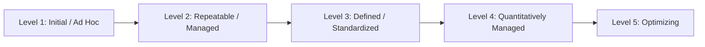
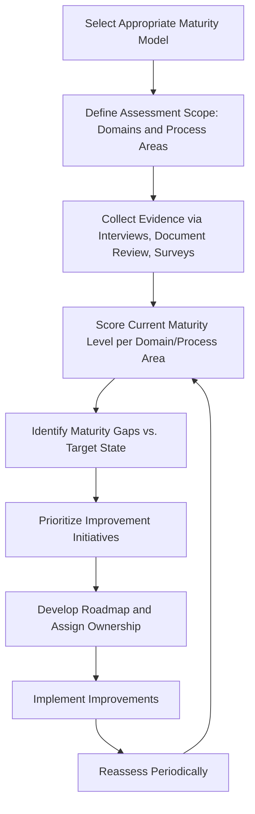

## Project Management Maturity Models

### Overview

Project management maturity models are structured frameworks used to assess an organization's current project management capability and provide a staged roadmap for progressive improvement. They provide a common vocabulary and a set of benchmarks against which an organization can evaluate its processes, tools, governance structures, and organizational culture related to managing projects, programs, and portfolios. Maturity models are typically used both diagnostically (assessing current state) and prescriptively (guiding investment priorities for improvement).

Most maturity models share a common structural pattern: a series of ordered levels (commonly four or five) representing increasing process discipline, measurement rigor, and strategic integration, evaluated across multiple knowledge areas or process domains.

### Common Generic Maturity Level Structure

While specific models use different names and level counts, most converge on a similar underlying progression:

- **Level 1 (Initial/Ad Hoc)**: Project success depends on individual effort and heroics rather than organizational process; practices are inconsistent and undocumented.
- **Level 2 (Repeatable/Managed)**: Basic project management processes are established, at least for similar or repeated project types, though not necessarily documented or applied organization-wide.
- **Level 3 (Defined/Standardized)**: A standardized, documented methodology is applied organization-wide, tailored as needed per project.
- **Level 4 (Quantitatively Managed)**: Detailed metrics on process and product quality are collected and used to manage projects and the organization's project management process itself.
- **Level 5 (Optimizing)**: Continuous process improvement is embedded, using quantitative feedback from the organization's own metrics and from innovative process/technology ideas.

**Key Points**

- Maturity typically must be assessed per knowledge area or process domain rather than as a single organization-wide score, since organizations commonly show uneven maturity (e.g., mature in schedule management, immature in benefits realization).
- Progression through levels is rarely strictly linear in practice; organizations may exhibit characteristics of adjacent levels simultaneously across different domains. [Inference: the degree of non-linearity observed varies by organization and is not something a generic model can predict precisely.]

### Major Named Maturity Models

#### 1. OPM3 (Organizational Project Management Maturity Model)

Published by the Project Management Institute (PMI), OPM3 assesses organizational project management maturity across three domains — project, program, and portfolio management — and across a set of process improvement stages (Standardize, Measure, Control, Continuously Improve) rather than a strict single-track level progression.

**Key Points**

- Distinctive in explicitly integrating portfolio and program management maturity alongside project-level maturity, rather than focusing solely on individual project execution practices.
- Uses a large best-practices/capabilities database against which organizations self-assess, rather than a simple five-level scorecard.

#### 2. Capability Maturity Model Integration (CMMI) — Adapted Context

CMMI, originally developed for software/systems engineering process improvement (by the Software Engineering Institute, now maintained by ISACA/CMMI Institute), uses a five-level structure (Initial, Managed, Defined, Quantitatively Managed, Optimizing) that has heavily influenced the generic level naming convention used across many project management maturity models, even outside its original software engineering context.

**Key Points**

- CMMI itself is a process/organizational capability model broader than project management specifically; many PM-focused maturity models borrow its level structure and terminology rather than applying CMMI directly. [Unverified: the exact degree of direct lineage versus independent convergent design across specific vendor PM maturity models varies by model and is not uniformly documented.]

#### 3. Kerzner Project Management Maturity Model (PMMM)

Developed by Dr. Harold Kerzner, this model defines five levels: Common Language, Common Processes, Singular Methodology, Benchmarking, and Continuous Improvement, with an emphasis on measurable progress and organizational learning through benchmarking against other organizations.

**Key Points**

- Distinctive for its strong emphasis on benchmarking (Level 4) as a discrete maturity stage, explicitly comparing organizational practices against external peers or industry standards.

#### 4. Portfolio, Programme and Project Management Maturity Model (P3M3)

Developed by Axelos (also responsible for PRINCE2 and MSP), P3M3 assesses maturity across three sub-models — Portfolio Management, Programme Management, and Project Management — each evaluated across seven "process perspectives" (e.g., management control, benefits management, financial management, stakeholder management, risk management, organizational governance, resource management) at five maturity levels.

**Key Points**

- Distinctive for its explicit process-perspective breakdown within each of the three sub-models, allowing granular assessment (e.g., "Level 2 maturity in Risk Management within Programme Management") rather than a single blended score.

### Comparative Summary

| Model | Publisher/Origin | Structural Approach | Distinctive Feature |
| --- | --- | --- | --- |
| OPM3 | PMI | Domains (Project/Program/Portfolio) × Process Improvement Stages | Integrates portfolio/program maturity explicitly |
| CMMI | SEI / ISACA (CMMI Institute) | Five sequential levels | Origin model for generic level-naming convention; broader than PM alone |
| Kerzner PMMM | Harold Kerzner | Five sequential levels | Strong emphasis on external benchmarking as a distinct stage |
| P3M3 | Axelos | Three sub-models × Seven process perspectives × Five levels | Granular, perspective-based assessment within each sub-model |

### Using a Maturity Model in Practice

#### Assessment Process

**Example**

An organization assesses itself against P3M3 and finds Level 3 (Defined) maturity in Project Management's "Management Control" perspective, but only Level 1 (Initial) maturity in Portfolio Management's "Benefits Management" perspective. Rather than investing broadly, the organization prioritizes a targeted improvement initiative to establish basic benefits tracking processes at the portfolio level, since this represents the largest maturity gap relative to organizational strategic goals.

**Key Points**

- Maturity assessments are most valuable when tied to a specific target state and business driver (e.g., "we need Level 3 portfolio benefits management maturity to support our upcoming M&A integration") rather than pursued as an abstract exercise in reaching higher scores.
- External facilitation or certified assessors are often used for formal model assessments (e.g., P3M3 has an associated assessment/certification ecosystem), though internal self-assessment is a valid lower-cost starting point. [Inference: the relative accuracy or objectivity benefit of external versus internal assessment has not been independently quantified here and depends on assessor expertise and organizational transparency.]

### Relationship to PMO Establishment and Maturation

Maturity models are commonly used as the diagnostic input during the Assessment phase of establishing a PMO, and as the recurring benchmark during the PMO's ongoing Maturation and Expansion phase, providing an external reference framework rather than relying solely on internal, potentially biased self-assessment of progress.

### Common Pitfalls

- **Treating maturity level as the goal itself**: Pursuing a higher maturity score as an end in itself rather than as a means to a specific business outcome, leading to process investment that does not deliver proportionate value.
- **Uniform scoring across uneven domains**: Assigning a single blended maturity score without domain/process-area granularity, obscuring specific high-priority gaps.
- **One-time assessment without reassessment cadence**: Conducting a single maturity assessment without periodic follow-up, losing the ability to track improvement trends over time.
- **Selecting a model mismatched to organizational context**: Applying a model (e.g., one designed for large government portfolio environments) to a context (e.g., a small agile software team) where its process perspectives are largely inapplicable, generating low-value assessment overhead.
- **Assessment without follow-through**: Conducting a rigorous assessment that identifies clear gaps but failing to allocate budget or ownership for the resulting improvement roadmap, wasting the assessment investment.

### Related Topics

- Establishing and Maturing a PMO
- Core PMO Functions and Services
- Organizational Project Management (OPM) Frameworks
- Portfolio Governance and Review Boards
- Benefits Realization Management
- Change Management for PMO Implementation
- PMO Metrics and Value Measurement