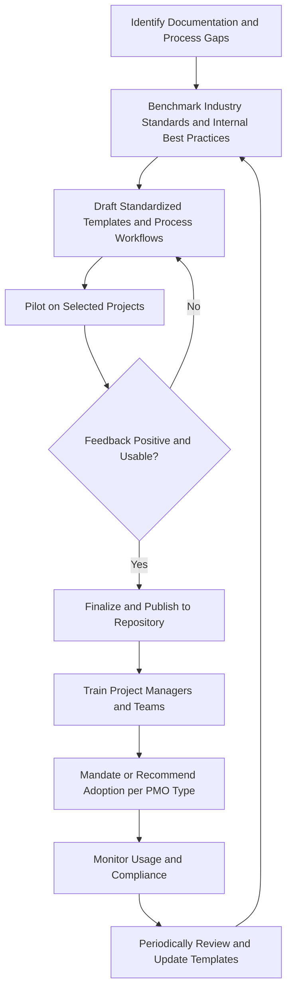

## Standardizing Templates and Processes

### Overview

Standardizing templates and processes is a core PMO function involving the creation, maintenance, and organization-wide adoption of consistent documentation formats and procedural workflows for managing projects. Standardization reduces variability in how projects are planned, executed, and reported, enabling comparability across projects, easier onboarding of project managers between initiatives, and reliable aggregation of data for portfolio-level reporting. It is foundational infrastructure that most other PMO functions — governance, reporting, resource coordination — depend upon to operate consistently across a project portfolio.

### Objectives of Standardization

- **Consistency**: Ensure similar information is captured and presented the same way across all projects, regardless of which project manager or team produces it.
- **Efficiency**: Reduce the time project managers spend creating documentation from scratch for each new project.
- **Comparability**: Enable meaningful portfolio-level aggregation and comparison of project status, cost, and performance data.
- **Quality assurance**: Embed organizational best practices and required content directly into templates, reducing the likelihood of critical omissions (e.g., a risk register template that prompts for risk owner and response strategy fields).
- **Knowledge transfer**: Make it easier for project managers to move between projects or for new team members to onboard, since documentation formats are familiar regardless of the specific project.

### Categories of Standardized Artifacts

#### 1. Initiation and Planning Templates

- **Project Charter**: Standardized fields for project purpose, objectives, high-level scope, key stakeholders, high-level budget/timeline, and sponsor authorization.
- **Business Case Template**: Structured format for problem statement, options analysis, financial justification (NPV/ROI/payback), and recommendation.
- **Project Management Plan / Scope Statement**: Templates defining required subsidiary plan sections (scope, schedule, cost, quality, resource, communications, risk, procurement, stakeholder management) tailored to project size/complexity tier.
- **Work Breakdown Structure (WBS) Templates**: Standard decomposition patterns or dictionaries for common project types.

#### 2. Execution and Monitoring Templates

- **Status Report Template**: Standardized format for reporting schedule, cost, scope, risk, and issue status, typically using consistent RAG (Red/Amber/Green) definitions across all projects.
- **Risk Register Template**: Standardized fields for risk description, category, probability, impact, risk score, owner, response strategy, and status.
- **Issue Log Template**: Standard fields for issue description, priority, owner, and resolution status.
- **Change Request Template**: Standardized format for proposing, evaluating, and approving/rejecting scope, schedule, or cost changes.
- **Meeting Minutes / Action Item Log Templates**: Consistent formats for capturing decisions and follow-up actions.

#### 3. Closing Templates

- **Project Closure Report**: Standardized format summarizing final outcomes against baseline, lessons learned, and outstanding items.
- **Lessons Learned Template**: Structured prompts (what worked, what didn't, recommendations) feeding into the PMO's knowledge management repository.
- **Benefits Realization Tracking Template**: Standard format for tracking projected vs. actual benefits over a defined post-closure measurement period.

### Standardized Process Workflows

Beyond documents, PMOs standardize the procedural workflows governing how projects move through their lifecycle.

**Common standardized processes:**

- **Stage-gate / phase-gate review process**: Defined checkpoints with standard entry/exit criteria between project phases.
- **Change control process**: A defined workflow for submitting, evaluating, approving, and implementing changes to project baselines.
- **Risk management process**: Standardized cadence and workflow for risk identification, assessment, response planning, and monitoring.
- **Project intake/demand process**: A defined workflow for submitting and screening new project proposals before they enter the portfolio.
- **Resource request/allocation process**: A standardized workflow for requesting and confirming resource assignments from functional or resource managers.

### Standardization Process Flow

### Tailoring Guidelines

A critical companion to standardization is defining **tailoring guidelines** — rules for how standardized templates and processes may be scaled or adapted based on project size, complexity, or risk level, preventing a one-size-fits-all approach from becoming either excessive bureaucracy for small projects or insufficient rigor for large ones.

**Example**

| Project Tier | Criteria | Required Templates | Governance Gates |
| --- | --- | --- | --- |
| Tier 1 (Small) | Budget < $50K, duration < 3 months | One-page charter, lightweight status update | Single sponsor sign-off at closure |
| Tier 2 (Medium) | Budget $50K–$500K | Full charter, risk register, monthly status report | Kickoff gate, mid-point gate, closure gate |
| Tier 3 (Large) | Budget > $500K, cross-functional, high risk | Full charter, detailed business case, full risk register, bi-weekly status report, benefits tracking plan | Kickoff, design, build, deployment, and closure gates |

**Key Points**

- Without tailoring guidelines, standardization can become a source of organizational friction, particularly for small or low-risk projects forced through disproportionately heavy documentation requirements.
- Tailoring criteria should be objective and transparent (e.g., budget thresholds, cross-functional scope) rather than subjectively applied, to maintain governance consistency and avoid perceptions of favoritism.

### Template and Process Governance

Once established, standardized artifacts require ongoing governance to remain relevant and avoid becoming outdated or ignored.

**Key governance activities:**

- **Version control**: Maintaining a single authoritative, current version of each template with clear version history, preventing teams from using outdated copies.
- **Change management for templates**: A defined process for proposing and approving updates to standard templates, informed by user feedback and lessons learned.
- **Usage monitoring**: Tracking actual adoption/compliance rates, particularly important for Controlling and Directive PMOs where compliance is mandated.
- **Periodic review cadence**: Scheduled reviews (e.g., annually) to assess whether templates and processes remain fit for purpose as organizational needs evolve.

### Common Pitfalls

- **Over-standardization**: Applying identical, heavyweight documentation requirements to all projects regardless of size or complexity, generating excessive administrative overhead and resistance, particularly from small-project teams.
- **Template proliferation without governance**: Allowing multiple unofficial variants of the same template to circulate without version control, undermining the comparability standardization is meant to provide.
- **Designing templates in isolation**: Creating templates without input from the project managers who will actually use them, resulting in impractical formats that are technically compliant but operationally ignored or worked around.
- **Static templates**: Failing to periodically review and update templates as organizational needs, tools, or lessons learned accumulate, leading to templates that no longer reflect current best practice.
- **Standardizing format without standardizing understanding**: Distributing templates without adequate training on their purpose and correct use, resulting in inconsistent quality despite consistent format (e.g., risk registers with identical fields but wildly inconsistent risk-scoring rigor across projects).
- **No tailoring guidance**: Applying a single standard uniformly across all project sizes without scaled tiers, causing either bureaucratic burden on small projects or insufficient rigor on large, complex ones.

### Related Topics

- Core PMO Functions and Services
- Establishing and Maturing a PMO
- Project Governance Frameworks and Stage-Gate Processes
- Knowledge Management and Lessons Learned Repositories
- Change Control Processes
- Project Management Information Systems (PMIS)
- Risk Management Planning