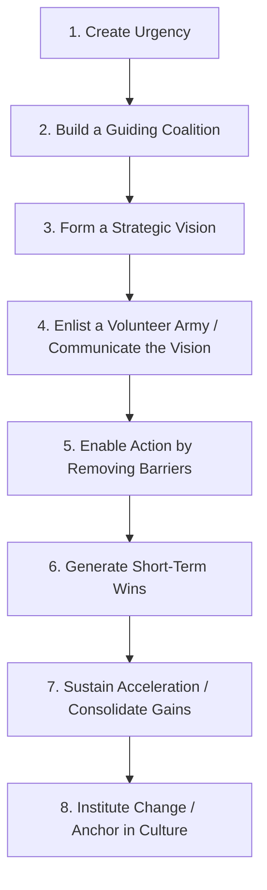
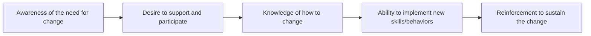

## Kotter's Change Model and the ADKAR Model

### Overview

Kotter's Change Model and the ADKAR Model are two of the most widely applied frameworks for guiding organizational change management (OCM), including changes driven by project outcomes such as new systems, processes, or organizational structures. Kotter's model is primarily **organization-centric**, providing a sequential set of leadership actions for driving change across an entire organization. ADKAR is primarily **individual-centric**, providing a sequential model of the stages a single person moves through to adopt a change. The two are frequently used together: Kotter's model structures the overall organizational change initiative, while ADKAR diagnoses and supports individual adoption within that initiative.

### Kotter's 8-Step Change Model

Developed by Harvard Business School professor John Kotter, this model outlines eight sequential steps for leading large-scale organizational change, originally introduced in his 1996 book *Leading Change*.

#### Step Details

1. **Create Urgency**: Build a compelling case for why change is necessary now, often by highlighting risks of inaction or market opportunities, to overcome organizational complacency.
2. **Build a Guiding Coalition**: Assemble a cross-functional group with sufficient authority, credibility, and influence to lead the change effort.
3. **Form a Strategic Vision**: Develop a clear, concise vision for the change and the strategies to achieve it, providing direction for all subsequent actions.
4. **Enlist a Volunteer Army (Communicate the Vision)**: Communicate the vision broadly and consistently, encouraging voluntary buy-in beyond the core coalition.
5. **Enable Action by Removing Barriers**: Identify and remove structural, procedural, or cultural obstacles preventing people from acting on the vision.
6. **Generate Short-Term Wins**: Plan for and publicize visible, near-term successes to build momentum and credibility for the change effort.
7. **Sustain Acceleration (Consolidate Gains)**: Use credibility from early wins to tackle bigger change challenges, avoiding premature declaration of victory.
8. **Institute Change (Anchor in Culture)**: Embed new behaviors and approaches into organizational culture, ensuring they persist after the initial change leadership moves on.

**Example**

A large retail organization implementing a new enterprise resource planning (ERP) system uses Kotter's model: leadership creates urgency by presenting data on how the current legacy system's failures are costing the company market share (Step 1), assembles a coalition of department heads and IT leadership (Step 2), and defines a vision of a unified, real-time inventory and financial system (Step 3). After go-live in a pilot region, early results showing reduced stock-outs are publicized company-wide as a short-term win (Step 6) before full rollout to remaining regions (Step 7), with new standard operating procedures embedded into onboarding materials for all future hires (Step 8).

**Key Points**

- Kotter's model is explicitly sequential; skipping steps (particularly rushing past creating urgency or generating short-term wins) is identified by Kotter as a common cause of change initiative failure.
- The model emphasizes leadership behavior and organizational momentum rather than providing granular tools for supporting individual employees through the emotional or cognitive process of adopting change — this is where ADKAR is often used as a complementary framework.

### The ADKAR Model

Developed by Jeff Hiatt and Prosci, ADKAR is an acronym representing five sequential outcomes an individual must achieve for a change to be successfully and sustainably adopted at the personal level.

#### Element Details

- **Awareness**: The individual understands why the change is happening and the risks of not changing.
- **Desire**: The individual has a personal motivation and willingness to participate in and support the change (distinct from mere awareness — someone can understand why a change is happening while still resisting it personally).
- **Knowledge**: The individual has the information, training, and understanding of how to change (new processes, skills, or behaviors).
- **Ability**: The individual can demonstrate the new skills and behaviors in practice, not merely understand them conceptually.
- **Reinforcement**: Mechanisms exist (recognition, corrective feedback, incentives) to sustain the change and prevent reversion to old behaviors.

**Example**

An employee affected by a new CRM system rollout: first becomes **aware** that the legacy system is being retired due to vendor discontinuation (Awareness); comes to personally want the change after seeing how the new system reduces manual data entry (Desire); attends structured training sessions on the new system's workflows (Knowledge); successfully completes real customer records in the new system during a supervised practice period (Ability); and continues using the new system correctly after go-live because managers provide positive feedback and monitor for reversion to old spreadsheet-based habits (Reinforcement).

**Key Points**

- ADKAR is diagnostic as well as prescriptive: change managers can assess where a specific individual or group is "stuck" (e.g., high Awareness and Desire but low Knowledge due to insufficient training) and target interventions specifically at that barrier point, rather than applying generic change management activities uniformly.
- The sequential nature means investment in later stages (e.g., extensive training/Knowledge) is largely wasted if earlier stages (Awareness, Desire) have not been achieved — a common failure pattern where organizations "explain the new system" to a workforce that has never been given the opportunity to want the change.

### Comparative Summary

| Dimension | Kotter's 8-Step Model | ADKAR Model |
| --- | --- | --- |
| Primary Focus | Organizational leadership and momentum | Individual adoption and behavior change |
| Level of Analysis | Organization-wide | Individual employee |
| Structure | 8 sequential leadership actions | 5 sequential individual outcomes |
| Primary Use | Structuring and leading the overall change initiative | Diagnosing and supporting individual-level adoption barriers |
| Origin | John Kotter, academic/consulting (1996) | Jeff Hiatt / Prosci, consulting practice |
| Typical Practitioner | Executive sponsors, change leaders | Change management practitioners, HR business partners, project managers |

### Using Both Models Together

Because Kotter's model addresses organizational-level leadership actions while ADKAR addresses individual-level adoption, many change management practitioners apply them in combination: Kotter's steps structure the overall change program timeline and leadership activities, while ADKAR assessments are used within that program to diagnose and target support for specific individuals, teams, or departments showing resistance or adoption gaps.

**Example integration mapping:**

| Kotter Step | Complementary ADKAR Focus |
| --- | --- |
| 1. Create Urgency | Builds organizational-level Awareness |
| 3. Form a Strategic Vision / 4. Communicate the Vision | Builds Awareness and Desire at individual level |
| 5. Enable Action by Removing Barriers | Addresses individual Knowledge and Ability gaps (training, tools, removing procedural obstacles) |
| 6. Generate Short-Term Wins | Reinforces Desire and demonstrates Ability successes publicly |
| 8. Institute Change / Anchor in Culture | Corresponds to sustained Reinforcement at the individual level |

**Key Points**

- This integration is a common practitioner approach rather than an officially co-branded methodology; organizations should adapt the mapping to their specific change context rather than treating it as a rigid prescribed sequence. [Inference: the specific pairing of steps shown reflects general conceptual alignment between the two models' stages rather than a formally validated one-to-one mapping published by either model's originators.]

### Relevance to Project Management

Project managers frequently encounter organizational change management when project outputs (new systems, processes, organizational structures) require behavior change from end users or affected staff to realize intended benefits. A technically successful project delivery (on time, on budget, meeting specifications) can still fail to deliver business value if the organizational change management dimension — user awareness, desire, training, and reinforcement — is neglected, since benefits realization typically depends on actual behavior change, not merely system deployment.

### Common Pitfalls

- **Skipping Kotter's early steps**: Moving directly to communicating a vision or implementing changes without first establishing genuine urgency, resulting in insufficient organizational motivation to sustain the effort through difficulty.
- **Declaring victory too early**: Per Kotter's Step 7 warning, treating early short-term wins as evidence the change is complete, leading to premature withdrawal of change management resources before new behaviors are anchored.
- **Treating Awareness as sufficient for Desire**: Assuming that because employees understand why a change is happening, they will automatically want to support it — ADKAR explicitly separates these as distinct barriers requiring distinct interventions.
- **Overinvesting in training without addressing Desire**: Providing extensive Knowledge-stage training to a population that has not developed genuine Desire, resulting in technically competent but unmotivated adoption, or continued resistance despite training completion.
- **Neglecting Reinforcement**: Assuming that individual Ability, once demonstrated, is self-sustaining without ongoing reinforcement mechanisms, leading to gradual reversion to prior behaviors ("regression") especially under time pressure.
- **Applying only one model**: Using Kotter's model alone without individual-level diagnostic tools can leave organizations unable to identify why specific pockets of resistance persist despite apparently successful organization-wide leadership actions; using ADKAR alone without organizational-level leadership actions (per Kotter) can leave change efforts lacking the coalition strength or momentum to overcome large-scale organizational inertia.

### Related Topics

- Stakeholder Engagement and Communication Planning
- Benefits Realization Management
- Change Management for PMO Implementation
- Resistance Management and Change Readiness Assessment
- Organizational Culture and Project Success
- Training and Competency Development Programs
- Lewin's Change Management Model (Unfreeze-Change-Refreeze)