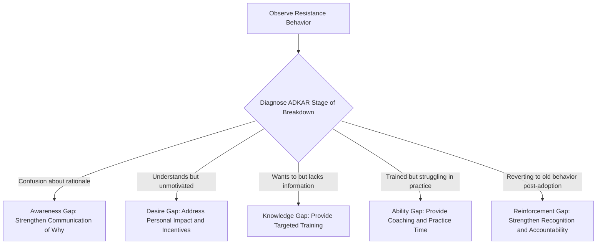
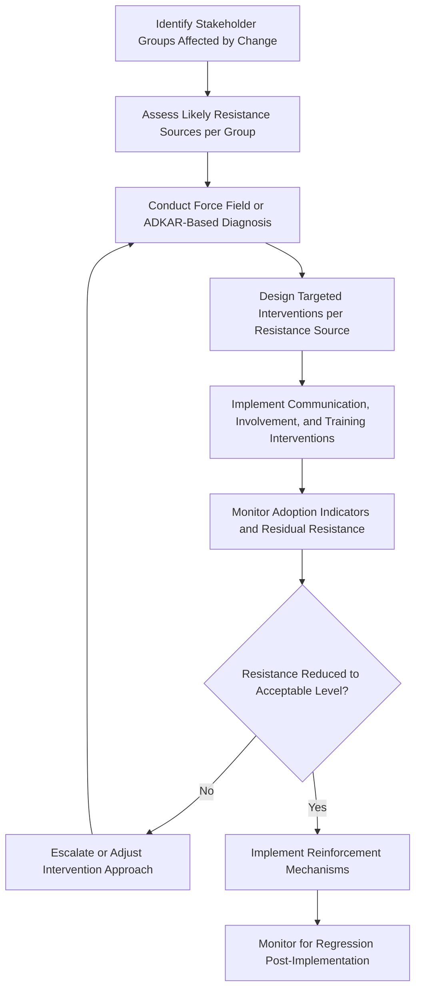

## Managing Resistance to Change

### Overview

Managing resistance to change is the discipline of identifying, understanding, and addressing the reluctance or opposition that individuals and groups exhibit when confronted with organizational change, including changes driven by project deliverables such as new systems, processes, or structures. Resistance is a normal, expected human response to change rather than an aberration to be eliminated by force; effective resistance management treats it as diagnostic information to be understood and addressed rather than an obstacle to be overpowered.

Unmanaged resistance is among the most commonly cited causes of project and change initiative failure, particularly for projects whose value depends on behavior change from end users rather than solely on technical delivery.

### Why Resistance Occurs

Resistance typically stems from one or more underlying causes rather than simple obstinance:

- **Loss aversion**: Fear of losing status, comfort with existing skills, established relationships, or job security.
- **Lack of awareness or understanding**: Insufficient information about why the change is happening or what it entails (see Awareness stage of ADKAR).
- **Lack of trust**: Skepticism toward leadership's motives or history of poorly managed past changes.
- **Disagreement with the change**: Genuine, substantive disagreement that the proposed change is the right solution, sometimes based on legitimate frontline knowledge not considered by change designers.
- **Change fatigue**: Exhaustion from frequent or poorly sequenced organizational changes, reducing capacity or willingness to engage with a new one.
- **Perceived lack of capability**: Fear of being unable to succeed under new processes or systems (related to the Ability stage of ADKAR).
- **Insufficient involvement**: Feeling that the change was imposed without consultation, reducing psychological ownership and buy-in.

**Key Points**

- Distinguishing between resistance rooted in emotional/psychological factors (loss aversion, trust) versus resistance rooted in legitimate substantive disagreement is critical, since the appropriate response differs significantly — the former requires empathetic engagement and communication, the latter may require genuinely revisiting the change design.

### Forms of Resistance

| Form | Description | Example |
| --- | --- | --- |
| Active/Overt | Openly expressed opposition, verbal objections, formal complaints | An employee raises concerns directly in a team meeting |
| Passive/Covert | Non-compliance without open objection; quiet non-adoption | Continuing to use the old spreadsheet process alongside the new system |
| Active Sabotage | Deliberate actions to undermine the change | Spreading negative rumors, deliberately misusing new processes to "prove" they don't work |
| Passive Withdrawal | Disengagement, reduced discretionary effort, increased absenteeism | Reduced participation in optional training sessions |

**Key Points**

- Passive resistance is often harder to detect and address than active resistance because it does not surface through direct communication channels, requiring proactive monitoring (e.g., system usage data, informal check-ins) rather than waiting for complaints.

### Diagnostic Frameworks for Resistance

#### Using ADKAR to Diagnose Resistance Source

Resistance can often be pinpointed to a specific stage of individual adoption using the ADKAR model: resistance at the Awareness stage looks different (confusion, "why are we doing this?") from resistance at the Desire stage ("I understand but I don't want to") or Ability stage ("I've tried but I can't do this well").

**Key Points**

- Applying a generic resistance-management response (e.g., more communication) to a resistance source that is actually rooted in a different stage (e.g., an Ability gap requiring hands-on coaching) wastes effort and can deepen frustration among affected employees.

#### Force Field Analysis

Developed by Kurt Lewin, force field analysis maps the driving forces supporting a change against the restraining forces opposing it, helping change leaders identify which specific restraining forces to address (rather than simply increasing pressure via driving forces, which can increase resistance and tension).

**Example**

| Driving Forces (Supporting Change) | Restraining Forces (Opposing Change) |
| --- | --- |
| Executive mandate and sponsorship | Fear of job role elimination |
| Competitive pressure from market | Comfort with legacy system familiarity |
| Improved efficiency for end users | Lack of trust in IT department (past failed rollout) |
| Regulatory compliance requirement | Insufficient training time allocated |

**Key Points**

- Lewin's approach specifically recommends reducing restraining forces (e.g., rebuilding trust, allocating more training time) over simply amplifying driving forces, since increasing pressure without addressing underlying resistance sources can increase tension and covert resistance rather than resolve it. [Inference: this recommendation reflects general change management practice guidance rather than a universally quantified outcome across all change contexts.]

### Strategies for Managing Resistance

#### 1. Early and Continuous Communication

Provide clear, consistent, and honest information about the change's rationale, timeline, and impact well before implementation, and maintain communication throughout rather than treating it as a one-time announcement.

#### 2. Stakeholder Involvement and Participation

Involve affected individuals in the design or implementation planning of the change where feasible, increasing psychological ownership and surfacing legitimate concerns early (which may improve the change design itself, not just its acceptance).

**Example**

Before rolling out a new project management tool organization-wide, the PMO invites a representative group of project managers from different departments to pilot the tool and provide feedback on workflow fit, incorporating several of their suggestions into the final configuration before full rollout — both improving the tool and creating internal advocates.

#### 3. Targeted Training and Support

Provide role-specific training addressing actual skill gaps (Knowledge and Ability stages of ADKAR) rather than generic, one-size-fits-all training that may not address the specific concerns of different affected groups.

#### 4. Addressing Emotional and Psychological Concerns

Acknowledge legitimate anxieties (job security, competence concerns) directly and empathetically rather than dismissing them, providing honest information where possible and support resources (coaching, career transition support) where appropriate.

#### 5. Identifying and Engaging Influencers

Identify informal opinion leaders within affected groups (who may not hold formal authority but hold peer influence) and engage them early as change champions, since peer-level advocacy is often more persuasive to affected staff than top-down messaging alone.

#### 6. Reinforcement and Accountability

Establish reinforcement mechanisms (recognition for adoption, corrective coaching for non-adoption, incorporation of new behaviors into performance expectations) to sustain change and prevent regression to old behaviors after initial rollout.

#### 7. Phased or Pilot Implementation

Introduce the change to a smaller group first, allowing issues to be identified and addressed, and generating visible early successes (aligned with Kotter's "Generate Short-Term Wins" step) that can reduce resistance in subsequent rollout phases.

### Resistance Management Process

### Common Pitfalls

- **Treating all resistance as irrational**: Dismissing resistance as simple stubbornness without investigating whether it reflects legitimate, substantive concerns about the change design that warrant genuine reconsideration.
- **One-size-fits-all communication**: Applying the same messaging and channel to all stakeholder groups regardless of their differing concerns, roles, or preferred communication styles.
- **Underestimating passive resistance**: Focusing resistance management efforts only on vocal, overt objectors while overlooking widespread quiet non-adoption that may be more consequential to overall change success.
- **Insufficient reinforcement post-launch**: Withdrawing change management attention immediately after go-live, allowing gradual regression to old behaviors once initial oversight relaxes.
- **Ignoring informal influence networks**: Focusing engagement efforts solely on formal organizational hierarchy while neglecting informal opinion leaders whose peer influence may be more consequential to broad adoption.
- **Escalating pressure instead of addressing root causes**: Responding to persistent resistance by increasing mandate enforcement or pressure rather than diagnosing and addressing the specific underlying restraining forces, which can increase covert resistance and damage trust further.

### Related Topics

- Kotter's Change Model and the ADKAR Model
- Stakeholder Engagement and Communication Planning
- Benefits Realization Management
- Force Field Analysis
- Change Management for PMO Implementation
- Organizational Culture and Project Success
- Training and Competency Development Programs