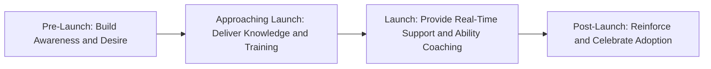
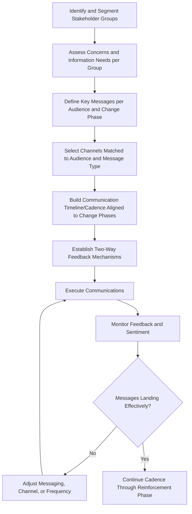

## Communication Planning for Change

### Overview

Communication planning for change is the structured process of designing, sequencing, and delivering messages to stakeholders throughout an organizational change initiative to build awareness, understanding, and support for the change while addressing concerns and reducing resistance. Unlike general project communication management (which focuses on status, progress, and deliverables), change communication planning is specifically oriented toward influencing stakeholder attitudes and behaviors — moving audiences through the psychological stages of change adoption, such as those described in the ADKAR model.

Effective change communication is not a single announcement but a sustained, multi-channel, multi-stage effort tailored to the differing needs, concerns, and influence levels of distinct stakeholder groups.

### Objectives of Change Communication

- **Build Awareness**: Ensure stakeholders understand what is changing and why (directly supporting the Awareness stage of ADKAR).
- **Generate Desire and Buy-In**: Address the personal "what's in it for me" (WIIFM) question for each stakeholder group to build motivation to support the change.
- **Convey Knowledge**: Provide the specific information stakeholders need to understand how the change will affect their work and how to adapt.
- **Manage Expectations**: Set realistic expectations about timelines, impacts, and transition challenges to reduce surprise and frustration.
- **Surface and Address Concerns**: Create channels for two-way dialogue so concerns, questions, and legitimate objections can be raised and addressed rather than suppressed.
- **Reinforce Adoption**: Sustain communication after go-live to reinforce new behaviors and celebrate progress, supporting the Reinforcement stage of ADKAR.

### Key Components of a Change Communication Plan

#### 1. Stakeholder Analysis and Segmentation

Before crafting messages, segment stakeholders by their role in the change, level of impact, influence, and likely concerns, since a single message rarely serves all groups effectively.

**Example**

| Stakeholder Group | Impact Level | Influence Level | Primary Concern | Preferred Channel |
| --- | --- | --- | --- | --- |
| Executive Sponsors | Low (strategic oversight) | High | Return on investment, risk | Executive briefings, dashboards |
| Frontline Staff (direct users) | High (daily workflow change) | Low-Medium | Job security, ease of use, WIIFM | Team meetings, hands-on training, FAQs |
| Middle Managers | Medium-High | Medium-High | Team productivity during transition, reporting burden | Manager briefing sessions, toolkits to cascade |
| IT/Support Staff | High (implementation/support role) | Medium | Technical readiness, support burden | Technical documentation, working sessions |

**Key Points**

- Middle managers are frequently a critical, underserved audience: they need enough detail to credibly cascade information to their teams and answer questions, not just headline messaging intended for frontline staff.

#### 2. Key Messages by Audience and Phase

Develop core messages tailored to what each audience needs to know at each phase of the change, ensuring consistency of core facts (the "what" and "why") while varying emphasis and detail (the "so what for you") by audience.

#### 3. Channel Selection

Match communication channels to the message type, audience preference, and required interactivity.

| Channel Type | Best Suited For | Limitations |
| --- | --- | --- |
| All-hands/town hall meetings | Building urgency, executive-level Awareness messaging | Limited two-way dialogue at scale |
| Team meetings | Role-specific detail, two-way Q&A | Time-intensive, requires manager cascade quality control |
| Email/newsletters | Broad-reach factual updates, timelines | Passive; easily overlooked or skimmed |
| Intranet/FAQ pages | Reference material, self-service Knowledge stage support | Requires active seeking-out by the user |
| One-on-one conversations | Addressing individual concerns, sensitive impacts (e.g., role changes) | Not scalable to large populations |
| Training sessions | Knowledge and Ability stage support | Requires scheduling and resourcing |
| Champion/peer networks | Building Desire through peer influence | Requires identifying and equipping champions in advance |

#### 4. Sequencing and Cadence

Change communication should be sequenced across the change timeline, front-loading Awareness-building messaging, transitioning to Knowledge/Ability-focused content closer to implementation, and shifting to Reinforcement messaging post-launch.

**Example timeline for a system rollout:**

| Phase | Timing | Primary Message Focus | Example Activities |
| --- | --- | --- | --- |
| Awareness | 3 months before launch | Why the change is happening; risks of status quo | Executive announcement, all-hands briefing |
| Desire | 2 months before launch | Personal benefits (WIIFM); address concerns | Manager cascade sessions, Q&A forums |
| Knowledge | 1 month before launch | How the new process/system works | Training sessions, documentation release |
| Ability | Launch week | Hands-on support | Floor-walking support staff, help desk |
| Reinforcement | 1–3 months after launch | Sustained adoption, success stories | Recognition of early adopters, usage metrics shared |

#### 5. Feedback Mechanisms

Build in channels for stakeholders to ask questions, raise concerns, and provide feedback, and ensure a visible process exists for responding to that feedback (silence or unaddressed feedback erodes trust and can deepen resistance).

**Key Points**

- One-way "broadcast" communication plans without feedback loops tend to generate the perception that the change is being imposed rather than co-created, which can increase resistance rooted in lack of involvement.

### Communication Planning Process

### Relationship to Broader Change Management Frameworks

Communication planning operationalizes several steps of Kotter's model directly (particularly "Communicate the Vision" and sustaining momentum through "Short-Term Wins" publicity) and directly supports the Awareness, Desire, and Reinforcement stages of ADKAR. It is typically developed as a formal subsidiary plan within a broader change management plan, closely coordinated with (but distinct from) the project's stakeholder engagement and communications management plan.

**Key Points**

- Project communications management plans (per standard project management practice) focus on status and progress information flow; change communication plans focus specifically on adoption and behavior change messaging. The two should be coordinated to avoid conflicting or redundant messaging to the same audiences, though they serve different primary purposes.

### Common Pitfalls

- **Single-message, single-channel approach**: Relying on one broadcast communication (e.g., a single company-wide email) and assuming the message has been received and understood by all audiences.
- **Front-loading all communication early and going silent**: Delivering an initial announcement with strong fanfare, then failing to sustain communication cadence through implementation and post-launch reinforcement, allowing momentum and awareness to fade.
- **Ignoring the WIIFM question**: Communicating organizational-level benefits (cost savings, efficiency) without translating them into what the change specifically means for each affected individual's day-to-day work.
- **No feedback mechanism**: Broadcasting messages without creating channels for questions or concerns, which can increase perceived top-down imposition and reduce trust.
- **Inconsistent messaging across cascaded channels**: Failing to equip middle managers with consistent talking points, resulting in variable or conflicting information reaching frontline staff depending on which manager cascades it.
- **Treating communication as complete at launch**: Stopping change communication activity once the system or process goes live, missing the critical Reinforcement phase needed to prevent regression to old behaviors.

### Related Topics

- Kotter's Change Model and the ADKAR Model
- Managing Resistance to Change
- Stakeholder Engagement and Communication Planning
- Benefits Realization Management
- Training and Competency Development Programs
- Change Management for PMO Implementation
- Project Communications Management