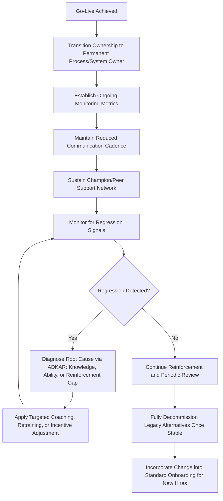

## Sustaining Change After Go Live

### Overview

Sustaining change after go-live is the discipline of ensuring that new processes, systems, or behaviors remain adopted and embedded in day-to-day operations after the initial implementation period ends, rather than gradually reverting to prior ways of working. This phase corresponds to the final stages of major change frameworks — the Reinforcement stage of ADKAR and the "Institute Change" (anchor in culture) step of Kotter's model — and is frequently the most under-resourced phase of change initiatives, since organizational attention and dedicated change management resources typically decline sharply once go-live is achieved.

Sustaining change is critical because go-live represents only the point at which a new capability becomes available, not the point at which the intended organizational benefit is guaranteed; benefits realization depends on sustained, correct adoption over time.

### Why Regression Happens

Without deliberate sustainment effort, several forces naturally pull organizations back toward prior behaviors:

- **Habit strength**: Long-established habits require sustained reinforcement to be overwritten by new behaviors, and habits tend to resurface under stress or time pressure.
- **Reduced oversight**: Dedicated project or change management resources are typically reassigned after go-live, removing the visible monitoring and support that drove initial compliance.
- **Incomplete initial adoption**: If Knowledge or Ability gaps (per ADKAR) were not fully closed during implementation, users may quietly revert to familiar (if inferior) methods under workload pressure.
- **Absence of reinforcement mechanisms**: Without incentives, recognition, or accountability tied to the new behavior, there is no ongoing motivation to maintain it over the old approach.
- **Turnover**: New employees who join after go-live may not receive the same onboarding rigor as those who went through the original change program, diluting adoption over time.
- **Parallel legacy systems/processes**: If old systems or processes are not fully decommissioned, the path of least resistance back to familiar tools remains available.

**Key Points**

- Regression risk is highest in the weeks immediately following go-live, when novelty-driven initial compliance fades but new habits are not yet fully established, and again months later as organizational attention moves to newer priorities. [Inference: the specific regression risk timeline varies by organization and change complexity and cannot be stated as a fixed universal interval.]

### Core Sustainment Mechanisms

#### 1. Reinforcement and Accountability

Embed the new behavior into formal organizational mechanisms so that maintaining it is not solely dependent on individual goodwill.

- Incorporate new process compliance into performance reviews or team KPIs.
- Provide positive recognition for early adopters and teams demonstrating strong compliance.
- Apply corrective coaching (not punitive action, particularly early on) for observed reversion to old methods.

#### 2. Monitoring and Measurement

Establish ongoing metrics to detect regression early, rather than relying on anecdotal observation.

**Example**

| Metric | Purpose | Example Threshold for Concern |
| --- | --- | --- |
| System usage/login rate | Detect disengagement from new tool | Declining week-over-week usage among target user group |
| Process compliance rate | Detect reversion to old workflow | Increase in manual workarounds or old-format submissions |
| Help desk ticket volume/type | Detect persistent Knowledge/Ability gaps | Recurring tickets on the same feature months post-launch |
| Benefits realization metrics | Confirm intended business value is materializing | Realized benefit tracking below projected trajectory (see Benefits Realization Management) |

#### 3. Continued Communication and Visibility

Maintain a reduced but sustained communication cadence post-launch — success stories, usage tips, and periodic reminders of the "why" — rather than allowing communication to cease entirely at go-live, directly supporting the sustained Reinforcement stage of ADKAR.

#### 4. Removing Legacy Alternatives

Deliberately decommission or restrict access to old systems, templates, or processes once the new approach is stable, removing the low-friction path back to prior habits. Timing this decommissioning too early (before Ability is fully established) can cause frustration; timing it too late allows parallel-use habits to persist indefinitely.

#### 5. Local Champions and Support Networks

Sustain the champion/peer-support network established during implementation into an ongoing role, providing accessible, non-threatening peer support for lingering questions or difficulties well after formal training has ended.

#### 6. Governance Ownership Transition

Formally transition ownership of the new process or system from the project/change team to a permanent operational owner (e.g., a process owner, system administrator, or the PMO for process standards) who is accountable for its ongoing health, updates, and continued compliance monitoring.

**Key Points**

- Without a clearly assigned permanent owner, sustainment activities often fall through organizational gaps once the temporary project team disbands, since no one holds explicit ongoing accountability for monitoring adoption or addressing emerging issues.

### Sustainment Process Flow

### Sustaining Change for New Employees

A commonly overlooked aspect of sustainment is ensuring the change persists correctly for employees who join after the initial go-live and were not part of the original change communication and training effort.

**Key activities:**

- Update standard onboarding materials and training curricula to reflect the new process/system as the default, "business as usual" approach rather than as a "recent change."
- Ensure new hire training carries the same rigor as the original rollout training, rather than being an abbreviated or informal version.
- Periodically audit whether onboarding materials remain current as the process continues to evolve post-launch.

### Benefits Realization Linkage

Sustainment activity should be directly tied to the benefits realization tracking established in the project's business case, since sustained correct adoption is typically the causal mechanism through which projected benefits are actually achieved. A decline in adoption metrics is often a leading indicator of an emerging shortfall in benefits realization before the shortfall becomes visible in lagging financial or operational metrics.

### Common Pitfalls

- **Resource cliff at go-live**: Abruptly withdrawing all dedicated change management and support resources immediately after go-live, leaving no capacity to address emerging adoption issues during the critical early post-launch period.
- **No formal ownership transition**: Failing to explicitly assign a permanent process/system owner, resulting in sustainment activities falling into an organizational gap once the project team disbands.
- **Retaining legacy systems indefinitely**: Allowing old systems or processes to remain accessible "just in case," providing a persistent low-friction path back to prior habits that undermines full adoption.
- **Treating go-live as project closure with no follow-up**: Closing the project (and associated reporting/monitoring) at go-live without a defined post-launch monitoring period to verify sustained adoption and benefits realization.
- **Neglecting new hire onboarding updates**: Leaving onboarding materials referencing the old process/system, causing new employees to learn outdated practices that must later be unlearned.
- **Punitive response to regression**: Responding to observed reversion with disciplinary action before diagnosing the underlying cause (e.g., an unaddressed Ability gap), which can increase resistance and reduce psychological safety to report genuine difficulties.

### Related Topics

- Kotter's Change Model and the ADKAR Model
- Managing Resistance to Change
- Communication Planning for Change
- Benefits Realization Management
- Change Management for PMO Implementation
- Portfolio Performance Reporting
- Training and Competency Development Programs