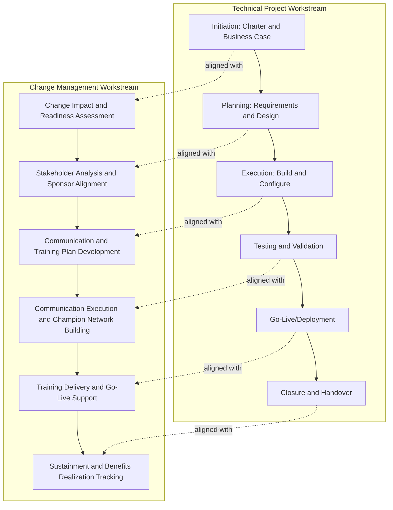

## Integrating Change Management with Project Delivery

### Overview

Integrating change management with project delivery is the practice of embedding organizational change management (OCM) activities directly into the project management lifecycle, rather than treating change management as a separate, disconnected workstream that begins only after technical delivery is complete. When change management is integrated from project initiation onward, adoption-readiness activities (stakeholder engagement, communication, training, resistance management) proceed in parallel with technical activities (requirements, design, build, testing), so that the organization is prepared to adopt the deliverable at the moment it becomes available, rather than beginning adoption efforts only after go-live.

Projects that treat change management as an afterthought — engaged only shortly before go-live — frequently experience delayed or incomplete benefits realization even when technical delivery is fully successful, since a technically functional deliverable does not by itself guarantee that people will use it correctly or willingly.

### Why Integration Matters

- **Benefits realization depends on adoption**: A project's business case value is typically contingent on people actually using the new system, process, or capability correctly; technical completion alone does not produce business value.
- **Late-stage change management is reactive, not proactive**: Change management activities compressed into the final weeks before go-live (communication, training) cannot adequately build Awareness and Desire, which require sustained lead time (see ADKAR).
- **Requirements quality improves with early stakeholder involvement**: Change management's stakeholder engagement practices, when applied early, often surface requirements or design concerns that improve the technical solution itself, not just its acceptance.
- **Risk identification improves**: Change-related risks (resistance, capability gaps, cultural misalignment) are more effectively identified and mitigated when assessed alongside technical risks from project initiation, rather than discovered late as implementation barriers.

### Parallel Workstream Model

Change management activities should run as a parallel, integrated workstream alongside the technical project workstream across the entire project lifecycle, with defined touchpoints at each phase rather than being appended only at the end.

### Integration by Project Phase

#### 1. Initiation Phase

**Technical activities**: Develop project charter and business case.

**Integrated change activities**: Conduct an initial change impact assessment estimating the scope and depth of behavior change required; identify the executive sponsor(s) needed to drive both project delivery and organizational adoption; begin high-level stakeholder identification.

**Key Points**

- A change impact assessment at this stage helps size the change management effort proportionately (see Sizing below), preventing under-resourcing of change activities relative to the actual behavioral change required.

#### 2. Planning Phase

**Technical activities**: Develop detailed requirements, design specifications, and project management plan.

**Integrated change activities**: Conduct detailed stakeholder analysis and segmentation; develop the change management plan (including communication and training plans) as a subsidiary plan alongside the technical project management plan; identify change champions/network; establish baseline adoption and readiness metrics.

**Key Points**

- Stakeholder input gathered during change management planning should feed back into technical requirements refinement where relevant, since frontline users often identify practical workflow considerations that technical designers may not anticipate.

#### 3. Execution Phase

**Technical activities**: Build, configure, or develop the solution.

**Integrated change activities**: Execute early-phase communication (building Awareness and Desire per ADKAR); develop and pilot training materials; continue stakeholder engagement and address emerging concerns; monitor change readiness indicators.

#### 4. Testing/Validation Phase

**Technical activities**: Conduct system/process testing, user acceptance testing (UAT).

**Integrated change activities**: Involve end users directly in UAT (serving both a technical validation purpose and a change management purpose by building early hands-on familiarity and champion advocacy); refine training materials based on UAT participant feedback; finalize go-live communication and support plans.

**Example**

A hospital implementing a new electronic health records (EHR) system includes practicing nurses and physicians directly in UAT sessions. This serves the technical purpose of validating workflow functionality while simultaneously building a cohort of clinically credible early adopters who can serve as peer champions during the broader rollout, directly supporting the Desire and Ability stages of adoption among their colleagues.

#### 5. Go-Live/Deployment Phase

**Technical activities**: Deploy the solution into production.

**Integrated change activities**: Provide intensive Ability-stage support (floor-walking support staff, help desk); execute go-live communication; actively monitor early adoption and resistance signals for rapid response.

#### 6. Closure and Sustainment Phase

**Technical activities**: Formal project closure, handover to operations.

**Integrated change activities**: Transition change sustainment activities (reinforcement, monitoring, ownership transition) to permanent operational owners; begin benefits realization tracking against the original business case; conduct lessons learned incorporating both technical and change management perspectives.

**Key Points**

- Change management activities frequently need to continue past formal technical project closure, since benefits realization tracking and sustainment activities occur over a longer post-implementation period than typical technical project closure timelines allow; this requires deliberate planning for how sustainment responsibility transitions beyond project closure.

### Sizing the Change Management Effort

Not all projects require the same intensity of change management investment; the effort should be proportionate to the scope and depth of behavioral change required, not applied uniformly.

**Example sizing framework:**

| Change Impact Level | Characteristics | Change Management Investment |
| --- | --- | --- |
| Low | Minor process tweak, small affected population, low behavior change | Lightweight communication, brief training notes |
| Medium | Moderate process/system change, departmental scope | Structured communication plan, formal training sessions, designated champions |
| High | Major system/process overhaul, cross-functional, significant behavior change, role changes | Full change management plan, dedicated change manager role, extensive stakeholder engagement, phased rollout, sustained post-launch support |

**Key Points**

- Under-sizing change management investment relative to actual change impact is a common cause of poor adoption; the assessment should be based on the depth and breadth of behavior change required, not merely the technical complexity or budget size of the project. [Inference: technical complexity and change impact are related but distinct dimensions, and a technically simple project can still require substantial change management if it significantly alters established behaviors or roles.]

### Roles and Responsibilities

| Role | Technical Delivery Responsibility | Change Management Responsibility |
| --- | --- | --- |
| Project Manager | Owns scope, schedule, cost, technical delivery | Coordinates integration of change activities into the overall project plan and timeline |
| Change Manager (dedicated, for larger projects) | Provides input on adoption-related requirements | Owns change impact assessment, communication plan, training plan, resistance management |
| Executive Sponsor | Approves business case, resolves technical escalations | Visibly champions the change, removes organizational barriers, reinforces urgency |
| Project Team/Business Analysts | Deliver technical solution | Support change activities by incorporating user feedback into design |
| Change Champions/Super Users | May participate in UAT | Provide peer-level advocacy and informal support during and after rollout |

**Key Points**

- On smaller projects, the project manager may perform change management functions directly without a dedicated change manager role; on larger, high-impact projects, a dedicated change manager working in close coordination with the project manager is more common. [Inference: the threshold at which a dedicated change manager role becomes warranted depends on organizational size, project impact, and available change management maturity, and is not governed by a fixed universal rule.]

### Common Pitfalls

- **Change management as an afterthought**: Engaging change management activities only in the weeks immediately before go-live, leaving insufficient time to build genuine Awareness and Desire.
- **Disconnected workstreams**: Running change management and technical delivery as separate, uncoordinated efforts with different timelines and stakeholders, resulting in messaging or timing misalignment (e.g., training delivered before the system is stable, or communication promising a go-live date the technical team later slips).
- **Uniform change management sizing**: Applying the same lightweight (or heavyweight) change management approach regardless of actual change impact, either under-resourcing high-impact changes or over-engineering low-impact ones.
- **Treating UAT as purely technical**: Missing the opportunity to use user acceptance testing as a change management tool for building early adopter advocacy and Ability, in addition to its technical validation purpose.
- **No clear ownership handoff for sustainment**: Failing to define how change management responsibility transitions from the project team to permanent operational owners at project closure, causing sustainment activities to lapse.
- **Excluding change management from project governance**: Failing to report change readiness and adoption risk alongside technical status (schedule, cost, scope) in project governance reviews, causing adoption risk to remain invisible to sponsors and steering committees until it manifests as poor benefits realization.

### Related Topics

- Kotter's Change Model and the ADKAR Model
- Managing Resistance to Change
- Communication Planning for Change
- Sustaining Change After Go Live
- Benefits Realization Management
- Stakeholder Engagement and Communication Planning
- Project Governance Frameworks