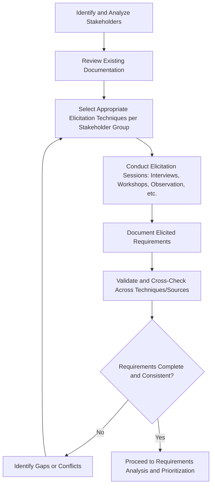

## Requirements Elicitation Techniques

### Overview

Requirements elicitation is the process of proactively identifying and drawing out stakeholder needs, expectations, and constraints to define what a project must deliver. It is distinct from simply collecting requirements that stakeholders volunteer; elicitation implies active, structured techniques to surface needs that stakeholders may not have consciously articulated, including latent needs, unstated assumptions, and conflicting priorities across stakeholder groups. Elicitation quality directly affects downstream project success, since requirements defects introduced at this stage are typically the most expensive to correct if discovered later in the project lifecycle.

Elicitation is rarely a single-technique, single-event activity; most projects combine multiple techniques across multiple sessions to triangulate a complete and accurate requirements picture.

### Core Elicitation Techniques

#### 1. Interviews

One-on-one or small-group structured conversations with stakeholders to gather detailed information about needs, processes, and constraints.

**Types:**

- **Structured interviews**: Follow a predefined, consistent set of questions across all interviewees, supporting comparability of responses.
- **Unstructured interviews**: Open-ended, conversational format allowing exploration of topics as they emerge, better suited to early-stage exploratory elicitation.
- **Semi-structured interviews**: A blend, using a core question set with flexibility to probe deeper on emerging topics.

**Key Points**

- Interviews are effective for gathering detailed, nuanced information from key stakeholders but do not scale efficiently to large stakeholder populations and are subject to the interviewee's individual perspective bias, making triangulation with other techniques advisable.

#### 2. Workshops (Facilitated Sessions)

Structured group sessions bringing multiple stakeholders together to jointly define requirements, resolve conflicting viewpoints, and build shared understanding in real time.

**Common formats:**

- **Joint Application Design/Development (JAD) sessions**: Structured, facilitator-led workshops specifically for defining system requirements collaboratively with business and technical stakeholders.
- **Requirements workshops**: General-purpose facilitated sessions for eliciting and prioritizing requirements across stakeholder groups.

**Example**

A facilitator runs a two-day JAD workshop with representatives from sales, finance, and IT to define requirements for a new order management system, using structured exercises to surface each department's must-have requirements, followed by a joint prioritization exercise (see Requirements Prioritization Techniques) to resolve competing departmental priorities in real time rather than through prolonged asynchronous negotiation.

**Key Points**

- Workshops are efficient for building consensus and resolving cross-stakeholder conflicts directly, but require skilled facilitation to prevent dominant personalities from overshadowing quieter stakeholders' input, and require significant scheduling coordination across busy stakeholders.

#### 3. Observation (Job Shadowing / Ethnographic Study)

Directly observing stakeholders performing their current work to understand actual (as opposed to reported) processes, workarounds, and pain points.

**Variants:**

- **Passive observation**: The observer watches without interaction, minimizing influence on natural behavior.
- **Active observation ("day in the life")**: The observer may ask clarifying questions during the observed activity.
- **Participatory observation**: The observer actively performs the task themselves under guidance, gaining direct experiential insight.

**Key Points**

- Observation is particularly effective for surfacing tacit knowledge and informal workarounds that stakeholders may not think to mention in interviews because the behavior has become so routine it is no longer consciously noticed.
- Subject to the observer effect: stakeholders may alter their behavior when aware they are being watched, potentially masking informal shortcuts or non-compliant practices relevant to accurate requirements gathering. [Inference: the magnitude of behavioral alteration under observation varies by individual and context and is not precisely quantifiable in general terms.]

#### 4. Document Analysis

Reviewing existing documentation — process manuals, system specifications, regulatory requirements, organizational policies, prior project artifacts — to extract existing, documented requirements or constraints as a starting baseline.

**Key Points**

- Useful as a preparatory technique before interviews or workshops, allowing elicitation sessions to focus on gaps, ambiguities, or changes rather than re-deriving already-documented information from scratch.
- Documentation may be outdated or reflect intended rather than actual process, so findings should generally be validated against other techniques (e.g., observation or interviews) rather than assumed current.

#### 5. Surveys and Questionnaires

Structured written instruments distributed to a large stakeholder population to gather requirements input at scale, typically using a mix of closed (rating scale, multiple choice) and open-ended questions.

**Key Points**

- Effective for gathering input from large, geographically dispersed stakeholder populations where interviews or workshops are impractical, but yields less depth and nuance than direct conversation and depends heavily on well-designed, unambiguous question wording.

#### 6. Prototyping

Building a preliminary, simplified version of a solution (paper mockup, wireframe, or working software prototype) to elicit concrete stakeholder feedback, since stakeholders often find it easier to react to a tangible representation than to articulate abstract requirements from scratch.

**Types:**

- **Low-fidelity prototypes**: Paper sketches or simple wireframes, quick to produce and modify.
- **High-fidelity prototypes**: Interactive, visually polished mockups closely resembling the final product, better for eliciting detailed feedback on usability and workflow but more costly to produce and revise.

**Example**

A UX team creates a low-fidelity paper prototype of a new mobile app's checkout flow and walks five target users through simulated tasks, observing where they hesitate or make errors, then uses this feedback to refine both the prototype and the underlying functional requirements before any code is written.

#### 7. Focus Groups

Facilitated group discussions with a curated set of stakeholders (often representative end users or customers) to gather qualitative input on needs, preferences, and reactions to proposed concepts.

**Key Points**

- Distinct from workshops in that focus groups are typically used to gather diverse perspectives and reactions (often with external customers/users) rather than to reach a specific joint decision or consensus requirement set among internal stakeholders.

#### 8. Brainstorming

Group idea-generation technique used to surface a broad range of requirements, features, or problem considerations without immediate evaluation or filtering, typically followed by a separate consolidation and prioritization step.

**Key Points**

- Effective for divergent, creative requirement discovery early in elicitation, but requires structured facilitation (e.g., ensuring no idea is criticized during the generation phase) to avoid prematurely narrowing the range of ideas surfaced.

#### 9. Benchmarking and Market Analysis

Studying how comparable organizations, competitors, or industry standards address similar problems, using external practice as a reference point to inform and validate internally elicited requirements.

#### 10. Interface Analysis

Systematically examining the interfaces (system-to-system, system-to-user, or process-to-process boundaries) that a new solution must interact with, to surface integration and data-exchange requirements that internal stakeholders may not spontaneously mention.

### Technique Selection Framework

| Technique | Best For | Scalability | Depth of Insight |
| --- | --- | --- | --- |
| Interviews | Deep individual insight, sensitive topics | Low | High |
| Workshops/JAD | Cross-stakeholder consensus, conflict resolution | Medium | High |
| Observation | Tacit knowledge, actual (vs. reported) process | Low | High |
| Document Analysis | Baseline/existing documented requirements | High | Medium |
| Surveys | Broad population input at scale | High | Low-Medium |
| Prototyping | Concrete feedback on usability/workflow | Medium | High |
| Focus Groups | Qualitative customer/user reactions | Medium | Medium |
| Brainstorming | Divergent idea generation | Medium | Medium |
| Benchmarking | External validation and best-practice input | High | Medium |
| Interface Analysis | System/process integration points | Medium | High (for integration specifically) |

**Key Points**

- No single technique is sufficient for comprehensive requirements elicitation on most non-trivial projects; effective business analysis practice typically triangulates multiple techniques to cross-validate findings and cover different insight types (stated needs, observed behavior, documented constraints, and future-facing input).

### Elicitation Process Flow

### Common Pitfalls

- **Relying on a single technique**: Using only interviews or only surveys, missing the complementary insight types other techniques would surface (e.g., tacit process knowledge only visible through observation).
- **Eliciting from an incomplete stakeholder set**: Focusing on the most vocal or senior stakeholders while missing frontline users whose day-to-day process knowledge may be most critical to accurate requirements.
- **Confusing solutions with requirements**: Allowing stakeholders to jump directly to proposed solutions ("we need a dropdown menu here") without first eliciting the underlying need or problem the solution is intended to address, which can prematurely constrain the solution space.
- **Insufficient preparation for interviews/workshops**: Conducting elicitation sessions without reviewing existing documentation first, wasting session time re-deriving already-known information rather than probing gaps.
- **Documenting without validating**: Recording stakeholder statements verbatim as final requirements without cross-checking against other sources or techniques, risking propagation of misunderstandings or individually biased perspectives into the requirements baseline.
- **Observer effect blind spot**: Relying solely on observation without accounting for the possibility that observed behavior may not reflect typical, unobserved behavior.

### Related Topics

- Requirements Analysis and Documentation
- Requirements Prioritization Techniques
- Stakeholder Engagement and Communication Planning
- Requirements Traceability Matrix
- Business Case Development and Value Scoring
- Use Case and User Story Development
- Requirements Validation and Verification