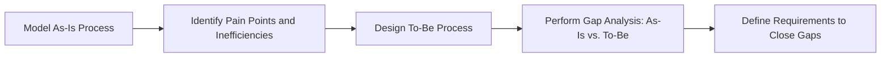
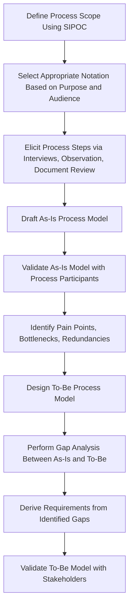

## Business Process Modeling

### Overview

Business process modeling (BPM) is the practice of creating visual and structured representations of an organization's business processes to document, analyze, communicate, and improve how work flows through people, systems, and decision points. In a project management context, business process modeling supports requirements definition, gap analysis between current ("as-is") and future ("to-be") states, and communication between business stakeholders and technical implementation teams. Models make implicit process knowledge explicit and provide a shared visual reference that reduces ambiguity compared to text-only process descriptions.

### Purposes of Business Process Modeling

- **Documentation**: Capture how a process currently operates, preserving institutional knowledge that might otherwise exist only informally.
- **Analysis**: Identify inefficiencies, bottlenecks, redundancies, or gaps in the current process.
- **Communication**: Provide a common visual language between business stakeholders, business analysts, and technical/development teams, reducing requirements misinterpretation.
- **Design**: Define the intended future-state process that a project's deliverables (new systems, reorganized workflows) are meant to enable.
- **Compliance and Training**: Serve as reference documentation for regulatory compliance, audit trails, and employee training on standard procedures.

### As-Is vs. To-Be Modeling

A foundational distinction in business process modeling is between documenting the current state and designing the desired future state.

- **As-Is (Current State) Model**: Represents how a process actually operates today, including inefficiencies, workarounds, and pain points. Serves as the baseline for gap analysis.
- **To-Be (Future State) Model**: Represents the intended, improved process design that a project aims to implement, incorporating process improvements and reflecting how new systems or organizational changes will alter the workflow.

**Key Points**

- Gap analysis between as-is and to-be models is a primary mechanism for deriving concrete project requirements: each identified gap (a step, decision point, or handoff present in one model but not the other) typically translates into a specific functional or process requirement.
- Skipping as-is modeling and jumping directly to to-be design risks designing a future state that fails to account for real current-state constraints, dependencies, or stakeholder concerns that as-is modeling would have surfaced.

### Common Modeling Notations and Techniques

#### 1. Flowcharts

The simplest and most widely understood process modeling notation, using standardized shapes (ovals for start/end, rectangles for activities, diamonds for decisions) connected by directional arrows to show sequential process flow.

**Key Points**

- Flowcharts are highly accessible to non-technical stakeholders due to widespread familiarity, but lack standardized conventions for representing complex elements like parallel processing, multiple actors/swimlanes, or system events without informal notation extensions.

#### 2. Swimlane Diagrams (Cross-Functional Flowcharts)

An extension of the basic flowchart that organizes process steps into horizontal or vertical "lanes," each representing a distinct actor, role, department, or system responsible for that step, making handoffs between parties explicit.

**Example**

A purchase order approval process modeled with three swimlanes — Requester, Manager, Finance — visually shows that the Requester submits the request, the Manager reviews and approves/rejects, and only upon approval does the request flow into the Finance lane for payment processing, making the handoff points and single points of accountability clearly visible in a way a non-lane flowchart would not.

**Key Points**

- Particularly valuable for identifying handoff-related delays and accountability gaps, since problems often occur specifically at the transition points between lanes (departments or systems) rather than within a single actor's activities.

#### 3. Business Process Model and Notation (BPMN)

A standardized, formal notation (maintained by the Object Management Group, OMG) widely used for detailed business process modeling, particularly when models will be used to inform system implementation or process automation (including business process automation/workflow engines that can execute BPMN diagrams directly).

**Core BPMN elements:**

- **Events**: Circles representing something that happens during the process (start events, intermediate events, end events).
- **Activities/Tasks**: Rounded rectangles representing work performed (tasks, sub-processes).
- **Gateways**: Diamonds representing decision points or points of parallel/converging flow (exclusive, inclusive, parallel gateways).
- **Sequence Flows**: Solid arrows showing the order of activities.
- **Message Flows**: Dashed arrows showing communication between separate process participants (pools).
- **Pools and Lanes**: Pools represent distinct process participants (e.g., separate organizations); lanes within a pool represent roles or departments, similar to swimlane diagrams.

**Key Points**

- BPMN's greater formality and standardized semantics make it well-suited for processes that will be directly implemented in business process automation/workflow engine software, since the notation maps more precisely to executable logic than an informal flowchart.
- The formal rigor and larger symbol vocabulary of BPMN carries a steeper learning curve for business stakeholders compared to simple flowcharts or swimlane diagrams, sometimes requiring a business analyst to translate between BPMN diagrams and plainer-language process narratives for non-technical audiences.

#### 4. Value Stream Mapping

A Lean management technique that visualizes the flow of materials and information required to bring a product or service to a customer, explicitly distinguishing value-adding steps from non-value-adding steps (waste), and typically annotating each step with timing data (process time, wait time).

**Key Points**

- Distinctive in its explicit focus on identifying and quantifying waste (non-value-adding time/activity) as a percentage of total process lead time, making it particularly suited to process improvement initiatives with an efficiency or Lean/Six Sigma mandate.

#### 5. SIPOC Diagrams

A high-level process overview technique (Suppliers, Inputs, Process, Outputs, Customers) used early in process analysis to establish process scope and boundaries before detailed modeling begins.

**Example**

| Suppliers | Inputs | Process | Outputs | Customers |
| --- | --- | --- | --- | --- |
| Sales team, CRM system | Signed contract, customer data | Order Fulfillment Process | Shipped product, invoice | End customer, Finance department |

**Key Points**

- SIPOC is intentionally high-level and is typically used as a scoping tool before applying a more detailed technique (flowchart, swimlane, or BPMN) to model the process internals.

### Notation Comparison

| Notation | Formality | Best Suited For | Learning Curve |
| --- | --- | --- | --- |
| Basic Flowchart | Low | Quick, accessible documentation for general audiences | Low |
| Swimlane Diagram | Low-Medium | Highlighting cross-functional handoffs and accountability | Low-Medium |
| BPMN | High | Detailed process design intended for system implementation or automation | Medium-High |
| Value Stream Mapping | Medium | Lean/efficiency-focused process improvement with waste identification | Medium |
| SIPOC | Low | High-level process scoping before detailed modeling | Low |

### Business Process Modeling Workflow

### Integration with Requirements and Project Delivery

Business process models serve as a bridge between requirements elicitation and formal requirements documentation: process steps and decision points identified in modeling often translate directly into functional requirements, while identified handoffs and pain points inform both requirements and change management planning (since a to-be process typically requires stakeholders to adopt new behaviors, connecting directly to organizational change management practice).

**Key Points**

- Process models developed during business analysis are frequently reused during later training development (illustrating the new to-be process to end users) and during change impact assessment (since a to-be process model makes visible exactly which roles' day-to-day work will change and how).

### Common Pitfalls

- **Modeling to-be without an as-is baseline**: Designing an idealized future-state process without first understanding current constraints, dependencies, or the reasons behind existing (even inefficient-looking) steps, risking a design that overlooks legitimate current-state requirements.
- **Excessive notation complexity for the audience**: Using highly formal BPMN with full gateway/event vocabulary for an audience of business stakeholders unfamiliar with the notation, reducing comprehension and engagement rather than improving communication.
- **Stale models**: Failing to update process models as the actual process evolves post-implementation, leading to documentation that no longer reflects reality and misleads future analysis or training efforts.
- **Modeling in isolation from process participants**: Business analysts drafting process models based solely on management-level input without validating against the people who actually perform the process day-to-day, missing informal workarounds or undocumented exception handling.
- **Confusing organizational charts with process models**: Documenting reporting-line hierarchy rather than actual process flow and handoffs, which serves a different purpose and does not surface process-specific bottlenecks or requirements.
- **No clear process boundary (scope creep in modeling)**: Attempting to model an overly broad process end-to-end without first scoping boundaries (as SIPOC is intended to establish), resulting in unwieldy, low-utility diagrams.

### Related Topics

- Requirements Elicitation Techniques
- Requirements Analysis and Documentation
- Integrating Change Management with Project Delivery
- Business Case Development and Value Scoring
- Lean and Six Sigma Process Improvement
- Requirements Traceability Matrix
- Use Case and User Story Development