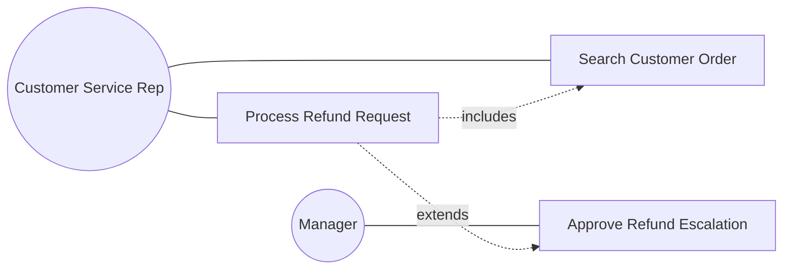
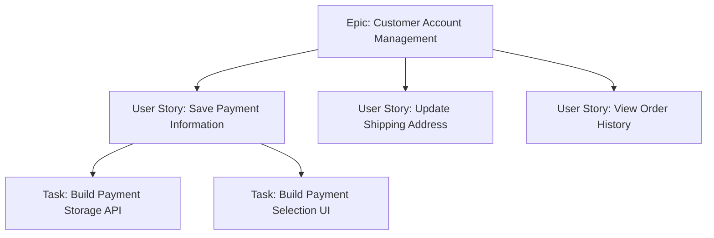

## User Stories and Use Cases

### Overview

User stories and use cases are two distinct but related techniques for documenting functional requirements from the perspective of the people who will interact with a system or process. Both aim to capture what a user needs to accomplish and why, but they differ significantly in structure, formality, and typical methodological context: use cases originate from traditional, plan-driven (often waterfall or structured) analysis and provide detailed, comprehensive interaction documentation, while user stories originate from Agile practice and provide lightweight, conversation-oriented requirement placeholders intended to be elaborated collaboratively rather than fully specified upfront.

### Use Cases

#### Definition

A use case describes a sequence of interactions between an actor (a user or external system) and a system to achieve a specific goal, including the main success scenario and relevant alternative or exception paths.

#### Core Components

- **Actor**: The user role or external system initiating or participating in the use case.
- **Goal**: The specific objective the actor is trying to achieve.
- **Preconditions**: Conditions that must be true before the use case can begin.
- **Main Success Scenario (Basic Flow)**: The step-by-step sequence of interactions representing the typical, successful path.
- **Alternative Flows**: Variations from the basic flow that still lead to a successful outcome via a different path.
- **Exception Flows**: Paths triggered by errors or failure conditions, describing how the system handles them.
- **Postconditions**: The state of the system after the use case completes successfully.

**Example — Use Case: "Process Refund Request"**

| Element | Detail |
| --- | --- |
| Actor | Customer Service Representative |
| Goal | Process a customer's refund request |
| Preconditions | Customer's original order exists in the system; representative is authenticated |
| Main Success Scenario | 1. Representative searches for the order. 2. System displays order details. 3. Representative selects "Initiate Refund." 4. System validates refund eligibility. 5. Representative confirms refund amount. 6. System processes refund and updates order status. |
| Alternative Flow | At step 4, if the order is outside the standard refund window, the representative may escalate for manager approval before proceeding. |
| Exception Flow | At step 4, if the payment gateway is unavailable, the system displays an error and logs the failed attempt for retry. |
| Postconditions | Refund is processed and order status reflects "Refunded"; customer is notified. |

**Key Points**

- Use cases are particularly valuable for capturing complex, multi-step interactions with meaningful branching logic (alternative and exception flows), where a single-sentence requirement statement would be insufficient to convey the necessary detail.
- Use cases are typically written and finalized in detail before development begins, consistent with plan-driven methodologies where comprehensive upfront specification is expected.

#### Use Case Diagrams

A complementary UML (Unified Modeling Language) visual notation showing actors, use cases (as ovals), and their relationships (association, include, extend) at a system-scope level, typically used to provide a high-level overview of system functionality before detailed use case narratives are written.

### User Stories

#### Definition

A user story is a short, informal description of a feature or requirement told from the perspective of the end user, intentionally lightweight and intended to serve as a placeholder for a conversation between the development team and stakeholders rather than a complete specification.

#### Standard Format

The most common user story template follows the structure:

> **As a** [type of user], **I want** [some goal], **so that** [some reason/benefit].

**Example**

> As a **returning customer**, I want **to save my payment information**, so that **I can check out faster on future purchases.**

**Key Points**

- The "so that" clause (the reason/benefit) is often the most valuable part of the story for the development team, since it conveys the underlying need rather than a specific prescribed solution, leaving room for the team to propose the best implementation approach to satisfy that underlying need.

#### Acceptance Criteria

Because user stories are intentionally brief, they are supplemented with acceptance criteria — specific, testable conditions that must be satisfied for the story to be considered complete — often written in Given/When/Then format (from Behavior-Driven Development practice).

**Example acceptance criteria for the story above:**

- Given a returning customer is logged in, when they complete a purchase, then they are prompted to save their payment method.
- Given a customer has a saved payment method, when they begin a new checkout, then the saved method is pre-selected as an option.
- Given a customer chooses not to save a payment method, when they complete checkout, then no payment information is retained.

**Key Points**

- Acceptance criteria bridge the gap between the intentionally brief user story and the level of detail needed for development and testing, without requiring the story itself to grow into a full specification document.

#### The INVEST Criteria

A commonly used heuristic (introduced by Bill Wake) for evaluating whether a user story is well-formed:

- **I**ndependent: The story can be developed and delivered without a hard dependency on other stories.
- **N**egotiable: The story is a placeholder for discussion, not a rigid contract; details can be negotiated between the team and stakeholders.
- **V**aluable: The story delivers clear value to a user or the business.
- **E**stimable: The team has enough understanding to estimate the effort required.
- **S**mall: The story is small enough to be completed within a single iteration/sprint.
- **T**estable: Clear acceptance criteria exist to verify the story is done.

**Key Points**

- Stories that fail the Independent or Small criteria are often candidates for splitting into smaller, more manageable stories (a practice sometimes guided by patterns such as splitting by workflow step, business rule variation, or data variation).

#### Epics and Story Hierarchy

Large bodies of work are often organized hierarchically: **Epics** (large bodies of related functionality, too large to complete in one iteration) are decomposed into individual **User Stories**, which may be further broken into **Tasks** (technical implementation steps) during sprint planning.

### Comparative Summary

| Dimension | Use Cases | User Stories |
| --- | --- | --- |
| Origin | Traditional/structured analysis, UML | Agile/Scrum/XP practice |
| Level of Detail | Comprehensive upfront (flows, exceptions) | Intentionally minimal; details emerge via conversation |
| Format | Structured narrative with defined sections | Short "As a/I want/So that" statement |
| Timing of Detail | Fully specified before development | Elaborated just-in-time, close to development |
| Handles Branching Logic | Explicitly, via alternative/exception flows | Implicitly, often via separate stories or acceptance criteria |
| Best Suited For | Complex system interactions, regulatory/compliance documentation needs, plan-driven projects | Iterative, incremental delivery in Agile/Scrum environments |
| Completion Definition | Postconditions | Acceptance criteria |

### Choosing Between Use Cases and User Stories

**Key Points**

- The choice is generally driven by the project's overall methodology and documentation needs rather than being an arbitrary preference: Agile/Scrum teams predominantly use user stories due to their fit with iterative, conversation-driven elaboration, while projects requiring comprehensive upfront documentation (e.g., for regulatory compliance, complex system integrations, or contractual specification) more commonly use use cases.
- The two are not mutually exclusive; some hybrid approaches use high-level use cases to document complex system interactions while breaking the implementation work into user stories for iterative Agile delivery, particularly in larger programs blending waterfall governance with Agile execution teams.

### Common Pitfalls

**For Use Cases:**

- **Excessive detail for simple interactions**: Writing full use case documentation (all sections) for trivial, low-risk interactions, creating unnecessary documentation overhead.
- **Missing exception flows**: Documenting only the main success scenario without adequately considering error conditions, leading to gaps discovered late in testing or production.

**For User Stories:**

- **Stories written as mini-specifications**: Over-elaborating the story text itself rather than keeping it brief and relying on conversation and acceptance criteria to fill in detail, undermining the "Negotiable" INVEST principle.
- **Missing or vague acceptance criteria**: Stories without clear, testable acceptance criteria leave "done" ambiguous, risking scope disputes at story review/demo.
- **Stories too large ("epics in disguise")**: Failing to split large stories into smaller, independently deliverable units, causing stories to span multiple sprints and undermining sprint predictability.
- **Losing the "why"**: Omitting or neglecting the "so that" benefit clause, reducing the story to a feature request without conveying the underlying user need the team should be solving for.

### Related Topics

- Requirements Elicitation Techniques
- Business Process Modeling
- Requirements Analysis and Documentation
- Requirements Prioritization Techniques
- Agile Estimation Techniques
- Sprint Planning and Backlog Refinement
- Requirements Traceability Matrix