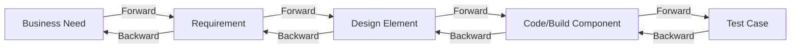
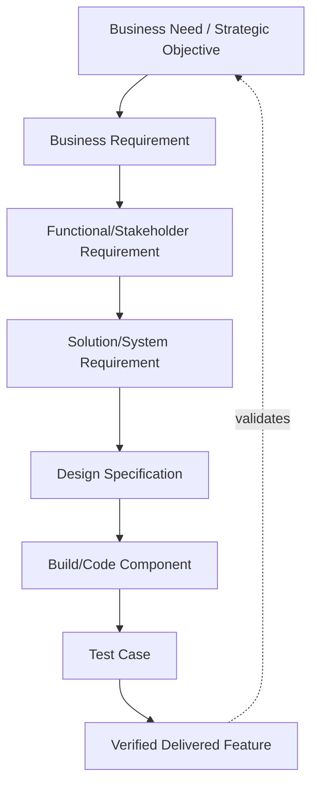
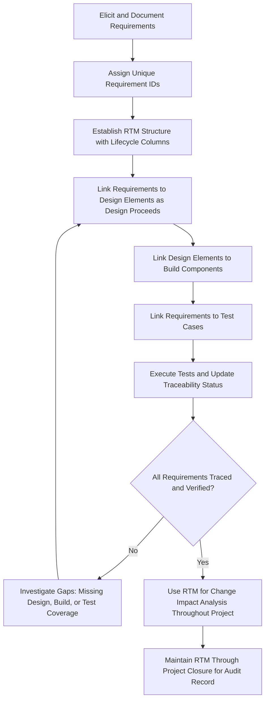

## Requirements Traceability

### Overview

Requirements traceability is the ability to link individual requirements forward and backward through the project lifecycle — from their originating business need, through design and development artifacts, to test cases, and ultimately to delivered features — so that every requirement's origin, implementation, and verification status can be tracked and confirmed at any point. Traceability provides an auditable chain of evidence connecting "why we are building this" to "what we built" to "how we proved it works," and is a critical control for managing scope, verifying completeness, and assessing the impact of proposed changes.

### Purposes of Requirements Traceability

- **Completeness verification**: Confirm that every requirement has been addressed by a design element, built, and tested — nothing is silently dropped.
- **Impact analysis**: When a change is proposed to a requirement, trace forward to identify every design element, code component, and test case affected, enabling accurate change impact assessment.
- **Scope control**: Detect "gold-plating" — delivered functionality that does not trace back to any documented requirement or business need, which may represent unauthorized scope addition.
- **Regulatory and audit compliance**: In regulated industries (healthcare, aviation, finance, defense), demonstrable traceability from regulatory/business requirements through to verified test evidence is often a mandatory compliance and audit requirement.
- **Test coverage assurance**: Confirm every requirement has at least one corresponding test case, and conversely that no test case exists without a traceable requirement justifying it.

### Types of Traceability

#### 1. Forward Traceability

Tracing from a requirement forward to the downstream artifacts that implement and verify it (design elements, code, test cases). Used to confirm a requirement has actually been built and tested.

#### 2. Backward Traceability

Tracing from a downstream artifact (a design element, a piece of code, a test case) backward to the originating requirement and business need that justifies its existence. Used to identify potential scope creep or unjustified work.

#### 3. Bidirectional Traceability

The combination of forward and backward traceability, allowing navigation in either direction. Bidirectional traceability is generally considered the standard for a mature traceability practice, since forward-only or backward-only traceability each leave a blind spot (undetected omissions or undetected unauthorized additions, respectively).

### The Requirements Traceability Matrix (RTM)

The primary tool used to implement and maintain traceability is the Requirements Traceability Matrix (RTM) — a structured table (often maintained in a spreadsheet or dedicated requirements management tool) that maps each requirement to its related artifacts across the project lifecycle.

**Example RTM structure**

| Req ID | Requirement Description | Source (Business Need) | Design/Spec Reference | Build/Component | Test Case ID | Test Status | Status |
| --- | --- | --- | --- | --- | --- | --- | --- |
| REQ-001 | System shall allow customer refund processing within 5 business days | Business Case Sec. 3.2 | Design Doc §4.1 (Refund Module) | RefundService.processRefund() | TC-014, TC-015 | Passed | Implemented |
| REQ-002 | System shall notify customer via email upon refund completion | Business Case Sec. 3.2 | Design Doc §4.3 (Notification Module) | NotificationService.sendRefundEmail() | TC-016 | Failed | In Progress |
| REQ-003 | System shall log all refund transactions for audit purposes | Regulatory Requirement (Audit Policy 7) | Design Doc §4.5 (Audit Log Module) | AuditLogger.logRefund() | TC-017 | Not Started | Not Started |

**Key Points**

- REQ-003's status reveals both forward traceability value (confirming a regulatory-sourced requirement has a planned test) and highlights an incomplete item requiring follow-up before the project can claim full requirements coverage.
- An RTM with a "Source" column enables backward traceability at a glance: any row lacking a documented source is a candidate for scope investigation (is this an undocumented but legitimate need, or unauthorized scope addition?).

### Traceability Across the Project Lifecycle

**Key Points**

- Traceability commonly spans multiple requirement "levels" (business, stakeholder, solution/functional, non-functional) as defined in structured business analysis frameworks; a single high-level business requirement may decompose into multiple detailed solution requirements, each individually traced.
- Maintaining traceability at every level of decomposition (rather than only at the top or bottom level) provides the most complete audit trail but requires proportionately more discipline and tooling support to sustain without becoming a documentation burden that falls out of date.

### Traceability in Agile Contexts

While traceability is most strongly associated with plan-driven, document-heavy methodologies, Agile projects also require a form of traceability, typically implemented more lightly — linking user stories to epics, linking acceptance criteria to automated test cases, and linking stories to the original business objective or theme they support, often maintained directly within Agile lifecycle management tooling rather than a separate standalone RTM document.

**Key Points**

- The underlying purpose (completeness verification, impact analysis, audit trail) remains the same in Agile contexts; what typically differs is the tooling and cadence — traceability links are usually created incrementally as stories are groomed and completed, rather than established comprehensively upfront as in plan-driven RTM practice. [Inference: the degree of traceability rigor Agile teams maintain varies significantly by organization and regulatory context; regulated Agile environments, such as those in medical device or aviation software, often impose traceability rigor closer to plan-driven standards.]

### Using Traceability for Impact Analysis

One of the most practically valuable applications of a maintained RTM is rapid, evidence-based impact analysis when a change request is proposed.

**Example**

A stakeholder requests a change to REQ-002 (email notification timing). Using the RTM, the business analyst immediately identifies that this requirement traces to the Notification Module design (§4.3), the `NotificationService.sendRefundEmail()` component, and test case TC-016 — providing the project manager and change control board with a concrete, evidence-based list of exactly what must be re-evaluated, re-designed, re-built, and re-tested before approving the change, rather than relying on team members' memory or informal investigation.

### Traceability Process

### Common Pitfalls

- **Establishing the RTM too late**: Creating the traceability matrix only near project completion (retrofitting it) rather than from initial requirements documentation, resulting in an incomplete or inaccurate matrix reconstructed from memory rather than maintained contemporaneously.
- **Allowing the RTM to fall out of date**: Failing to update the matrix as requirements change, are added, or are removed during the project, causing the RTM to become an unreliable historical artifact rather than a current, trustworthy reference.
- **Forward-only traceability**: Tracking only that requirements were implemented without also tracking backward from build/test artifacts to requirements, missing the ability to detect unauthorized scope additions (gold-plating).
- **Too granular or too coarse traceability levels**: Tracing at a level of detail mismatched to project risk and complexity — excessive granularity creates unsustainable maintenance overhead on low-risk projects, while insufficient granularity fails to provide the audit rigor needed on regulated or high-risk projects.
- **Treating the RTM as a static deliverable rather than a living tool**: Producing the RTM as a one-time compliance artifact rather than actively using it for ongoing change impact analysis throughout the project.
- **No unique, stable requirement identifiers**: Failing to assign persistent unique IDs to requirements, making it difficult to reliably link requirements across separate design, build, and test artifacts/tools over time.

### Related Topics

- Requirements Elicitation Techniques
- Requirements Analysis and Documentation
- User Stories and Use Cases
- Business Process Modeling
- Change Control Processes
- Integrated Change Control
- Quality Assurance and Test Planning