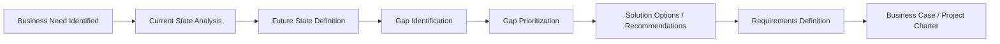

## Gap Analysis

### Definition and Purpose

Gap analysis is a structured technique used to compare an organization's current state ("as-is") against its desired future state ("to-be") in order to identify the differences ("gaps") that must be addressed to achieve strategic or project objectives. In project management and business analysis, it serves as a diagnostic tool that informs scope definition, requirements gathering, and business case justification.

The core output of a gap analysis is a clear articulation of:

- What exists today (current capabilities, processes, systems, or performance)
- What is required or desired (target capabilities, processes, systems, or performance)
- The specific difference between the two
- The actions needed to close that difference

### Position in the Business Analysis Lifecycle

Gap analysis typically occurs early in the business analysis process, after initial stakeholder needs have been identified but before detailed requirements are finalized. It bridges enterprise analysis (understanding why change is needed) and requirements definition (specifying what the solution must do).

### Core Components

**Current State Analysis**

This involves documenting the organization's existing processes, systems, resources, skills, and performance metrics. Common inputs include process maps, system inventories, staff competency assessments, and performance data. The objective is an objective, evidence-based baseline rather than an assumed one.

**Future State Definition**

This describes the desired outcome, typically derived from strategic goals, stakeholder requirements, regulatory mandates, or competitive benchmarks. The future state should be specific and measurable wherever possible, since vague target states make gap identification unreliable.

**Gap Identification**

The explicit comparison step. Gaps are usually categorized into types such as:

- **Performance gaps** — difference between current and target output or efficiency metrics
- **Process gaps** — missing, redundant, or inefficient process steps
- **Skills/competency gaps** — workforce capability shortfalls
- **Technology gaps** — missing or outdated systems and tools
- **Compliance gaps** — deviations from regulatory or policy requirements

**Root Cause Analysis of Gaps**

Identifying *why* a gap exists is distinct from identifying that it exists. Techniques such as the 5 Whys or Fishbone (Ishikawa) diagrams are commonly paired with gap analysis to avoid treating symptoms rather than causes.

**Action Planning**

Translating identified gaps into concrete initiatives, requirements, or project deliverables, often ranked by priority, cost, effort, and risk.

### Common Frameworks and Models Used Alongside Gap Analysis

**McKinsey 7S Framework**

Used for organizational gap analysis across Strategy, Structure, Systems, Shared Values, Skills, Style, and Staff. Useful when the gap spans multiple organizational dimensions rather than a single process or system.

**SWOT Analysis**

Often used as a precursor; Weaknesses identified in a SWOT can seed the current-state input for a gap analysis, while Opportunities can inform the future-state target.

**Capability Maturity Models (e.g., CMMI)**

Used when the "gap" is expressed in maturity levels (e.g., moving from an ad-hoc process maturity level to a defined or optimized level).

**Benchmarking**

External comparison against industry standards or competitors, used to define a realistic and competitively relevant future state rather than an arbitrary target.

### Step-by-Step Process

1. **Define the scope and objective** — clarify which process, system, or capability area is under review and why.
2. **Document the current state** — gather data via interviews, process observation, system audits, and document review.
3. **Define the future/desired state** — align with strategic objectives, stakeholder requirements, and measurable targets.
4. **Compare and identify gaps** — list discrepancies systematically, avoiding assumptions not backed by evidence.
5. **Analyze root causes** — determine underlying drivers of each gap.
6. **Prioritize gaps** — typically using criteria such as business impact, urgency, cost of inaction, and feasibility.
7. **Develop recommendations/action plan** — define initiatives, resource needs, and rough timelines to close prioritized gaps.
8. **Validate with stakeholders** — confirm findings and proposed actions align with expectations before proceeding to requirements or solution design.

### Illustrative Example

**Example**

A mid-sized logistics company wants to reduce order-fulfillment time from an average of 48 hours to 24 hours.

- **Current State:** Orders are manually keyed into the warehouse management system by staff after being received via email; average processing time is 48 hours; error rate in manual entry is 6%.
- **Future State:** Orders are automatically ingested from the e-commerce platform into the warehouse management system via API integration; target processing time is 24 hours; error rate target is under 1%.
- **Identified Gaps:**
  - Technology gap: no API integration between e-commerce platform and warehouse management system
  - Process gap: manual data entry step introduces delay and error
  - Skills gap: warehouse staff untrained on exception-handling workflows for automated orders
- **Root Cause:** Legacy warehouse management system was implemented before the e-commerce platform existed, and integration was never budgeted.
- **Recommended Actions:** Procure or build an API middleware layer; redesign the order-intake process to remove manual entry; train staff on new exception workflows.

This example demonstrates how gap analysis output feeds directly into a business case (technology investment) and into requirements definition (API specifications, process redesign specifications).

### Visual Representation of Gap Analysis Structure

<svg xmlns="http://www.w3.org/2000/svg" viewBox="0 0 760 380">
<text x="380" y="28" text-anchor="middle" font-size="18" font-weight="bold" fill="#1f2937">Gap Analysis Structure (svg_diagram)</text>
<rect x="40" y="70" width="220" height="90" rx="8" fill="#dbeafe" stroke="#2563eb" stroke-width="1.5" />
<text x="150" y="100" text-anchor="middle" font-size="14" font-weight="bold" fill="#1e3a8a">Current State</text>
<text x="150" y="122" text-anchor="middle" font-size="11" fill="#1e3a8a">Processes, systems,</text>
<text x="150" y="138" text-anchor="middle" font-size="11" fill="#1e3a8a">skills, performance</text>
<rect x="500" y="70" width="220" height="90" rx="8" fill="#dcfce7" stroke="#16a34a" stroke-width="1.5" />
<text x="610" y="100" text-anchor="middle" font-size="14" font-weight="bold" fill="#14532d">Future State</text>
<text x="610" y="122" text-anchor="middle" font-size="11" fill="#14532d">Target capabilities,</text>
<text x="610" y="138" text-anchor="middle" font-size="11" fill="#14532d">goals, benchmarks</text>
<rect x="270" y="90" width="220" height="50" rx="8" fill="#fee2e2" stroke="#dc2626" stroke-width="1.5" />
<text x="380" y="120" text-anchor="middle" font-size="14" font-weight="bold" fill="#7f1d1d">THE GAP</text>
<line x1="260" y1="115" x2="270" y2="115" stroke="#374151" stroke-width="2" marker-end="url(#arrow)" />
<line x1="490" y1="115" x2="500" y2="115" stroke="#374151" stroke-width="2" marker-end="url(#arrow)" />
<rect x="60" y="220" width="640" height="130" rx="8" fill="#f3f4f6" stroke="#6b7280" stroke-width="1" />
<text x="380" y="245" text-anchor="middle" font-size="13" font-weight="bold" fill="#111827">Gap Categories</text>
<text x="140" y="275" text-anchor="middle" font-size="11" fill="#111827">Performance</text>
<text x="260" y="275" text-anchor="middle" font-size="11" fill="#111827">Process</text>
<text x="380" y="275" text-anchor="middle" font-size="11" fill="#111827">Skills</text>
<text x="500" y="275" text-anchor="middle" font-size="11" fill="#111827">Technology</text>
<text x="620" y="275" text-anchor="middle" font-size="11" fill="#111827">Compliance</text>
<text x="380" y="310" text-anchor="middle" font-size="11" fill="#374151">Each gap is prioritized by impact, urgency, cost, and feasibility</text>
<text x="380" y="330" text-anchor="middle" font-size="11" fill="#374151">before being translated into requirements or project deliverables</text>
</svg>

### Deliverables Typically Produced

- Current state assessment report
- Future state vision/target document
- Gap analysis matrix (often a table listing each gap, category, root cause, impact, and recommended action)
- Prioritized action/recommendation list
- Input to business case or project charter

### Sample Gap Analysis Matrix Structure

| Area | Current State | Desired State | Gap | Category | Priority | Recommended Action |
| --- | --- | --- | --- | --- | --- | --- |
| Order Processing | 48 hr manual entry | 24 hr automated | 24 hr delay, manual errors | Process/Technology | High | Build API integration |
| Staff Training | No exception handling training | Trained on automated workflow | Skill deficiency | Skills | Medium | Develop training program |

### Common Pitfalls

- Defining the future state too vaguely to allow measurable comparison
- Relying on assumptions rather than validated data for the current state
- Treating gap analysis as a one-time exercise rather than revisiting it as conditions change
- Failing to perform root cause analysis, resulting in recommendations that address symptoms only
- Skipping stakeholder validation, leading to gaps that do not reflect actual business priorities

[Inference] The specific numeric error rates and timeframes in the illustrative example are hypothetical figures constructed for demonstration purposes and are not derived from a real organization's reported data.

### Relationship to Other BA Techniques

Gap analysis commonly precedes or complements:

- **Requirements elicitation** — gaps often become the seed list for functional and non-functional requirements
- **SWOT analysis** — Weaknesses feed current-state, Opportunities feed future-state
- **Business process modeling (BPMN)** — used to visually document current and future process states before gap comparison
- **Cost-benefit analysis** — used to evaluate whether closing an identified gap is financially justified

**Related Topics**

- SWOT Analysis
- Business Process Modeling (BPMN)
- Root Cause Analysis (5 Whys, Fishbone Diagram)
- Requirements Elicitation Techniques
- Cost-Benefit Analysis
- Capability Maturity Model Integration (CMMI)
- Business Case Development
- Stakeholder Analysis