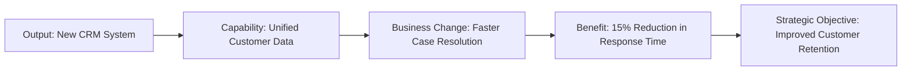

## Defining Expected Benefits

### Definition and Purpose

Defining expected benefits is the discipline of explicitly identifying, describing, and quantifying the positive outcomes a project or program is intended to deliver to the sponsoring organization. It forms the foundation of benefits realization management, establishing the criteria against which project success will ultimately be measured — separate from mere delivery of outputs (products, services, or deliverables).

A benefit is distinct from a deliverable: a deliverable is what the project produces (e.g., a new CRM system), while a benefit is the measurable positive change that results from using that deliverable (e.g., a 15% reduction in customer response time).

### Position in the Benefits Realization Lifecycle

Defining expected benefits typically occurs during the business case development stage, before project chartering, and is revisited throughout the project lifecycle as scope or assumptions change.

### Types of Benefits

**Financial (Tangible, Quantifiable) Benefits**

Directly measurable in monetary terms, such as cost savings, revenue increases, or return on investment. Examples: reduced operational costs, increased sales, avoided penalty costs.

**Non-Financial but Quantifiable Benefits**

Measurable using non-monetary metrics but not directly converted to currency. Examples: reduced cycle time, improved defect rate, increased customer satisfaction score.

**Intangible (Qualitative) Benefits**

Difficult to measure precisely but still valuable to the organization. Examples: improved employee morale, enhanced brand reputation, better regulatory relationships.

Distinguishing these categories early prevents ambiguity later when benefits must be tracked and reported.

### Core Characteristics of a Well-Defined Benefit

A properly defined benefit should be documented with the following attributes:

- **Description** — a clear statement of the change and who experiences it
- **Type/category** — financial, non-financial quantifiable, or intangible
- **Baseline value** — the current-state measurement before the project
- **Target value** — the expected future-state measurement
- **Measurement method** — how and by what metric the benefit will be tracked
- **Owner** — the individual or role accountable for realizing the benefit (often a business owner, not the project manager)
- **Timeframe** — when the benefit is expected to be realized, which is frequently after project closure
- **Dependencies/assumptions** — conditions that must hold true for the benefit to materialize

This structure aligns with common benefits management frameworks such as those described in MSP (Managing Successful Programmes) and PMI's benefits realization guidance.

### The SMART Criteria Applied to Benefits

Expected benefits are commonly validated against SMART criteria:

- **Specific** — clearly defined, not vague ("improve efficiency" is insufficient; "reduce invoice processing time" is specific)
- **Measurable** — quantifiable using a defined metric
- **Achievable** — realistic given organizational constraints
- **Relevant** — aligned with strategic objectives
- **Time-bound** — has a defined realization date or window

### Benefits Mapping

A benefits map (or benefits dependency network) visually connects project outputs to intermediate outcomes and ultimately to strategic benefits. This technique, popularized by John Ward and Elizabeth Daniel, helps trace the causal logic from "what we are building" to "why it matters."

### Step-by-Step Process for Defining Expected Benefits

1. **Link to strategic drivers** — trace each proposed benefit back to a documented strategic objective or business need.
2. **Engage benefit owners early** — identify who in the business will be accountable for realizing and reporting on each benefit; this should not default to the project manager.
3. **Establish the baseline** — measure the current state before any change is implemented, since without a baseline, realized improvement cannot be proven.
4. **Define the target and metric** — specify the measurement method, target value, and data source.
5. **Classify the benefit** — financial, quantifiable non-financial, or intangible.
6. **Map dependencies and assumptions** — document what must be true (e.g., user adoption rate, market conditions) for the benefit to be realized.
7. **Validate feasibility** — review with finance, operations, or relevant subject-matter stakeholders to ensure the projected benefit is realistic.
8. **Incorporate into the business case** — expected benefits become a core justification component alongside cost and risk.

### Illustrative Example

**Example**

An organization is implementing a new automated invoicing system.

- **Benefit Description:** Reduction in average invoice processing time
- **Type:** Non-financial quantifiable (with a secondary financial benefit derived from labor cost savings)
- **Baseline:** 6 days average processing time (measured over the prior 3 months)
- **Target:** 2 days average processing time within 6 months of go-live
- **Measurement Method:** Average of timestamp difference between invoice receipt and payment approval, tracked in the finance system's reporting module
- **Owner:** Head of Accounts Payable
- **Timeframe:** Realized incrementally over 6 months post-implementation, reviewed at 3-month and 6-month intervals
- **Assumptions:** Staff complete training before go-live; invoice volume remains within historical range; no major disruption from concurrent system changes

[Inference] The specific figures in this example (6 days, 2 days, 6-month timeframe) are illustrative constructs for demonstration and not derived from a documented case study.

### Common Frameworks Referenced

**MSP (Managing Successful Programmes) Benefits Management**

Defines benefits as measurable improvements resulting from an outcome perceived as positive by a stakeholder, and formalizes the benefits profile document capturing baseline, target, owner, and dependencies.

**PMI Benefits Realization Management Framework**

Positions benefits identification as occurring during the business case and continuing through a benefits register maintained across the project and into operations.

**Balanced Scorecard**

Sometimes used to categorize benefits across financial, customer, internal process, and learning/growth perspectives, ensuring benefits are not narrowly financial.

### Benefits Register (Sample Structure)

| Benefit ID | Description | Type | Baseline | Target | Owner | Realization Date | Status |
| --- | --- | --- | --- | --- | --- | --- | --- |
| B-01 | Reduced invoice processing time | Quantifiable | 6 days | 2 days | Head of AP | +6 months post go-live | Not yet realized |
| B-02 | Reduced late-payment penalty costs | Financial | $40,000/yr | $5,000/yr | Finance Director | +9 months post go-live | Not yet realized |

### Common Pitfalls

- Confusing outputs/deliverables with benefits (e.g., stating "implement new system" as a benefit rather than the outcome it produces)
- Failing to establish a baseline, making post-implementation comparison impossible
- Assigning benefit ownership to the project manager rather than a business stakeholder who controls the process after project closure
- Overstating benefits to justify a business case without validated assumptions
- Omitting intangible benefits entirely because they are harder to quantify, resulting in an incomplete value picture
- Not identifying dependencies/assumptions, so external factors are not accounted for when a benefit fails to materialize

[Inference] The degree to which any specific organization's governance requires formal benefit sign-off varies significantly by industry and internal policy; behavior described here reflects common practice rather than a universal mandate.

### Relationship to Other Value Management Concepts

Defining expected benefits directly feeds:

- **Business case development** — quantified benefits justify the investment
- **Benefits realization tracking** — the defined baseline/target pair becomes the measurement reference
- **Project success criteria** — benefits, not just on-time/on-budget delivery, increasingly define project success
- **Post-implementation review** — actual outcomes are compared against the originally defined expected benefits

**Related Topics**

- Benefits Realization Management
- Benefits Mapping / Benefits Dependency Networks
- Business Case Development
- Benefits Register and Tracking
- Cost-Benefit Analysis
- Balanced Scorecard
- Post-Implementation Review
- Value Management Frameworks (MSP, PMI)