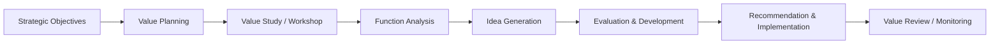
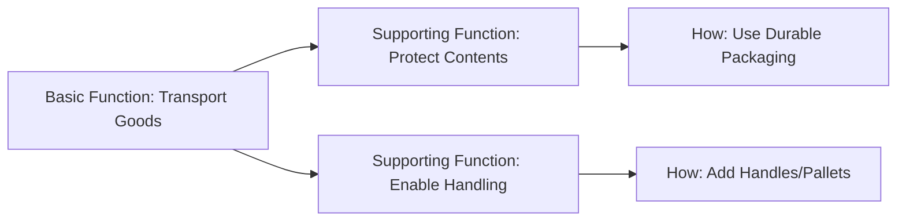

## Value Management Techniques

### Definition and Purpose

Value management is a structured, function-oriented discipline aimed at maximizing the functional value of a project, product, process, or organization relative to its cost. It originated from Value Engineering (developed by Lawrence Miles at General Electric in the 1940s) and has since expanded into a broader family of techniques applied throughout project management, business analysis, and organizational strategy. The central principle is that **value = function / cost**, meaning value can be increased either by improving function/performance, reducing cost, or both, without sacrificing essential quality or purpose.

### Value Management vs. Related Disciplines

| Concept | Focus | Typical Timing |
| --- | --- | --- |
| Value Management | Maximizing overall value (function/cost) across the project lifecycle | Continuous, especially early stages |
| Value Engineering | Cost/function optimization of specific design or technical solutions | Design and development phases |
| Value Analysis | Retrospective review of existing products/processes for value improvement | Post-implementation or operational review |
| Benefits Realization | Ensuring intended outcomes are achieved post-delivery | Post-implementation |

### Core Function-Value Formula

$$Value = \frac{Function}{Cost}$$

Where **Function** represents the performance, quality, or capability delivered, and **Cost** represents the total resources (financial, time, effort) required to achieve that function. Value management techniques seek to shift this ratio favorably rather than simply minimizing cost in isolation.

### Position in the Value Management Lifecycle

### Core Value Management Techniques

**Function Analysis System Technique (FAST)**

A structured method for decomposing a product, process, or system into its constituent functions, expressed as active verb + measurable noun pairs (e.g., "reduce cost," "improve safety"). FAST diagrams organize functions into a logical hierarchy showing how basic functions are achieved through supporting functions, helping teams identify unnecessary or redundant functions that add cost without adding value.

**Value Engineering Job Plan**

A structured phased methodology, typically comprising:

1. **Information Phase** — gather data on the project, costs, and functions
2. **Function Analysis Phase** — identify and classify functions (basic vs. secondary)
3. **Creative Phase** — brainstorm alternative ways to achieve required functions at lower cost or higher performance
4. **Evaluation Phase** — assess ideas for feasibility, cost impact, and risk
5. **Development Phase** — refine selected ideas into actionable proposals
6. **Presentation/Implementation Phase** — present recommendations to decision-makers and implement approved changes

**Life Cycle Costing (LCC)**

Evaluates the total cost of a solution across its entire life, including acquisition, operation, maintenance, and disposal costs, rather than focusing solely on initial capital cost. This technique often reveals that the lowest upfront-cost option is not the highest-value option once operating and maintenance costs are considered.

$$LCC = C_{acquisition} + C_{operation} + C_{maintenance} + C_{disposal}$$

**Value Workshops (Value Study Sessions)**

Structured, facilitated multi-day sessions bringing together cross-functional stakeholders (designers, end users, finance, operations) to apply the Value Engineering Job Plan to a specific project or decision. Typically conducted at key project milestones such as concept design or detailed design stages, when the potential to influence cost is highest and the cost of making changes is lowest.

**Target Costing**

A technique where the target cost is derived by starting from the market-acceptable selling price or approved budget and subtracting the desired margin/value, then designing the solution to fit within that target rather than designing first and costing afterward.

$$Target\ Cost = Selling\ Price - Desired\ Margin$$

**Weighted Evaluation Matrices**

Used during the evaluation phase to score competing design alternatives or ideas against weighted criteria (e.g., cost, functionality, risk, sustainability), providing an objective basis for comparing options that have different strengths and weaknesses.

**Value Stream Mapping**

Borrowed from Lean methodology, this technique visually maps all the steps in a process, distinguishing value-adding activities from non-value-adding (waste) activities, to identify opportunities to streamline and improve the value ratio of a process.

### The Value Curve Concept

Value management recognizes that the ability to influence value and cost is highest early in a project and diminishes over time, while the cost of making changes increases over time. This relationship is a key justification for applying value management techniques as early as possible.

<svg xmlns="http://www.w3.org/2000/svg" viewBox="0 0 700 380">
<text x="350" y="26" text-anchor="middle" font-size="17" font-weight="bold" fill="#1f2937">Influence vs. Cost of Change Over Time (svg_diagram)</text>
<line x1="70" y1="320" x2="650" y2="320" stroke="#374151" stroke-width="1.5" />
<line x1="70" y1="320" x2="70" y2="60" stroke="#374151" stroke-width="1.5" />
<text x="360" y="355" text-anchor="middle" font-size="12" fill="#374151">Project Lifecycle</text>
<text x="35" y="190" text-anchor="middle" font-size="12" fill="#374151" transform="rotate(-90 35 190)">Relative Level</text>
<path d="M 90 90 C 250 100, 400 220, 630 300" stroke="#2563eb" stroke-width="2.5" fill="none" />
<text x="150" y="80" font-size="11" fill="#2563eb" font-weight="bold">Ability to Influence Value</text>
<path d="M 90 300 C 250 280, 400 150, 630 90" stroke="#dc2626" stroke-width="2.5" fill="none" />
<text x="450" y="80" font-size="11" fill="#dc2626" font-weight="bold">Cost of Change</text>

<text x="120" y="335" font-size="10" fill="`#374151`">Concept</text>

<text x="280" y="335" font-size="10" fill="`#374151`">Design</text>

<text x="420" y="335" font-size="10" fill="`#374151`">Build/Execute</text>

<text x="570" y="335" font-size="10" fill="`#374151`">Close/Operate</text>

</svg>

### Illustrative Example

**Example**

A construction firm is designing a new office building. During a value engineering workshop conducted at the schematic design stage:

- **Function Analysis** identifies the basic function of the exterior wall system as "control environment" (regulate temperature, exclude weather).
- **Creative Phase** generates alternatives: standard curtain wall system, precast concrete panel system, and a hybrid insulated metal panel system.
- **Life Cycle Costing** reveals that while the precast concrete option has 12% higher upfront cost than the curtain wall system, its lower maintenance and energy costs result in 18% lower total cost over a 30-year life cycle.
- **Weighted Evaluation Matrix** scores each option against criteria (upfront cost, life cycle cost, aesthetics, sustainability rating, construction schedule impact), with precast concrete scoring highest overall.
- **Recommendation:** Adopt the precast concrete panel system, documented with supporting life cycle cost analysis for stakeholder approval.

[Inference] The specific percentages and comparative outcomes in this example are illustrative constructs for demonstration purposes and are not derived from a documented case study.

### Weighted Evaluation Matrix (Sample Structure)

| Criteria | Weight | Curtain Wall (Score) | Precast Concrete (Score) | Insulated Metal Panel (Score) |
| --- | --- | --- | --- | --- |
| Upfront Cost | 25% | 8 | 6 | 7 |
| Life Cycle Cost | 30% | 5 | 9 | 6 |
| Aesthetics | 15% | 9 | 7 | 6 |
| Sustainability | 15% | 6 | 8 | 7 |
| Schedule Impact | 15% | 7 | 6 | 8 |
| **Weighted Total** | 100% | **6.85** | **7.45** | **6.75** |

### Common Frameworks and Standards

**SAVE International Value Methodology Standard**

The most widely referenced formal standard for value engineering and value management practice, defining the structured job plan phases and certification pathways (e.g., Certified Value Specialist).

**EN 12973 (European Standard for Value Management)**

A European standard defining principles, terminology, and processes for value management across organizational and project contexts.

**ISO 12006 / Value Management in Construction**

Value management techniques are especially formalized in construction and infrastructure sectors, often mandated on public sector projects above certain cost thresholds.

### When to Apply Value Management Techniques

- During early concept and design phases, when the cost of change is lowest and influence over value is highest
- When project costs are significantly exceeding budget and a structured cost-reduction exercise (without cutting essential function) is needed
- During procurement, to evaluate competing bids or design alternatives on a like-for-like value basis
- Periodically during operations, to reassess whether an existing process or asset still delivers optimal value (value analysis)

### Common Pitfalls

- Conflating value engineering with simple cost-cutting, which risks removing essential functions rather than improving the function-to-cost ratio
- Applying value management too late in the project lifecycle, when the cost of implementing changes has already escalated
- Excluding key stakeholders (especially end users) from function analysis, resulting in functions being misclassified as unnecessary when they are in fact essential
- Failing to use life cycle costing, leading to decisions optimized for lowest initial cost rather than lowest total value-adjusted cost
- Treating the value workshop as a one-time event rather than an iterative practice revisited at multiple project stages

[Inference] The degree to which value management is formally mandated varies substantially by jurisdiction and sector; its prevalence in public infrastructure procurement is well documented, but its application in other sectors is often discretionary rather than standardized.

### Relationship to Other Concepts in This Chapter

Value management techniques complement:

- **Defining Expected Benefits** — function analysis helps clarify what truly constitutes value/benefit before targets are set
- **Benefits Realization Planning** — life cycle costing and value tracking can extend into post-implementation benefit verification
- **Cost-Benefit Analysis** — value management provides the structured technique set that often feeds inputs into a broader cost-benefit business case

**Related Topics**

- Function Analysis System Technique (FAST)
- Life Cycle Costing
- Value Engineering Job Plan
- Target Costing
- Value Stream Mapping (Lean)
- Cost-Benefit Analysis
- Business Case Development
- SAVE International Value Methodology Standard