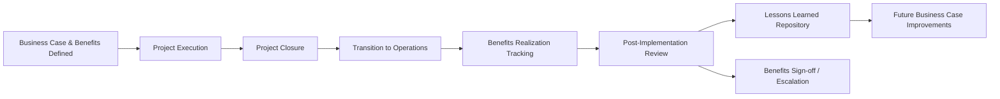

## Post-Implementation Reviews

### Definition and Purpose

A post-implementation review (PIR) is a formal, structured evaluation conducted after a project has been delivered and transitioned into operational use, assessing whether the project achieved its intended objectives, delivered the expected benefits, and was executed effectively. Unlike a project closure report, which focuses on confirming deliverables were completed and contracts closed, a PIR focuses on outcomes — comparing actual results against the original business case, requirements, and benefit targets.

PIRs serve dual purposes: **accountability** (verifying whether the investment was justified) and **organizational learning** (capturing lessons to improve future project selection, planning, and execution).

### Position in the Project and Benefits Lifecycle

A PIR is typically scheduled at a defined interval after go-live — commonly 3, 6, or 12 months — allowing sufficient time for the solution to stabilize and for benefits to begin materializing, rather than being conducted immediately at project closure when outcomes are not yet observable.

### Objectives of a Post-Implementation Review

- Determine whether the project met its original objectives, scope, and requirements
- Assess whether expected benefits (financial, non-financial, intangible) have been or are being realized against baseline and target values
- Evaluate the effectiveness of project delivery (schedule, budget, quality, stakeholder satisfaction)
- Identify root causes for any variances between planned and actual outcomes
- Capture lessons learned for application to future projects
- Provide input into whether follow-on investment, further optimization, or corrective action is required
- Support organizational decisions about similar future investments

### Core Components of a PIR

**Objectives and Scope Review**

Confirms whether the original project objectives, as stated in the charter and business case, were achieved, and identifies any scope changes that occurred during execution and their impact.

**Benefits Realization Assessment**

The central component: comparing actual measured values against the baseline and target values established during benefits definition and tracked through the benefits realization plan.

**Cost and Schedule Performance Review**

Evaluates actual cost and schedule performance against the approved baseline, distinguishing this delivery-performance assessment from the outcome-focused benefits assessment.

**Stakeholder Satisfaction Assessment**

Gathers feedback from end users, sponsors, and other stakeholders regarding the solution's usability, adoption, and perceived value — often via surveys or structured interviews.

**Process and Methodology Review**

Assesses whether project management processes, governance, and methodology were effective, identifying what worked well and what did not.

**Lessons Learned Documentation**

Captures specific, actionable insights for future projects, distinguishing this forward-looking learning focus from the backward-looking performance assessment.

**Recommendations and Follow-up Actions**

Documents any corrective actions needed (e.g., additional training if adoption is low, process adjustments if a benefit is under-target) and assigns ownership and timelines.

### Step-by-Step Process for Conducting a PIR

1. **Determine timing** — schedule the review after sufficient operational stabilization, informed by the realization timeline in the benefits realization plan.
2. **Gather baseline documentation** — retrieve the original business case, benefits register, project charter, and approved budget/schedule baselines.
3. **Collect actual performance data** — obtain current operational metrics, financial data, and benefit measurements from the relevant business systems.
4. **Conduct stakeholder interviews/surveys** — gather qualitative feedback from sponsors, end users, and the project team.
5. **Compare planned vs. actual** — systematically analyze variances across objectives, benefits, cost, schedule, and quality.
6. **Perform root cause analysis on variances** — determine why any gaps between planned and actual outcomes occurred.
7. **Document findings and lessons learned** — compile findings into a structured PIR report.
8. **Present to governance** — review findings with the sponsor, steering committee, or PMO, and formally sign off or escalate as needed.
9. **Distribute lessons learned** — feed insights into the organization's lessons-learned repository or knowledge base for future project use.

### Illustrative Example

**Example**

Continuing the invoicing automation project scenario from the benefits realization planning example, a PIR is conducted 6 months after go-live.

- **Objectives Review:** Core objective (automate invoice processing) was delivered as scoped; one planned feature (automated vendor dispute workflow) was deferred to a phase 2 due to budget constraints.
- **Benefits Assessment:**
  - Invoice processing time: target 2 days, actual 2.3 days — close to target, with the shortfall attributed to a subset of high-complexity invoices still requiring manual review
  - Late payment penalty costs: target $5,000/year, actual $4,200/year — target exceeded
- **Cost/Schedule Performance:** Delivered 4% over original budget due to unplanned integration work; delivered on the revised schedule after a 3-week baseline change approved mid-project
- **Stakeholder Feedback:** Accounts Payable staff report high satisfaction with reduced manual workload; some feedback indicates the exception-handling training could have been more thorough
- **Root Cause of Variance:** The processing time shortfall traces to an edge case in vendor invoice formats not accounted for during requirements definition
- **Recommendations:** Extend automated processing rules to cover the identified edge case; schedule a supplementary training session for exception handling; document the requirements gap as a lesson learned for future integration projects
- **Outcome:** Benefits substantially achieved; PIR findings recommend formal benefits sign-off with a follow-up mini-review in 3 months to confirm the processing-time gap closes after the rule extension is implemented

[Inference] The specific figures and outcomes in this example are illustrative constructs for demonstration purposes and are not derived from a documented case study.

### PIR Findings Summary (Sample Structure)

| Area | Planned | Actual | Variance | Status |
| --- | --- | --- | --- | --- |
| Invoice Processing Time | 2 days | 2.3 days | +0.3 days | Near Target |
| Late Payment Penalties | $5,000/yr | $4,200/yr | -$800/yr | Exceeded Target |
| Budget | Baseline | +4% | +4% | Minor Overrun |
| Schedule | Original date | +3 weeks (approved) | +3 weeks | On Revised Baseline |

### Visual Representation of PIR Comparison Structure

<svg xmlns="http://www.w3.org/2000/svg" viewBox="0 0 700 300">
<text x="350" y="26" text-anchor="middle" font-size="17" font-weight="bold" fill="#1f2937">Post-Implementation Review: Planned vs. Actual (svg_diagram)</text>
<rect x="60" y="60" width="260" height="180" rx="8" fill="#eff6ff" stroke="#2563eb" stroke-width="1.5" />
<text x="190" y="90" text-anchor="middle" font-size="14" font-weight="bold" fill="#1e3a8a">Planned (Baseline)</text>
<text x="190" y="120" text-anchor="middle" font-size="11" fill="#1e3a8a">Business Case Objectives</text>
<text x="190" y="145" text-anchor="middle" font-size="11" fill="#1e3a8a">Benefit Targets</text>
<text x="190" y="170" text-anchor="middle" font-size="11" fill="#1e3a8a">Budget &amp; Schedule Baseline</text>
<text x="190" y="195" text-anchor="middle" font-size="11" fill="#1e3a8a">Quality/Scope Requirements</text>
<rect x="380" y="60" width="260" height="180" rx="8" fill="#f0fdf4" stroke="#16a34a" stroke-width="1.5" />
<text x="510" y="90" text-anchor="middle" font-size="14" font-weight="bold" fill="#14532d">Actual (Observed)</text>
<text x="510" y="120" text-anchor="middle" font-size="11" fill="#14532d">Delivered Objectives</text>
<text x="510" y="145" text-anchor="middle" font-size="11" fill="#14532d">Measured Benefit Values</text>
<text x="510" y="170" text-anchor="middle" font-size="11" fill="#14532d">Actual Cost &amp; Timeline</text>
<text x="510" y="195" text-anchor="middle" font-size="11" fill="#14532d">Stakeholder Feedback</text>
<line x1="320" y1="150" x2="380" y2="150" stroke="#374151" stroke-width="2" marker-end="url(#arrow2)" />
<text x="350" y="140" text-anchor="middle" font-size="10" fill="#374151">Compare</text>
<rect x="220" y="260" width="260" height="30" rx="6" fill="#fef3c7" stroke="#d97706" stroke-width="1.5" />
<text x="350" y="280" text-anchor="middle" font-size="11" font-weight="bold" fill="#78350f">Variance Analysis + Lessons Learned</text>
</svg>

### Common Frameworks and References

**PMI (PMBOK Guide)**

References post-implementation review as part of the broader project benefits and closure processes, emphasizing the link between the business case's original justification and the verification of realized value.

**PRINCE2**

Formalizes the **Benefits Review Plan** and defines a **Post-Project Review** as a distinct activity from project closure, often conducted by the corporate/programme management layer rather than the disbanded project team, since the project team typically no longer exists once operational benefits emerge.

**MSP (Managing Successful Programmes)**

Positions the post-implementation/benefits review as an ongoing governance activity within programme management, often continuing across multiple review cycles until all benefits are confirmed or formally closed.

### Common Pitfalls

- Conducting the review too early, before benefits have had sufficient time to materialize, leading to premature or misleading conclusions
- Conducting the review too late or not at all, once the project team has disbanded and organizational attention has moved on, resulting in lost accountability
- Focusing only on delivery metrics (cost, schedule) while neglecting the benefits realization assessment, which is the primary purpose distinguishing a PIR from a standard closure report
- Failing to assign ownership for follow-up actions identified during the review, so recommendations are documented but never acted upon
- Treating the PIR as a blame exercise rather than a learning exercise, which discourages honest reporting of variances and root causes
- Not feeding lessons learned into a searchable, reusable repository, causing the same issues to recur on future projects

[Inference] The specific interval chosen for conducting a PIR (e.g., 3, 6, or 12 months) is context-dependent and varies by organizational policy, project size, and the nature of the benefits being tracked; no single interval is universally prescribed across all methodologies.

### Relationship to Other Value Management Concepts

Post-implementation reviews depend on and validate:

- **Defining Expected Benefits** — supplies the original baseline and target values used for comparison
- **Benefits Realization Planning** — provides the tracking data and measurement methodology the PIR draws upon
- **Business Case Development** — the PIR ultimately validates or challenges the original investment justification
- **Lessons Learned Processes** — PIR findings are a primary input into organizational knowledge management and continuous improvement

**Related Topics**

- Defining Expected Benefits
- Benefits Realization Planning
- Business Case Development
- Lessons Learned Repository
- Project Closure Processes
- PRINCE2 Benefits Review Plan
- Organizational Learning and Knowledge Management
- Portfolio-Level Benefits Reporting