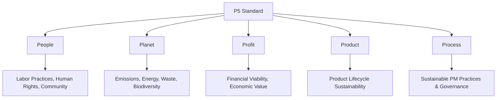

## Sustainable Project Management Principles

### Definition and Purpose

Sustainable project management refers to the integration of environmental, social, and economic sustainability considerations into the planning, execution, and governance of projects, alongside traditional constraints of scope, time, cost, and quality. Rather than treating sustainability as an external compliance requirement, sustainable project management principles embed sustainability thinking into decision-making throughout the project lifecycle, recognizing that project outcomes have impacts extending beyond immediate stakeholders to broader society, the environment, and future generations.

This discipline draws heavily from the broader ESG (Environmental, Social, and Governance) movement and frameworks such as the GPM Global P5 Standard (People, Planet, Profit, Product, Process), which explicitly extends the traditional project management triple constraint to include sustainability dimensions.

### Position Within Project Management Practice

### Core Principles

**Principle 1: Triple Bottom Line Integration**

Projects should be evaluated not only on financial return but also on social and environmental impact, commonly summarized as **People, Planet, Profit**. This reframes project success criteria to include social equity and environmental stewardship alongside economic viability.

**Principle 2: Life Cycle Thinking**

Sustainability considerations should account for the full life cycle of a project's deliverable — from raw material sourcing and construction/development, through operational use, to eventual decommissioning or disposal — rather than focusing narrowly on the project delivery phase alone.

**Principle 3: Stakeholder Inclusivity**

Sustainable project management requires broadening the stakeholder analysis beyond direct sponsors and users to include affected communities, regulatory bodies, environmental groups, and future generations who may be impacted by the project's long-term consequences.

**Principle 4: Transparency and Accountability**

Sustainability performance should be measured, reported, and verified using recognized standards and metrics, avoiding vague or unsubstantiated claims of environmental or social benefit (a practice often referred to as "greenwashing" when done without genuine substantiation).

**Principle 5: Long-Term Value Over Short-Term Gain**

Decisions should weigh long-term sustainability outcomes against short-term cost or schedule pressures, recognizing that sustainable choices may carry higher upfront costs but generate greater long-term value (a concept closely related to life cycle costing).

**Principle 6: Resource Efficiency and Waste Minimization**

Project delivery methods themselves should minimize resource consumption, energy use, and waste generation, applying principles similar to Lean methodology to environmental impact rather than only to process efficiency.

**Principle 7: Risk Management Extended to Sustainability Risks**

Traditional project risk management should be expanded to explicitly identify and mitigate environmental, social, and governance risks (e.g., regulatory non-compliance, reputational risk, supply chain labor practices) alongside conventional schedule/cost/technical risks.

**Principle 8: Continuous Improvement and Innovation**

Sustainable project management encourages ongoing innovation in materials, methods, and processes to progressively reduce environmental footprint and improve social outcomes across successive projects, rather than treating sustainability targets as static.

### The GPM P5 Standard Framework

The P5 Standard for Sustainability in Project Management, developed by GPM Global, extends the traditional project management triangle (scope, time, cost) into five impact dimensions:

- **People** — social impacts including labor practices, human rights, diversity, community welfare, and health and safety
- **Planet** — environmental impacts including energy consumption, emissions, resource use, waste, and biodiversity
- **Profit** — economic viability and value creation, retaining the traditional financial success dimension
- **Product** — the sustainability characteristics of the project's deliverable itself over its lifecycle
- **Process** — the sustainability of the project management processes and practices used to deliver the outcome

### Relationship to the UN Sustainable Development Goals (SDGs)

Many sustainable project management frameworks explicitly map project objectives and benefits to the UN's 17 Sustainable Development Goals, providing a globally recognized reference framework for categorizing and reporting a project's social and environmental contributions (e.g., SDG 7: Affordable and Clean Energy, SDG 12: Responsible Consumption and Production, SDG 13: Climate Action).

### Sustainability Assessment Tools and Techniques

**Environmental Impact Assessment (EIA)**

A formal, often regulatory-mandated process for evaluating the likely environmental effects of a proposed project before it proceeds, commonly required for large infrastructure, construction, or industrial projects.

**Social Impact Assessment (SIA)**

Evaluates the effects of a project on the social fabric of affected communities, including displacement, employment effects, cultural heritage impacts, and public health considerations.

**Carbon Footprint Analysis**

Quantifies the greenhouse gas emissions associated with a project across its lifecycle (often categorized into Scope 1, 2, and 3 emissions), used to assess and report environmental impact and identify reduction opportunities.

**Sustainability Scorecards / GPM P5 Impact Analysis**

Structured scoring tools that assess a project against sustainability criteria across the P5 dimensions, similar in structure to a weighted evaluation matrix used in value management.

**Materiality Assessment**

A technique borrowed from ESG corporate reporting, used to identify which sustainability issues are most significant (material) to a specific project's stakeholders and outcomes, focusing sustainability effort where it has the greatest relevance and impact.

### Step-by-Step Process for Embedding Sustainability into a Project

1. **Conduct a sustainability materiality assessment** during project initiation to identify which environmental, social, and governance factors are most relevant to the specific project.
2. **Expand stakeholder analysis** to include affected communities, regulators, and other indirect stakeholders beyond the immediate sponsor and user group.
3. **Set sustainability objectives and KPIs** alongside traditional scope/time/cost objectives, ideally using SMART criteria consistent with other benefit definitions.
4. **Integrate sustainability into requirements and design** — for example, specifying energy-efficient materials, ethical sourcing requirements, or accessibility standards.
5. **Apply life cycle thinking** to major decisions, using life cycle costing and life cycle assessment techniques rather than evaluating only upfront cost and immediate delivery impact.
6. **Extend the risk register** to explicitly capture sustainability-related risks (regulatory, reputational, supply chain, environmental).
7. **Select sustainable delivery methods** — e.g., reducing travel/transportation emissions, minimizing material waste, choosing lower-impact suppliers.
8. **Monitor and report sustainability performance** throughout execution using defined metrics and recognized reporting standards.
9. **Include sustainability outcomes in post-implementation review**, verifying whether sustainability objectives were achieved alongside traditional benefits.

### Illustrative Example

**Example**

A company undertakes a project to construct a new distribution warehouse.

- **Materiality Assessment** identifies energy consumption, local employment impact, and construction waste as the most material sustainability issues for this project.
- **Sustainability Objectives:** Achieve a recognized green building certification; source at least 30% of construction materials from local/regional suppliers to reduce transportation emissions and support the local economy; divert at least 75% of construction waste from landfill.
- **Design Integration:** Building design incorporates solar panels, high-efficiency HVAC systems, and rainwater harvesting for non-potable use.
- **Extended Risk Register:** Identifies a risk that a key material supplier's labor practices do not meet the organization's ethical sourcing policy, requiring supplier due diligence before contract award.
- **Life Cycle Consideration:** Life cycle costing analysis confirms that the higher upfront cost of energy-efficient systems is offset by reduced operating energy costs within an 8-year payback period.
- **Reporting:** Progress against the waste diversion and local sourcing targets is reported monthly to the project steering committee alongside traditional cost/schedule metrics.
- **Post-Implementation Review:** Confirms the green building certification was achieved, waste diversion reached 80% (exceeding target), and local sourcing reached 27% (slightly below target due to a regional material shortage during construction).

[Inference] The specific figures, targets, and outcomes in this example are illustrative constructs for demonstration purposes and are not derived from a documented case study.

### Sustainability KPI Tracking (Sample Structure)

| Sustainability Metric | Dimension (P5) | Target | Actual | Status |
| --- | --- | --- | --- | --- |
| Green building certification | Product | Achieved | Achieved | Met |
| Waste diverted from landfill | Planet | 75% | 80% | Exceeded |
| Local/regional material sourcing | People/Planet | 30% | 27% | Near Target |
| Carbon emissions (construction phase) | Planet | Baseline -20% | Baseline -18% | Near Target |

### Common Frameworks and Standards Referenced

**GPM P5 Standard for Sustainability in Project Management**

The most widely referenced project-management-specific sustainability framework, extending the traditional triple constraint into the five P5 dimensions.

**ISO 14001 (Environmental Management Systems)**

An international standard for environmental management systems, often referenced when a project must align with an organization's broader environmental management certification.

**ISO 20400 (Sustainable Procurement)**

Provides guidance for integrating sustainability into procurement processes, relevant when a project's supply chain decisions carry significant sustainability implications.

**Global Reporting Initiative (GRI) Standards**

Widely used corporate sustainability reporting standards that projects may need to align with when their outcomes contribute to organizational ESG disclosures.

**UN Sustainable Development Goals (SDGs)**

Used as a common reference taxonomy for categorizing and communicating a project's social and environmental contributions.

### Common Pitfalls

- Treating sustainability as an add-on compliance checklist rather than integrating it into core project decision-making from initiation
- Setting vague or unmeasurable sustainability objectives, making it impossible to verify achievement during post-implementation review
- Failing to expand the stakeholder register to include affected communities and regulators, resulting in incomplete social impact assessment
- Overstating sustainability achievements without independent verification or recognized reporting standards (greenwashing risk)
- Evaluating sustainability trade-offs using only upfront cost rather than life cycle cost, leading to under-investment in genuinely higher-value sustainable options
- Excluding sustainability risks from the standard project risk register, resulting in reactive rather than proactive management of ESG-related risk

[Inference] The extent to which sustainable project management principles are formally mandated versus voluntarily adopted varies significantly by industry, jurisdiction, and organizational maturity; regulatory requirements such as environmental impact assessments are more consistently mandated than broader P5-style sustainability integration, which remains substantially voluntary in many sectors as of the current knowledge base.

### Relationship to Other Concepts in This Chapter

Sustainable project management principles provide the conceptual foundation for more specific topics including:

- **ESG Reporting and Metrics** — the measurement and disclosure mechanisms that operationalize these principles
- **Sustainable Procurement** — applying sustainability criteria to supplier selection and contract management
- **Environmental and Social Risk Management** — the extended risk management practices these principles call for
- **Green Project Management Certifications** (e.g., GPM PRiSM, PMI-related sustainability credentials) — formal training and certification pathways built on these principles

**Related Topics**

- GPM P5 Standard for Sustainability
- Life Cycle Assessment and Life Cycle Costing
- Environmental and Social Impact Assessment
- Sustainable Procurement (ISO 20400)
- ESG Reporting Frameworks (GRI)
- UN Sustainable Development Goals in Project Management
- Carbon Footprint Analysis
- Stakeholder Analysis for Sustainability