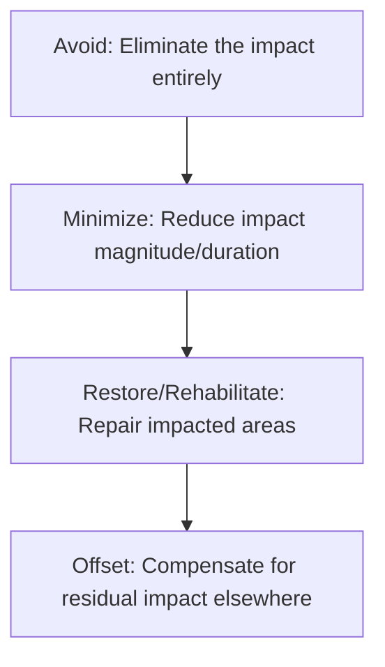

## Environmental Impact Assessment

### Definition and Purpose

Environmental Impact Assessment (EIA) is a formal, structured process used to evaluate the likely environmental consequences of a proposed project before key decisions are made and before implementation begins. It systematically identifies, predicts, and evaluates the biophysical, social, and other relevant effects of proposed development activities, providing decision-makers, regulators, and stakeholders with the information needed to determine whether and how a project should proceed.

EIA is distinct from broader sustainability practices in that it is frequently a **legally mandated regulatory process** rather than a voluntary organizational initiative, particularly for infrastructure, industrial, extractive, and large-scale construction projects.

### Position in the Project Lifecycle

```mermaid
flowchart LR
    A[Project Concept/Screening] --> B[Scoping]
    B --> C[Baseline Environmental Studies]
    C --> D[Impact Prediction & Evaluation]
    D --> E[Mitigation Measures Development]
    E --> F[EIA Report / Environmental Statement]
    F --> G[Public Consultation & Review]
    G --> H[Regulatory Decision / Permit]
    H --> I[Environmental Monitoring During Execution]
    I --> J[Post-Project Environmental Audit]
```

EIA typically occurs during the earliest stages of project initiation and planning, often before a project charter or business case is finalized, since the outcome of the EIA (approval, conditional approval, or rejection) can fundamentally affect project feasibility, scope, and cost.

### Core Stages of the EIA Process

**Screening**

The initial determination of whether a proposed project requires a full EIA, based on factors such as project type, scale, location (e.g., proximity to protected areas), and applicable regulatory thresholds. Many jurisdictions maintain schedules or lists specifying which project categories automatically trigger a mandatory EIA.

**Scoping**

Defines the boundaries of the assessment — which environmental factors (air quality, water resources, biodiversity, noise, cultural heritage, socioeconomic impacts) will be studied, and to what level of detail, based on the project's specific context and potential significant impacts.

**Baseline Studies**

Establishes the current environmental conditions at and around the project site before any development occurs, providing the reference point against which predicted impacts and post-implementation monitoring results are compared — conceptually parallel to establishing a baseline in benefits realization planning.

**Impact Prediction and Evaluation**

Uses modeling, expert judgment, and comparative case data to predict the likely magnitude, duration, and significance of environmental effects (e.g., air emissions dispersion modeling, noise propagation modeling, habitat disruption assessment).

**Mitigation Hierarchy Development**

Defines measures to address predicted impacts, following the internationally recognized mitigation hierarchy: **avoid, minimize, restore/rehabilitate, offset** — in that order of preference, with avoidance always preferred over compensatory offsetting.

**Environmental Impact Statement (EIS) / EIA Report**

The formal document compiling baseline data, predicted impacts, proposed mitigation measures, and alternatives considered, submitted to the relevant regulatory authority and often made available for public review.

**Public Consultation**

A structured process for informing and gathering input from affected communities, indigenous groups, NGOs, and other stakeholders, with feedback often required to be formally addressed in the final EIA documentation.

**Decision-Making and Permitting**

The regulatory authority reviews the EIA report and consultation feedback to approve, conditionally approve (with mitigation requirements), or reject the project.

**Environmental Monitoring and Compliance**

Ongoing monitoring during project construction and operation to verify that actual environmental impacts align with predictions and that mitigation commitments are being fulfilled.

**Post-Project Environmental Audit**

A review, sometimes conducted years after project completion, to verify long-term environmental outcomes against the original EIA predictions — conceptually analogous to a post-implementation review applied to environmental performance specifically.

### The Mitigation Hierarchy

This hierarchy reflects a strong preference ordering: avoidance is always preferred, and offsetting is considered a last resort for unavoidable residual impacts after avoidance, minimization, and restoration options have been exhausted.

### Common Environmental Factors Assessed

- **Air quality** — emissions from construction equipment, vehicle traffic, or ongoing operations
- **Water resources** — surface water and groundwater quality, quantity, and drainage patterns
- **Biodiversity and ecosystems** — habitat disruption, species displacement, protected area impacts
- **Noise and vibration** — construction and operational noise levels affecting nearby communities or wildlife
- **Soil and land use** — contamination risk, erosion, land use change
- **Cultural and heritage resources** — impacts on archaeological sites or culturally significant locations
- **Socioeconomic factors** — displacement, employment effects, changes to community livelihoods
- **Climate** — greenhouse gas emissions and climate resilience considerations

### Step-by-Step Process for Integrating EIA into Project Management

1. **Determine regulatory applicability** — identify whether the project triggers a mandatory EIA requirement under applicable jurisdictional law, and at what screening threshold.
2. **Engage environmental specialists early** — commission qualified environmental consultants during project initiation, well before detailed design, since EIA findings can significantly affect project scope.
3. **Incorporate EIA timeline into the project schedule** — EIA processes, including public consultation periods, can take months to over a year and must be built into the critical path rather than treated as a parallel afterthought.
4. **Conduct scoping in coordination with project stakeholders** — align the scope of environmental study with known project risks and stakeholder concerns.
5. **Integrate baseline data into project risk management** — feed identified environmental risks into the project risk register.
6. **Apply the mitigation hierarchy during design** — favor design alternatives that avoid or minimize impact before considering costly offset measures.
7. **Support public consultation activities** — ensure project communications and stakeholder engagement plans align with regulatory consultation requirements.
8. **Track permit conditions as project requirements** — treat approved mitigation commitments and permit conditions as binding project deliverables, not optional recommendations.
9. **Establish environmental monitoring during execution** — assign responsibility for ongoing compliance monitoring throughout construction and operational phases.

### Illustrative Example

**Example**

A company plans to construct a new manufacturing facility near a river system.

- **Screening:** The project exceeds the regulatory size threshold requiring a full EIA due to proximity to a protected wetland area.
- **Scoping:** Key factors identified for assessment: water quality impact on the adjacent river, noise impact on a nearby residential community, and habitat impact on a wetland bird species.
- **Baseline Studies:** Six months of water quality and noise-level baseline monitoring conducted before design finalization.
- **Impact Prediction:** Modeling predicts a moderate increase in surface runoff during construction, with potential sediment impact on the river if unmitigated.
- **Mitigation Hierarchy Applied:**
  - *Avoid:* Facility footprint redesigned to maintain a larger buffer zone from the wetland edge
  - *Minimize:* Construction scheduled to avoid the bird species' nesting season
  - *Restore:* Temporary construction access roads to be fully rehabilitated post-construction
  - *Offset:* Funding allocated to a regional wetland restoration project to compensate for unavoidable residual habitat impact
- **Public Consultation:** Two public meetings held; community concerns about noise led to an additional mitigation commitment for a temporary sound barrier during peak construction hours.
- **Permit Outcome:** Conditional approval granted, with binding commitments on the mitigation measures incorporated as permit conditions.
- **Project Impact:** The redesigned footprint and construction sequencing added approximately 6 weeks to the schedule and a moderate cost increase, both incorporated into the revised project baseline following EIA approval.

[Inference] The specific scenario details, figures, and outcomes in this example are illustrative constructs for demonstration purposes and are not derived from a documented case study.

### EIA Risk Register Extract (Sample Structure)

| Environmental Risk | Likelihood | Impact | Mitigation | Owner |
| --- | --- | --- | --- | --- |
| Sediment runoff into river during construction | Medium | High | Erosion control measures, buffer zone | Environmental Manager |
| Noise disturbance to nearby residents | High | Medium | Sound barriers, restricted work hours | Construction Manager |
| Habitat disruption during bird nesting season | Medium | High | Schedule construction outside nesting period | Project Manager |

### Common Frameworks and Standards Referenced

**International Finance Corporation (IFC) Performance Standards**

Widely referenced by lenders and investors, particularly for projects seeking international project financing, establishing environmental and social risk management requirements including EIA-equivalent processes.

**Equator Principles**

A risk management framework adopted by financial institutions for determining, assessing, and managing environmental and social risk in project financing, closely tied to IFC Performance Standards.

**National/Jurisdictional EIA Legislation**

Most countries maintain their own EIA regulatory frameworks (e.g., the National Environmental Policy Act (NEPA) in the United States, the EIA Directive in the European Union), with varying screening thresholds, procedural requirements, and public consultation obligations.

**ISO 14001 (Environmental Management Systems)**

While not an EIA-specific standard, organizations with ISO 14001-certified environmental management systems often integrate EIA findings and mitigation commitments directly into their operational environmental management procedures.

### Common Pitfalls

- Treating EIA as a late-stage regulatory hurdle rather than integrating it into early project planning, resulting in costly redesign when significant impacts are identified after design is largely finalized
- Underestimating the time required for baseline studies and public consultation periods, causing critical path schedule delays that were not anticipated in the original project plan
- Failing to treat approved mitigation commitments and permit conditions as binding project requirements, risking regulatory non-compliance during execution
- Applying the mitigation hierarchy out of order — for example, defaulting to offsetting before genuinely exploring avoidance and minimization options
- Inadequate or perfunctory public consultation, which can lead to stakeholder opposition, legal challenges, or reputational damage even after formal regulatory approval is obtained
- Neglecting post-project environmental monitoring and audit, leaving long-term environmental performance unverified against original EIA predictions

[Inference] The specific procedural requirements, thresholds, and consultation timelines for EIA vary substantially by jurisdiction; the process described here reflects commonly recognized international good practice rather than the specific legal requirements of any single country.

### Relationship to Other Concepts in This Chapter

Environmental Impact Assessment connects directly to:

- **Sustainable Project Management Principles** — EIA operationalizes the "Planet" dimension of the P5 Standard and life cycle thinking through formal, evidence-based impact evaluation
- **Environmental and Social Risk Management** — EIA findings populate the environmental risk register and inform ongoing risk mitigation throughout execution
- **Sustainable Procurement** — mitigation commitments may require specific sourcing or contractor requirements to ensure compliance
- **Stakeholder Engagement** — public consultation requirements significantly expand and formalize the project's stakeholder engagement plan

**Related Topics**

- Sustainable Project Management Principles
- Social Impact Assessment
- Mitigation Hierarchy (Avoid, Minimize, Restore, Offset)
- IFC Performance Standards and Equator Principles
- Environmental Risk Management
- Stakeholder Consultation and Engagement Planning
- ISO 14001 Environmental Management Systems
- Carbon Footprint Analysis