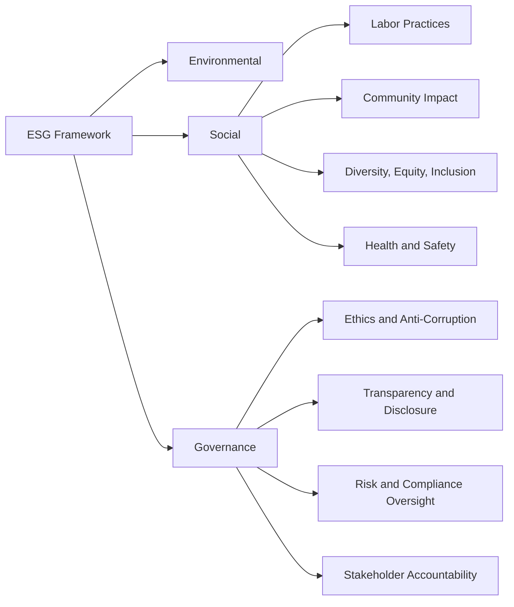

## Social and Governance Considerations

### Definition and Purpose

Social and Governance considerations refer to the "S" and "G" components of the ESG (Environmental, Social, and Governance) framework as applied within project management. While environmental considerations (covered separately via Environmental Impact Assessment) address a project's physical and ecological effects, social considerations address a project's impact on people — employees, communities, and broader society — while governance considerations address the structures, policies, and accountability mechanisms that ensure a project is managed ethically, transparently, and in compliance with legal and regulatory obligations.

Together, social and governance factors are increasingly used by investors, regulators, and organizations to evaluate project and organizational risk and value creation, alongside traditional financial and environmental metrics.

### Position Within the ESG and Project Management Framework

### Social Considerations in Project Management

**Labor Practices and Human Rights**

Ensuring fair wages, safe working conditions, freedom of association, and prohibition of forced or child labor across the project's direct workforce and its supply chain/subcontractors. This extends due diligence responsibility beyond an organization's direct employees to contracted labor and suppliers.

**Community Impact and Social License to Operate**

Assessing how a project affects the communities in which it operates — including displacement, changes to local livelihoods, access to resources, and cultural impacts. The concept of "social license to operate" refers to the ongoing acceptance and approval of a project by local communities and stakeholders, which can significantly affect project feasibility even when all formal regulatory approvals have been obtained.

**Diversity, Equity, and Inclusion (DEI)**

Ensuring fair representation, equal opportunity, and inclusive practices within the project team and in how the project's outcomes affect different demographic groups, avoiding disproportionate negative impacts on marginalized populations.

**Health and Safety**

Beyond standard occupational health and safety compliance, sustainable social practice extends to broader wellbeing considerations for both the project workforce and affected communities (e.g., public health impacts of construction activity).

**Stakeholder Engagement and Consultation**

Formal, inclusive processes for consulting affected stakeholders — extending beyond the regulatory public consultation requirements often associated with environmental assessments to ongoing, good-faith community engagement throughout the project lifecycle.

**Indigenous Rights and Free, Prior, and Informed Consent (FPIC)**

For projects affecting indigenous communities, internationally recognized frameworks call for FPIC — ensuring affected indigenous groups are consulted, informed, and have genuinely consented to project activities affecting their land or rights, rather than merely being notified.

### Governance Considerations in Project Management

**Ethics and Anti-Corruption**

Ensuring project procurement, contracting, and decision-making processes are free from bribery, corruption, and conflicts of interest, often requiring formal anti-corruption policies, gift/hospitality registers, and whistleblower mechanisms.

**Transparency and Disclosure**

Providing accurate, timely, and complete information to stakeholders, regulators, and the public regarding project decisions, risks, and performance — including honest disclosure of setbacks or negative impacts rather than selective positive reporting.

**Risk and Compliance Oversight**

Establishing clear governance structures (steering committees, independent oversight bodies, audit functions) responsible for ensuring the project complies with applicable laws, regulations, and organizational policies.

**Data Privacy and Security Governance**

For projects involving data collection or systems implementation, governance considerations include compliance with data protection regulations and responsible data stewardship practices.

**Supply Chain Governance**

Extending governance oversight to subcontractors and suppliers, verifying that third parties engaged by the project meet the same ethical, legal, and social standards expected of the primary organization.

**Board and Sponsor Accountability**

Clear definition of decision-making authority, escalation paths, and accountability structures ensuring that project governance bodies (steering committees, sponsors) are genuinely empowered and accountable for oversight, rather than serving a purely nominal function.

### Comparison of Social vs. Governance Focus Areas

| Dimension | Social Focus | Governance Focus |
| --- | --- | --- |
| Primary Concern | Impact on people (workforce, community) | Structures ensuring ethical, compliant conduct |
| Key Tools | Social Impact Assessment, stakeholder engagement plans | Governance charters, compliance frameworks, audit |
| Typical Risks | Labor disputes, community opposition, reputational harm | Corruption, non-compliance, lack of accountability |
| Example Metric | Local employment rate, worker safety incident rate | Number of compliance breaches, audit findings resolved |

### Step-by-Step Process for Integrating Social and Governance Considerations

1. **Conduct a social impact assessment** during project initiation, identifying affected communities, workforce implications, and potential DEI considerations.
2. **Establish a project governance charter** defining decision-making authority, escalation paths, and oversight responsibilities distinct from day-to-day project management.
3. **Develop or align with an anti-corruption and ethics policy**, including procurement controls and conflict-of-interest disclosure requirements for project team members and vendors.
4. **Extend stakeholder engagement planning** to include structured, ongoing consultation with affected communities, not limited to one-time regulatory consultation events.
5. **Apply supply chain due diligence** to verify labor practices and ethical standards of subcontractors and suppliers before contract award.
6. **Incorporate social and governance risks into the risk register**, alongside environmental, schedule, and cost risks.
7. **Define social and governance KPIs** (e.g., local employment percentage, safety incident rate, number of governance audit findings) with clear baseline and target values, consistent with the SMART benefit-definition approach.
8. **Monitor and report performance** throughout execution, escalating governance breaches or social risk materialization through defined escalation paths.
9. **Include social and governance outcomes in post-implementation review**, verifying whether social license to operate was maintained and governance controls functioned as intended.

### Illustrative Example

**Example**

Continuing the manufacturing facility scenario introduced in the Environmental Impact Assessment discussion, the organization also addresses social and governance dimensions.

- **Social Impact Assessment:** Identifies that a portion of the construction workforce will be sourced locally, creating a positive local employment impact, but also identifies a risk that increased construction traffic could disproportionately affect a nearby low-income residential area with fewer alternative transportation routes.
- **Community Engagement:** In addition to the regulatory public consultation held for the EIA, the project establishes a standing community liaison committee that meets monthly throughout construction to address ongoing concerns.
- **Labor Practices:** A supply chain due diligence review of the primary steel supplier identifies a gap in documented worker safety practices at one facility; the organization requires a corrective action plan as a condition of continued contract award.
- **Governance Structure:** A project steering committee is established with clearly defined authority to approve scope or budget changes above a defined threshold, and an independent audit function is engaged to periodically review procurement compliance.
- **Anti-Corruption Controls:** All vendor contracts above a defined value threshold require a documented competitive bid process and conflict-of-interest disclosure from evaluation team members.
- **Outcome:** The community liaison committee's ongoing engagement is credited with maintaining local support (social license to operate) despite the traffic disruption concern, which was mitigated through an adjusted construction vehicle routing plan developed in direct response to community feedback.

[Inference] The specific scenario details and outcomes in this example are illustrative constructs for demonstration purposes and are not derived from a documented case study.

### Social and Governance Risk Register Extract (Sample Structure)

| Risk | Category | Likelihood | Impact | Mitigation | Owner |
| --- | --- | --- | --- | --- | --- |
| Construction traffic disproportionately affects low-income area | Social | Medium | Medium | Adjusted vehicle routing, community liaison committee | Community Relations Lead |
| Supplier labor practice non-compliance | Governance/Social | Low | High | Supplier corrective action plan, ongoing audit | Procurement Manager |
| Conflict of interest in vendor selection | Governance | Low | High | Mandatory disclosure, independent audit review | Project Sponsor |

### Common Frameworks and Standards Referenced

**IFC Performance Standards (Standards 1–8)**

Widely referenced for social risk management in project financing, covering labor and working conditions, community health and safety, land acquisition and resettlement, and indigenous peoples.

**UN Guiding Principles on Business and Human Rights**

Provides a globally recognized framework for corporate and project-level human rights due diligence, commonly referenced in supply chain governance practices.

**OECD Guidelines for Multinational Enterprises**

Addresses responsible business conduct including anti-corruption, human rights, and labor practices, frequently referenced in international project governance policies.

**COSO Internal Control Framework**

Widely used for establishing internal control and governance structures relevant to project financial and compliance oversight.

**ISO 26000 (Guidance on Social Responsibility)**

Provides guidance on social responsibility principles applicable to organizational and project-level decision-making, though it is a guidance standard rather than a certifiable one.

### Common Pitfalls

- Treating social consultation as a one-time regulatory box-ticking exercise rather than sustained, good-faith community engagement throughout the project
- Failing to extend governance and ethical due diligence to subcontractors and suppliers, leaving significant labor or corruption risk unaddressed in the supply chain
- Establishing governance structures (e.g., steering committees) with unclear or purely nominal authority, undermining genuine oversight and accountability
- Overlooking disproportionate impacts on vulnerable or marginalized community groups during social impact assessment
- Neglecting to define measurable social and governance KPIs, making it difficult to verify performance during monitoring or post-implementation review
- Underestimating the reputational and schedule risk of losing "social license to operate," even after all formal regulatory and legal approvals have been secured

[Inference] The degree of formality and rigor applied to social and governance due diligence varies substantially across industries and jurisdictions; sectors such as extractives, infrastructure, and international development tend to have more mature, codified frameworks, while formal integration in other sectors is often less standardized as of the current knowledge base.

### Relationship to Other Concepts in This Chapter

Social and governance considerations connect directly to:

- **Sustainable Project Management Principles** — operationalize the "People" dimension of the P5 Standard and extend risk management to social and governance risk categories
- **Environmental Impact Assessment** — social impact assessment is frequently conducted alongside EIA, and both feed into the same consultation and permitting processes
- **Stakeholder Analysis and Engagement** — social considerations substantially expand the scope and depth of traditional stakeholder engagement planning
- **Sustainable Procurement** — governance due diligence requirements directly shape supplier selection and contract management practices

**Related Topics**

- Sustainable Project Management Principles
- Environmental Impact Assessment
- Social Impact Assessment
- Sustainable Procurement (ISO 20400)
- Stakeholder Engagement Planning
- IFC Performance Standards
- Anti-Corruption and Ethics Governance
- UN Guiding Principles on Business and Human Rights