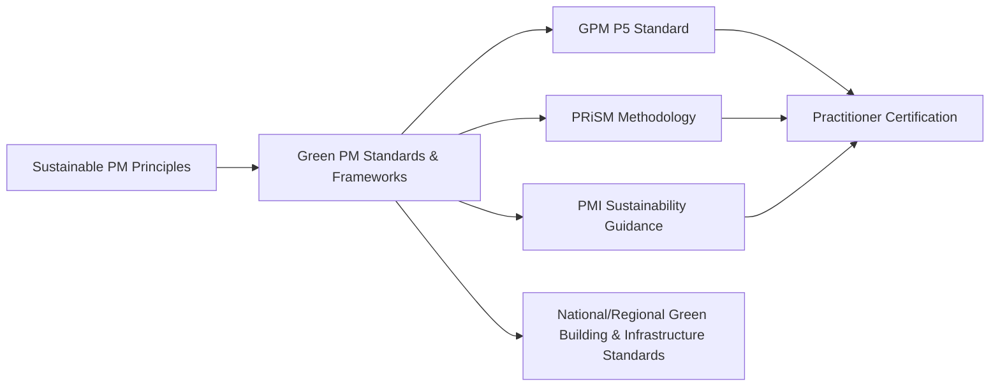

## Green Project Management Standards

### Definition and Purpose

Green Project Management Standards refer to the formal frameworks, certifications, and methodologies specifically developed to guide the integration of environmental and broader sustainability considerations into project management practice. Unlike general ESG principles, which describe *what* should be considered, green project management standards provide structured, often certifiable, methodologies for *how* sustainability is embedded into project processes, governance, and practitioner competency.

These standards typically extend or adapt traditional project management bodies of knowledge to incorporate sustainability-specific processes, roles, deliverables, and assessment criteria.

### Position Within the Broader Sustainability and PM Landscape

### Major Green Project Management Standards and Methodologies

**GPM P5 Standard for Sustainability in Project Management**

Developed by GPM Global (Green Project Management), this is the most widely referenced project-management-specific sustainability standard. It extends the traditional triple constraint (scope, time, cost) into five dimensions: People, Planet, Profit, Product, and Process. The standard provides a structured impact analysis methodology allowing project teams to score and document sustainability impacts across the full project lifecycle, and underpins GPM's certification pathway.

**PRiSM (Projects Integrating Sustainable Methods)**

A structured project delivery methodology, also developed by GPM Global, that integrates sustainability directly into the standard project phases (pre-project, initiation, planning, execution/monitoring/control, closure, and a distinctive post-project "benefits realization" phase focused on sustainability outcomes). PRiSM emphasizes reducing negative environmental and social impacts while maximizing economic value throughout the delivery methodology itself, rather than treating sustainability as a separate assessment activity layered on top of a conventional methodology.

**PMI Sustainability Guidance and PMBOK Alignment**

The Project Management Institute has progressively incorporated sustainability considerations into its guidance materials and practice standards, framing sustainability as a contextual factor project managers must account for within broader project performance domains, rather than issuing a separate certifiable sustainability standard equivalent to GPM's P5/PRiSM offerings. [Unverified] The specific current scope and depth of PMI's sustainability-specific credentialing may have evolved since this content was compiled; readers should verify current offerings directly with PMI.

**IPMA Individual Competence Baseline (ICB) Sustainability References**

The International Project Management Association's competence framework includes references to ethics and sustainability as part of the broader "people" and "perspective" competence areas expected of project professionals, though it is a competence framework rather than a dedicated sustainability delivery methodology.

**ISO 21500 / ISO 21502 (Project, Programme, and Portfolio Management Guidance)**

While not sustainability-specific standards, these international project management guidance standards are increasingly referenced alongside sustainability frameworks like ISO 14001, providing a structural basis into which sustainability considerations from other standards can be integrated.

### Comparison of Major Frameworks

| Framework | Type | Primary Focus | Certification Available |
| --- | --- | --- | --- |
| GPM P5 Standard | Impact assessment standard | Scoring sustainability impact across 5 dimensions | Yes (GPM certifications) |
| PRiSM | Full project delivery methodology | Embedding sustainability into every project phase | Yes (GPM certifications) |
| PMI Sustainability Guidance | Contextual guidance | Sustainability as a performance domain consideration | Integrated into broader PMI credentials |
| IPMA ICB | Competence framework | Individual practitioner ethics/sustainability competence | Yes (IPMA certification levels) |
| ISO 21502 | General PM guidance standard | Structural PM guidance (sustainability-adjacent) | No (guidance standard) |

### The PRiSM Methodology Phases

PRiSM's distinguishing characteristic relative to conventional methodologies is the explicit, formalized emphasis on the final benefits realization phase focusing specifically on verifying sustainability outcomes, conceptually mirroring the post-implementation review practices covered elsewhere in benefits realization management, but applied specifically to environmental and social performance criteria.

### Certification and Practitioner Pathways

**GPM-B (GPM Sustainable Project Management Practitioner)**

An entry-level certification demonstrating foundational knowledge of sustainable project management principles and the P5 Standard.

**GPM-M (GPM Sustainable Project Management Master)**

An advanced certification building on GPM-B, typically covering deeper application of PRiSM methodology and P5 impact analysis to real project scenarios.

**PRiSM Practitioner Certifications**

Certifications specifically focused on applying the PRiSM methodology as a full project delivery framework, distinct from the more assessment-focused P5 Standard certifications.

[Unverified] Specific certification names, prerequisites, and exam structures for these credentials are subject to change by their issuing bodies; readers pursuing certification should verify current requirements directly with GPM Global or the relevant issuing organization.

### How Green PM Standards Integrate with Traditional Project Management Processes

**Initiation**

Sustainability screening and materiality assessment (informed by the P5 Standard's impact categories) are incorporated alongside traditional feasibility and business case development.

**Planning**

Sustainability objectives and KPIs are defined using the same SMART criteria applied to traditional benefits, and sustainability risks are incorporated into the standard risk register rather than tracked separately.

**Execution**

PRiSM-aligned delivery practices emphasize sustainable resource use, ethical sourcing, and waste minimization as operational execution priorities, not merely design-stage considerations.

**Monitoring and Control**

Sustainability KPIs are tracked using the same governance cadence (dashboards, steering committee reporting) as traditional cost and schedule performance metrics.

**Closure and Benefits Realization**

A distinct sustainability-focused review — as formalized in PRiSM — verifies whether environmental and social objectives were achieved, feeding into the organization's broader post-implementation review and lessons-learned processes.

### Illustrative Example

**Example**

An infrastructure organization elects to apply the PRiSM methodology and GPM P5 Standard to a new public transit extension project.

- **Pre-Project/Initiation:** A P5 impact analysis is conducted, scoring the project across People, Planet, Profit, Product, and Process dimensions, identifying construction-phase emissions and community displacement risk as the highest-priority impact areas.
- **Planning:** Sustainability KPIs are defined: reduce construction-phase carbon emissions by 25% relative to a comparable baseline project; achieve zero permanent residential displacement; source at least 40% of materials from certified sustainable suppliers.
- **Execution:** Contractors are required to use low-emission construction equipment as a contractual condition, directly tied to the Planet-dimension KPI.
- **Monitoring:** Monthly sustainability dashboards track emissions, supplier certification compliance, and community engagement metrics alongside standard cost/schedule dashboards.
- **Closure/Benefits Realization Phase (PRiSM-specific):** A dedicated sustainability outcomes review, conducted 6 months post-opening, confirms a 22% emissions reduction (near target) and full achievement of the zero-displacement and sustainable sourcing targets, with findings documented for application to the organization's next transit project.

[Inference] The specific figures, targets, and outcomes in this example are illustrative constructs for demonstration purposes and are not derived from a documented case study.

### Green PM Standards Scorecard (Sample P5-Style Structure)

| P5 Dimension | Assessment Focus | Score (1–5) | Notes |
| --- | --- | --- | --- |
| People | Community/labor impact | 4 | Strong local engagement; minor labor gap identified |
| Planet | Emissions, resource use | 3 | Near-target emissions reduction achieved |
| Profit | Economic viability | 4 | Delivered within revised budget |
| Product | Lifecycle sustainability of transit asset | 4 | High-durability, low-maintenance materials selected |
| Process | Sustainability of PM delivery practices | 4 | PRiSM phases consistently applied |

### Visual Representation of Framework Relationships

<svg xmlns="http://www.w3.org/2000/svg" viewBox="0 0 700 320">
<text x="350" y="26" text-anchor="middle" font-size="17" font-weight="bold" fill="#1f2937">Green Project Management Standards Landscape (svg_diagram)</text>
<rect x="270" y="50" width="160" height="50" rx="8" fill="#f3f4f6" stroke="#6b7280" stroke-width="1.5" />
<text x="350" y="80" text-anchor="middle" font-size="12" font-weight="bold" fill="#111827">Sustainable PM Principles</text>
<rect x="60" y="140" width="150" height="60" rx="8" fill="#dbeafe" stroke="#2563eb" stroke-width="1.5" />
<text x="135" y="165" text-anchor="middle" font-size="12" font-weight="bold" fill="#1e3a8a">P5 Standard</text>
<text x="135" y="182" text-anchor="middle" font-size="10" fill="#1e3a8a">Impact Assessment</text>
<rect x="230" y="140" width="150" height="60" rx="8" fill="#dcfce7" stroke="#16a34a" stroke-width="1.5" />
<text x="305" y="165" text-anchor="middle" font-size="12" font-weight="bold" fill="#14532d">PRiSM</text>
<text x="305" y="182" text-anchor="middle" font-size="10" fill="#14532d">Delivery Methodology</text>
<rect x="400" y="140" width="150" height="60" rx="8" fill="#fef3c7" stroke="#d97706" stroke-width="1.5" />
<text x="475" y="165" text-anchor="middle" font-size="12" font-weight="bold" fill="#78350f">PMI Guidance</text>
<text x="475" y="182" text-anchor="middle" font-size="10" fill="#78350f">Contextual Integration</text>
<rect x="570" y="140" width="120" height="60" rx="8" fill="#fce7f3" stroke="#db2777" stroke-width="1.5" />
<text x="630" y="165" text-anchor="middle" font-size="12" font-weight="bold" fill="#831843">IPMA ICB</text>
<text x="630" y="182" text-anchor="middle" font-size="10" fill="#831843">Competence Framework</text>
<line x1="350" y1="100" x2="135" y2="140" stroke="#374151" stroke-width="1.2" />
<line x1="350" y1="100" x2="305" y2="140" stroke="#374151" stroke-width="1.2" />
<line x1="350" y1="100" x2="475" y2="140" stroke="#374151" stroke-width="1.2" />
<line x1="350" y1="100" x2="630" y2="140" stroke="#374151" stroke-width="1.2" />
<rect x="230" y="240" width="230" height="50" rx="8" fill="#ede9fe" stroke="#7c3aed" stroke-width="1.5" />
<text x="345" y="270" text-anchor="middle" font-size="12" font-weight="bold" fill="#4c1d95">Practitioner Certification Pathways</text>
<line x1="135" y1="200" x2="345" y2="240" stroke="#374151" stroke-width="1.2" />
<line x1="305" y1="200" x2="345" y2="240" stroke="#374151" stroke-width="1.2" />
</svg>

### Common Pitfalls

- Adopting a green PM standard in name only (e.g., referencing the P5 Standard in documentation) without genuinely restructuring project processes to reflect its impact assessment methodology
- Treating PRiSM's sustainability-focused benefits realization phase as optional or skippable, undermining the methodology's core distinguishing feature
- Assuming general project management certification (e.g., traditional PMP-style credentials) is equivalent to specialized sustainability credentialing, when the depth of sustainability-specific competency covered differs substantially
- Applying a green PM standard's scoring or assessment tools inconsistently across projects, undermining the ability to compare sustainability performance at a portfolio level
- Failing to align organizational procurement and contracting practices with the sustainability commitments embedded in the chosen standard, creating a gap between documented methodology and actual delivery practice

[Inference] The relative market adoption and recognition of GPM's P5/PRiSM standards versus other project management sustainability approaches varies by region and industry sector; the framework descriptions here reflect their documented scope and structure rather than a comparative claim about which is most widely adopted globally.

### Relationship to Other Concepts in This Chapter

Green project management standards operationalize and formalize the concepts introduced elsewhere in this chapter:

- **Sustainable Project Management Principles** — the P5 Standard provides the structured scoring methodology for the People/Planet/Profit/Product/Process principles
- **Environmental Impact Assessment** — EIA findings and mitigation commitments are natural inputs into a P5 impact analysis and PRiSM planning phase
- **Social and Governance Considerations** — the People and Process dimensions of P5 directly incorporate social and governance factors into a unified scoring framework

**Related Topics**

- GPM P5 Standard for Sustainability
- PRiSM (Projects Integrating Sustainable Methods) Methodology
- Sustainable Project Management Principles
- Environmental Impact Assessment
- Social and Governance Considerations
- IPMA Individual Competence Baseline (ICB)
- ISO 21502 Project Management Guidance
- Sustainability Practitioner Certification Pathways