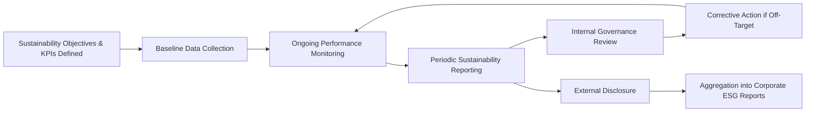

## Reporting on Sustainability Outcomes

### Definition and Purpose

Reporting on sustainability outcomes is the structured process of measuring, documenting, and disclosing a project's environmental, social, and governance (ESG) performance to stakeholders, regulators, investors, and the public. It provides the evidentiary basis for demonstrating whether sustainability objectives defined during project planning were actually achieved, functioning as the sustainability-specific counterpart to financial benefits reporting covered elsewhere in benefits realization management.

Effective sustainability reporting serves multiple purposes: internal accountability and continuous improvement, external stakeholder transparency, regulatory compliance, and support for organizational or corporate-level ESG disclosure obligations that increasingly aggregate data from individual projects.

### Position in the Sustainability and Reporting Lifecycle

### Core Components of Sustainability Reporting

**Defined Metrics and Indicators**

Reporting depends on the sustainability KPIs established during planning (informed by materiality assessment and frameworks such as the GPM P5 Standard), each with a clear baseline, target, and measurement methodology, consistent with the SMART-style discipline applied to financial benefit definitions.

**Data Collection and Assurance**

The mechanisms and systems used to gather sustainability data (e.g., emissions monitoring equipment, HR systems for labor data, supplier audit records), along with any independent verification or assurance process applied to validate reported figures.

**Reporting Boundary and Scope**

A clear definition of what is included in the report — which project activities, time period, and value chain elements (e.g., direct operations only versus extended supply chain) are covered, since inconsistent scoping undermines comparability.

**Narrative and Contextual Disclosure**

Beyond raw metrics, quality sustainability reporting includes narrative explanation of performance context, challenges encountered, and corrective actions taken — avoiding a purely numeric presentation that omits meaningful interpretation.

**Stakeholder-Specific Reporting Formats**

Different audiences require different reporting formats: detailed technical compliance reports for regulators, summarized dashboards for internal steering committees, and accessible narrative disclosures for public and community stakeholders.

### Common Sustainability Reporting Frameworks and Standards

**Global Reporting Initiative (GRI) Standards**

The most widely used international framework for sustainability reporting, providing standardized disclosure topics across economic, environmental, and social dimensions, enabling comparability across organizations and projects.

**IFRS Sustainability Disclosure Standards (ISSB)**

Standards issued by the International Sustainability Standards Board, focused primarily on sustainability-related financial disclosures relevant to investors, with an emphasis on climate-related risk (IFRS S2) alongside general sustainability disclosure requirements (IFRS S1).

**Task Force on Climate-related Financial Disclosures (TCFD) Recommendations**

A framework specifically focused on climate-related risk disclosure, structured around governance, strategy, risk management, and metrics/targets; its recommendations have substantially informed subsequent standards including the ISSB framework.

**CDP (formerly Carbon Disclosure Project)**

A global disclosure system primarily focused on environmental data (climate, water, forests), through which organizations and projects report performance to investors and stakeholders via standardized questionnaires.

**GPM P5 Impact Analysis Reporting**

As covered under green project management standards, the P5 Standard's scoring methodology can itself serve as a structured internal reporting format for project-level sustainability performance across the five P5 dimensions.

[Unverified] The sustainability reporting standards landscape has evolved rapidly, including active convergence efforts between frameworks such as GRI and ISSB; readers should verify the current status of any specific framework's requirements directly with the issuing body, as specific provisions may have changed since this content was compiled.

### Comparison of Major Reporting Frameworks

| Framework | Primary Audience | Primary Focus | Scope |
| --- | --- | --- | --- |
| GRI Standards | Multi-stakeholder (broad) | Comprehensive ESG disclosure | Economic, environmental, social |
| IFRS ISSB (S1/S2) | Investors | Financially material sustainability risk | Enterprise value, climate focus (S2) |
| TCFD | Investors, financial markets | Climate-related risk | Governance, strategy, risk, metrics |
| CDP | Investors, supply chain partners | Environmental data disclosure | Climate, water, forests |
| GPM P5 | Internal project stakeholders | Project-level impact scoring | People, Planet, Profit, Product, Process |

### Step-by-Step Process for Reporting on Sustainability Outcomes

1. **Confirm reporting requirements and audience** — determine whether reporting is driven by regulatory obligation, corporate ESG disclosure needs, contractual/lender requirements, or internal governance only.
2. **Align metrics to an appropriate framework** — map project-specific sustainability KPIs to a recognized standard (e.g., GRI disclosure topics) where external comparability or compliance is required.
3. **Establish data collection and assurance processes** — define how each metric will be measured, from what system or source, and whether independent verification is needed.
4. **Set the reporting cadence** — determine frequency (e.g., monthly internal dashboards, quarterly steering committee reports, annual public disclosure) aligned with the criticality and volatility of each metric.
5. **Compile the report** — combine quantitative metrics with narrative context, explaining variances, challenges, and corrective actions, consistent with good practice in project performance reporting generally.
6. **Route through internal governance review** — validate findings with relevant sustainability, compliance, or steering committee stakeholders before external release.
7. **Disclose to appropriate external stakeholders** — publish or submit reports per regulatory, contractual, or voluntary disclosure commitments.
8. **Feed into aggregated corporate-level reporting** — where applicable, ensure project-level data flows accurately into broader organizational ESG disclosures (e.g., annual sustainability reports).
9. **Use findings to inform the post-implementation review** — incorporate sustainability outcome reporting into the broader post-implementation review process alongside financial and delivery performance.

### Illustrative Example

**Example**

Continuing the transit extension project scenario introduced under green project management standards, the organization compiles its sustainability outcomes report.

- **Reporting Boundary:** Covers the construction phase of the transit extension project, including direct contractor activities and Tier 1 material suppliers.
- **Metrics Reported:** Construction-phase carbon emissions (against a 25% reduction target), community displacement (zero-displacement target), and sustainable sourcing percentage (40% target).
- **Data Collection:** Emissions data collected via contractor equipment monitoring logs and fuel consumption records; sourcing data verified through supplier certification audits.
- **Assurance:** An independent sustainability consultant reviews the emissions calculation methodology and confirms it aligns with the organization's stated approach, providing limited assurance rather than full independent audit certification.
- **Narrative Disclosure:** The report explains that the emissions target was narrowly missed (22% achieved against a 25% target) due to an equipment supply constraint that limited access to the lowest-emission machinery during peak construction months, and outlines a corrective sourcing strategy for future projects.
- **Internal Governance Review:** Findings are presented to the project steering committee, which formally accepts the near-target result given the documented equipment constraint, while noting the corrective action for the lessons-learned repository.
- **External Disclosure:** A summarized version of the findings is included in the organization's annual GRI-aligned sustainability report, referencing the relevant GRI disclosure topics for emissions and community impact.

[Inference] The specific figures, assurance level, and outcomes in this example are illustrative constructs for demonstration purposes and are not derived from a documented case study.

### Sustainability Reporting Summary (Sample Structure)

| Metric | Framework Alignment | Target | Actual | Assurance Level | Status |
| --- | --- | --- | --- | --- | --- |
| Construction-phase carbon emissions | GRI 305 (Emissions) | -25% vs. baseline | -22% vs. baseline | Limited (external review) | Near Target |
| Residential displacement | GRI 413 (Local Communities) | Zero | Zero | Internal verification | Met |
| Sustainable material sourcing | GRI 308 (Supplier Assessment) | 40% | 41% | Supplier audit records | Exceeded |

### Visual Representation of the Reporting Flow

<svg xmlns="http://www.w3.org/2000/svg" viewBox="0 0 700 300">
<text x="350" y="26" text-anchor="middle" font-size="17" font-weight="bold" fill="#1f2937">Sustainability Reporting Flow (svg_diagram)</text>
<rect x="40" y="60" width="150" height="60" rx="8" fill="#dbeafe" stroke="#2563eb" stroke-width="1.5" />
<text x="115" y="85" text-anchor="middle" font-size="12" font-weight="bold" fill="#1e3a8a">Raw Project Data</text>
<text x="115" y="102" text-anchor="middle" font-size="10" fill="#1e3a8a">Emissions, labor, sourcing</text>
<rect x="240" y="60" width="150" height="60" rx="8" fill="#dcfce7" stroke="#16a34a" stroke-width="1.5" />
<text x="315" y="85" text-anchor="middle" font-size="12" font-weight="bold" fill="#14532d">Metric Compilation</text>
<text x="315" y="102" text-anchor="middle" font-size="10" fill="#14532d">Mapped to KPIs/framework</text>
<rect x="440" y="60" width="150" height="60" rx="8" fill="#fef3c7" stroke="#d97706" stroke-width="1.5" />
<text x="515" y="85" text-anchor="middle" font-size="12" font-weight="bold" fill="#78350f">Assurance Review</text>
<text x="515" y="102" text-anchor="middle" font-size="10" fill="#78350f">Internal/external verification</text>
<line x1="190" y1="90" x2="240" y2="90" stroke="#374151" stroke-width="2" marker-end="url(#arrow3)" />
<line x1="390" y1="90" x2="440" y2="90" stroke="#374151" stroke-width="2" marker-end="url(#arrow3)" />
<rect x="140" y="180" width="150" height="60" rx="8" fill="#ede9fe" stroke="#7c3aed" stroke-width="1.5" />
<text x="215" y="205" text-anchor="middle" font-size="12" font-weight="bold" fill="#4c1d95">Internal Governance</text>
<text x="215" y="222" text-anchor="middle" font-size="10" fill="#4c1d95">Steering committee review</text>
<rect x="390" y="180" width="150" height="60" rx="8" fill="#fce7f3" stroke="#db2777" stroke-width="1.5" />
<text x="465" y="205" text-anchor="middle" font-size="12" font-weight="bold" fill="#831843">External Disclosure</text>
<text x="465" y="222" text-anchor="middle" font-size="10" fill="#831843">GRI-aligned public report</text>
<line x1="515" y1="120" x2="215" y2="180" stroke="#374151" stroke-width="1.2" />
<line x1="515" y1="120" x2="465" y2="180" stroke="#374151" stroke-width="1.2" />
</svg>

### Practical Considerations

**Data Quality and Consistency**

Sustainability data often originates from more fragmented sources than financial data (e.g., manual field observations, supplier self-reporting), making data quality assurance and consistent measurement methodology particularly important to avoid unreliable or non-comparable figures over time.

**Avoiding Greenwashing**

Reports should avoid selective disclosure (reporting only favorable metrics), vague qualitative claims without supporting data, or misleading framing of near-target results as full achievement — practices broadly referred to as greenwashing that can create significant reputational and, increasingly, regulatory or legal risk.

**Assurance Levels**

Sustainability data assurance typically falls into a spectrum from no external verification, through "limited assurance" (a moderate level of independent review), to "reasonable assurance" (a higher, audit-equivalent level of verification), with the appropriate level often determined by the materiality and external use of the reported data.

**Aggregation Challenges**

When project-level sustainability data feeds into corporate-level ESG disclosures, ensuring consistent definitions, boundaries, and units of measurement across multiple projects is essential to producing a reliable aggregated corporate report.

### Common Pitfalls

- Reporting sustainability metrics without a clearly defined baseline or measurement methodology, making performance claims unverifiable
- Selectively disclosing favorable metrics while omitting or downplaying missed targets, undermining the credibility of the report and creating greenwashing risk
- Failing to align project-level reporting with a recognized framework (e.g., GRI) when the data is intended to feed into external or corporate-level disclosure, resulting in incompatible or unusable data at the aggregation stage
- Treating sustainability reporting as a one-time end-of-project activity rather than an ongoing monitoring and disclosure cadence throughout execution
- Neglecting narrative context, presenting only raw numbers without explaining the reasons behind variances or the corrective actions taken
- Applying inconsistent reporting boundaries (e.g., changing which supply chain tiers are included) across reporting periods, undermining trend comparability

[Inference] The specific assurance level and reporting cadence appropriate for any given project is context-dependent, varying with regulatory requirements, stakeholder expectations, and the materiality of the sustainability issues involved; no single universal standard applies uniformly across all sectors and jurisdictions.

### Relationship to Other Concepts in This Chapter

Reporting on sustainability outcomes is the culmination of the sustainability practices introduced elsewhere in this chapter:

- **Sustainable Project Management Principles** — the transparency and accountability principle is directly operationalized through formal reporting practices
- **Environmental Impact Assessment** — EIA baseline and monitoring data are primary inputs into ongoing environmental reporting
- **Social and Governance Considerations** — social and governance KPIs (e.g., labor practices, anti-corruption compliance) are reported using the same structured disclosure approach
- **Green Project Management Standards** — the P5 Standard and PRiSM methodology provide structured internal reporting formats that can align with or feed into external frameworks such as GRI

**Related Topics**

- Global Reporting Initiative (GRI) Standards
- IFRS Sustainability Disclosure Standards (ISSB)
- TCFD Climate-Related Financial Disclosure
- Environmental Impact Assessment
- Social and Governance Considerations
- Green Project Management Standards
- Post-Implementation Review
- Greenwashing Risk and Assurance Levels