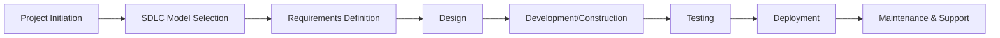
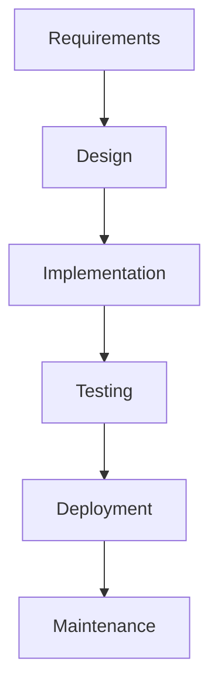
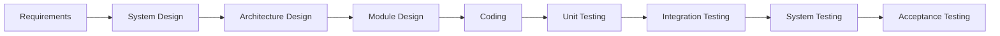
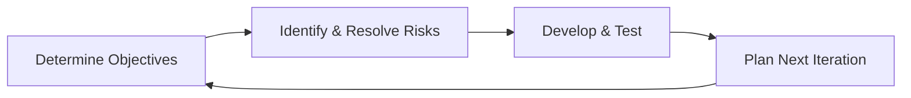
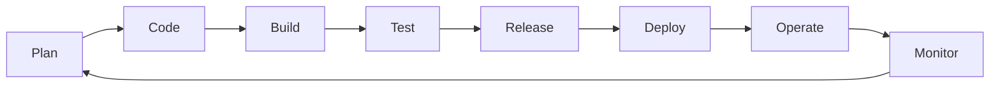

## Software Development Life Cycle Models

### Definition and Purpose

A Software Development Life Cycle (SDLC) model is a structured framework that defines the phases, activities, and deliverables involved in planning, creating, testing, and deploying software systems. SDLC models provide project managers and development teams with a common process structure for organizing work, managing risk, allocating resources, and coordinating stakeholders throughout a software project's lifespan. Different models represent fundamentally different philosophies about how requirements, design, and change should be handled — from rigid, sequential approaches to highly adaptive, iterative ones.

### Position Within IT Project Management

The choice of SDLC model influences virtually every other project management decision: how the project schedule is structured, how risk is managed, how stakeholders are engaged, and how change requests are handled.

### Core SDLC Models

**Waterfall Model**

A linear, sequential model in which each phase (requirements, design, implementation, testing, deployment, maintenance) must be completed before the next begins. Waterfall assumes requirements can be fully defined upfront and change minimally during development.

*Strengths:* Clear documentation, predictable structure, well-suited to projects with stable, well-understood requirements (e.g., regulatory compliance systems).

*Weaknesses:* Poor tolerance for changing requirements; defects discovered late (during testing) are costly to fix since they may trace back to design or requirements decisions made much earlier.

**V-Model (Verification and Validation Model)**

An extension of Waterfall that explicitly pairs each development phase with a corresponding testing phase, forming a "V" shape — unit testing corresponds to detailed design, integration testing corresponds to architecture, and acceptance testing corresponds to requirements.

*Strengths:* Strong emphasis on early test planning, well-suited to safety-critical or highly regulated systems (e.g., medical devices, aerospace).

*Weaknesses:* Shares Waterfall's inflexibility to changing requirements; testing activities, while planned early, are still largely executed late in the cycle.

**Iterative Model**

Develops the system through repeated cycles (iterations), with each iteration producing a working, progressively refined version of the software rather than attempting to build the complete system in one pass.

**Incremental Model**

Divides the system into functional increments, each fully developed, tested, and delivered in sequence, allowing partial system functionality to be released to users before the entire system is complete.

**Spiral Model**

Combines iterative development with explicit, structured risk analysis at each cycle. Each spiral "loop" includes four phases: determine objectives, identify and resolve risks, develop and test, and plan the next iteration — making it well-suited to large, complex, high-risk projects where risk mitigation must be built into the process itself.

**Agile Models (Scrum, Kanban, XP)**

A family of iterative, incremental approaches emphasizing adaptive planning, early and continuous delivery, close customer collaboration, and rapid response to change, formalized in the Agile Manifesto (2001). Agile models deliver working software in short cycles (sprints or continuous flow) rather than through large sequential phases.

*Scrum:* Organizes work into fixed-length sprints (commonly 1–4 weeks), with defined roles (Product Owner, Scrum Master, Development Team) and ceremonies (sprint planning, daily stand-up, sprint review, retrospective).

*Kanban:* A flow-based approach visualizing work on a board with defined columns (e.g., To Do, In Progress, Done), emphasizing limiting work-in-progress (WIP) and continuous delivery rather than fixed-length iterations.

*Extreme Programming (XP):* Emphasizes engineering practices such as test-driven development (TDD), pair programming, and continuous integration alongside iterative delivery.

**DevOps-Extended Lifecycle (CI/CD Integration)**

While not a traditional SDLC "model" in the classic sense, DevOps practices extend agile development lifecycles with continuous integration and continuous delivery/deployment (CI/CD) pipelines, blurring the line between development and operations phases and enabling much higher release frequency.

**Rapid Application Development (RAD)**

Emphasizes rapid prototyping and iterative feedback over extensive upfront planning, typically involving close user involvement and reusable components, well-suited to projects with well-understood business functionality but evolving user interface or workflow requirements.

**Hybrid Models**

Many organizations combine elements of multiple models — for example, using Waterfall-style governance and phase-gate approval at the program level while individual development teams use Scrum internally, or applying Water-Scrum-Fall approaches that use agile development sandwiched between waterfall-style planning and deployment/release management phases.

### Comparative Overview

| Model | Flexibility to Change | Risk Management Emphasis | Delivery Frequency | Best Suited For |
| --- | --- | --- | --- | --- |
| Waterfall | Low | Low (implicit) | Single, at project end | Stable, well-understood requirements |
| V-Model | Low | Moderate (via early test planning) | Single, at project end | Safety-critical, regulated systems |
| Spiral | Moderate | High (explicit risk analysis loops) | Multiple, per spiral | Large, complex, high-risk projects |
| Incremental | Moderate | Moderate | Multiple, per increment | Systems that can be functionally decomposed |
| Agile (Scrum) | High | Moderate (via iteration/retrospective) | Frequent, per sprint | Evolving requirements, close customer collaboration |
| Kanban | High | Moderate (via flow visibility) | Continuous | Support/maintenance, variable-priority work |
| DevOps/CI-CD | Very High | Moderate-High (via automated testing/monitoring) | Continuous, multiple per day possible | High-velocity software delivery environments |

### Step-by-Step Process for Selecting an SDLC Model

1. **Assess requirements stability** — determine how well-understood and likely to change the requirements are; stable requirements favor Waterfall/V-Model, while evolving requirements favor Agile.
2. **Evaluate project risk and complexity** — high-risk, high-complexity projects benefit from the Spiral model's explicit risk-review cycles.
3. **Consider regulatory and compliance context** — safety-critical or heavily regulated domains often require the traceability and structured verification emphasis of the V-Model.
4. **Assess stakeholder/customer availability** — Agile models require sustained, close customer/product owner engagement; if this is not feasible, a more document-driven model may be more practical.
5. **Evaluate organizational and team maturity** — Agile and DevOps approaches require cultural and process maturity (e.g., automated testing infrastructure, empowered cross-functional teams) that not all organizations currently possess.
6. **Determine delivery cadence needs** — if the business requires frequent incremental releases, Agile, Kanban, or DevOps-integrated models are generally more suitable than Waterfall's single end-of-project delivery.
7. **Consider hybrid approaches where appropriate** — many real-world IT projects, particularly those with external vendor contracts or fixed-price governance, adopt hybrid models blending phase-gate governance with agile execution.

### Illustrative Example

**Example**

A financial services company needs to replace its core banking transaction processing system, a highly regulated, mission-critical system, while simultaneously building a new customer-facing mobile banking app.

- **Core Banking System:** Given strict regulatory requirements, well-defined transaction processing rules, and the high cost of post-deployment defects, the organization selects a **V-Model** approach, with extensive requirements traceability matrices linking each requirement to specific test cases at each corresponding testing level.
- **Mobile Banking App:** Given evolving user experience requirements and the need for frequent market-responsive updates, the organization selects a **Scrum-based Agile** approach with two-week sprints, a dedicated Product Owner representing customer experience priorities, and continuous integration pipelines enabling frequent app store releases.
- **Governance Structure:** A program-level steering committee applies phase-gate style governance across both workstreams (approving major milestones and budget releases), while each workstream internally uses the SDLC model best suited to its own risk profile and requirements stability — a hybrid governance approach.

[Inference] The specific organizational choices and structure in this example are illustrative constructs for demonstration purposes and are not derived from a documented case study.

### SDLC Model Selection Matrix (Sample Structure)

| Project Characteristic | Recommended Model(s) |
| --- | --- |
| Highly stable, well-documented requirements | Waterfall |
| Safety-critical, regulated system | V-Model |
| Large, complex, high uncertainty | Spiral |
| Evolving requirements, active customer collaboration | Scrum (Agile) |
| Ongoing support/maintenance work with variable priority | Kanban |
| High-velocity release environment, strong automation maturity | DevOps/CI-CD Integrated Agile |
| Fixed-price vendor contract with need for governance control | Hybrid (Water-Scrum-Fall) |

### Common Frameworks and Standards Referenced

**Agile Manifesto and the 12 Principles**

The foundational document underpinning Agile SDLC models, emphasizing individuals and interactions, working software, customer collaboration, and responding to change.

**Scrum Guide**

The authoritative reference defining Scrum roles, events, and artifacts, maintained and periodically updated by its co-creators.

**IEEE/ISO Software Life Cycle Standards (e.g., ISO/IEC/IEEE 12207)**

Provides an international standard framework for software life cycle processes, often referenced in contractual or regulated software development contexts requiring formal process documentation.

**CMMI (Capability Maturity Model Integration)**

While not an SDLC model itself, CMMI provides a maturity framework often used to assess and improve the discipline and consistency with which an organization applies its chosen SDLC model(s).

### Common Pitfalls

- Selecting Waterfall for a project with genuinely uncertain or evolving requirements, leading to costly late-stage rework when requirements inevitably change
- Adopting Agile terminology and ceremonies (stand-ups, sprints) without genuinely empowering cross-functional teams or securing sustained customer/product owner engagement — often termed "Agile in name only" or "cargo cult Agile"
- Applying the Spiral model without genuine, rigorous risk analysis at each cycle, reducing it to iterative development without its distinguishing risk-management discipline
- Failing to align contractual and procurement structures (e.g., fixed-price, fixed-scope contracts) with the flexibility assumptions of an Agile delivery model, creating friction between governance expectations and delivery practice
- Underestimating the organizational and technical maturity (automated testing, CI/CD infrastructure) required to successfully sustain DevOps-integrated delivery models
- Treating SDLC model selection as a one-time decision rather than periodically reassessing fit as project risk, requirements stability, or organizational context changes

[Inference] The relative prevalence of specific SDLC models varies significantly by industry sector and organizational context; Agile-family approaches are widely documented as prevalent in commercial software development, while Waterfall and V-Model approaches remain more common in regulated, safety-critical, or heavily contracted environments, though exact prevalence figures are not verifiable from static training data and would require current industry survey data to state precisely.

### Relationship to Other IT Project Management Concepts

SDLC model selection directly shapes and connects to:

- **Requirements Management** — the chosen SDLC model determines whether requirements are fully defined upfront (Waterfall) or elaborated progressively (Agile)
- **Software Testing and Quality Assurance Strategy** — testing approach and timing (e.g., V-Model's paired testing phases vs. Agile's continuous testing) are directly determined by the SDLC model
- **IT Project Governance and Contracting** — contract structures (fixed-price vs. time-and-materials) often need to align with the flexibility assumptions of the chosen SDLC model
- **DevOps and Release Management** — modern SDLC models increasingly integrate directly with CI/CD pipelines and release management practices

**Related Topics**

- Agile Project Management (Scrum, Kanban, XP)
- DevOps and CI/CD Pipelines
- Requirements Management in IT Projects
- Software Testing and Quality Assurance Strategy
- Hybrid Project Management Approaches
- IT Project Governance and Contracting Models
- Capability Maturity Model Integration (CMMI)
- Risk Management in Software Projects