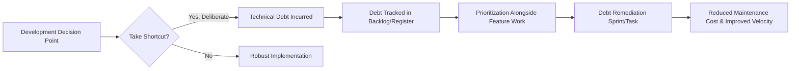

## Managing Technical Debt

### Definition and Purpose

Technical debt is a metaphor, originally coined by Ward Cunningham, describing the implied cost of additional future rework caused by choosing an easy or expedient solution now instead of a better, more robust approach that would take longer to implement. Like financial debt, technical debt can be a deliberate, strategic tool when consciously incurred and tracked, but it accrues "interest" over time in the form of increased maintenance cost, reduced development velocity, and higher defect rates if left unmanaged.

Managing technical debt is a project and product management discipline concerned with identifying, quantifying, prioritizing, and systematically addressing this debt to sustain long-term software quality and delivery velocity.

### Position Within the Software Development Lifecycle

### The Technical Debt Quadrant (Martin Fowler's Framework)

A widely referenced framework categorizing technical debt along two dimensions: whether it was incurred deliberately or inadvertently, and whether the decision was reckless or prudent.

|  | Reckless | Prudent |
| --- | --- | --- |
| **Deliberate** | "We don't have time for design" | "We must ship now and deal with consequences" |
| **Inadvertent** | "What's layering?" | "Now we know how we should have done it" |

This framework highlights that not all technical debt is a management failure — **prudent, deliberate debt** (consciously accepting a shortcut to meet a critical deadline, with a plan to address it later) is a legitimate strategic choice, whereas **reckless debt** (incurred through poor practice or lack of design discipline) represents a genuine risk requiring correction.

### Categories of Technical Debt

**Code Debt**

Poor code quality, duplicated logic, inconsistent style, or lack of adherence to coding standards, making code harder to read, test, and modify.

**Architecture Debt**

Structural design decisions that no longer suit the system's current scale, requirements, or usage patterns (e.g., a monolithic architecture that has outgrown its original design assumptions).

**Test Debt**

Insufficient automated test coverage, outdated tests, or reliance on manual testing, increasing the risk and cost of introducing regressions with future changes.

**Documentation Debt**

Missing, outdated, or inaccurate documentation, increasing onboarding time for new team members and the risk of incorrect assumptions during maintenance.

**Infrastructure/Environment Debt**

Outdated dependencies, unsupported platform versions, or manual deployment processes that increase operational risk and slow delivery.

**Design Debt**

Suboptimal user experience or interface design decisions made under time pressure that create usability issues requiring future rework.

### Step-by-Step Process for Managing Technical Debt

1. **Establish visibility and a debt register** — create a structured mechanism (e.g., a tagged backlog category, dedicated technical debt register) to formally document identified debt items, distinct from ad hoc developer complaints.
2. **Classify each debt item** — categorize by type (code, architecture, test, documentation, infrastructure, design) and by the Fowler quadrant (deliberate/inadvertent, reckless/prudent).
3. **Quantify impact and cost of delay** — estimate the ongoing "interest" cost of each debt item (e.g., increased time to implement related features, elevated defect risk) and the estimated cost/effort to remediate it.
4. **Prioritize alongside feature work** — integrate technical debt items into the standard backlog prioritization process rather than treating them as separate, perpetually deprioritized work.
5. **Allocate dedicated capacity** — many teams reserve a fixed percentage of each sprint or release cycle (a common practice, though the specific percentage varies by team) specifically for debt remediation to prevent it from being continuously deprioritized by feature pressure.
6. **Address debt incrementally** — favor small, continuous remediation (e.g., refactoring as part of related feature work) over large, disruptive "debt paydown" projects where feasible.
7. **Monitor debt-related metrics** — track indicators such as code complexity trends, test coverage percentage, defect density, and development velocity to identify when accumulating debt is measurably affecting delivery.
8. **Communicate debt status to stakeholders** — translate technical debt into business terms (e.g., delivery risk, increased cost of future changes) to secure appropriate prioritization and investment from non-technical stakeholders and sponsors.
9. **Prevent unnecessary accumulation** — apply coding standards, code review practices, and architectural governance to minimize reckless debt from being introduced in the first place.

### Common Metrics for Measuring Technical Debt

**Code Complexity Metrics**

Measures such as cyclomatic complexity assess how difficult code is to understand and maintain, with elevated complexity often correlating with higher defect rates and maintenance cost.

**Test Coverage Percentage**

The proportion of code exercised by automated tests, used as a proxy indicator for test debt, though high coverage alone does not guarantee test quality.

**Code Churn and Defect Density**

Frequency of changes to a given code area combined with defect rates in that area can highlight architecture or code debt hotspots requiring attention.

**Technical Debt Ratio (TDR)**

A ratio comparing the estimated cost to fix identified code issues against the estimated cost to develop the code from scratch, used by some static analysis tools as a quantified debt indicator.

$$TDR = \frac{Remediation\ Cost}{Development\ Cost} \times 100\%$$

**Delivery Velocity Trends**

A sustained decline in team velocity or increasing time-to-deliver for comparable feature sizes can be a lagging indicator that accumulated technical debt is measurably slowing delivery.

### Illustrative Example

**Example**

A software team building an e-commerce platform faces a critical holiday-season deadline.

- **Deliberate Debt Incurred:** To meet the deadline, the team hardcodes a promotional discount calculation directly into the checkout flow rather than building a configurable discount rules engine, consciously accepting this as prudent, deliberate debt given the immovable deadline.
- **Debt Register Entry:** The shortcut is logged in the technical debt register with a description, estimated remediation effort (3 sprint days), and an assigned priority tied to the next planned promotional campaign.
- **Impact Quantification:** The team estimates that without remediation, each future promotional campaign will require an additional 2 days of custom code changes rather than simple configuration, creating recurring "interest" cost.
- **Prioritization:** During the next quarterly planning cycle, the debt item is prioritized ahead of several lower-impact feature requests because the recurring interest cost is quantified as exceeding the one-time remediation cost within two future campaigns.
- **Remediation:** The team allocates capacity during a lower-pressure period (post-holiday) to build the configurable discount rules engine, retiring the debt.
- **Outcome:** Subsequent promotional campaigns require only configuration changes rather than custom development, and the team's velocity for campaign-related work measurably improves.

[Inference] The specific figures and outcomes in this example are illustrative constructs for demonstration purposes and are not derived from a documented case study.

### Technical Debt Register (Sample Structure)

| Debt ID | Description | Category | Quadrant | Est. Interest Cost | Est. Remediation Effort | Priority |
| --- | --- | --- | --- | --- | --- | --- |
| TD-01 | Hardcoded discount logic in checkout | Code | Deliberate/Prudent | 2 days per campaign | 3 days | High |
| TD-02 | Missing automated tests on payment module | Test | Inadvertent/Reckless | Elevated regression risk | 5 days | High |
| TD-03 | Outdated third-party logging library | Infrastructure | Inadvertent/Prudent | Security patch delay risk | 1 day | Medium |

### Visual Representation of the Technical Debt Quadrant

<svg xmlns="http://www.w3.org/2000/svg" viewBox="0 0 620 420">
<text x="310" y="26" text-anchor="middle" font-size="17" font-weight="bold" fill="#1f2937">Technical Debt Quadrant (svg_diagram)</text>
<line x1="310" y1="60" x2="310" y2="380" stroke="#374151" stroke-width="1.5" />
<line x1="60" y1="220" x2="560" y2="220" stroke="#374151" stroke-width="1.5" />

<text x="180" y="45" text-anchor="middle" font-size="12" font-weight="bold" fill="`#374151`">Deliberate</text>

<text x="440" y="45" text-anchor="middle" font-size="12" font-weight="bold" fill="`#374151`">Inadvertent</text>

<text x="30" y="140" text-anchor="middle" font-size="12" font-weight="bold" fill="`#374151`" transform="rotate(-90 30 140)">Reckless</text>

<text x="30" y="300" text-anchor="middle" font-size="12" font-weight="bold" fill="`#374151`" transform="rotate(-90 30 300)">Prudent</text>

<rect x="65" y="65" width="240" height="150" fill="#fee2e2" opacity="0.5" />
<text x="185" y="130" text-anchor="middle" font-size="11" fill="#7f1d1d">"We don't have</text>
<text x="185" y="148" text-anchor="middle" font-size="11" fill="#7f1d1d">time for design"</text>
<rect x="315" y="65" width="240" height="150" fill="#fef3c7" opacity="0.5" />
<text x="435" y="130" text-anchor="middle" font-size="11" fill="#78350f">"What's</text>
<text x="435" y="148" text-anchor="middle" font-size="11" fill="#78350f">layering?"</text>
<rect x="65" y="225" width="240" height="150" fill="#dcfce7" opacity="0.5" />
<text x="185" y="290" text-anchor="middle" font-size="11" fill="#14532d">"We must ship now</text>
<text x="185" y="308" text-anchor="middle" font-size="11" fill="#14532d">and deal with it later"</text>
<rect x="315" y="225" width="240" height="150" fill="#dbeafe" opacity="0.5" />
<text x="435" y="290" text-anchor="middle" font-size="11" fill="#1e3a8a">"Now we know how</text>
<text x="435" y="308" text-anchor="middle" font-size="11" fill="#1e3a8a">we should have done it"</text>
</svg>

### Strategies for Preventing Excessive Debt Accumulation

- **Code review discipline** — enforcing peer review standards to catch reckless debt before it is merged into the codebase
- **Automated static analysis** — using tooling to flag complexity, duplication, and code smell indicators continuously rather than relying solely on manual review
- **Definition of Done standards** — in Agile contexts, embedding quality criteria (test coverage, documentation) into the team's Definition of Done to prevent debt from being silently introduced with each increment
- **Architecture governance** — periodic architecture review checkpoints to catch architecture debt before it compounds across many dependent features
- **Explicit debt budgeting** — treating debt remediation capacity as a first-class planning input rather than "whatever time is left over" after feature work

### Common Pitfalls

- Treating all technical debt as equally urgent or equally low-priority, rather than differentiating by quadrant, category, and quantified interest cost
- Allowing feature delivery pressure to perpetually deprioritize debt remediation, leading to compounding "interest" costs that eventually severely constrain delivery velocity
- Incurring debt "recklessly" (through lack of design discipline) while mistakenly framing it as strategically "prudent" debt to avoid accountability
- Failing to communicate technical debt in business terms, leaving non-technical stakeholders unable to make informed prioritization trade-offs
- Undertaking large, high-risk "big bang" debt remediation projects instead of incremental, continuous remediation integrated into regular delivery work
- Neglecting to track technical debt at all, relying solely on informal developer knowledge that is lost when team members leave the organization

[Inference] The specific percentage of sprint capacity organizations allocate to technical debt remediation varies considerably by team and organizational context; commonly cited practitioner guidance suggests reserving a meaningful, consistent proportion of capacity, but no single universally standardized percentage applies across all software organizations.

### Relationship to Other IT Project Management Concepts

Managing technical debt connects directly to:

- **Software Development Life Cycle Models** — the chosen SDLC model affects how and when debt is likely to accumulate (e.g., Agile's iterative delivery can both surface and, if mismanaged, accelerate debt accumulation)
- **Software Quality Assurance and Testing Strategy** — test debt is directly addressed through testing strategy and coverage standards
- **Risk Management in Software Projects** — unmanaged technical debt is itself a significant project and organizational risk requiring formal tracking
- **Agile Backlog Management** — debt remediation items must be integrated into standard backlog prioritization and sprint planning practices

**Related Topics**

- Software Development Life Cycle Models
- Agile Backlog Management and Prioritization
- Software Testing and Quality Assurance Strategy
- Code Review and Static Analysis Practices
- Architecture Governance
- Risk Management in Software Projects
- DevOps and Continuous Integration Practices
- Refactoring Strategies