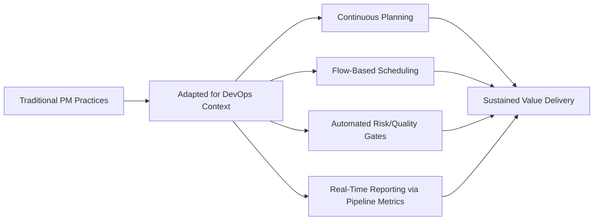
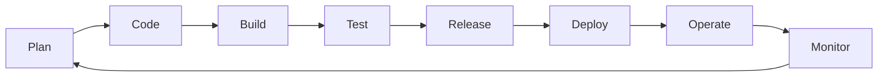
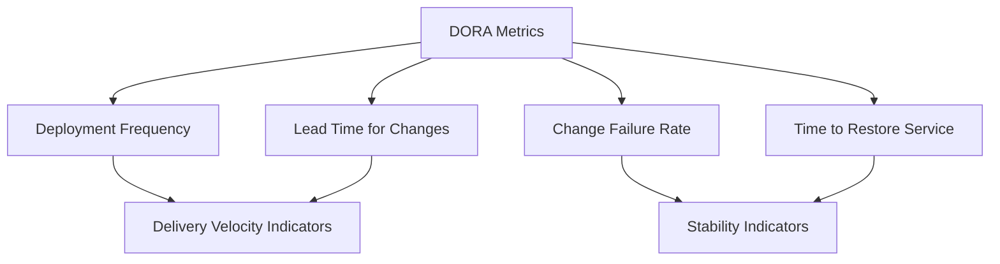

## DevOps and Project Management Integration

### Definition and Purpose

DevOps is a set of cultural philosophies, practices, and tools that integrates software development (Dev) and IT operations (Ops) to shorten the systems development life cycle while delivering features, fixes, and updates frequently and reliably. Integrating DevOps with project management involves adapting traditional project management practices — planning, scheduling, risk management, governance, and reporting — to fit a continuous, highly automated delivery environment, rather than applying conventional phase-gate project structures unmodified to a DevOps context.

This integration matters because DevOps fundamentally changes the cadence and nature of "delivery" in a software project: instead of a small number of discrete releases, a mature DevOps environment may deploy changes to production multiple times per day, requiring project management practices that support continuous flow rather than discrete milestone-based delivery.

### Position Within IT Project Management

### The DevOps Lifecycle (CI/CD Pipeline)

This continuous, looping lifecycle is often visualized as an infinity loop, reflecting that DevOps is not a linear, terminating process but a sustained operating model in which feedback from monitoring directly informs the next planning cycle.

### Core DevOps Practices Relevant to Project Management

**Continuous Integration (CI)**

Developers frequently merge code changes into a shared repository, with automated builds and tests run on each integration to detect issues early, reducing the large, risky "integration phase" common in traditional sequential SDLC models.

**Continuous Delivery/Deployment (CD)**

Continuous Delivery ensures code is always in a deployable state, with deployment to production requiring a manual approval step; Continuous Deployment goes further, automatically deploying every change that passes the pipeline's automated checks directly to production without manual intervention.

**Infrastructure as Code (IaC)**

Managing and provisioning infrastructure through machine-readable configuration files rather than manual processes, enabling infrastructure changes to be version-controlled, reviewed, and tracked using the same practices applied to application code.

**Automated Testing Pipelines**

Extensive automated test suites (unit, integration, security, performance) run as part of the CI/CD pipeline, replacing much of the manual testing phase found in traditional SDLC models.

**Monitoring and Observability**

Continuous, real-time monitoring of production systems (logs, metrics, traces) provides ongoing feedback used both for operational incident response and for informing future development priorities.

**Feature Flags / Feature Toggles**

A technique allowing code to be deployed to production while keeping new functionality hidden or disabled until it is ready for release, decoupling the act of deployment from the act of feature release — a concept with direct implications for how project managers define and track "delivery" milestones.

### How DevOps Changes Traditional Project Management Practices

**Planning**

Shifts from large, upfront release planning toward continuous backlog refinement and shorter planning horizons, often integrated with Agile sprint or Kanban flow planning rather than long-range Gantt-chart-driven scheduling.

**Scheduling and Milestones**

Traditional milestone-based scheduling (tied to discrete releases) is often replaced or supplemented with flow metrics (e.g., lead time, cycle time, deployment frequency) that better reflect a continuous delivery cadence.

**Risk Management**

Risk management shifts toward automated, continuous risk mitigation (automated testing, canary deployments, feature flags enabling rapid rollback) rather than relying primarily on discrete risk review checkpoints at defined project phases.

**Change Management**

Formal, meeting-based change control boards common in traditional IT governance are often replaced or supplemented by automated change management embedded in the pipeline itself (e.g., automated approval gates based on test results and defined criteria), though high-risk changes may still require human governance review.

**Reporting and Governance**

Project status reporting shifts from periodic manual status reports toward real-time dashboards drawing directly from pipeline and monitoring tool data (e.g., deployment frequency, change failure rate, mean time to recovery).

**Team Structure and Roles**

DevOps typically requires cross-functional teams with combined development and operations responsibility (sometimes summarized as "you build it, you run it"), which has implications for how a project manager structures team accountability compared to traditionally siloed development and operations teams.

### Key DevOps Performance Metrics (DORA Metrics)

The DevOps Research and Assessment (DORA) program identifies four key metrics widely used to measure software delivery performance, providing a structured basis for project and organizational reporting in a DevOps context:

- **Deployment Frequency** — how often an organization successfully releases to production
- **Lead Time for Changes** — the time it takes to go from code committed to code successfully running in production
- **Change Failure Rate** — the percentage of deployments causing a failure in production requiring remediation
- **Time to Restore Service (Mean Time to Recovery)** — how long it takes to recover from a failure in production

These four metrics are commonly grouped into two categories: **velocity/throughput** (deployment frequency, lead time) and **stability** (change failure rate, time to restore), reflecting DORA research findings that high-performing organizations tend to achieve strong results in both dimensions simultaneously rather than trading one off against the other. [Inference] Specific benchmark thresholds distinguishing "elite," "high," "medium," and "low" performers on these metrics have been published in DORA's periodic State of DevOps research and are subject to revision in newer research iterations; readers should consult current DORA research directly for up-to-date benchmark figures rather than relying on any single historical benchmark as permanently authoritative.

### Step-by-Step Process for Integrating DevOps into Project Management Practice

1. **Assess current delivery maturity** — evaluate existing automation, testing, and deployment practices to determine readiness for DevOps-integrated project management approaches.
2. **Redefine planning cadence** — shift from long-range, phase-based release planning toward shorter, continuous planning cycles aligned with the team's chosen Agile framework (Scrum sprints or Kanban flow).
3. **Establish pipeline-based governance gates** — define automated quality and security checks within the CI/CD pipeline to replace or supplement manual review checkpoints, reserving human governance review for genuinely high-risk changes.
4. **Adopt DORA metrics for reporting** — integrate deployment frequency, lead time, change failure rate, and time to restore service into regular project and program reporting, alongside or in place of traditional milestone-based status reporting.
5. **Redefine risk management practices** — incorporate automated risk mitigation techniques (canary releases, feature flags, automated rollback) into the project risk management plan.
6. **Align team structure and accountability** — ensure project governance reflects cross-functional, combined development-and-operations team accountability rather than assuming separate handoff points between development and operations teams.
7. **Establish continuous feedback loops** — ensure production monitoring data feeds back into backlog prioritization and planning, closing the loop between the "operate/monitor" and "plan" phases of the DevOps lifecycle.
8. **Adapt stakeholder communication** — educate sponsors and stakeholders accustomed to traditional milestone reporting on interpreting flow-based and DORA metrics as indicators of project health and progress.

### Illustrative Example

**Example**

An organization migrating its customer support ticketing system from a traditional quarterly-release model to a DevOps-integrated delivery model.

- **Prior State:** Releases occurred quarterly, following a Waterfall-influenced governance process with manual change advisory board (CAB) approval for every release; mean time to recovery from production incidents averaged 8 hours due to manual rollback procedures.
- **DevOps Integration Steps:** The team implements automated CI/CD pipelines with automated regression testing, introduces feature flags to decouple deployment from release, and establishes automated rollback capability triggered by real-time monitoring alerts.
- **Governance Adaptation:** The formal CAB process is retained only for major architectural changes; routine feature deployments now flow through automated pipeline gates requiring peer code review and passing automated tests, without requiring a full CAB meeting.
- **Metrics Adopted:** The project steering committee shifts its reporting dashboard from a quarterly Gantt-chart-style status report to a real-time DORA metrics dashboard.
- **Result (illustrative):** Deployment frequency increases from quarterly to multiple times per week; mean time to recovery decreases from 8 hours to under 30 minutes due to automated rollback; change failure rate is closely monitored during the transition to ensure the increased deployment frequency does not come at the cost of production stability.

[Inference] The specific figures and outcomes in this example are illustrative constructs for demonstration purposes and are not derived from a documented case study.

### DevOps-Integrated Reporting Dashboard (Sample Structure)

| Metric | Prior State | Current State | Trend |
| --- | --- | --- | --- |
| Deployment Frequency | Quarterly | 3–5x per week | Improving |
| Lead Time for Changes | ~6 weeks | ~2 days | Improving |
| Change Failure Rate | Not tracked | 8% | Monitoring |
| Time to Restore Service | ~8 hours | <30 minutes | Improving |

### Common Frameworks and Standards Referenced

**DORA (DevOps Research and Assessment) Research Program**

The primary empirical research body behind the four key DevOps performance metrics, widely referenced for benchmarking software delivery performance.

**The Three Ways (from "The Phoenix Project" / DevOps literature)**

A conceptual framework describing DevOps principles as: (1) the flow of work from development to operations to the customer, (2) fast, continuous feedback loops, and (3) a culture of continuous experimentation and learning.

**Site Reliability Engineering (SRE) Practices**

A related discipline, originating at Google, that applies software engineering approaches to IT operations problems, often integrated with DevOps practices and contributing concepts such as error budgets and service level objectives (SLOs) relevant to project risk and quality governance.

**ITIL 4**

The IT service management framework's most recent major version has incorporated Agile and DevOps-aligned concepts, providing a bridge for organizations transitioning from traditional ITIL-based change management toward DevOps-integrated practices.

### Common Pitfalls

- Attempting to overlay traditional phase-gate project governance unmodified onto a DevOps delivery environment, creating friction between continuous delivery capability and infrequent, meeting-based approval processes
- Adopting DevOps tooling (CI/CD pipelines) without the corresponding cultural and organizational changes (cross-functional accountability, blameless post-incident reviews), limiting realized benefit
- Focusing exclusively on velocity metrics (deployment frequency, lead time) while neglecting stability metrics (change failure rate, time to restore), risking a false perception of improved performance if increased release speed comes at the cost of production reliability
- Retaining fully manual change advisory board processes for all changes regardless of risk level, negating much of the speed benefit DevOps automation is intended to provide
- Failing to adapt stakeholder reporting formats, leaving sponsors unable to interpret DORA or flow metrics and reverting to demands for traditional milestone-based status updates that do not fit the delivery model
- Underestimating the infrastructure and tooling investment required to establish robust automated testing and deployment pipelines before attempting to scale deployment frequency

[Inference] The pace and extent of DevOps adoption, along with typical DORA metric benchmark values, vary considerably across industries and organizational contexts; regulated industries in particular may retain more manual governance steps for compliance reasons even within an otherwise DevOps-integrated delivery model.

### Relationship to Other IT Project Management Concepts

DevOps and project management integration connects directly to:

- **Software Development Life Cycle Models** — DevOps most naturally extends Agile-family SDLC models, though hybrid approaches integrating DevOps automation with more traditional governance also occur
- **Managing Technical Debt** — automated pipelines and monitoring can surface technical debt (e.g., flaky tests, deployment failures) more visibly and continuously than traditional periodic review
- **Risk Management in Software Projects** — DevOps shifts risk management toward automated, continuous mitigation techniques rather than discrete phase-based risk reviews
- **IT Project Governance and Contracting Models** — DevOps' continuous delivery cadence has significant implications for how contracts, service level agreements, and governance structures should be designed

**Related Topics**

- Software Development Life Cycle Models
- DORA Metrics and Software Delivery Performance
- Site Reliability Engineering (SRE) Practices
- Continuous Integration and Continuous Delivery (CI/CD)
- Managing Technical Debt
- Agile Project Management (Scrum, Kanban)
- IT Service Management (ITIL 4)
- Risk Management in Software Projects