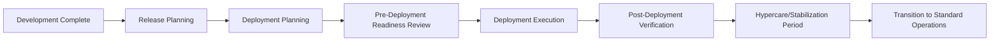
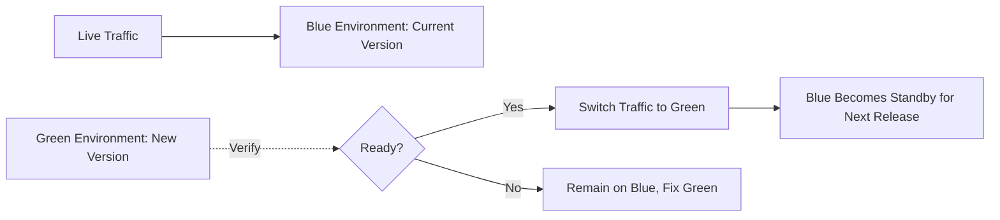

## Release and Deployment Planning

### Definition and Purpose

Release and deployment planning is the discipline of organizing, scheduling, and coordinating how software changes move from a completed, tested state into a live production environment, including all activities required to ensure the transition occurs with minimal disruption, appropriate risk mitigation, and full stakeholder readiness. It bridges the final stages of development and testing with ongoing operations, encompassing not just the technical act of deployment but the broader coordination of communication, training, rollback planning, and go/no-go decision-making.

Release planning refers to the broader scope and timing decisions (what will be included in a release and when), while deployment planning refers to the specific technical and operational execution of getting that release into production.

### Position in the IT Project Lifecycle

### Release Planning vs. Deployment Planning

| Aspect | Release Planning | Deployment Planning |
| --- | --- | --- |
| Primary Question | What features/fixes go into this release, and when? | How do we technically deliver this release into production? |
| Typical Owner | Product Owner / Release Manager | DevOps/Release Engineer, Operations Team |
| Key Artifacts | Release scope document, release roadmap/calendar | Deployment runbook, rollback plan, cutover schedule |
| Time Horizon | Weeks to months (release cadence) | Hours to days (deployment window) |

### Core Components of Release Planning

**Release Scope Definition**

Determining which features, enhancements, and defect fixes are included in a given release, typically based on backlog prioritization, business priority, and dependency readiness.

**Release Cadence and Scheduling**

Establishing the frequency and timing of releases — ranging from infrequent, large releases (common in Waterfall/V-Model contexts) to frequent, small releases (common in Agile/DevOps contexts), and aligning release timing with business constraints (e.g., avoiding releases during peak business periods such as retail holiday seasons).

**Release Versioning Strategy**

Defining a consistent version numbering approach (e.g., semantic versioning: major.minor.patch) to clearly communicate the nature and risk level of each release to stakeholders.

**Dependency Coordination**

Identifying and sequencing dependencies between different components, teams, or systems that must be released together or in a specific order to avoid integration failures.

### Core Components of Deployment Planning

**Deployment Strategy Selection**

Choosing the technical approach for how the new release will be introduced into production (see Deployment Strategies section below).

**Deployment Runbook**

A detailed, step-by-step technical procedure documenting exactly how the deployment will be executed, including specific commands, responsible individuals, expected duration for each step, and verification checkpoints.

**Rollback Plan**

A pre-defined, tested procedure for reverting to the previous stable state if the deployment fails or introduces critical issues, including clear criteria for triggering a rollback decision.

**Deployment Window and Change Freeze**

Scheduling deployments during periods of lower business risk (e.g., off-peak hours) and defining change freeze periods around critical business events during which no non-emergency deployments are permitted.

**Communication Plan**

Coordinating notifications to affected stakeholders, end users, and support teams before, during, and after deployment, including planned maintenance windows if applicable.

**Go/No-Go Decision Process**

A formal checkpoint, typically involving key stakeholders, to confirm all readiness criteria are met immediately before deployment execution begins.

### Common Deployment Strategies

**Big Bang Deployment**

The entire release is deployed to all users simultaneously. Simple to plan but carries the highest risk, since any issue affects the entire user base immediately with no gradual exposure.

**Blue-Green Deployment**

Two identical production environments ("blue" and "green") are maintained; the new release is deployed to the idle environment, verified, and then traffic is switched over, allowing near-instant rollback by switching traffic back to the previous environment.

**Canary Deployment**

The new release is rolled out to a small subset of users or servers first, monitored closely for issues, and progressively expanded to the full user base if no problems are detected, limiting the blast radius of any defects.

**Rolling Deployment**

The new release is deployed incrementally across a set of servers or instances one batch at a time, rather than all at once, allowing the system to remain available throughout the deployment process.

**Feature Flag / Dark Launch Deployment**

New code is deployed to production but kept hidden or disabled behind a feature flag, allowing the deployment itself to be decoupled from the actual release of functionality to users, and allowing gradual, controlled feature activation independent of the deployment schedule.

### Comparison of Deployment Strategies

| Strategy | Risk Level | Rollback Speed | Infrastructure Complexity | Best Suited For |
| --- | --- | --- | --- | --- |
| Big Bang | High | Slow (full redeploy) | Low | Low-risk, simple releases |
| Blue-Green | Low-Moderate | Very Fast (traffic switch) | High (duplicate environments) | High-availability systems requiring instant rollback |
| Canary | Low | Fast (halt rollout) | Moderate-High | Large user bases, gradual risk exposure needed |
| Rolling | Moderate | Moderate | Moderate | Systems requiring continuous availability |
| Feature Flag | Low | Instant (toggle off) | Moderate (flag management overhead) | Frequent releases, controlled feature rollout |

### Step-by-Step Process for Release and Deployment Planning

1. **Define release scope** — confirm which features and fixes are included based on backlog prioritization and dependency readiness.
2. **Establish the release schedule** — align release timing with the organization's release cadence and known business constraints (e.g., blackout periods).
3. **Select the deployment strategy** — choose an approach (big bang, blue-green, canary, rolling, feature flag) appropriate to the release's risk profile and available infrastructure.
4. **Develop the deployment runbook** — document detailed, sequential deployment steps, responsible parties, and expected timing.
5. **Develop and test the rollback plan** — define clear rollback trigger criteria and verify the rollback procedure itself has been tested, not merely documented.
6. **Plan stakeholder and user communication** — schedule notifications for affected users, support teams, and business stakeholders regarding timing and any expected impact.
7. **Conduct a pre-deployment readiness review** — verify testing completion, environment readiness, communication completion, and rollback plan validation.
8. **Execute the go/no-go decision** — formally confirm readiness with key stakeholders immediately before deployment.
9. **Execute the deployment** — follow the runbook, with designated personnel monitoring each step and verification checkpoint.
10. **Conduct post-deployment verification** — confirm the release is functioning correctly in production through smoke testing and monitoring.
11. **Monitor through a hypercare/stabilization period** — maintain heightened support and monitoring attention for a defined period after deployment to quickly catch and address any issues.
12. **Conduct a post-deployment review** — capture lessons learned regarding the release and deployment process itself, feeding into continuous improvement of future release cycles.

### Illustrative Example

**Example**

An e-commerce company plans the deployment of a major checkout flow redesign ahead of a key sales event.

- **Release Planning:** The redesign is scoped for a release two weeks before the sales event (to allow a stabilization buffer), deliberately avoiding a change freeze period the organization enforces during the event itself.
- **Deployment Strategy:** Given the high-traffic, high-risk nature of the checkout flow, the team selects a **canary deployment** combined with **feature flags**, initially exposing the new checkout flow to 5% of users.
- **Deployment Runbook:** Documents the exact sequence: deploy code with the feature flag disabled, verify system health, enable the flag for 5% of traffic, monitor key metrics (conversion rate, error rate, page load time) for 2 hours, then progressively increase to 25%, 50%, and 100% if metrics remain healthy at each stage.
- **Rollback Plan:** Defines that if checkout error rate exceeds a defined threshold at any stage, the feature flag is immediately disabled, instantly reverting all users to the previous checkout flow without requiring a code redeployment.
- **Communication Plan:** Customer support team is briefed in advance on the new checkout flow to handle any user inquiries; no external customer communication is planned since the change is not expected to disrupt normal usage.
- **Go/No-Go Review:** Conducted the morning of deployment, confirming all automated tests passed, the rollback mechanism was tested in staging, and the customer support team confirmed readiness.
- **Outcome:** The canary rollout proceeds through all stages without triggering the rollback threshold, and the redesign reaches 100% of users three days ahead of the sales event, providing a stabilization buffer before peak traffic.

[Inference] The specific figures, thresholds, and outcomes in this example are illustrative constructs for demonstration purposes and are not derived from a documented case study.

### Deployment Readiness Checklist (Sample Structure)

| Readiness Criteria | Status |
| --- | --- |
| All automated tests passing | Confirmed |
| Rollback procedure tested in staging | Confirmed |
| Stakeholder communication sent | Confirmed |
| Deployment window confirmed (no conflicting change freeze) | Confirmed |
| Support team briefed | Confirmed |
| Monitoring/alerting configured for new release | Confirmed |
| Go/No-Go sign-off obtained | Pending |

### Common Frameworks and Standards Referenced

**ITIL 4 Release Management Practice**

Provides a widely referenced framework for release management within IT service management, defining release planning, coordination, and control practices, particularly relevant in enterprise environments with formal change management requirements.

**Semantic Versioning (SemVer)**

A widely adopted versioning convention (major.minor.patch) used to communicate the nature and compatibility impact of a given release.

**DORA Deployment Frequency Metric**

As introduced under DevOps integration, deployment frequency is a key metric for assessing the maturity and effectiveness of an organization's release and deployment practices.

### Common Pitfalls

- Selecting a big bang deployment strategy for high-risk or high-traffic systems without adequate justification, unnecessarily concentrating risk exposure
- Documenting a rollback plan without actually testing it, discovering during a real incident that the rollback procedure itself does not work as documented
- Scheduling deployments without accounting for known business blackout periods or peak usage windows, increasing the business impact of any deployment issues
- Treating the go/no-go review as a formality rather than a genuine decision checkpoint, proceeding with deployment despite unresolved readiness concerns
- Underestimating the importance of the post-deployment hypercare/stabilization period, withdrawing heightened monitoring and support attention too soon after deployment
- Failing to decouple deployment from release (via feature flags) when releasing high-risk features, missing the opportunity to limit exposure through gradual, controlled rollout

[Inference] The relative prevalence of specific deployment strategies (e.g., canary versus blue-green) varies by organizational infrastructure maturity and industry context; the strategies described here reflect widely documented industry practice rather than a claim about which approach is most common across all organizations.

### Relationship to Other IT Project Management Concepts

Release and deployment planning connects directly to:

- **DevOps and Project Management Integration** — deployment strategies such as canary and blue-green deployment are core DevOps practices enabling frequent, low-risk releases
- **Software Development Life Cycle Models** — the chosen SDLC model significantly influences release cadence and planning approach (e.g., infrequent large releases in Waterfall versus frequent small releases in Agile/DevOps)
- **Managing Technical Debt** — poorly planned or rushed deployments can themselves introduce technical debt (e.g., skipped verification steps, undocumented manual workarounds)
- **Risk Management in Software Projects** — deployment strategy selection is fundamentally a risk management decision balancing exposure, rollback speed, and infrastructure complexity

**Related Topics**

- DevOps and Project Management Integration
- Software Development Life Cycle Models
- Change Management and Change Freeze Policies
- ITIL 4 Release Management Practice
- Feature Flag Management
- Post-Deployment Monitoring and Hypercare
- Risk Management in Software Projects
- Semantic Versioning and Release Documentation