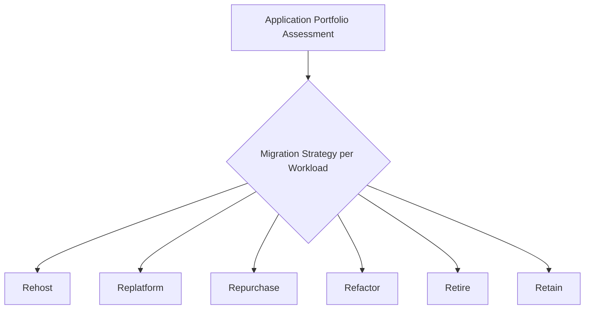

## Managing IT Infrastructure Projects

### Definition and Purpose

IT infrastructure projects involve the planning, design, procurement, implementation, and integration of the foundational hardware, network, storage, computing, and platform resources that support an organization's applications and services. Unlike software development projects, which primarily produce custom application code, infrastructure projects typically involve significant physical or virtual asset procurement, complex vendor coordination, and integration with existing operational environments, introducing a distinct set of planning, risk, and governance considerations.

Common examples include data center migrations, cloud migration initiatives, network upgrades, server virtualization programs, and enterprise storage system implementations.

### Position Within IT Project Management

### Distinguishing Characteristics of Infrastructure Projects

**Physical or Cloud Asset Dependency**

Infrastructure projects often depend on procurement lead times for hardware, data center capacity, or cloud service provisioning, introducing schedule dependencies not typically present in pure software projects.

**High Interdependency with Existing Environment**

Infrastructure changes frequently affect multiple existing applications and services simultaneously, requiring careful impact analysis and coordination across many stakeholder groups that may not be direct project sponsors.

**Elevated Cutover Risk**

Migration and cutover activities (e.g., switching from an old data center to a new one, migrating from on-premises to cloud infrastructure) often involve a discrete, high-risk transition window during which core business operations may be affected.

**Vendor and Contract Complexity**

Infrastructure projects frequently involve multiple vendors (hardware suppliers, cloud providers, network carriers, systems integrators), requiring more extensive contract and vendor management than typical application development projects.

**Compliance and Security Emphasis**

Infrastructure changes often have direct implications for data residency, security posture, and regulatory compliance (e.g., data protection regulations affecting where data can be physically or geographically stored).

### Common Types of IT Infrastructure Projects

**Data Center Migration**

Relocating physical or virtual infrastructure from one data center to another, or from on-premises facilities to a colocation or cloud provider, requiring careful sequencing to minimize service disruption.

**Cloud Migration**

Moving applications, data, and workloads from on-premises infrastructure to public, private, or hybrid cloud environments, often following recognized migration strategy patterns (see below).

**Network Infrastructure Upgrades**

Projects to upgrade or replace core networking equipment, bandwidth capacity, or network architecture (e.g., migrating to a software-defined networking model).

**Server Virtualization and Consolidation**

Converting physical servers into virtual machines to improve resource utilization, reduce hardware footprint, and improve disaster recovery capability.

**Enterprise Storage Implementation**

Deploying new storage area network (SAN), network-attached storage (NAS), or cloud storage solutions to meet evolving capacity, performance, or data protection requirements.

**Disaster Recovery / Business Continuity Infrastructure**

Establishing or upgrading backup data centers, replication infrastructure, and failover capability to meet defined recovery time and recovery point objectives.

### Common Cloud Migration Strategies (The "6 Rs")

A widely referenced framework for categorizing cloud migration approaches for individual applications or workloads within a broader infrastructure migration project:

- **Rehost** ("lift and shift") — moving an application to the cloud with minimal or no modification
- **Replatform** — making minor optimizations during migration without changing the core application architecture
- **Repurchase** — replacing the existing application with a cloud-native SaaS alternative
- **Refactor/Re-architect** — substantially redesigning the application to take full advantage of cloud-native capabilities
- **Retire** — decommissioning applications no longer needed
- **Retain** — keeping certain applications on-premises, often due to compliance, latency, or cost considerations

### Step-by-Step Process for Managing an IT Infrastructure Project

1. **Conduct an infrastructure assessment** — inventory existing assets, dependencies, capacity, and performance baselines to inform the scope and design of the target infrastructure.
2. **Define the target architecture** — develop the solution design, informed by business requirements, security/compliance obligations, and (for cloud initiatives) the appropriate migration strategy per workload.
3. **Develop the procurement plan** — identify required hardware, licensing, cloud services, or vendor contracts, and account for procurement lead times in the project schedule.
4. **Conduct dependency and impact analysis** — map which existing applications, services, and business processes will be affected by the infrastructure change, and identify indirect stakeholders beyond the immediate project sponsor.
5. **Build and configure the target environment** — implement the new infrastructure in a non-production or parallel environment where feasible, to allow testing before cutover.
6. **Test and validate** — conduct performance, security, failover, and integration testing against defined acceptance criteria before proceeding to migration.
7. **Plan the migration/cutover approach** — determine whether migration will occur via a single cutover event, a phased/wave-based approach, or a parallel-running transition period, based on risk tolerance and business continuity requirements.
8. **Develop a detailed cutover plan and rollback plan** — document the exact sequence of migration activities, responsible parties, timing, and criteria for triggering a rollback if issues arise during cutover.
9. **Execute migration in coordination with a change freeze or maintenance window** — align cutover timing with business constraints and formal change management processes.
10. **Conduct post-migration validation and stabilization** — verify system functionality and performance in the new environment, maintaining heightened support during an initial stabilization period.
11. **Decommission legacy infrastructure** — retire the previous environment only after confirming successful, stable operation of the new infrastructure, avoiding premature decommissioning that eliminates rollback options.

### Illustrative Example

**Example**

A mid-sized organization undertakes a project to migrate its on-premises data center to a cloud provider.

- **Assessment:** An application portfolio assessment identifies 40 applications; using the 6 Rs framework, 25 are categorized for rehost, 8 for replatform, 4 for repurchase (replacing with SaaS alternatives), 2 for retirement, and 1 for retention on-premises due to a data residency regulatory requirement.
- **Procurement:** Cloud service contracts are negotiated with defined service level agreements; a 12-week lead time is built into the schedule for a specialized network circuit required to establish a secure hybrid connection between the retained on-premises system and the cloud environment.
- **Dependency Analysis:** Mapping reveals that one rehosted application has an undocumented direct network dependency on the retained on-premises system, requiring additional network configuration not originally scoped.
- **Migration Approach:** A phased, wave-based migration is selected, grouping applications into five migration waves based on interdependency and business criticality, rather than attempting a single cutover of all 40 applications simultaneously.
- **Cutover Planning:** Each wave includes a detailed cutover runbook, a defined rollback trigger (e.g., critical application unavailability exceeding a defined threshold), and a post-migration validation checklist.
- **Outcome:** The first two waves (lower-risk, less interdependent applications) migrate successfully within planned windows; the third wave, containing the application with the undocumented dependency, requires a one-week schedule delay to address the newly discovered network configuration requirement before proceeding.

[Inference] The specific figures, application counts, and outcomes in this example are illustrative constructs for demonstration purposes and are not derived from a documented case study.

### Infrastructure Migration Wave Plan (Sample Structure)

| Wave | Applications | Migration Strategy | Risk Level | Planned Window |
| --- | --- | --- | --- | --- |
| Wave 1 | 8 low-criticality apps | Rehost | Low | Week 1–2 |
| Wave 2 | 10 medium-criticality apps | Rehost/Replatform | Medium | Week 3–4 |
| Wave 3 | 12 apps incl. interdependent systems | Rehost/Replatform | High | Week 5–7 (delayed) |
| Wave 4 | 6 apps | Repurchase (SaaS) | Medium | Week 8 |
| Wave 5 | 4 apps | Refactor | High | Week 9–12 |

### Common Frameworks and Standards Referenced

**ITIL 4 (Transition and Deployment Practices)**

Provides widely referenced guidance on managing infrastructure and service transitions, including release management, change enablement, and service validation practices relevant to infrastructure cutover planning.

**TOGAF (The Open Group Architecture Framework)**

An enterprise architecture framework often referenced when infrastructure projects must align with broader organizational architecture standards and target-state technology roadmaps.

**Cloud Provider Well-Architected Frameworks**

Major cloud providers publish their own architectural best-practice frameworks (covering reliability, security, cost optimization, and performance) commonly referenced during cloud migration solution design. [Unverified] Specific framework names, pillar structures, and content differ by provider and are updated periodically; readers should consult the relevant cloud provider's current documentation directly rather than relying on a fixed historical description.

**ISO/IEC 27001 (Information Security Management)**

Frequently referenced during infrastructure projects with significant security or compliance implications, particularly for data center and cloud migration initiatives.

### Common Pitfalls

- Underestimating procurement and vendor lead times, particularly for specialized hardware, network circuits, or data center capacity, resulting in schedule delays not accounted for in the original project plan
- Conducting an incomplete dependency analysis, leading to undocumented application dependencies being discovered only during migration execution
- Attempting a single, large-scale cutover for a complex, highly interdependent environment rather than a phased, risk-managed wave approach
- Decommissioning legacy infrastructure prematurely, before the new environment has been fully validated and stabilized, eliminating the ability to roll back if issues emerge
- Insufficient engagement of indirect stakeholders (application owners not directly sponsoring the infrastructure project) who are nonetheless significantly affected by the change
- Neglecting compliance and data residency requirements during cloud migration planning, resulting in regulatory non-compliance discovered late in the project

[Inference] The relative prevalence of specific migration strategies (e.g., rehost versus refactor) within a given organization's cloud migration portfolio is highly context-dependent, varying with application age, criticality, and available modernization budget; the proportions described in the illustrative example are constructed for demonstration and do not represent a typical or average distribution across organizations generally.

### Relationship to Other IT Project Management Concepts

Managing IT infrastructure projects connects directly to:

- **Release and Deployment Planning** — infrastructure cutover planning shares many practices with application release/deployment planning, including runbooks, rollback plans, and go/no-go decision processes
- **DevOps and Project Management Integration** — Infrastructure as Code practices increasingly blur the line between traditional infrastructure projects and DevOps-managed, version-controlled infrastructure changes
- **Risk Management in Software Projects** — infrastructure projects require risk management practices extended to cover vendor, procurement, and cutover-specific risk categories
- **Environmental Impact Assessment / Sustainability** — data center and cloud infrastructure decisions increasingly carry energy consumption and environmental impact considerations relevant to organizational sustainability objectives

**Related Topics**

- Release and Deployment Planning
- DevOps and Project Management Integration
- Cloud Migration Strategy (6 Rs Framework)
- Vendor and Contract Management
- ITIL 4 Transition and Deployment Practices
- Enterprise Architecture (TOGAF)
- Disaster Recovery and Business Continuity Planning
- Information Security Management (ISO/IEC 27001)