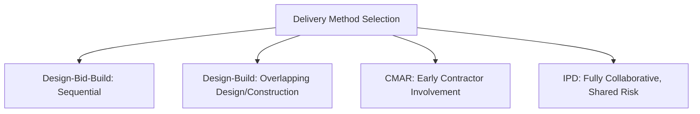

## Construction Project Life Cycle

### Definition and Purpose

The construction project life cycle describes the sequential phases a construction project passes through from initial concept to final handover and occupancy. Unlike software or IT projects, construction projects are characterized by physical, irreversible-once-built deliverables, heavy regulatory and permitting involvement, extensive multi-party contractual relationships, and significant safety and site-management considerations. Understanding this life cycle provides the structural framework for scheduling, cost control, risk management, and stakeholder coordination throughout a construction project.

### Overview of the Construction Project Life Cycle

### Phase 1: Initiation and Feasibility

**Purpose:** Determine whether the proposed construction project is viable, aligned with organizational objectives, and worth proceeding to detailed planning.

**Key Activities:**

- Site selection and site feasibility analysis (including geotechnical and environmental site assessments)
- Preliminary cost estimation and budget feasibility
- Regulatory feasibility review (zoning, land use restrictions)
- Development of the initial business case and project charter
- High-level risk identification

**Key Deliverables:** Feasibility study report, preliminary business case, site selection decision, project charter

### Phase 2: Planning and Design

**Purpose:** Develop the detailed technical design and comprehensive project plan that will govern construction execution.

**Key Activities:**

- Schematic design, design development, and construction documents (progressively detailed design stages)
- Structural, mechanical, electrical, and plumbing (MEP) engineering design
- Environmental Impact Assessment and other regulatory approval processes
- Detailed cost estimating and budget finalization
- Development of the master project schedule
- Building permit and regulatory approval applications

**Key Deliverables:** Approved architectural and engineering drawings, detailed specifications, approved budget, master schedule, building permits

### Phase 3: Pre-Construction and Procurement

**Purpose:** Establish the contractual, resource, and logistical foundation required before physical construction begins.

**Key Activities:**

- Contractor and subcontractor bidding and selection
- Contract negotiation and execution (e.g., lump-sum, cost-plus, or design-build contract structures)
- Material and equipment procurement planning, accounting for supplier lead times
- Site mobilization planning (temporary facilities, site access, utility connections)
- Finalization of the detailed construction schedule and logistics plan

**Key Deliverables:** Executed construction contracts, procurement schedule, site mobilization plan, finalized construction schedule

### Phase 4: Construction and Execution

**Purpose:** Physically build the project according to approved designs, specifications, schedule, and budget.

**Key Activities:**

- Site mobilization and groundbreaking
- Sequential construction activities (foundation, structure, envelope, MEP systems, interior finishes) following the critical path schedule
- Ongoing quality control and inspection
- Health and safety management on site
- Change order management for scope changes discovered or requested during construction
- Progress monitoring, cost tracking, and regular stakeholder reporting

**Key Deliverables:** Physically completed structure, inspection and quality records, updated as-built documentation, progress reports

### Phase 5: Commissioning and Testing

**Purpose:** Verify that all building systems function correctly and meet design specifications before occupancy.

**Key Activities:**

- Systems testing (HVAC, electrical, fire/life safety, plumbing, elevators)
- Performance verification against design specifications
- Regulatory inspections and certificate of occupancy application
- Punch list development and resolution (identifying and correcting outstanding defects or incomplete items)

**Key Deliverables:** Commissioning reports, certificate of occupancy, resolved punch list, systems documentation and operating manuals

### Phase 6: Handover and Closeout

**Purpose:** Formally transfer the completed facility to the owner/operator and close out all contractual and financial obligations.

**Key Activities:**

- Final walkthrough and formal acceptance by the owner
- Delivery of as-built drawings, warranties, and operations/maintenance manuals
- Final financial reconciliation and contract closeout (final payments, retention release)
- Training of owner's operational staff on building systems
- Lessons learned documentation

**Key Deliverables:** Signed handover/acceptance certificate, complete as-built documentation package, final account settlement, closed contracts

### Phase 7: Post-Occupancy and Warranty Period

**Purpose:** Address any defects or issues arising after occupancy and confirm long-term facility performance.

**Key Activities:**

- Defect rectification during the contractual warranty/defects liability period
- Post-occupancy evaluation of building performance against design intent
- Final release of any retained contract funds after warranty period expiration

**Key Deliverables:** Defect rectification records, post-occupancy evaluation report, final retention release

### Comparison of Construction Life Cycle to General Project Management Phases

| General PM Phase | Construction Life Cycle Equivalent |
| --- | --- |
| Initiation | Initiation and Feasibility |
| Planning | Planning and Design |
| — | Pre-Construction and Procurement (construction-specific) |
| Execution | Construction and Execution |
| Monitoring and Controlling | Ongoing throughout Execution and Commissioning |
| Closing | Handover and Closeout |
| — | Post-Occupancy/Warranty (construction-specific, extends beyond formal project closure) |

### Common Project Delivery Methods Affecting the Life Cycle Structure

**Design-Bid-Build (DBB)**

The traditional sequential approach: design is fully completed before construction contractors are engaged through competitive bidding. Design and construction phases are distinctly separated.

**Design-Build (DB)**

A single entity is contracted for both design and construction, allowing design and early construction activities to overlap, often compressing the overall project schedule compared to DBB.

**Construction Manager at Risk (CMAR)**

A construction manager is engaged early during the design phase to provide cost estimating and constructability input, then assumes the role of general contractor during construction, taking on risk for delivering within a guaranteed maximum price.

**Integrated Project Delivery (IPD)**

Owner, designer, and contractor enter into a single multi-party agreement with shared risk and reward, promoting early collaboration across all parties from the earliest design stages.

The chosen delivery method significantly affects how distinctly separated the Planning/Design and Pre-Construction/Procurement phases are — DBB keeps them strictly sequential, while Design-Build, CMAR, and IPD progressively increase overlap and collaboration between design and construction activities.

### Step-by-Step Process for Managing a Project Through the Construction Life Cycle

1. **Confirm feasibility** — validate site, budget, and regulatory feasibility before committing to detailed design investment.
2. **Select the appropriate delivery method** — choose DBB, Design-Build, CMAR, or IPD based on project complexity, risk tolerance, schedule urgency, and owner's desired level of design control.
3. **Manage the design process** — coordinate architects and engineers through progressive design stages, incorporating constructability review where the delivery method allows early contractor input.
4. **Secure regulatory approvals** — manage the permitting timeline as a critical path item, since delays in permit approval directly affect the overall schedule.
5. **Execute procurement and contracting** — competitively bid or negotiate contracts, ensuring contract terms align with the project's risk allocation strategy.
6. **Mobilize and execute construction** — manage the sequential (or fast-tracked, overlapping) construction activities against the critical path schedule, with active quality, safety, and cost control.
7. **Manage change orders rigorously** — apply formal change control processes to scope changes discovered during construction, since uncontrolled change orders are a leading cause of construction cost and schedule overruns.
8. **Commission and verify systems** — conduct thorough systems testing before proceeding to occupancy, resolving punch list items promptly.
9. **Execute formal handover** — ensure complete documentation transfer and formal acceptance, avoiding informal or partial handover that creates ambiguity about contractual completion.
10. **Manage the warranty period** — track and resolve defects arising during the contractual warranty period before final retention release.

### Illustrative Example

**Example**

A developer undertakes construction of a mid-rise commercial office building.

- **Initiation/Feasibility:** Site feasibility study confirms zoning compatibility and acceptable soil conditions; preliminary budget of $40 million approved based on a feasibility-level cost estimate.
- **Planning/Design:** Design-Build delivery method is selected to compress schedule; the design-build contractor is engaged early, allowing structural design to proceed in parallel with finalization of interior finish specifications.
- **Pre-Construction:** Key long-lead-time equipment (custom curtain wall panels, elevators) is ordered during this phase based on a preliminary design package, before final construction documents are fully complete, to avoid schedule delay from procurement lead time.
- **Construction:** Structural steel erection proceeds while MEP rough-in design for upper floors is still being finalized, characteristic of the overlapping nature of Design-Build delivery; a change order arises when a subsurface utility conflict is discovered during foundation excavation, requiring a two-week schedule adjustment and formal change order approval.
- **Commissioning:** HVAC and fire/life safety systems testing identifies a control system calibration issue, added to the punch list and resolved within one week.
- **Handover:** Certificate of occupancy obtained; formal handover includes delivery of as-built drawings, systems warranties, and a one-day operations training session for the building's facilities management staff.
- **Post-Occupancy:** During the 12-month warranty period, a minor roof membrane leak is identified and rectified by the contractor under warranty terms before final retention funds are released.

[Inference] The specific figures, scenario details, and outcomes in this example are illustrative constructs for demonstration purposes and are not derived from a documented case study.

### Construction Life Cycle Milestone Schedule (Sample Structure)

| Phase | Key Milestone | Typical Duration Driver |
| --- | --- | --- |
| Initiation/Feasibility | Feasibility study approved | Site complexity, regulatory research |
| Planning/Design | Construction documents approved, permits issued | Design complexity, permitting timelines |
| Pre-Construction | Contracts executed, long-lead procurement initiated | Bidding process, supplier lead times |
| Construction | Substantial completion achieved | Building size/complexity, weather, labor availability |
| Commissioning | Certificate of occupancy obtained | Systems complexity, inspection scheduling |
| Handover/Closeout | Final acceptance and contract closeout | Documentation completeness, punch list resolution |
| Post-Occupancy | Warranty period expiration | Contractual warranty term (commonly 12 months, varies by contract) |

### Common Frameworks and Standards Referenced

**AIA (American Institute of Architects) Contract Documents**

Widely used standard contract forms in the United States defining roles, responsibilities, and phase structures for design and construction services across different delivery methods.

**FIDIC (International Federation of Consulting Engineers) Contract Forms**

Internationally recognized standard construction contract forms, particularly prevalent in international and infrastructure construction projects.

**PMI Construction Extension to the PMBOK Guide**

Provides construction-specific guidance extending general project management practice standards to address the unique characteristics of construction project delivery.

**RIBA Plan of Work**

A widely referenced framework (particularly in the UK and internationally) defining stages of the building design and construction process, from strategic definition through to use and in-use evaluation.

[Unverified] Specific stage names, numbering, and current terminology in frameworks such as the RIBA Plan of Work are periodically revised by their issuing organizations; readers should consult the current published version directly rather than relying on a fixed historical description.

### Common Pitfalls

- Insufficient feasibility-stage due diligence (e.g., inadequate geotechnical investigation), leading to costly design changes or construction delays when unforeseen site conditions are discovered later
- Underestimating permitting and regulatory approval timelines, causing critical path delays not accounted for in the original schedule
- Poor change order management during construction, allowing scope creep and cost overruns to accumulate without adequate control or owner visibility
- Rushing or abbreviating the commissioning phase to meet a schedule deadline, resulting in systems issues discovered only after occupancy
- Incomplete documentation handover at project closeout, leaving the owner's facilities management team without adequate as-built information or operating manuals
- Treating the warranty period as the contractor's sole responsibility without active owner-side tracking, resulting in unresolved defects going unaddressed before contractual warranty expiration

[Inference] The specific phase durations, terminology, and contractual warranty periods vary substantially by jurisdiction, project type, and contract form; the structure described here reflects commonly recognized international good practice rather than a single universally standardized life cycle applicable to every construction contract or jurisdiction.

### Relationship to Other Concepts in This Chapter

The construction project life cycle provides the structural foundation for other construction and engineering project management topics, including:

- **Construction Contract Types and Delivery Methods** — directly shapes how the Planning/Design and Pre-Construction phases relate to one another
- **Construction Risk Management** — different life cycle phases carry distinct risk profiles requiring phase-specific risk management approaches
- **Construction Quality Management and Commissioning** — the Commissioning phase formalizes quality verification before handover
- **Construction Health and Safety Management** — safety management requirements evolve significantly across the life cycle, from design-stage safety-in-design considerations through active construction-phase site safety management

**Related Topics**

- Construction Contract Types and Delivery Methods
- Construction Risk Management
- Construction Quality Management and Commissioning
- Construction Health and Safety Management
- Change Order Management
- Construction Scheduling and Critical Path Method
- FIDIC and AIA Contract Standards
- Post-Occupancy Evaluation