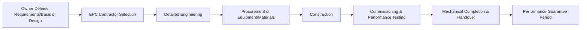
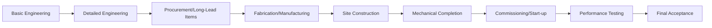

## Engineering Procurement and Construction Models

### Definition and Purpose

Engineering, Procurement, and Construction (EPC) is a project delivery model in which a single contractor (or consortium) is contracted to be responsible for the detailed engineering design, procurement of all necessary materials and equipment, and construction of the complete facility, typically delivering the finished asset to the owner on a turnkey basis for a fixed or guaranteed price. EPC models are especially prevalent in large-scale industrial, energy, oil and gas, power generation, and infrastructure projects where the owner seeks to transfer significant execution risk to a single accountable contractor.

The term "EPC" is often used interchangeably with "turnkey" delivery, reflecting the model's core characteristic: the owner receives a complete, ready-to-operate facility from a single point of contractual responsibility.

### Position Within Construction Delivery Models

### Core Characteristics of the EPC Model

**Single Point of Contractual Responsibility**

The EPC contractor holds sole responsibility for engineering, procurement, and construction, significantly simplifying the owner's contract management compared to models involving multiple separate design and construction contracts.

**Fixed-Price or Lump-Sum Turnkey (LSTK) Contracting**

EPC contracts are frequently structured as fixed-price or lump-sum arrangements, transferring cost overrun risk from the owner to the contractor, in exchange for the contractor typically pricing in a risk premium to account for that transferred risk.

**Performance Guarantees**

EPC contracts typically include specific, measurable performance guarantees (e.g., plant output capacity, efficiency ratings, emissions levels) that the completed facility must meet, often verified through formal performance testing before final acceptance.

**Minimal Owner Design Involvement**

Once the owner's basis of design and requirements are established, detailed engineering decisions are largely delegated to the EPC contractor, in contrast to Design-Bid-Build models where the owner (via its architect/engineer) retains detailed design control throughout.

### EPC vs. Other Delivery Models

| Aspect | EPC/Turnkey | Design-Bid-Build | Design-Build | CMAR |
| --- | --- | --- | --- | --- |
| Contractual Parties | Single EPC contractor | Separate designer and contractor | Single design-build entity | CM + separate design consultant |
| Owner Design Control | Low (basis of design only) | High (full design control) | Moderate | Moderate-High |
| Price Certainty | High (fixed-price/LSTK common) | Low until bids received | Moderate-High | Moderate (GMP-based) |
| Risk Transfer to Contractor | High | Low | Moderate-High | Moderate |
| Typical Application | Large industrial/energy/infrastructure | Traditional building construction | Commercial/institutional buildings | Complex buildings needing early input |

### Core Phases of an EPC Project

**Engineering**

Encompasses conceptual/basic engineering (translating the owner's requirements into a technical design basis) and detailed engineering (producing complete technical drawings, specifications, and equipment lists sufficient for procurement and construction).

**Procurement**

Involves sourcing, purchasing, expediting, and logistics management for all equipment, bulk materials, and subcontracted work packages required for construction, often representing the largest cost component and a significant schedule risk area due to long-lead equipment items.

**Construction**

Encompasses site mobilization, civil works, mechanical/electrical/piping installation, and all physical construction activities, typically managed directly by the EPC contractor with extensive subcontractor coordination.

**Commissioning and Performance Testing**

Verifies that the completed facility meets contractual performance guarantees through formal, often extended, performance testing periods before final acceptance — a distinguishing feature of EPC projects compared to typical building construction commissioning.

### EPC Contract Risk Allocation Considerations

**Fixed-Price Risk Premium**

Because the EPC contractor assumes significant cost and schedule risk under a fixed-price structure, contract pricing typically includes contingency and risk premiums, which owners must weigh against the value of the price certainty and risk transfer received.

**Change Order and Variation Management**

Even in fixed-price EPC contracts, changes to the owner's original scope or requirements after contract execution ("variations") require formal change order processes, and are a common source of cost and schedule disputes if not rigorously managed.

**Force Majeure Provisions**

EPC contracts typically include detailed force majeure clauses addressing extraordinary events (e.g., natural disasters, regulatory changes) that may excuse contractor performance obligations or adjust schedule/cost baselines.

**Liquidated Damages**

Many EPC contracts specify liquidated damages payable by the contractor for late completion or failure to meet performance guarantees, providing a defined financial remedy without requiring the owner to prove actual damages in court.

**Owner-Furnished Items and Interfaces**

Where the owner retains responsibility for supplying certain equipment or interfacing with adjacent facilities outside the EPC scope, these interfaces must be clearly defined in the contract to avoid responsibility gaps.

### Variants of the EPC Model

**EPCM (Engineering, Procurement, and Construction Management)**

The EPC contractor (acting as EPCM contractor) manages engineering, procurement, and construction execution, but does not hold direct contracts with construction subcontractors or bear the same fixed-price risk — the owner typically holds those contracts directly, retaining more risk but also more control than a fully turnkey EPC arrangement.

**EPCC (Engineering, Procurement, Construction, and Commissioning)**

An extension of EPC explicitly incorporating commissioning within the contractor's scope of responsibility, often used to emphasize that performance verification, not just physical construction completion, is included in the contractor's obligations.

**BOOT/BOT (Build-Own-Operate-Transfer / Build-Operate-Transfer)**

Extends beyond EPC to include the contractor (often as part of a consortium) financing, owning, and operating the facility for a defined concession period before transferring ownership to the owner/government, commonly used in infrastructure projects such as toll roads or power plants under public-private partnership arrangements.

### Comparison of EPC Variants

| Model | Contractor Holds Subcontracts | Fixed-Price Risk | Includes Operation | Typical Use |
| --- | --- | --- | --- | --- |
| EPC/Turnkey | Yes | High | No | Industrial, power, oil & gas facilities |
| EPCM | No (owner holds subcontracts) | Low (fee-based) | No | Owners wanting more direct control/risk retention |
| EPCC | Yes | High | No (commissioning only) | Emphasizing performance verification scope |
| BOOT/BOT | Yes | High | Yes (during concession period) | Public-private infrastructure partnerships |

### Step-by-Step Process for Managing an EPC Project (Owner's Perspective)

1. **Develop the basis of design and owner's requirements** — define performance specifications, capacity requirements, and key design parameters sufficient to support competitive EPC bidding without over-specifying detailed design.
2. **Select the appropriate EPC variant** — determine whether full turnkey EPC, EPCM, or another variant best matches the owner's desired risk allocation and level of retained control.
3. **Conduct EPC contractor selection** — evaluate bidders on technical capability, relevant experience, financial strength, and proposed price/schedule, given the significant risk transfer and reliance placed on a single contractor.
4. **Negotiate and finalize the EPC contract** — carefully define performance guarantees, liquidated damages provisions, change order procedures, and owner-furnished item interfaces.
5. **Monitor engineering and procurement progress** — track progress on detailed engineering deliverables and, critically, long-lead equipment procurement status, since procurement delays are a common source of EPC schedule slippage.
6. **Oversee construction execution** — maintain appropriate owner oversight (often through an owner's engineer or representative) despite the EPC contractor's primary execution responsibility, to protect owner interests without undermining the contractor's accountability.
7. **Manage variations formally** — ensure any changes to the original scope are processed through the contractually defined change order mechanism, with clear documentation of cost and schedule impact.
8. **Coordinate commissioning and performance testing** — actively participate in performance test planning and verification, since these results determine final acceptance and release of retained contract funds.
9. **Manage the performance guarantee period** — track facility performance during any post-acceptance guarantee period, addressing any shortfalls per contractual remedy provisions.

### Illustrative Example

**Example**

An energy company contracts an EPC consortium to design, procure, and construct a new gas-fired power generation facility.

- **Basis of Design:** The owner specifies required generating capacity, fuel type, emissions compliance requirements, and grid interconnection specifications, leaving detailed engineering design to the EPC contractor.
- **Contract Structure:** A lump-sum turnkey contract is executed, with a guaranteed maximum completion date, specified performance guarantees for generating capacity and heat rate efficiency, and liquidated damages for late completion.
- **Engineering/Procurement:** Detailed engineering proceeds over 9 months; a critical long-lead item (a large gas turbine) is ordered early in the procurement phase due to a 14-month manufacturing lead time, becoming a key schedule-driving item tracked closely by the owner's project team.
- **Construction:** Civil and structural works proceed while the turbine is still in fabrication, with construction sequencing carefully coordinated to have the turbine foundation ready upon equipment delivery.
- **Variation:** Midway through construction, the owner requests an additional emissions control system beyond the original scope due to an updated regulatory requirement, triggering a formal variation order with associated cost and schedule adjustment.
- **Commissioning/Performance Testing:** A 30-day performance test period verifies the facility meets the guaranteed generating capacity and heat rate; a minor shortfall in heat rate efficiency triggers a liquidated damages provision specific to performance shortfall, distinct from the completion-date liquidated damages provision.
- **Outcome:** The facility achieves mechanical completion on schedule (accounting for the approved variation's schedule adjustment) and passes performance testing with a minor efficiency shortfall resolved through the contractually defined performance liquidated damages remedy rather than requiring facility rework.

[Inference] The specific figures, scenario details, and outcomes in this example are illustrative constructs for demonstration purposes and are not derived from a documented case study.

### EPC Project Milestone Tracking (Sample Structure)

| Milestone | Planned Date | Status | Notes |
| --- | --- | --- | --- |
| Basic Engineering Complete | Month 3 | Complete | On schedule |
| Long-Lead Equipment Ordered | Month 4 | Complete | Turbine order placed |
| Mechanical Completion | Month 22 | Complete (revised) | Adjusted for approved variation |
| Performance Testing | Month 23 | Complete | Minor heat rate shortfall identified |
| Final Acceptance | Month 24 | Complete | LDs applied per contract terms |

### Common Frameworks and Standards Referenced

**FIDIC Silver Book (Conditions of Contract for EPC/Turnkey Projects)**

The internationally recognized standard contract form specifically developed for EPC/turnkey projects, defining standard risk allocation, performance guarantee, and variation management provisions widely referenced in international EPC contracting.

**FIDIC Yellow Book (Plant and Design-Build)**

A related FIDIC standard form used for design-build type arrangements with somewhat different risk allocation than the Silver Book's full turnkey risk transfer.

**PMI Construction Extension to the PMBOK Guide**

Provides broader construction project management guidance applicable to EPC project planning and execution, complementing EPC-specific contract standards.

### Common Pitfalls

- Over-specifying detailed design requirements in the owner's basis of design, undermining the fundamental EPC principle of transferring detailed engineering responsibility and associated risk to the contractor
- Underestimating the schedule risk posed by long-lead equipment procurement, failing to track and expedite critical procurement items with the same rigor applied to construction activities
- Poor definition of owner-furnished item interfaces, creating responsibility gaps that surface as disputes during construction or commissioning
- Inadequate owner-side technical oversight capability, leaving the owner unable to effectively monitor contractor progress and quality despite the EPC contractor's primary execution responsibility
- Failing to rigorously manage variations through formal change order processes, allowing informal scope changes to erode the fixed-price contract's cost certainty benefit
- Underestimating the complexity and duration of performance testing requirements, particularly for facilities with stringent regulatory or technical performance guarantees

[Inference] The specific risk premiums, contingency levels, and prevalence of particular EPC contract variants (e.g., full turnkey EPC versus EPCM) vary considerably by industry sector, project scale, and market conditions; the comparative characterizations here reflect commonly documented industry practice rather than precise, universally applicable figures.

### Relationship to Other Concepts in This Chapter

Engineering, Procurement, and Construction models connect directly to:

- **Construction Project Life Cycle** — EPC represents a specific delivery method variant that significantly compresses and integrates the Planning/Design and Pre-Construction/Procurement phases described in the general construction life cycle
- **Construction Contract Types and Delivery Methods** — EPC/turnkey sits at one end of the risk-transfer spectrum among delivery methods, contrasted with Design-Bid-Build, Design-Build, and CMAR
- **Construction Risk Management** — EPC's fixed-price, single-point-of-responsibility structure fundamentally reallocates risk compared to other delivery models, requiring risk management approaches tailored to this allocation
- **Construction Quality Management and Commissioning** — EPC's formal performance guarantee and testing requirements represent an elevated, more rigorous commissioning standard than typical building construction

**Related Topics**

- Construction Project Life Cycle
- Construction Contract Types and Delivery Methods
- FIDIC Contract Standards (Silver Book, Yellow Book)
- Construction Risk Management
- Change Order and Variation Management
- Performance Guarantees and Liquidated Damages
- Build-Own-Operate-Transfer (BOOT) Models
- Construction Quality Management and Commissioning