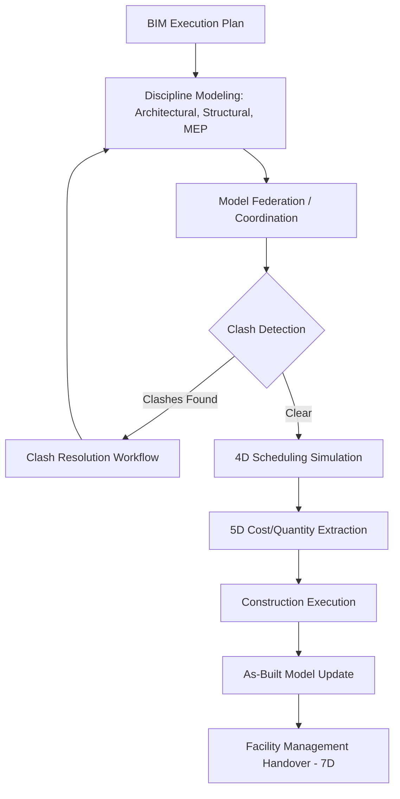

## Building Information Modeling (BIM)

### Overview

Building Information Modeling (BIM) is a process for creating and managing digital representations of the physical and functional characteristics of a facility, spanning its entire lifecycle from conceptual design through construction, operation, and eventual decommissioning. Rather than being a single software product, BIM is a collaborative methodology built on structured, object-based 3D models enriched with data — geometry, materials, cost, schedule, and performance attributes — that multiple disciplines can query, coordinate, and update throughout a project.

### Core Concepts

**BIM vs. CAD**

Traditional Computer-Aided Design (CAD) produces geometric drawings — lines and shapes representing a design without embedded meaning. BIM instead models intelligent objects (a wall is a "wall" object with thickness, fire rating, and cost data, not just four lines), enabling automated quantity takeoffs, clash detection, and data-driven analysis that flat CAD drawings cannot support natively.

**Levels of Development (LOD)**

LOD specifications, standardized by organizations such as the BIMForum, define how much geometric and non-geometric detail a model element contains at a given project stage:

- **LOD 100** — Conceptual massing, no precise geometry
- **LOD 200** — Approximate quantities, size, shape, location, orientation
- **LOD 300** — Precise geometry suitable for coordination, accurate quantity takeoff
- **LOD 350** — Adds interface/connection detail with other building systems
- **LOD 400** — Fabrication-level detail, suitable for construction/assembly
- **LOD 500** — As-built, field-verified representation for facility operation

[Inference] LOD numbering and exact definitions can vary slightly between regional standards (e.g., UK PAS 1192/ISO 19650 uses a different "Level of Information Need" framing than the US BIMForum LOD spec), so project teams should confirm which standard governs their BIM Execution Plan.

**Dimensions of BIM**

| Dimension | Adds |
| --- | --- |
| 3D | Geometric model |
| 4D | Construction schedule linked to model elements |
| 5D | Cost estimation tied to model quantities |
| 6D | Sustainability/energy performance analysis |
| 7D | Facility management and asset lifecycle data |

### BIM Maturity Levels (UK Framework)

Widely referenced internationally as a maturity ramp for BIM adoption:

- **Level 0** — Unmanaged CAD, paper-based or 2D electronic exchange
- **Level 1** — Managed CAD in 2D/3D with a common data environment for basic collaboration, but no shared model
- **Level 2** — Collaborative working via separate discipline-specific 3D models federated together, with defined file formats and processes (aligned with ISO 19650)
- **Level 3** — A single, shared, integrated model accessible by all disciplines in real time (often referred to as "Open BIM" or full integration)

### BIM Workflow Across Project Lifecycle

**BIM Execution Plan (BEP)**

A foundational document, typically developed at project outset, defining modeling responsibilities by discipline, file-naming and folder conventions, LOD targets by project phase, software platforms, and the coordination/clash-resolution process. The BEP is the governance backbone that keeps federated models interoperable across firms using different authoring tools.

**Discipline Modeling and Federation**

Each discipline (architectural, structural, mechanical/electrical/plumbing) typically builds its model independently in native authoring software, then these discrete models are aggregated ("federated") into a combined model for coordination review — rather than all disciplines editing a single monolithic file simultaneously.

**Clash Detection**

Automated software analysis identifies spatial conflicts between elements from different disciplines (e.g., a structural beam intersecting a ductwork run) before construction begins, categorized typically as hard clashes (physical overlap), soft/clearance clashes (insufficient maintenance or access space), and workflow/4D clashes (sequencing conflicts in time).

### Key Standards and Interoperability

**Industry Foundation Classes (IFC)**

An open, vendor-neutral data schema (maintained by buildingSMART International) enabling model exchange between different BIM authoring platforms without proprietary lock-in — foundational to "Open BIM" workflows where architectural, structural, and MEP tools from different vendors must interoperate.

**BIM Collaboration Format (BCF)**

An open format for exchanging issue/clash information (screenshots, comments, viewpoints) between different BIM tools, separate from the geometry itself, allowing coordination workflows to remain tool-agnostic.

**ISO 19650**

The international standard series for managing information over the lifecycle of a built asset using BIM, defining roles (e.g., the "Information Manager"), the Common Data Environment (CDE) concept, and information delivery milestones across a project.

**Common Data Environment (CDE)**

A single, agreed-upon source of information for a project, organized into defined states/containers (commonly Work in Progress, Shared, Published, and Archive under ISO 19650) governing who can access which version of a model at what approval stage.

### Common Software Ecosystem

[Unverified] Specific vendor tools and their capabilities evolve continuously; the following reflects commonly referenced categories rather than an exhaustive or current feature comparison, and should be verified against current vendor documentation for procurement decisions.

- **Authoring tools**: Revit, ArchiCAD, Tekla Structures (used per-discipline to build native models)
- **Coordination/clash detection**: Navisworks, Solibri, BIM Collaborate
- **Open-source/interoperability**: IFC.js, BlenderBIM add-on for open IFC-based workflows
- **4D/5D tools**: Synchro, Vico Office, integrations linking model quantities to scheduling and cost software
- **Facility management**: CAFM/IWMS platforms consuming the as-built 7D model handover

### Roles in a BIM-Enabled Project

| Role | Responsibility |
| --- | --- |
| BIM Manager/Coordinator | Oversees BEP compliance, manages the CDE, facilitates coordination meetings |
| Discipline Model Author | Builds and maintains the discipline-specific model (architectural, structural, MEP) |
| Information Manager (ISO 19650) | Owns information management processes across the project lifecycle |
| Clash Detection Coordinator | Runs federation checks, logs and tracks clash resolution |
| Facility Manager (post-handover) | Consumes the 7D as-built model for operations and maintenance |

### Practical Example

**Example**

On a hospital expansion project, the structural engineer's model places a beam at the same elevation as a mechanical duct run modeled by the MEP consultant. During the weekly federated model review in Navisworks, an automated clash detection pass flags this as a hard clash. The BIM Coordinator logs the issue via a BCF file shared with both discipline teams; the MEP engineer reroutes the duct in their native authoring tool, re-exports, and the updated federated model clears the clash in the following week's coordination cycle — resolving the conflict before it becomes a costly field rework issue during construction.

### Common Pitfalls

- Treating BIM purely as 3D visualization software rather than a data-rich, lifecycle-spanning process
- Skipping or under-defining the BIM Execution Plan, causing incompatible LOD expectations and file formats across disciplines
- Running clash detection too infrequently, allowing conflicts to accumulate and become expensive to resolve late in design
- Neglecting the handover of a properly structured 7D/as-built model, forcing facility managers to rebuild asset data manually
- Assuming Open BIM interoperability (via IFC) eliminates all coordination issues, when in practice geometry translation between platforms can introduce data loss requiring validation

### Related Topics

- Clash Detection Workflows and Coordination Meeting Cadence
- ISO 19650 and the Common Data Environment in Depth
- 4D Construction Sequencing and Scheduling Simulation
- 5D BIM: Quantity Takeoff and Cost Estimating Integration
- Digital Twins and BIM-to-Operations Handover
- Open BIM vs. Closed BIM Ecosystem Strategy
- BIM Execution Plan (BEP) Authoring and Governance
- Facility Management Integration via 7D BIM