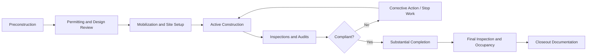
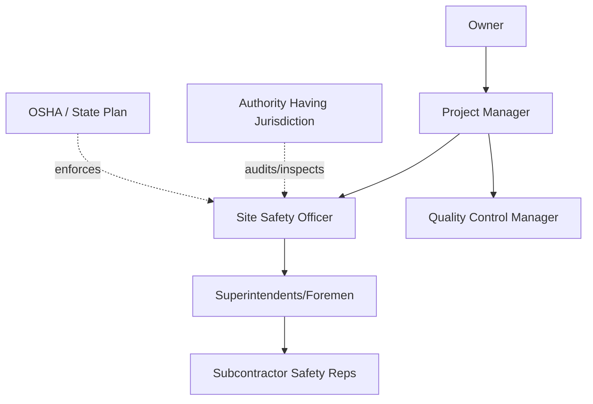

## Safety and Regulatory Compliance

### Overview

Safety and Regulatory Compliance in construction and engineering project management is the discipline of planning, implementing, and monitoring systems that protect workers, the public, and the environment while ensuring the project conforms to applicable laws, codes, standards, and permit conditions. It spans occupational safety programs, regulatory permitting, code compliance, environmental controls, quality assurance tie-ins, and the contractual/legal obligations that flow from noncompliance. On construction projects, safety and compliance are not parallel workstreams to schedule and cost — they are constraints that shape means and methods, sequencing, staffing, and budget from preconstruction through closeout.

### Core Regulatory Framework

**Occupational Safety Regulation**

In the United States, the primary regulatory body is the Occupational Safety and Health Administration (OSHA), operating under the Occupational Safety and Health Act of 1970. Construction-specific requirements are codified in 29 CFR 1926, distinct from general industry rules in 29 CFR 1926. Key subparts include:

- Subpart C — General Safety and Health Provisions
- Subpart E — Personal Protective and Life Saving Equipment
- Subpart L — Scaffolds
- Subpart M — Fall Protection
- Subpart P — Excavations
- Subpart Q — Concrete and Masonry Construction
- Subpart R — Steel Erection
- Subpart CC — Cranes and Derricks in Construction

Many jurisdictions operate OSHA-approved State Plans (e.g., Cal/OSHA, Washington L&I) which may impose requirements stricter than federal OSHA. [Unverified] Specific numeric thresholds and enforcement priorities can change through rulemaking, so current text should always be verified against the eCFR rather than memorized values.

**Environmental Regulation**

Environmental compliance typically involves:

- National Environmental Policy Act (NEPA) — environmental review for federally funded/permitted projects
- Clean Water Act (CWA) Section 402/404 — NPDES stormwater permits, wetlands/dredge-fill permits
- Clean Air Act — dust control, emissions from equipment, asbestos (NESHAP)
- Resource Conservation and Recovery Act (RCRA) — hazardous waste handling and disposal
- Local/state environmental agencies overlaying federal baseline requirements

**Building and Life Safety Codes**

- International Building Code (IBC) and International Fire Code (IFC), adopted with local amendments
- NFPA standards (e.g., NFPA 241 for construction site fire safety, NFPA 70 — National Electrical Code)
- ADA/accessibility standards
- Local Authority Having Jurisdiction (AHJ) permitting and inspection regimes

### Compliance Lifecycle Across Project Phases

**Preconstruction**

- Site-specific safety plan development
- Job Hazard Analysis (JHA) / Activity Hazard Analysis (AHA) for anticipated high-risk tasks
- Permit identification matrix: building, grading, stormwater (SWPPP), demolition, hot work, crane, right-of-way
- Subcontractor prequalification including EMR (Experience Modification Rate) review and safety record vetting

**Mobilization**

- Site logistics plan addressing fall protection anchor points, fencing, signage, traffic control
- Emergency action plan (evacuation routes, hospital routing, emergency contacts)
- New-hire and site-specific orientation training

**Active Construction**

- Daily/weekly toolbox talks
- Ongoing JHAs updated as work sequences change
- Permit-to-work systems for high-risk activities (confined space, hot work, excavation, crane lifts)
- Subcontractor safety audits and corrective action tracking

**Inspections and Audits**

- Internal safety walks by project safety officer
- Third-party or owner-mandated audits
- AHJ inspections tied to permit milestones (footing, framing, MEP rough-in, final)
- OSHA compliance inspections (programmed, complaint-driven, or following an incident)

**Closeout**

- As-built compliance documentation
- Certificate of Occupancy
- Incident log reconciliation (OSHA 300/300A)
- Lessons-learned and safety performance review

### Key Compliance Programs and Mechanisms

**Hazard Communication and Fall Protection**

Fall protection is consistently among the most cited OSHA construction violations. 29 CFR 1926 Subpart M requires fall protection at heights of 6 feet or greater in construction (versus 4 feet in general industry), implemented through guardrail systems, safety net systems, or personal fall arrest systems (PFAS). A PFAS assembly requires an anchorage capable of supporting $5000\text{ lb}$ per attached worker (or engineered with a safety factor of at least 2), a full-body harness, and a shock-absorbing lanyard or self-retracting lifeline.

**Competent Person and Qualified Person Designations**

OSHA regulations frequently require a "competent person" — someone capable of identifying existing and predictable hazards and authorized to take prompt corrective measures — for activities such as excavation, scaffolding, and fall protection. A "qualified person" designation (used for crane operations, for example) requires a recognized degree, certificate, or extensive knowledge/training demonstrating the ability to solve problems in the subject matter. [Inference] These roles are frequently conflated in practice, but the regulatory distinction matters for liability allocation and audit defense.

**Confined Space Entry**

Permit-required confined spaces (29 CFR 1926 Subpart AA) require atmospheric testing (oxygen, flammability, toxicity), a written entry permit, an attendant, and rescue provisions before entry is authorized.

**Excavation and Trenching**

Excavations 5 feet or deeper generally require protective systems (sloping, benching, shoring, or shielding) unless made entirely in stable rock, per Subpart P. A competent person must classify soil type (Type A, B, or C) to determine the appropriate slope angle or protective system design.

**Stormwater and Erosion Control**

Projects disturbing one acre or more typically require an NPDES permit and a Stormwater Pollution Prevention Plan (SWPPP), with Best Management Practices (BMPs) such as silt fencing, inlet protection, and sediment basins.

### Documentation and Recordkeeping

| Document | Purpose | Typical Owner |
| --- | --- | --- |
| OSHA 300 Log | Record of recordable injuries/illnesses | Employer/Contractor |
| OSHA 300A | Annual summary posting | Employer/Contractor |
| Site-Specific Safety Plan (SSSP) | Governs project safety procedures | General Contractor |
| SWPPP | Stormwater/erosion control plan | Owner/GC |
| JHA/AHA | Task-level hazard analysis | Supervisor/Competent Person |
| Permit-to-Work Records | Authorization for high-risk tasks | Site Safety Officer |
| Inspection Reports | AHJ or third-party findings | AHJ/Inspector |
| Incident Investigation Reports | Root cause analysis after events | Safety Manager |

### Roles and Responsibilities

- **Owner**: Sets contractual safety and compliance requirements; may mandate a Site-Specific Safety and Health Plan (SSSP) as a contract exhibit.
- **Project Manager**: Integrates compliance obligations into schedule, budget, and procurement; ensures permit conditions are tracked as project milestones.
- **Site Safety Officer / Safety Manager**: Executes day-to-day safety program administration, training, inspections, and incident response.
- **Superintendents/Foremen**: Enforce field-level compliance, conduct toolbox talks, and identify hazards in real time.
- **Subcontractors**: Contractually obligated to comply with the prime contractor's safety program and applicable law; often required to carry their own EMR-based insurance and safety documentation.

### Risk and Cost Implications

Noncompliance carries multiple layers of exposure:

- **Regulatory penalties**: OSHA civil penalties are adjusted annually for inflation; willful or repeat violations carry substantially higher maximum penalties than serious/other-than-serious violations. [Unverified] Exact dollar figures should be verified against the current OSHA penalty table, as these are updated periodically.
- **Schedule impact**: Stop-work orders from AHJ or OSHA can halt entire trades or the full site pending corrective action.
- **Contractual impact**: Many contracts (e.g., AIA A201 General Conditions) place explicit responsibility for safety programs and code compliance on the contractor, with indemnification clauses tied to safety failures.
- **Insurance impact**: Poor safety performance raises EMR, which increases workers' compensation premiums and can disqualify a contractor from bidding on projects with EMR caps.
- **Reputational and legal impact**: Serious incidents can trigger litigation, criminal referral (in cases of willful violations resulting in death), and loss of future contract eligibility (suspension/debarment on public work).

### Example: Compliance Failure Chain

**Example**

A framing subcontractor removes guardrails to move materials on an elevated deck and does not reinstall them before shift end, and no PFAS anchor points are established for the remaining crew. The next morning, a worker from a different trade steps onto the deck and falls through the open edge.

Resulting compliance cascade:

1. OSHA is notified per the fatality/catastrophe reporting rule (a fatality must be reported to OSHA within 8 hours; an in-patient hospitalization, amputation, or loss of an eye within 24 hours).
2. Site work in the affected area is subject to a stop-work order pending OSHA investigation.
3. The GC's competent person and the framing subcontractor's site safety documentation (JHA, daily inspection logs) become primary evidence in determining fault and citation classification (serious vs. willful).
4. The incident is logged on the OSHA 300 log and factors into the subcontractor's future EMR.
5. Contractual indemnification clauses are invoked to allocate liability between GC and subcontractor per the subcontract agreement.

### Integration with Project Management Processes

Safety and regulatory compliance is not a standalone function; it is embedded across PMBOK-aligned knowledge areas:

- **Scope**: Permit conditions and code requirements can constrain design and construction methods, effectively defining scope boundaries.
- **Schedule**: Inspection holds, permit approval lead times, and mandated cure windows for correcting deficiencies must be built into the critical path.
- **Cost**: Compliance costs (PPE, engineering controls, third-party inspections, permit fees) must be budgeted as direct costs, not contingency.
- **Risk Management**: Regulatory and safety risks belong in the project risk register with likelihood/impact scoring and assigned risk owners.
- **Procurement**: Subcontract agreements should flow down safety program requirements and compliance obligations with audit rights.
- **Stakeholder Management**: AHJs, insurers, and regulatory bodies function as de facto stakeholders whose approval gates affect the schedule.

### Common Pitfalls

- Treating the safety plan as a static document produced once at mobilization rather than updated as work sequences and hazards evolve
- Underestimating permit approval lead times, particularly environmental permits with public comment periods
- Failing to flow down owner or prime-contract safety requirements into subcontract agreements, creating compliance gaps
- Relying on generic JHAs instead of task-specific, site-specific hazard analyses
- Inadequate documentation, which weakens the contractor's position in the event of an incident investigation or audit

### Related Topics

- Occupational Safety and Health Administration (OSHA) Standards Deep Dive (29 CFR 1926)
- Job Hazard Analysis (JHA) and Job Safety Analysis (JSA) Methodology
- Construction Risk Management and Risk Registers
- Insurance and Bonding in Construction (Builder's Risk, General Liability, Surety Bonds)
- Environmental Permitting (NEPA, NPDES/SWPPP, Air Quality Permits)
- Quality Assurance/Quality Control (QA/QC) Programs in Construction
- Contract Administration: AIA and ConsensusDocs Safety Clauses
- Incident Investigation and Root Cause Analysis Techniques
- Crane and Rigging Safety Compliance (Subpart CC)
- Building Information Modeling (BIM) for Clash Detection and Code Compliance Checking