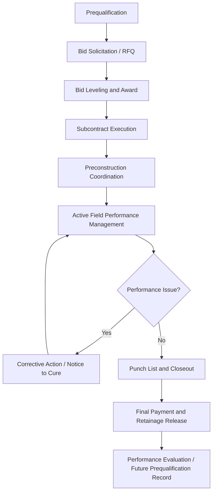
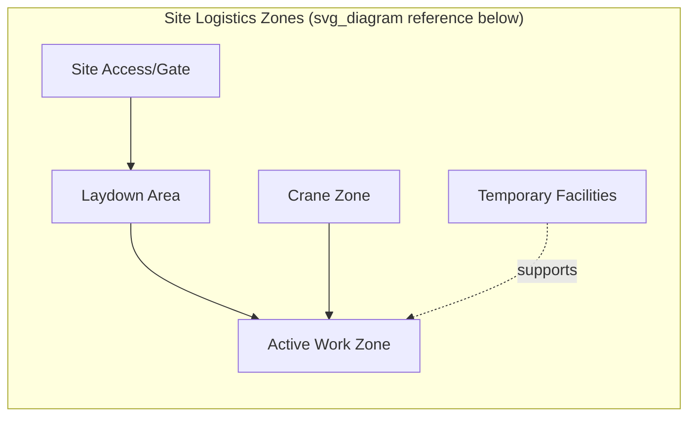

## Managing Subcontractors and Site Logistics

### Overview

Managing Subcontractors and Site Logistics addresses two interlocking disciplines in construction project management: the contractual, coordination, and performance management of trade subcontractors, and the physical planning of how people, materials, equipment, and information move through a constrained job site. Both disciplines directly drive schedule adherence, cost control, and safety outcomes, and failures in either domain typically cascade into the other — poor site logistics planning creates subcontractor conflicts, and poorly managed subcontractors undermine even a well-designed logistics plan.

### Subcontractor Management Lifecycle

**Prequalification**

Before bid invitation, general contractors vet subcontractors against financial stability, bonding capacity, safety record (EMR, OSHA incident rates), relevant experience, current workload/capacity, and reference checks. Prequalification reduces the risk of award to a subcontractor who is financially unable to perform or has a documented pattern of safety or quality failures.

**Bid Solicitation and Leveling**

Scope-specific Requests for Quotation (RFQs) are issued with bid packages containing drawings, specifications, and a scope-of-work breakdown. Bid leveling normalizes competing bids onto a common basis — since subcontractors may include or exclude different scope items, exclusions and clarifications must be reconciled before an apples-to-apples cost comparison is possible.

**Subcontract Execution**

The subcontract agreement (e.g., AIA A401 or ConsensusDocs 750 family) flows down relevant prime contract obligations — including safety program requirements, schedule commitments, insurance/indemnification terms, retainage percentage, and change order procedures — from the prime contract to the subcontractor.

**Preconstruction Coordination**

Prior to mobilization, a subcontractor kickoff meeting aligns on schedule sequencing, site access, laydown area assignments, submittal/RFI procedures, and safety orientation requirements specific to that trade's scope.

### Active Field Performance Management

**Schedule Coordination**

Subcontractors are managed against the Critical Path Method (CPM) schedule, with the General Contractor's superintendent tracking each trade's percent complete, identifying float erosion, and resequencing work when a subcontractor falls behind to avoid delaying successor trades.

**Quality Control Integration**

Subcontractor work is inspected against approved submittals and Product Descriptions/specifications, often through a formal Quality Control (QC) inspection checklist tied to specific trade milestones (e.g., pre-pour concrete inspection, pre-drywall MEP rough-in inspection).

**Change Management**

Field conditions frequently generate scope changes; these are processed through Requests for Information (RFIs), Architect's Supplemental Instructions (ASIs), and formal Change Orders, with the subcontract defining markup limits and pricing methodology (e.g., time and materials versus lump sum) for extra work.

**Payment Administration**

Progress payments are typically processed monthly against a Schedule of Values, with retainage (commonly 5–10%) withheld until substantial completion or full completion to incentivize timely punch-list closure, subject to jurisdiction-specific prompt payment statutes.

### Coordination Mechanisms Across Trades

| Mechanism | Purpose | Typical Frequency |
| --- | --- | --- |
| Subcontractor Coordination Meeting | Cross-trade sequencing and conflict resolution | Weekly |
| Look-Ahead Schedule (3-week) | Near-term task sequencing at the trade level | Weekly, rolling |
| RFI Log Review | Track open information requests blocking work | Weekly |
| Submittal Tracking Log | Track approval status of materials/shop drawings | Ongoing |
| Site Safety Walk | Cross-trade hazard identification | Daily/Weekly |

### Site Logistics Planning

**Purpose**

Site logistics planning organizes the physical constraints of the job site — access, storage, vertical/horizontal transport, and safety zones — to minimize congestion, rework, and safety incidents as multiple trades occupy overlapping space and time.

**Core Elements of a Site Logistics Plan**

- **Site Access and Traffic Control**: Defined entry/exit points for delivery vehicles, worker parking, and pedestrian routes, often requiring coordination with municipal right-of-way permits
- **Laydown and Staging Areas**: Designated zones for material storage per trade, sized and scheduled to avoid double-handling and to prevent material staging from blocking active work areas
- **Crane and Hoist Placement**: Tower crane or mobile crane positioning based on lift radius, load capacity, and site geometry, coordinated against the construction sequence since crane relocation is costly
- **Temporary Facilities**: Site offices, restrooms, temporary power/water, fencing, and signage
- **Vertical/Horizontal Transport**: Material hoists, personnel hoists, and stair/ramp access planning, especially critical on high-rise or confined urban sites
- **Waste Management**: Dumpster/debris chute placement and removal scheduling to avoid material handling conflicts

**Site Logistics Plan Layout (SVG)**

<svg xmlns="http://www.w3.org/2000/svg" viewBox="0 0 640 400">
<title>Simplified Construction Site Logistics Layout (svg_diagram)</title>
<rect x="0" y="0" width="640" height="400" fill="#ffffff" stroke="#cccccc" />

<rect x="20" y="20" width="600" height="360" fill="none" stroke="#333333" stroke-width="3" />

<rect x="20" y="180" width="20" height="40" fill="#f0ad4e" />
<text x="45" y="205" font-size="12" fill="#333333">Site Access / Gate</text>

<rect x="60" y="260" width="150" height="100" fill="#5bc0de" fill-opacity="0.4" stroke="#5bc0de" />
<text x="75" y="315" font-size="13" fill="#333333">Laydown / Staging</text>

<circle cx="380" cy="200" r="140" fill="#d9534f" fill-opacity="0.12" stroke="#d9534f" stroke-dasharray="6,4" />
<circle cx="380" cy="200" r="6" fill="#d9534f" />
<text x="345" y="195" font-size="13" fill="#333333">Crane + Lift Radius</text>

<rect x="300" y="150" width="160" height="100" fill="#5cb85c" fill-opacity="0.3" stroke="#5cb85c" />
<text x="330" y="205" font-size="13" fill="#333333">Building / Active Work</text>

<rect x="480" y="60" width="120" height="70" fill="#f7e79b" stroke="#d4b106" />
<text x="495" y="100" font-size="12" fill="#333333">Site Office / Temp Facilities</text>

<rect x="480" y="300" width="100" height="50" fill="#c9c9c9" stroke="#888888" />
<text x="495" y="330" font-size="12" fill="#333333">Waste/Debris</text>
</svg>

### Integration Between Subcontractor Management and Logistics

Site logistics constraints directly shape subcontractor sequencing decisions, and subcontractor performance directly affects logistics congestion:

- **Trade stacking**: When multiple trades are compressed into the same physical zone due to schedule slippage, logistics congestion rises sharply, increasing safety risk and productivity loss; the site logistics plan should be revisited whenever the CPM schedule shows overlapping trade windows in a shared area.
- **Delivery scheduling**: Just-in-time material delivery windows must be coordinated with each subcontractor's laydown allocation to avoid site congestion, particularly on confined urban sites with no on-site storage capacity.
- **Crane time allocation**: On projects with a single tower crane serving multiple trades, a shared crane-time booking system prevents subcontractor conflicts over lift priority.

### Practical Example

**Example**

On a 12-story urban office building with no on-site laydown space, the GC's site logistics plan allocates a single curbside loading zone permitted for 6 hours daily. The structural steel subcontractor, MEP subcontractor, and curtain wall subcontractor all require crane time and delivery windows during the same project phase.

The GC's superintendent implements a shared crane-booking log, requiring each subcontractor to reserve lift slots 48 hours in advance through the weekly coordination meeting. When the curtain wall subcontractor's material delivery is delayed by a manufacturing issue, the superintendent reallocates that day's crane slots to the MEP subcontractor's rooftop equipment lift instead of leaving the crane idle, and updates the 3-week look-ahead schedule to reflect the curtain wall subcontractor's revised sequence — preventing the delay from cascading into idle crane time or trade stacking once the curtain wall material arrives.

### Common Pitfalls

- Awarding subcontracts based on lowest price alone without adequate prequalification, increasing risk of default or quality failure
- Failing to flow down prime contract safety, insurance, and schedule obligations into subcontract agreements, creating enforcement gaps
- Static site logistics plans that are not revised as the construction sequence and trade mix evolve over the project timeline
- Underestimating laydown area requirements, forcing double-handling of materials and site congestion
- Inadequate crane/hoist scheduling coordination, leading to trade conflicts over shared vertical transport resources
- Delaying corrective action on underperforming subcontractors until float is fully consumed, removing schedule recovery options

### Related Topics

- Construction Contract Types and Subcontract Agreement Structures (AIA, ConsensusDocs)
- Critical Path Method (CPM) Scheduling and Look-Ahead Planning
- Construction Safety and Regulatory Compliance
- Change Order and RFI Management Processes
- Crane Selection and Lift Planning
- Just-In-Time (JIT) Material Delivery in Constrained Urban Sites
- Retainage, Schedule of Values, and Progress Payment Administration
- Trade Stacking and Congestion Risk Mitigation