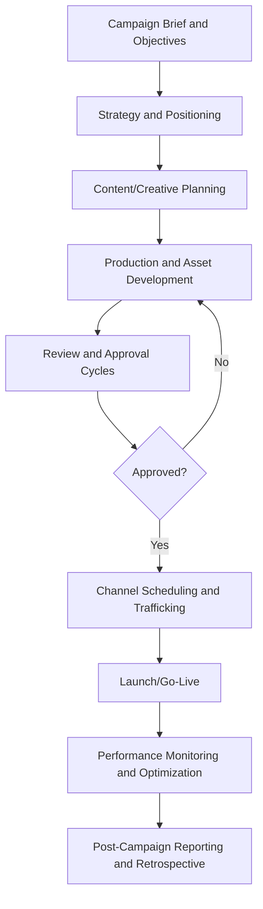
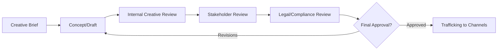

## Campaign and Content Project Planning

### Overview

Campaign and Content Project Planning applies project management discipline to marketing and creative deliverables — coordinating strategy, creative production, content calendars, channel distribution, and performance measurement within fixed launch dates and budgets. Unlike construction or software projects with relatively stable requirements, marketing campaigns operate under high ambiguity in creative direction, frequent stakeholder-driven scope changes (brand/legal review cycles), and compressed timelines tied to immovable external dates (product launches, seasonal windows, event dates).

### Campaign Planning Lifecycle

**Campaign Brief and Objectives**

The foundational document defining the campaign's business objective, target audience, key message, budget, timeline, and success metrics (KPIs). A well-formed brief distinguishes between the ultimate business goal (e.g., revenue lift) and the marketing objective that supports it (e.g., qualified leads generated), preventing scope ambiguity later in production.

**Strategy and Positioning**

Translates the brief into audience segmentation, channel mix selection, messaging pillars, and competitive positioning, typically owned by a strategist or brand lead before creative production begins.

**Content/Creative Planning**

Breaks the campaign into a content calendar or asset matrix specifying each deliverable (video, static ad, landing page, email, social post), its associated channel, format specifications, and dependency on other assets (e.g., a landing page depending on finalized brand messaging).

### Content Calendar and Asset Matrix

A content calendar is the primary planning artifact translating campaign strategy into a scheduled, trackable production plan.

| Asset | Channel | Format Spec | Owner | Due Date | Dependency |
| --- | --- | --- | --- | --- | --- |
| Hero video | YouTube/Paid Social | 16:9, 30s cut + 15s cutdown | Video team | T-14 days | Approved script |
| Static ad set | Instagram/Meta | 1080x1080, 1080x1920 | Design team | T-10 days | Brand guidelines |
| Landing page | Owned web | Responsive, CMS template | Web team | T-7 days | Copy approval |
| Email sequence | Owned/CRM | 3-part drip | Lifecycle marketer | T-5 days | Landing page live |
| Influencer content | Instagram/TikTok | Native format per creator | Partnerships | T-3 days | Contract signed |

**Format and Channel Specification Management**

Each platform imposes distinct technical constraints (aspect ratio, file size, duration limits, safe-zone text placement); [Unverified] exact platform specifications change frequently as social/ad platforms update their requirements, so current specs should be verified against each platform's advertising documentation before final asset export rather than relied upon from memory.

### Production and Review Workflow

**Review and Approval Cycles**

Marketing projects are distinguished by multi-layered, often subjective approval gates: internal creative review (craft quality), stakeholder/brand review (message alignment), and legal/compliance review (claims substantiation, regulatory disclosures, trademark usage). Each round introduces potential rework, so mature marketing PM practice builds explicit revision-round limits and buffer time into the schedule rather than treating "final approval" as a single, predictable event.

**Version Control and Asset Management**

Given multiple concurrent revision cycles across many assets, disciplined naming conventions and a Digital Asset Management (DAM) system or shared workspace are essential to prevent outdated or unapproved versions from being trafficked to live channels — a common and costly failure mode in high-volume campaigns.

### Channel Scheduling and Trafficking

**Trafficking**

The operational process of loading approved creative assets into the specific ad platforms, email service providers, or CMS instances, respecting each platform's lead time for review (e.g., paid social ad review queues) and scheduling assets to go live at coordinated times across channels.

**Cross-Channel Sequencing**

Campaigns typically sequence channel activation deliberately (e.g., owned content and email seeded before paid media amplification begins) rather than launching all channels simultaneously, to build organic momentum before paid spend activates.

### Performance Monitoring and Optimization

**Key Performance Indicators (KPIs)**

Common metrics tracked during and after a campaign include reach, impressions, click-through rate (CTR), conversion rate, cost per acquisition (CPA), and return on ad spend (ROAS):

$$ROAS = \frac{\text{Revenue Attributed to Campaign}}{\text{Campaign Spend}}$$

$$CPA = \frac{\text{Total Campaign Spend}}{\text{Number of Conversions}}$$

**Real-Time Optimization**

Unlike many project types where the deliverable is "done" at launch, marketing campaigns often continue as active optimization projects post-launch — reallocating budget between channels, pausing underperforming creative variants, and iterating on messaging based on early performance data, which requires the project plan to explicitly allocate time and decision authority for mid-flight adjustments.

### Roles in Campaign Project Management

| Role | Responsibility |
| --- | --- |
| Marketing/Campaign Project Manager | Owns timeline, budget, cross-functional coordination |
| Brand/Creative Director | Owns creative vision and quality standards |
| Copywriter/Content Strategist | Develops messaging and written content |
| Designer/Video Producer | Produces visual and video assets |
| Media Buyer/Paid Channel Specialist | Manages channel budget allocation and trafficking |
| Legal/Compliance Reviewer | Validates claims, disclosures, regulatory adherence |
| Analytics/Performance Marketer | Tracks KPIs, provides optimization recommendations |

### Post-Campaign Reporting and Retrospective

After the campaign concludes (or reaches a defined evaluation checkpoint for ongoing campaigns), the team compiles performance results against the original KPIs from the brief, documents what worked and what didn't across creative, channel, and audience dimensions, and captures lessons learned for future campaign planning — closing the loop back to the strategy phase for iterative improvement.

### Practical Example

**Example**

A consumer product brand plans a 6-week product launch campaign with a hard launch date tied to retail availability. The campaign brief sets a KPI target of a specific CPA threshold for paid social conversions. The content calendar schedules a hero video (due T-14 days), a static ad set (T-10 days), and an email sequence (T-5 days), all dependent on a single approved messaging document.

During the stakeholder review cycle, legal flags a product claim in the hero video script requiring substantiation data that isn't yet available, forcing a script revision two days before the video production shoot. Because the project plan had built in a buffer round for legal review, the PM shifts the shoot date by two days without impacting the T-14 asset delivery deadline, using previously identified schedule float rather than compressing downstream review cycles. Post-launch, the paid social CPA comes in 15% above target in week one; the media buyer reallocates budget from an underperforming ad variant to the top-performing creative, and the campaign closes within its overall CPA target by week four.

### Common Pitfalls

- Treating the creative brief as a formality rather than a binding scope document, leading to late-stage "just one more revision" scope creep
- Underestimating legal/compliance review lead time, especially for regulated industries (finance, healthcare, alcohol)
- Failing to build revision-round limits into the schedule, allowing subjective creative feedback loops to consume all float
- Launching all channels simultaneously without a deliberate sequencing strategy, diluting organic momentum
- Not allocating explicit time/budget for post-launch optimization, treating campaign launch as the project's end rather than an ongoing phase
- Inconsistent asset versioning/naming leading to outdated creative being trafficked live

### Related Topics

- Creative Brief Development and Stakeholder Alignment
- Digital Asset Management (DAM) Systems and Version Control
- Paid Media Planning and Channel Mix Strategy
- Marketing Attribution Models and ROAS Measurement
- Agile Marketing (Scrumban for Creative Teams)
- Event Project Management and Launch Day Coordination
- Legal and Regulatory Compliance Review Workflows in Marketing
- Post-Campaign Retrospectives and Performance Reporting