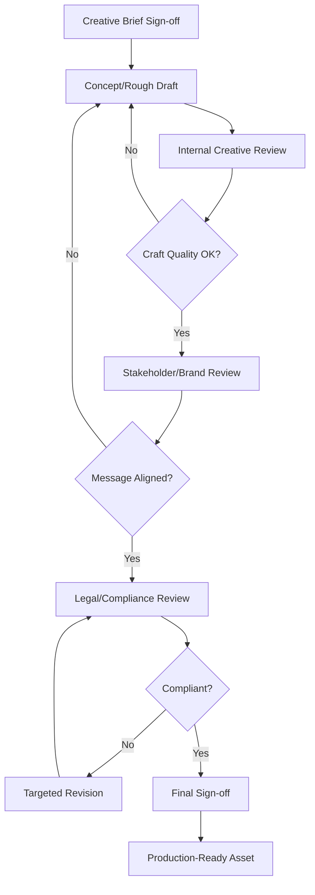
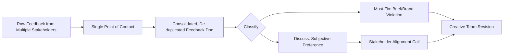

## Creative Review and Approval Workflows

### Overview

Creative Review and Approval Workflows are the structured processes by which marketing and creative deliverables move from draft to final, published state through defined stakeholder checkpoints. Because creative feedback is inherently more subjective than technical acceptance criteria, these workflows exist to convert open-ended opinion into a converging, time-bound decision process — preventing the single most common failure mode in creative production: unbounded revision cycles that consume schedule float without a clear path to sign-off.

### Why Creative Review Differs from Technical Review

In technical projects, acceptance criteria are typically binary and objective (a function passes its test suite, a beam meets its load calculation). In creative review, "correctness" is a negotiated judgment across brand alignment, craft quality, audience resonance, and legal/regulatory risk — each evaluated by a different stakeholder with different, sometimes conflicting, standards. A creative review workflow's primary job is to sequence these different judgment types so that conflicting feedback is resolved in a defined order rather than arriving simultaneously and contradicting itself.

### Standard Review Workflow Structure

### Review Tiers

**Tier 1: Internal Creative Review**

Conducted within the creative team (art director, copywriter, creative director) before external stakeholders see the work. Focuses on craft quality — composition, copy clarity, technical execution — rather than strategic alignment, since catching craft issues internally before stakeholder review preserves stakeholder trust and avoids wasting external review cycles on preventable errors.

**Tier 2: Stakeholder/Brand Review**

Conducted with marketing leadership, brand managers, or the requesting business unit. Focuses on strategic and brand alignment — does the creative achieve the campaign objective, is it on-brand, does it resonate with the target audience. This tier is where subjective disagreement is most likely, making structured feedback consolidation especially important.

**Tier 3: Legal/Compliance Review**

Conducted by legal, regulatory affairs, or compliance teams, particularly critical in regulated industries (finance, pharmaceuticals, alcohol, gambling). Focuses on objective criteria — substantiated claims, required disclosures, trademark/copyright clearance, accessibility requirements — and should generally be sequenced after brand alignment is settled, since legal review of a concept likely to be discarded on brand grounds wastes compliance team capacity.

**Tier 4: Final Sign-off**

A designated approver (often the campaign owner or brand director) provides the binding go/no-go decision, closing the loop and authorizing production or trafficking.

### Feedback Consolidation

**The Single-Point-of-Contact Principle**

A recurring best practice is designating one person (often the project manager or creative lead) to collect feedback from all stakeholders in a given review round and consolidate it into a single, reconciled feedback document before it reaches the creative team — rather than allowing multiple stakeholders to send raw, potentially contradictory feedback directly to the creator. This prevents the creative team from having to independently arbitrate conflicting direction from different authority levels.

**Structured Feedback Formats**

Effective feedback is anchored to specific elements (a timestamp in a video, a region of an image, a specific line of copy) rather than general impressions, commonly facilitated through:

- **Annotation/markup tools**: Time-stamped comments on video, pinned comments on specific image regions
- **Feedback templates**: Structured forms separating "must-fix" issues from "subjective preference" suggestions, often tied explicitly back to the creative brief's stated objectives to filter out off-brief feedback
- **Revision request classification**: Categorizing each note as Brief Deviation (must address), Brand Guideline Violation (must address), or Subjective Preference (discuss/negotiate)

### Governing the Revision Cycle

**Revision Round Limits**

Mature workflows cap the number of formal revision rounds included in scope (e.g., two rounds of stakeholder revisions included, additional rounds requiring scope/timeline renegotiation), preventing indefinite iteration and forcing stakeholders to consolidate their feedback rather than trickle it in across many small rounds.

**Escalation Path for Deadlock**

When stakeholders provide contradictory direction that the creative team cannot reconcile independently, a predefined escalation path (e.g., to the brand director or campaign sponsor) resolves the conflict with a binding decision rather than leaving the creative team to guess which stakeholder's opinion carries more weight.

**Time-Boxed Review Windows**

Each review tier is assigned a maximum turnaround time (e.g., 2 business days for stakeholder review, 3 business days for legal review) built into the master schedule as a scheduled task with a defined duration, rather than an open-ended "whenever they get to it" dependency — since unbounded review windows are a primary source of marketing schedule slippage.

### Approval Workflow Tooling

Digital Asset Management (DAM) systems and creative collaboration platforms (e.g., Frame.io for video, Ziflow, InVision, or built-in review tools in project management platforms) typically support:

- Version-stacked review (comparing current draft against prior versions side by side)
- Time-coded/region-based commenting
- Approval status tracking per stakeholder (approved, changes requested, rejected)
- Audit trail of who approved what version, critical for compliance record-keeping in regulated industries

[Unverified] Specific platform capabilities and pricing tiers change frequently; current feature sets should be verified against vendor documentation rather than assumed from general familiarity with the category.

### Roles and RACI in Creative Review

| Activity | Creative Team | PM/Coordinator | Brand Stakeholder | Legal/Compliance | Final Approver |
| --- | --- | --- | --- | --- | --- |
| Produce draft | R | I | I | I | I |
| Internal craft review | R/A | C | I | I | I |
| Consolidate feedback | I | R/A | C | C | I |
| Brand alignment review | I | C | R/A | I | I |
| Compliance review | I | C | I | R/A | I |
| Final sign-off | I | C | C | C | R/A |

*(R = Responsible, A = Accountable, C = Consulted, I = Informed)*

### Practical Example

**Example**

A financial services company produces a video ad claiming a specific rate of return. In internal creative review, the art director flags that on-screen text is illegible on mobile and sends it back for a single craft fix. Once craft-approved, the video moves to stakeholder review, where the brand manager and the VP of Marketing both submit feedback — but through the single-point-of-contact PM, who consolidates their notes and identifies that the VP's requested tagline change conflicts with the brand manager's approved messaging framework. The PM escalates this conflict to the brand director per the predefined escalation path rather than asking the creative team to choose, and the brand director rules in favor of the approved messaging framework.

Only after brand alignment is settled does the video proceed to legal/compliance review, where the compliance team requires a disclosure disclaimer for the stated rate of return — a fix that would have been wasted effort if applied before the tagline conflict was resolved, since legal was reviewing a version that might otherwise have changed. The disclaimer is added, and the final approver signs off within the pre-agreed two-day compliance review window.

### Common Pitfalls

- Running legal/compliance review before brand alignment review, wasting compliance capacity on creative likely to change
- Allowing multiple stakeholders to send feedback directly to the creative team without consolidation, creating contradictory direction
- Failing to distinguish "must-fix" feedback (brief/brand violations) from subjective preference, treating every note as equally mandatory
- Not capping revision rounds, allowing indefinite iteration that silently consumes all schedule float
- Missing a defined escalation path, leaving creative teams to informally guess which stakeholder's authority takes precedence
- Treating verbal or informal approval as sufficient in regulated industries where an auditable sign-off trail is required

### Related Topics

- Campaign and Content Project Planning
- Digital Asset Management (DAM) Systems and Version Control
- RACI Matrices in Cross-Functional Marketing Teams
- Legal and Regulatory Compliance Review in Advertising
- Agile Marketing Ceremonies and Sprint-Based Creative Production
- Stakeholder Management and Escalation Path Design
- Brand Guidelines Governance and Enforcement