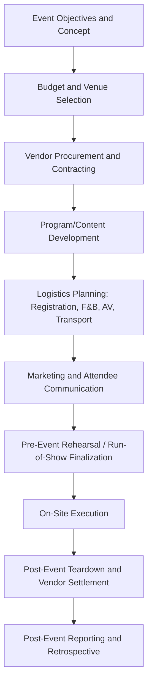
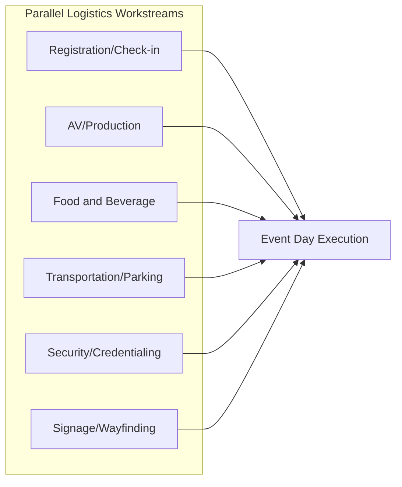
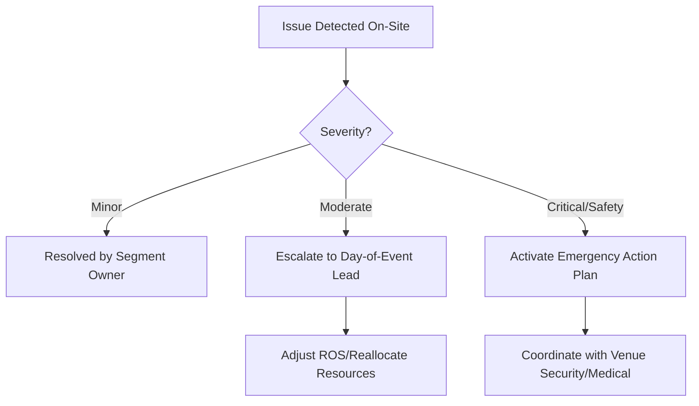

## Event Planning and Logistics

### Overview

Event Planning and Logistics applies project management discipline to the design, coordination, and execution of live or hybrid events — conferences, product launches, trade shows, internal company events, and experiential marketing activations. Events are distinguished from most other project types by an immovable, non-negotiable delivery date (the event date itself), a highly compressed execution window where dozens of workstreams converge simultaneously, and irreversibility: unlike software or creative deliverables, a failed event execution generally cannot be quietly patched afterward.

### Event Planning Lifecycle

**Event Objectives and Concept**

Establishes the business purpose (lead generation, product launch, internal culture-building, customer retention), target audience, expected attendance, and success metrics before any venue or vendor commitments are made — analogous to a project charter, anchoring later scope decisions.

**Budget and Venue Selection**

Venue selection is typically the first major binding commitment, driven by capacity, location, date availability, and cost, and it constrains nearly every downstream logistics decision (catering options, AV capabilities, load-in/load-out access, parking). Budgets in event management commonly allocate line items across venue, catering (Food & Beverage/F&B), audio-visual (AV) production, staffing, marketing/promotion, and contingency.

### Vendor and Contract Management

**Vendor Categories**

| Vendor Type | Scope |
| --- | --- |
| Venue | Space rental, house AV, in-house catering rules |
| Catering/F&B | Meals, beverage service, dietary accommodation |
| AV/Production | Sound, lighting, staging, livestream/hybrid broadcast |
| Décor/Rentals | Furniture, signage, branding elements |
| Transportation | Shuttle service, valet, attendee logistics |
| Registration/Tech Platform | Attendee registration, badge printing, check-in systems |
| Security | Crowd control, credential verification |
| Entertainment/Speakers | Keynote talent, performers, speaker logistics |

**Contract Terms Specific to Events**

- **Attrition clauses**: Financial penalties if actual attendance/room-block usage falls below a contracted minimum, common in hotel/venue contracts
- **Force majeure provisions**: Terms governing cancellation or postponement due to circumstances beyond either party's control
- **Cancellation/deposit schedules**: Tiered refund percentages based on how far in advance cancellation occurs
- **Load-in/load-out windows**: Contracted time blocks for vendor setup and teardown, which directly constrain the production schedule

[Unverified] Specific attrition thresholds, cancellation percentages, and force majeure language vary significantly by venue and jurisdiction and must be negotiated and verified in the actual contract rather than assumed from general industry convention.

### Logistics Workstreams

**Registration and Attendee Management**

Involves selecting a registration platform, managing capacity limits, badge/credential production, and check-in flow design to avoid bottlenecks at entry — particularly critical for events with keynote start times, where slow check-in directly delays the program.

**Audio-Visual and Production**

Coordinates staging, sound reinforcement, lighting, and any hybrid/livestream broadcast requirements, typically requiring a technical rehearsal to validate microphone handoffs, slide/video playback, and network bandwidth for streaming before doors open.

**Food and Beverage**

Requires headcount guarantees submitted to caterers by a contractual deadline (often 3–5 business days before the event), with dietary accommodation tracking tied back to the registration data.

**Transportation and Wayfinding**

For multi-venue or large-campus events, shuttle scheduling and on-site signage/wayfinding reduce attendee confusion and prevent session delays caused by attendees arriving late from transit.

**Security and Credentialing**

Particularly critical for events with public figures, high-value equipment, or specific compliance requirements, involving credential design, access-tier definition (general attendee, VIP, staff, vendor), and coordination with venue security personnel.

### The Run-of-Show (ROS)

**Purpose**

The Run-of-Show is the event's master minute-by-minute schedule, functioning as the event equivalent of a detailed project schedule, specifying every segment's start/end time, responsible owner, and technical cues (microphone changes, video rolls, lighting changes).

**Structure**

| Time | Segment | Owner | AV Cue | Notes |
| --- | --- | --- | --- | --- |
| 8:00–9:00 | Registration/Breakfast | Registration Lead | Ambient music | Doors open |
| 9:00–9:15 | Welcome/Opening | Emcee | Stage lights up, mic 1 live | Keynote on standby backstage |
| 9:15–10:00 | Keynote | Speaker | Slide deck cued, mic 2 live | Confirm clicker battery |
| 10:00–10:15 | Transition/Break | Stage Manager | House lights up | Reset stage for panel |

**Pre-Event Rehearsal**

A full or partial run-through validating the ROS against actual timing, catching issues such as AV cue mismatches, speaker transition delays, or unaccounted setup time before the live event, ideally conducted with the actual venue AV team rather than assumed from the written document alone.

### On-Site Execution and Contingency Planning

**Command Structure**

Larger events typically designate a Day-of-Event Lead or Event Manager operating from a central command point, coordinating via radio/communication channels with vendor leads, registration staff, and AV technicians — mirroring an incident command structure to enable rapid decision-making when issues arise in real time.

**Contingency Planning**

- **Weather contingency**: Indoor backup plans for outdoor events, particularly for load-in equipment vulnerable to weather
- **No-show speaker/technical failure contingency**: Backup content or moderator scripts to fill unplanned gaps
- **Overflow/capacity contingency**: Plans for attendance exceeding registration projections
- **Emergency action plan**: Evacuation routes, medical response procedures, and coordination with venue security, analogous to construction site emergency planning

### Post-Event Activities

**Teardown and Vendor Settlement**

Load-out logistics must respect the venue's contracted teardown window; final vendor invoices are reconciled against contracted rates and any attrition or overage charges (e.g., final F&B headcount versus guaranteed minimum).

**Post-Event Reporting**

Compiles attendance figures against projections, budget-actual variance, attendee satisfaction survey results, and lead-generation or business-objective metrics established in the original event brief, feeding into a retrospective for future event planning.

### Roles in Event Project Management

| Role | Responsibility |
| --- | --- |
| Event Project Manager | Owns overall timeline, budget, vendor coordination |
| Day-of-Event Lead | On-site command and real-time issue resolution |
| Production/AV Manager | Technical execution of staging, sound, lighting |
| Registration Lead | Attendee check-in flow and data management |
| Vendor/Venue Liaison | Contract compliance and on-site vendor coordination |
| Marketing/Communications Lead | Pre-event promotion and attendee communication |

### Practical Example

**Example**

A software company plans a 500-person in-person product launch event with a hybrid livestream component. The Event PM secures the venue six months out, subject to an attrition clause requiring 80% of the contracted room block to be filled or a financial penalty applies. Registration tracking three weeks out shows only 60% fill, prompting the marketing team to run a targeted email push, ultimately reaching 85% by the deadline and avoiding the attrition penalty.

On event day, the technical rehearsal the morning of the event reveals the livestream encoder is incompatible with the venue's network configuration, discovered only because the rehearsal was conducted with actual venue infrastructure rather than assumed from vendor specifications alone. The AV Production Manager escalates to the Day-of-Event Lead, who authorizes an emergency swap to a backup cellular-bonded encoder unit held in contingency, resolving the issue 90 minutes before doors open without adjusting the published Run-of-Show start time.

### Common Pitfalls

- Committing to a venue before finalizing attendance projections, creating downstream attrition penalty risk
- Treating the Run-of-Show as a static document rather than validating it through an actual rehearsal with venue AV
- Underestimating registration/check-in throughput capacity, causing keynote delays from entry bottlenecks
- No defined command structure on event day, leading to diffused, slow decision-making when issues arise
- Skipping contingency planning for weather, no-shows, or technical failure, leaving no fallback when the inevitable issue occurs
- Failing to track F&B headcount guarantees against the contractual deadline, resulting in overage charges

### Related Topics

- Campaign and Content Project Planning
- Vendor Contract Negotiation and Attrition Clause Management
- Risk Management and Contingency Planning for Live Events
- Hybrid and Virtual Event Production Technology
- Post-Event ROI Measurement and Retrospectives
- Incident Command Structures for On-Site Event Management
- Budget Management and Cost Variance Tracking for Events