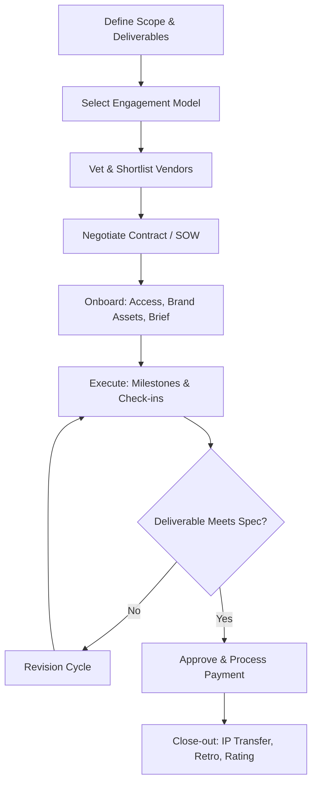
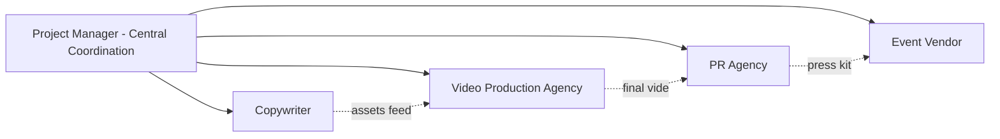

## Managing Freelancers and Agencies

### Overview

Managing freelancers and agencies is a project management discipline focused on coordinating external, non-employee resources to deliver creative, marketing, or event work. Unlike managing internal teams, this discipline centers on contractual clarity, asynchronous communication, intellectual property (IP) control, and vendor performance management, since the project manager typically has less direct authority over external contributors' time, tools, and processes.

This discipline sits at the intersection of procurement, legal, creative direction, and traditional PM scheduling/budgeting.

### Key Points

- **Engagement models differ fundamentally**: A single freelancer, a boutique agency, and a large agency-of-record (AOR) each require different governance structures.
- **Control is indirect**: PMs cannot mandate tools, daily standups, or internal processes for external vendors the way they can for employees — influence is exercised through contracts, milestones, and relationship management.
- **Risk is concentrated in IP, confidentiality, and continuity**: Losing a freelancer mid-project or a agency reassigning staff are common failure modes unique to this context.
- **Cost structures vary**: hourly, day-rate, project-based (fixed fee), retainer, and value-based/performance pricing each carry different scope-creep risks.

### Engagement Models

| Model | Description | Best Fit | Key Risk |
| --- | --- | --- | --- |
| Freelancer (project-based) | Single independent contractor for a defined deliverable | Discrete creative assets (logo, copy, one-off video) | Availability/single point of failure |
| Freelancer (retainer) | Ongoing hours/month for continuous work | Recurring content needs (blog, social) | Scope creep without clear hour caps |
| Boutique agency | Small specialized team, often founder-led | Niche expertise (motion graphics, PR) | Key-person dependency within the agency itself |
| Agency of Record (AOR) | Long-term strategic partner across campaigns | Sustained brand/marketing programs | Vendor lock-in, misaligned incentives over time |
| Production company/event vendor | Specialized execution for a bounded event | Live events, video shoots | Tight time-bound delivery, weather/logistics risk |

### Core Workflow

### Contractual Fundamentals

**Statement of Work (SOW)**

The SOW is the operational backbone of any freelancer/agency engagement. It should specify:

- Deliverables (with acceptance criteria, not vague descriptions)
- Timeline with named milestones
- Number of revision rounds included (and cost of additional rounds)
- Payment schedule (e.g., 50% upfront, 50% on delivery; or milestone-based)
- Kill fee / early termination terms

**Master Service Agreement (MSA)**

For ongoing relationships (retainers, AOR), an MSA governs the overall relationship terms (liability, confidentiality, IP, termination), while individual SOWs govern specific projects under that umbrella. This two-tier structure avoids renegotiating boilerplate legal terms for every new project.

**Intellectual Property (IP) Clauses**

- **Work-for-hire**: Client owns all IP outright upon payment — standard for logos, campaign assets, branded content.
- **License-based**: Freelancer retains ownership, client receives a usage license (common with stock-influenced creative, photography, or when the freelancer wants portfolio reuse rights).
- [Inference] Ambiguity here is one of the most common sources of post-project disputes; explicit IP language in the SOW is considered best practice across creative industries.

**Confidentiality and NDAs**

Necessary when freelancers/agencies access unreleased campaigns, pricing strategy, or internal brand guidelines before public launch.

### Selecting and Vetting Vendors

**Key Points**

- Portfolio relevance (similar industry, similar deliverable type) outweighs general prestige.
- Reference checks should probe specifically on **communication reliability** and **handling of scope changes**, not just quality of output.
- For agencies, clarify who on the account team will actually do the work — "senior pitch, junior delivery" is a common structural risk.

**Evaluation Criteria Checklist**

- Relevant portfolio samples (not just aesthetic fit, but comparable project complexity)
- References from past clients, specifically asked about missed deadlines
- Financial stability signals (for larger, longer engagements)
- Response time during the sales/pitch process (a leading indicator of engagement-phase responsiveness) [Inference]
- Clarity of their own onboarding process (a well-run vendor typically has a defined kickoff process)

### Onboarding External Resources

Freelancers and agencies need a compressed, self-contained onboarding package since they lack the ambient context employees absorb over time.

**Onboarding Package Should Include**

- Brand guidelines (visual identity, tone of voice, do's/don'ts)
- Access provisioning (shared drives, project management tool guest access, communication channels) — scoped to least privilege necessary
- A single point of contact (SPOC) on the client side to prevent conflicting direction
- Prior campaign assets/context for continuity
- Escalation path for blockers

### Communication Cadence and Governance

| Engagement Type | Suggested Cadence | Primary Channel |
| --- | --- | --- |
| Single freelancer, short project | Async updates + 1 kickoff call | Email/Slack guest channel |
| Freelancer retainer | Weekly async check-in | Shared task tracker |
| Boutique agency | Bi-weekly status call | Video call + shared doc |
| Agency of Record | Weekly status + monthly strategic review | Formal status reports + QBRs |
| Event production vendor | Daily during pre-event crunch week | Phone/text + on-site coordination |

**Example**

A monthly Quarterly Business Review (QBR) with an AOR typically covers: performance against KPIs, budget pacing, upcoming campaign calendar, and any contract renewal considerations — distinct from weekly tactical check-ins which cover task-level status.

### Budget and Cost Control

**Key Points**

- Fixed-fee contracts shift scope-creep risk to the vendor but require very precise upfront specs.
- Hourly/day-rate contracts shift scope-creep risk to the client and require active hour-tracking oversight.
- Retainers should define what happens to unused hours (rollover vs. forfeiture) and what counts as "in scope" vs. billable extra.

**Common Cost Pitfalls**

- Underspecifying revision rounds, leading to endless "just one more tweak" cycles billed at premium rates
- Rush fees not negotiated upfront, discovered only when a deadline compresses
- Agency markup on third-party costs (stock footage, printing, media buys) not disclosed initially

$$\text{Effective Hourly Cost} = \frac{\text{Total Invoice}}{\text{Actual Hours Delivered}}$$

This metric is useful retrospectively to compare a fixed-fee freelancer's real cost-efficiency against an hourly one, especially when scope was similar.

### Performance Management

**Key Points**

- Define KPIs before the engagement starts, not after a problem arises.
- Common metrics: on-time delivery rate, revision-round count vs. budgeted, defect/error rate in deliverables, responsiveness (time-to-first-response on requests).
- For agencies, track account team turnover — frequent reassignment of your account team is a leading indicator of relationship deterioration. [Inference]

**Handling Underperformance**

1. Document specific instances against the SOW's acceptance criteria (not subjective impressions alone)
2. Raise directly with the SPOC/account lead before escalating contractually
3. Reference contract remedies (revision clauses, kill fees, termination-for-cause) only if informal resolution fails
4. Maintain a paper trail — critical if termination or non-payment becomes necessary

### Managing Multiple Vendors Simultaneously

For larger campaigns or events, a PM often coordinates several freelancers/agencies concurrently (e.g., a copywriter, a video production house, and a PR agency all feeding one launch).

**Key Points**

- The PM (not the vendors) owns cross-vendor dependency management — vendors typically won't proactively coordinate with each other.
- A shared asset repository and single master timeline prevent version-control conflicts across vendors working on interdependent deliverables.
- Clarify data hand-off formats between vendors early (e.g., what file format the video agency needs from the copywriter) to avoid late-stage rework.

### Legal and Compliance Considerations

- **Worker classification**: In many jurisdictions, misclassifying a freelancer as an independent contractor when the relationship resembles employment (fixed hours, exclusive engagement, provided equipment) carries legal and tax risk. [Unverified — classification rules vary significantly by jurisdiction and should be confirmed with legal counsel for the specific region.]
- **Data privacy**: If freelancers/agencies handle customer data (e.g., email marketing lists), data processing agreements (DPAs) may be required under regulations like GDPR.
- **Insurance**: For event vendors especially, verify general liability insurance and, where applicable, certificates of insurance (COI) naming the client as additionally insured.

### Tools Commonly Used

- **Project tracking with guest access**: Asana, Monday.com, ClickUp (external collaborator permissions)
- **Contract/SOW management**: PandaDoc, DocuSign, HelloSign
- **Time/budget tracking**: Harvest, Toggl (especially for hourly engagements)
- **Asset/file sharing**: Google Drive, Dropbox, Frame.io (for video review cycles)
- **Vendor/freelancer marketplaces**: Upwork, Toptal, industry-specific talent networks (for sourcing, less for ongoing management)

### Common Pitfalls

- Treating a freelancer/agency relationship like an internal team without adjusting for reduced context and control
- Vague SOWs that lack measurable acceptance criteria
- No defined revision-round limit, leading to scope creep
- Single point of contact not designated on the client side, causing conflicting feedback to the vendor
- Ignoring IP ownership clauses until a dispute arises
- Over-reliance on a single freelancer for critical-path work with no contingency plan

**Next Steps**

- Statement of Work (SOW) Drafting for Creative Projects
- Vendor Onboarding and Access Provisioning Frameworks
- Budgeting Models for External Creative Resources (Fixed-Fee vs. Retainer)
- KPI Frameworks for Agency Performance Reviews
- Managing Cross-Vendor Dependencies on Integrated Campaigns
- Contract Termination and Kill-Fee Negotiation