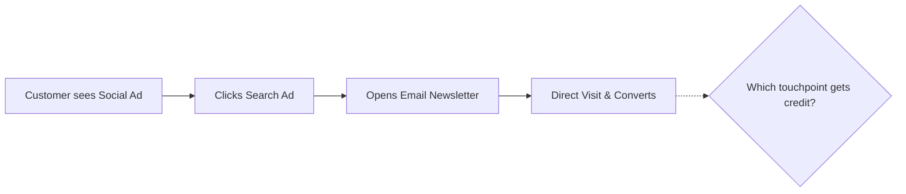

## Measuring Marketing Project Return on Investment

### Overview

Measuring marketing project ROI is the discipline of quantifying the financial return generated by a marketing initiative relative to its cost, translating creative and campaign work into a metric that can be compared against other investment options. Unlike measuring ROI for a straightforward capital purchase, marketing ROI is complicated by attribution difficulty, delayed/lagging effects, and the mix of direct-response and brand-building activities within a single project.

For a project manager, this discipline matters because it closes the loop on the PM lifecycle: a project isn't just "delivered on time and on budget" — it must be evaluated against whether it achieved its intended business value.

### Key Points

- **ROI is a ratio, not an absolute number**: it expresses gain relative to cost, enabling comparison across projects of different sizes.
- **Attribution is the central technical challenge**: multi-touch customer journeys make it difficult to assign credit for a conversion to a single marketing project.
- **Not all value is immediately monetizable**: brand awareness, sentiment, and reach require proxy metrics rather than direct revenue figures.
- **Timeframe selection materially changes the result**: short attribution windows undercount long-sales-cycle B2B campaigns; long windows overcount by including unrelated organic gains.

### The Core ROI Formula

$$\text{Marketing ROI} = \frac{\text{Revenue Attributable to Campaign} - \text{Campaign Cost}}{\text{Campaign Cost}} \times 100\%$$

**Example**

A campaign costing $20,000 (ads, creative production, agency fees) that generates $80,000 in attributable revenue:

$$\text{ROI} = \frac{80{,}000 - 20{,}000}{20{,}000} \times 100\% = 300\%$$

This is read as "a 300% return," or equivalently "$4 returned for every $1 spent" (a 4:1 ratio).

### Full Cost Accounting

**Key Points**

- ROI calculations are frequently distorted by incomplete cost inputs — media spend alone is not total campaign cost.
- A comprehensive cost base should include:

| Cost Category | Examples |
| --- | --- |
| Media/ad spend | Paid search, paid social, display, sponsorships |
| Production costs | Video/photo shoots, copywriting, design, agency fees |
| Tooling/software | Marketing automation platform fees, analytics tools |
| Labor (internal) | PM time, marketing team hours allocated to the project |
| Third-party/vendor fees | Freelancers, influencers, PR agencies |
| Overhead allocation | [Inference] Some organizations allocate a portion of fixed marketing overhead to individual projects, though practice varies widely by company accounting policy. |

### Attribution Models

Attribution models determine how credit for a conversion is distributed across the touchpoints a customer encountered before converting.

| Model | Credit Assignment | Best Fit |
| --- | --- | --- |
| First-touch | 100% to the first interaction | Measuring top-of-funnel/awareness campaigns |
| Last-touch | 100% to the final interaction before conversion | Measuring direct-response/conversion campaigns |
| Linear | Equal credit across all touchpoints | Balanced view across full funnel |
| Time-decay | More credit to touchpoints closer to conversion | Longer consideration-cycle purchases |
| U-shaped (position-based) | 40% first touch, 40% last touch, 20% middle | Emphasizing both awareness and conversion moments |
| Data-driven/algorithmic | Statistical/ML-based credit allocation using historical conversion data | Organizations with sufficient conversion volume and tracking infrastructure |

[Inference] No single attribution model is universally "correct" — the choice should reflect what stage of the funnel the specific marketing project was designed to influence, and organizations often report ROI under multiple models to bound the range of plausible outcomes.

### Measuring Brand and Awareness Campaigns

Not all marketing projects have direct, trackable conversions. Brand campaigns require proxy metrics that correlate with, but do not directly equal, revenue.

**Key Points**

- **Reach and impressions**: raw exposure volume, weakest signal of value on its own
- **Brand lift studies**: pre/post surveys measuring awareness, favorability, and purchase intent shifts
- **Share of voice**: brand's presence relative to competitors across a channel/market
- **Search volume lift**: increase in branded search queries following campaign exposure, often used as a proxy for awareness-driven interest [Inference]
- **Media Mix Modeling (MMM)**: a statistical, aggregate approach (distinct from touchpoint-level attribution) that estimates the incremental contribution of each channel to overall sales using historical spend and outcome data over time — useful when individual-level tracking is unavailable or restricted (e.g., due to privacy regulations)

### Calculating ROI for Different Project Types

**Direct-Response Campaigns (e.g., performance ads, email)**

Straightforward application of the core formula, using platform-reported conversions or CRM-tracked attributed revenue.

**Content Marketing / SEO Projects**

$$\text{Content ROI} = \frac{\text{Value of Organic Traffic Generated} - \text{Production Cost}}{\text{Production Cost}} \times 100\%$$

Value of organic traffic is often estimated using **cost-per-click equivalence** (what it would have cost to acquire the same traffic via paid search) as a proxy, since organic traffic itself isn't directly purchased. [Inference]

**Event Marketing Projects**

Combines direct pipeline generated (leads captured, deals influenced) with softer value (relationship-building, sponsor visibility), often requiring a blended qualitative/quantitative reporting approach.

**Brand Campaigns**

Typically reported via brand lift and share-of-voice deltas rather than a strict ROI percentage, since a clean revenue attribution isn't feasible; some organizations instead calculate a **Marketing Efficiency Ratio (MER)** at the aggregate business level rather than per-campaign.

$$\text{MER} = \frac{\text{Total Revenue}}{\text{Total Marketing Spend}}$$

### Customer Lifetime Value (CLV) Integration

For subscription or repeat-purchase businesses, first-purchase revenue understates a campaign's true return. Incorporating CLV corrects for this:

$$\text{CLV-Adjusted ROI} = \frac{(\text{Customers Acquired} \times \text{Average CLV}) - \text{Campaign Cost}}{\text{Campaign Cost}} \times 100\%$$

**Example**

A campaign acquiring 100 customers at $150 average CLV, costing $8,000:

$$\text{ROI} = \frac{(100 \times 150) - 8{,}000}{8{,}000} \times 100\% = 87.5\%$$

This is markedly different from a first-purchase-only view if average order value were, say, only $40 — which alone would show a negative ROI despite being a genuinely profitable campaign long-term.

### Attribution Windows and Timing

**Key Points**

- The attribution window (e.g., 7-day, 30-day, 90-day click/view window) determines how long after exposure a conversion can still be credited to the campaign.
- Shorter windows favor channels with fast conversion cycles (paid search, retargeting); longer windows are necessary for high-consideration purchases (B2B software, real estate).
- Lag effects mean some campaign ROI cannot be fully assessed until well after project close — PMs should distinguish "in-flight ROI" (preliminary) from "final ROI" (post-lag-window).

### Reporting ROI to Stakeholders

**Key Points**

- Present ROI alongside the underlying assumptions (attribution model, cost inclusions, time window) — an ROI figure without methodology invites disputed comparisons.
- Use a dashboard combining leading indicators (engagement, CTR) with lagging indicators (revenue, ROI) so stakeholders see early signal before final numbers mature.
- Benchmark against the project's original goal/KPI, not just an abstract "good ROI" threshold, since acceptable ROI varies drastically by industry and campaign type.

**Sample Reporting Structure**

| Metric | Target | Actual | Status |
| --- | --- | --- | --- |
| Attributed Revenue | $60,000 | $72,000 | ✅ Above target |
| Total Cost | $18,000 | $18,500 | ⚠️ Slightly over |
| ROI | 233% | 289% | ✅ Above target |
| Attribution Model Used | Last-touch, 30-day window | — | — |

### Common Pitfalls

- Comparing ROI across campaigns that used different attribution models or windows without disclosing the discrepancy
- Omitting internal labor and production costs, artificially inflating ROI
- Applying a single attribution model uniformly across both awareness and direct-response campaigns
- Treating vanity metrics (impressions, likes) as ROI proxies without connecting them to a validated downstream correlation to revenue
- Measuring ROI too early, before the attribution window/lag period has closed
- Ignoring CLV for repeat-purchase businesses, undervaluing genuinely profitable acquisition campaigns

**Related Topics**

- Attribution Modeling and Multi-Touch Analytics Implementation
- Media Mix Modeling (MMM) Fundamentals
- Customer Lifetime Value (CLV) Calculation Methods
- Marketing Budget Allocation Across Channels
- KPI Frameworks for Brand vs. Performance Campaigns
- Event Marketing ROI and Pipeline Attribution