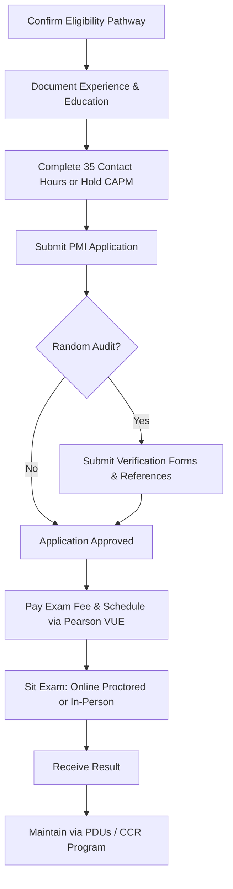
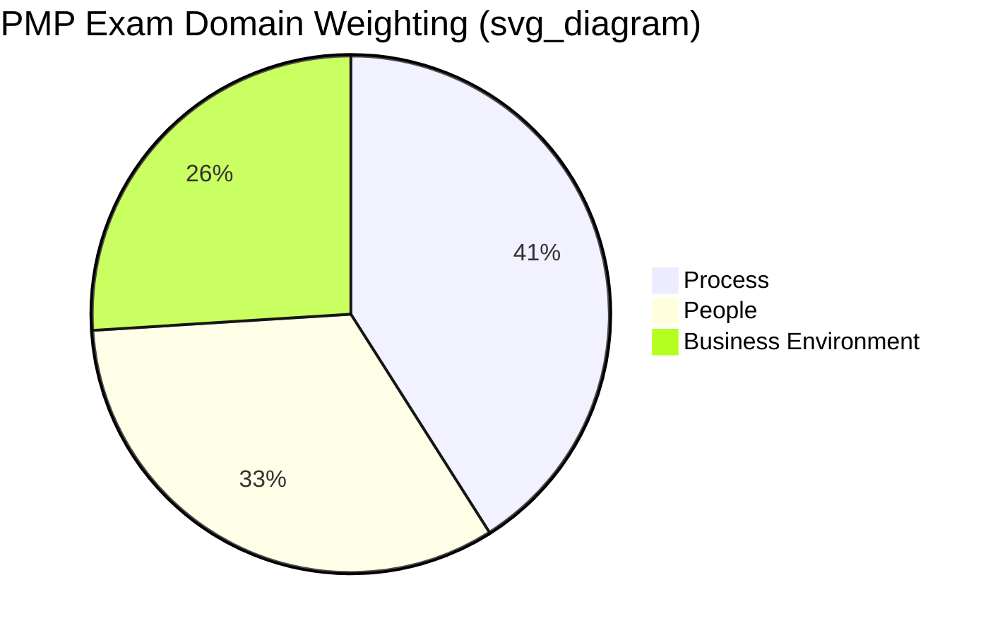

## Project Management Professional (PMP)

### Overview

The Project Management Professional (PMP) is a globally recognized certification issued by the Project Management Institute (PMI) that validates a practitioner's ability to lead and direct projects across methodologies — predictive (waterfall), agile, and hybrid. It is widely treated as the industry-standard credential for project managers across sectors including construction, IT, healthcare, and finance, distinguishing itself from methodology-specific certifications (like a Scrum credential) by covering the full spectrum of project delivery approaches.

PMP-certified professionals often gain better career opportunities, higher salaries, and global recognition because the certification validates both practical project management experience and formal training. [StarAgile](https://staragile.com/info/project-management/pmp-certification-eligibility)

### Key Points

- The PMP is **experience-based**, not purely knowledge-based — unlike entry-level credentials, it requires documented, verifiable project leadership hours before an application is even accepted.
- Eligibility is based on actual project leadership experience — what the candidate did, not their job title — PMI evaluates activities like directing decisions and managing scope/budget/schedule rather than titles alone. [Pmexamstudy](https://www.pmexamstudy.com/pmp-eligibility)
- A significant exam and eligibility update takes effect **July 9, 2026**, aligning the exam with a new edition of PMI's foundational guide.
- The credential requires ongoing maintenance (continuing education) to remain active — it is not a one-time achievement.

### Eligibility Pathways

PMI offers multiple eligibility tracks depending on educational background:

| Pathway | Education | Required PM Experience | Formal PM Education |
| --- | --- | --- | --- |
| Degree-holder track | Four-year degree | 36 months of project management experience | 35 contact hours (or active CAPM) |
| Non-degree track | Secondary diploma (high school/associate) | 60 months of experience | 35 contact hours (or active CAPM) |
| GAC-accredited degree track | GAC-accredited degree | 24 months | 35 contact hours (or active CAPM) |

**Recency Rule**

Beginning with PMI's July 2026 PMP exam update, qualifying project management experience can now come from the last 10 years, replacing the previous 8-year limit. [PMTI](https://www.4pmti.com/learn/pmp-exam-update-2026-pmbok-8th-edition/)

**CAPM Exemption**

Candidates who currently hold an active CAPM certification are exempt from the 35-hour training requirement, since CAPM already validates foundational PM education. [StarAgile](https://staragile.com/info/project-management/pmp-certification-eligibility)

**Self-Employed Candidates**

Self-employed project managers can apply for PMP certification if they meet the standard eligibility criteria — freelance or contract PM work is not automatically excluded. [Invensis Learning](https://www.invensislearning.com/info/pmp-certification-requirements/)

### The 35 Contact Hours Requirement

**Key Points**

- Contact hours refer to formal educational hours in project management, completed through in-person or virtual courses covering topics like project planning, resource management, budgeting, and risk management. [Invensis Learning](https://www.invensislearning.com/info/pmp-certification-requirements/)
- Acceptable sources include instructor-led training, online courses from PMI Registered Education Providers, and college or university courses covering project management. [Invensis Learning](https://www.invensislearning.com/info/pmp-certification-requirements/)
- Informal training or self-study, such as reading books or watching free webinars, does not count toward the 35 hours. [Invensis Learning](https://www.invensislearning.com/info/pmp-certification-requirements/)

**Upcoming Training Provider Change**

From late Q4 2026, PMI will only accept training hours completed through a PMI Authorized Training Partner (ATP) — non-ATP hours will not count toward the 35-hour requirement. [Unverified — confirm current ATP status of any specific training provider directly with PMI before enrolling, as provider accreditation can change.] [Pmexamstudy](https://www.pmexamstudy.com/pmp-eligibility)

### Application and Audit Process

**Key Points**

- PMI may audit an application randomly, requiring signed verification forms or reference contacts who can confirm the candidate's experience. [NovelVista](https://www.novelvista.com/blogs/project-management/pmp-certification-requirements-complete-guide)
- Most applications are approved within 5 business days as long as they are not selected for audit. [PMTI](https://www.4pmti.com/learn/pmp-certification-requirements-whoseligible/)
- Documentation discipline matters well before applying: candidates should begin documenting project roles, dates, and deliverables early, as this evidence is required during the application and potential audit stages. [StarAgile](https://staragile.com/info/project-management/pmp-certification-eligibility)

### The July 2026 Exam Update

**Key Points**

- The updated exam launches in its new format on July 9, 2026, aligned with the PMBOK Guide 8th Edition. [Vcareprojectmanagement](https://www.vcareprojectmanagement.com/blogs/news/pmp-exam-2026-complete-guide)
- The exam tests candidates across three domains: People (33%), Process (41%), and Business Environment (26%), consisting of 180 questions to be completed in 240 minutes. [Vcareprojectmanagement](https://www.vcareprojectmanagement.com/blogs/news/pmp-exam-2026-complete-guide)
- The exam update does not affect how candidates schedule and take the exam — candidates still take it through Pearson VUE in online proctored or in-person format after PMI approves their application. [PMTI](https://www.4pmti.com/learn/pmp-exam-update-2026-pmbok-8th-edition/)

### Exam Domain Breakdown

*(Note: rendered here as unrendered plaintext per formatting rules — treat as a reference table equivalent.)*

| Domain | Weighting | Focus Area |
| --- | --- | --- |
| Process | 41% | Technical project management: scope, schedule, cost, quality, risk, procurement |
| People | 33% | Leading teams, conflict resolution, stakeholder engagement, servant leadership |
| Business Environment | 26% | Organizational strategy alignment, compliance, benefits realization |

### Cost Structure

| Item | PMI Member | Non-Member |
| --- | --- | --- |
| Exam fee | $425 | $675 |
| Retake fee | $275 | $375 |
| PMI annual membership | $164 + tax, plus a $10 initial administrative fee | — |
| Authorized training course | $300 to $2,000 depending on provider and support level | — |

Membership is generally more cost-effective because it reduces exam and renewal fees and provides access to PMBOK Guides and other study tools. [Inference] Fee schedules are subject to periodic revision by PMI (one source references an increase expected around August 2026), so current figures should be verified directly on PMI's website before budgeting. [PMTI](https://www.4pmti.com/learn/pmp-certification-requirements-whoseligible/)

### Maintaining Certification

**Key Points**

- PMP holders must earn Professional Development Units (PDUs) within each three-year cycle to maintain the credential — this is standard across PMI's Continuing Certification Requirements (CCR) program.
- PDUs are typically earned through a mix of formal education, giving back to the profession (e.g., mentoring, volunteering), and practical application of project management work.
- Failure to accumulate required PDUs within the cycle results in certification suspension, followed by expiration if unresolved. [Inference — specific suspension/expiration timelines should be confirmed against PMI's current CCR handbook, as administrative policies can be updated independently of exam content changes.]

### Common Pitfalls

- Underdocumenting project experience early, leading to audit delays or rejected applications
- Assuming a job title alone (e.g., "Project Coordinator") qualifies or disqualifies experience, when PMI evaluates actual responsibilities performed
- Completing non-ATP training hours after the Q4 2026 cutoff, risking hours not counting toward eligibility
- Treating self-study or free webinars as contact hours, which PMI does not accept
- Neglecting PDU accumulation post-certification, risking credential lapse
- Assuming a master's degree changes baseline eligibility requirements — a master's degree does not automatically change the basic requirements, though it may enhance overall qualifications [Invensis Learning](https://www.invensislearning.com/info/pmp-certification-requirements/)

**Next Steps**

- CAPM (Certified Associate in Project Management) as a Pre-PMP Pathway
- PMBOK Guide 8th Edition — Key Structural Changes
- PMI-ACP (Agile Certified Practitioner) as a Complementary Credential
- Building a PDU Maintenance Plan for Ongoing Certification
- Comparing PMP vs. PRINCE2 for International Career Mobility
- Preparing an Audit-Ready Experience Documentation Log