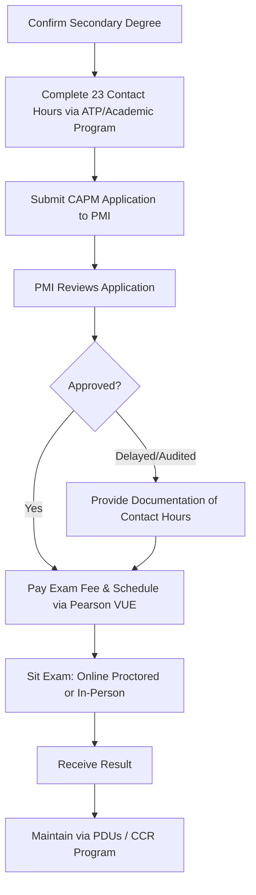

## Certified Associate in Project Management (CAPM)

### Overview

The Certified Associate in Project Management (CAPM) is PMI's entry-level project management certification, designed for students, career changers, and early-career professionals who have limited or no formal project leadership experience. It validates foundational knowledge of project management terminology, processes, and frameworks — predictive, agile, and hybrid — without requiring the multi-year documented experience that PMI's more advanced PMP credential demands.

CAPM in 2026 is treated by many organizations as a baseline capability credential for PMO pipelines, delivery teams, analysts, coordinators, and early-career project talent, reflecting rising industry demand for project management talent generally.

### Key Points

- **No project experience requirement**: PMI removed the previous 1,500-hour project experience option in August 2024, making the sole substantive prerequisite 23 contact hours of project management education.
- **Low barrier to entry relative to PMP**: compare the CAPM's education-only pathway against the PMP's 36–60 months of documented project leadership experience — the accessibility gap is a primary reason the CAPM exists as a distinct credential.
- **Exam content spans multiple methodologies**: PMI's CAPM exam blueprint explicitly reflects predictive, adaptive (agile), and business analysis principles, not solely traditional waterfall processes.
- **Can serve as a PMP on-ramp**: holding an active CAPM exempts a candidate from the PMP's separate 35-contact-hour training requirement.

### Eligibility Requirements

| Requirement | Detail |
| --- | --- |
| Education | Secondary degree — a high school diploma, associate degree, or global equivalent |
| Project management education | 23 contact hours of formal project management instruction, completed before the exam date |
| Project experience | None required (removed by PMI in August 2024) |

**What Counts Toward the 23 Contact Hours**

Qualifying hours typically come from instructor-led training, workshops or courses from PMI Authorized Training Partners (ATPs), and university/college academic or continuing-education programs with an end-of-course assessment.

**What Does Not Count**

Work experience, independent reading, general business or leadership courses that are not specific to project management, and any training without documented hours do not satisfy the requirement. Candidates should complete the hours before their exam date and retain the completion certificate, as PMI can request it during review.

### Application Workflow

**Key Points**

- After submitting an application, PMI reviews it to confirm the requirements are met; this review usually takes a few days but can take longer during high-volume periods.
- A candidate's eligibility to sit the exam is valid only for a limited window after approval, making prompt exam scheduling and preparation important.

### Exam Structure and Content Domains

The CAPM exam blueprint reflects a broader value-delivery spectrum than older, purely predictive-methodology versions of the exam, incorporating predictive, agile, and business analysis content areas. [Inference] Exact question counts, timing, and domain weight percentages are periodically revised by PMI alongside its broader exam content outline updates — candidates should verify the current Examination Content Outline (ECO) directly on PMI's website before final exam preparation, since specific figures were not consistently reported across sources at time of writing.

### Cost Structure

| Item | Note |
| --- | --- |
| Exam fee | Confirm current pricing directly at pmi.org, as PMI periodically revises certification fees across its portfolio |
| PMI membership | Optional for CAPM — the member exam discount is smaller than the PMP's discount |
| Training (23 contact hours) | Costs vary by provider; many ATPs bundle the required hours into a packaged exam-prep course |

**Membership Consideration**

Unlike the PMP, where membership is often clearly cost-effective, PMI membership is a closer call for CAPM candidates specifically because the exam discount is smaller. Joining makes more sense if a candidate expects to pursue the PMP later or wants PMBOK Guide access; skipping it is reasonable if the CAPM is the only near-term goal.

### CAPM vs. PMP Comparison

| Dimension | CAPM | PMP |
| --- | --- | --- |
| Experience required | None | 36–60 months of documented project leadership |
| Education/training | 23 contact hours | 35 contact hours (waived with active CAPM) |
| Target candidate | Entry-level, students, career changers | Experienced project leaders |
| Career signal | Foundational knowledge validation | Demonstrated leadership and delivery track record |
| Typical career stage | Pre-PM or early-career PM-adjacent roles | Established project manager / senior coordinator+ |

[Inference] Published salary estimates for CAPM holders vary by source, region, and role — general ranges cited across industry sources place US-based CAPM holders broadly in line with entry-to-mid-level project coordination roles, but candidates should treat any specific published figure as indicative rather than authoritative given the wide variance by industry and geography.

### Recent Changes to the Credential

**Key Points**

- PMI removed the 1,500-hour project management experience requirement in August 2024 specifically to make the CAPM more accessible, based on PMI's research finding that many people most interested in becoming certified did not have prior field experience — even at entry level.
- The current prerequisite structure — secondary degree plus 23 contact hours — replaced the prior dual-pathway structure (experience OR education).
- CAPM holders who later pursue the PMP have their 35-hour PMP training requirement waived, streamlining the transition between the two credentials.

### Maintaining Certification

**Key Points**

- Like the PMP, the CAPM is maintained through PMI's Continuing Certification Requirements (CCR) program, requiring Professional Development Units (PDUs) accumulated within a defined renewal cycle.
- PDUs are generally earned through continued education and professional engagement activities consistent with PMI's broader certification maintenance framework. [Inference — the specific PDU count and cycle length for CAPM should be confirmed against PMI's current CCR handbook, as this was not consistently detailed across available sources and may differ from the PMP's maintenance requirements.]

### Common Pitfalls

- Assuming general business or leadership training satisfies the 23-hour requirement when it must be project-management-specific
- Waiting to document contact hours until after the exam, risking incomplete records if PMI requests verification
- Treating the CAPM as equivalent in market signal to the PMP — employers generally view them as serving different career stages
- Not verifying current ATP status of a training provider before enrolling, given PMI's evolving accreditation requirements for contact-hour-qualifying courses
- Letting the exam eligibility window lapse after application approval due to delayed study/scheduling

**Next Steps**

- CAPM vs. PMP — Detailed Career Pathway Comparison
- Building a 23-Contact-Hour Study Plan via PMI ATPs
- Transitioning from CAPM to PMP: Documenting Early Project Experience
- Understanding PMI's Examination Content Outline (ECO) Update Cycle
- PMI-ACP as an Alternative Early-Career Agile-Focused Credential
- PDU Accumulation Strategies for Early-Career PMI Credential Holders