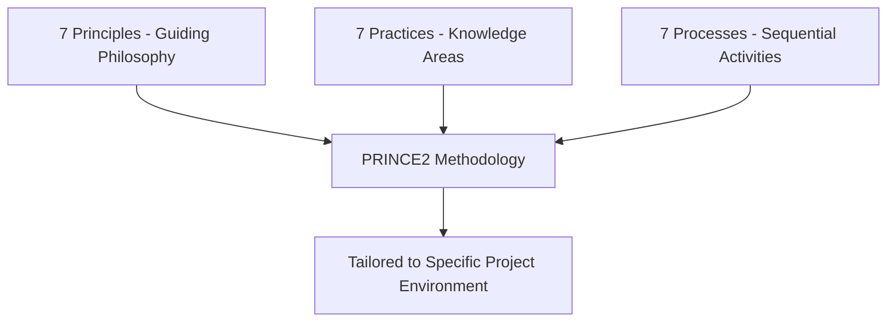
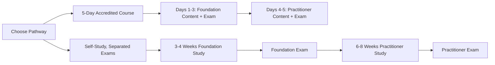

## PRINCE2 Foundation and Practitioner

### Overview

PRINCE2 (**PR**ojects **IN** **C**ontrolled **E**nvironments) is a structured, process-driven project management methodology with roots in the UK government's IT delivery programmes of the 1980s. It is maintained and owned by PeopleCert, which acquired AXELOS — the joint venture that had managed PRINCE2 since 2013 — in 2021. Unlike the PMP, which certifies knowledge and experience across any methodology, PRINCE2 certifies proficiency in a specific, well-defined framework — prescriptive and process-oriented, which makes it particularly valuable in government, defence, regulated industries, and large enterprise environments requiring consistent governance.

The methodology is the dominant PM standard across the UK public sector, European enterprise, Middle East government, and Commonwealth countries including Australia, South Africa, Nigeria, and parts of Asia.

**[Unverified — source conflict]** Search sources disagree on the release timeline of the "7th Edition": some describe it as already released and established since 2023, forming the basis of exams from 2024 onward, while other, similarly-dated sources describe a 7th Edition launching courses from September 2026. This may reflect confusion between an actual 2023 edition update and a separate 2026 refresh/rebrand in some marketing material, or genuinely inconsistent reporting across training providers. Verify the current edition and effective exam date directly at peoplecert.org/PRINCE2 before registering or budgeting study time.

### Key Points

- PRINCE2 is delivered as **two sequential certification levels**: Foundation (knowledge-based) and Practitioner (application-based) — Practitioner cannot be attempted without holding a valid Foundation-level prerequisite.
- Foundation validates understanding of the methodology; Practitioner tests the ability to apply it in realistic project scenarios, and is the level that carries greater weight with employers.
- PeopleCert is the sole body responsible for conducting PRINCE2 exams, all delivered online in objective test format.
- The methodology is built around **7 Principles, 7 Practices (previously called "Themes"), and 7 Processes** — a structure emphasized across recent edition updates.

### PRINCE2 Structural Framework

**7 Principles** (guiding obligations that must be followed for a project to be considered "PRINCE2"):

Continued business justification, learn from experience, defined roles and responsibilities, manage by stages, manage by exception, focus on products, tailor to suit the project environment.

**7 Practices** (formerly "Themes" — continuously addressed knowledge areas):

Business case, organization, quality, plans, risk, issues, progress.

**7 Processes** (sequential activity groups spanning the project lifecycle):

Starting up a project, directing a project, initiating a project, controlling a stage, managing product delivery, managing a stage boundary, closing a project.

### Edition Changes (7th Edition)

**Key Points**

- Renamed the seven "Themes" to seven "Practices" and updated the seven Principles with modernized language.
- Introduced explicit integration with agile and digital delivery approaches, rather than treating PRINCE2 as purely waterfall/predictive.
- Strengthened guidance on people-focused leadership and sustainability considerations.
- Added new commercial management content, reflecting greater emphasis on vendor/contract-aware project governance.
- The updated exam format aligns fully with this edition, featuring themes around people, sustainability, and digital transformation, with scenario-based questions described as more practical and realistic rather than more difficult.

### Foundation Level

**Purpose**

To determine whether a candidate is able to act as an informed member of a project management team, utilizing PRINCE2 methodologies. It tests knowledge of PRINCE2 terminology and structure rather than applied judgment.

**Exam Format**

| Attribute | Detail |
| --- | --- |
| Question format | Multiple-choice (classic, missing-word, and list-style questions) |
| Number of questions | 60 |
| Duration | 60 minutes |
| Pass mark | 36/60 (60%) |
| Book policy | Closed-book |
| Prerequisites | None |
| Approximate fee | ~£295 / ~$395 (varies by region/provider) |

The PRINCE2 Foundation certification is intended for those who are new to PRINCE2 and have little experience in project management — no official project experience is required, though familiarity with how projects function can improve confidence with scenario-based questions.

### Practitioner Level

**Purpose**

To ensure candidates can manage projects in a structured, controlled, and consistent manner, and — critically — to test the ability to **apply** PRINCE2 principles, practices, and processes to realistic scenarios rather than merely recall them. It enables professionals to understand how to tailor PRINCE2 to different project environments, assess project risks, manage resources effectively, and ensure projects are delivered on time, within scope, and within budget.

**Exam Format**

| Attribute | Detail |
| --- | --- |
| Number of questions | 70 |
| Duration | 150 minutes |
| Pass mark | 60% |
| Book policy | Open-book (official manual only) |
| Prerequisites | Valid PRINCE2 Foundation certification (current or prior edition, per accepted prerequisite policy) |
| Approximate fee | ~£445 / ~$565 (varies by region/provider) |
| Renewal | Every 3 years |

**Important Exam-Day Note**

Candidates who purchased an older edition's manual must upgrade to the current edition's manual for the exam — an outdated manual cannot be brought into the open-book Practitioner exam. [Unverified — confirm current manual edition acceptance policy directly with PeopleCert before exam day, given the edition-timeline ambiguity noted above.]

### Typical Study and Exam Pathways

**Key Points**

- Most candidates take Foundation and Practitioner back-to-back rather than as fully separated pursuits, particularly in accredited classroom formats.
- A common intensive path is a 5-day accredited course: Foundation content across days 1–3 with the Foundation exam on day 3 afternoon, followed by Practitioner content on days 4–5 with the Practitioner exam on day 5 afternoon.
- A self-study path typically spans 3–4 weeks of Foundation preparation followed by 6–8 weeks of Practitioner preparation, reflecting the greater depth of application-based content at the Practitioner level.

### PRINCE2 vs. PMP

| Dimension | PRINCE2 | PMP |
| --- | --- | --- |
| Certifying body | PeopleCert | PMI |
| Approach | Prescriptive, process-oriented, specific methodology | Knowledge/experience-based, methodology-agnostic (predictive/agile/hybrid) |
| Experience prerequisite | None for Foundation; none formally required for Practitioner beyond Foundation | 36–60 months documented project leadership |
| Regional strength | UK public sector, European enterprise, Commonwealth countries, government/regulated industries | Broadly global, especially strong in North America and multinational private sector |
| Renewal cycle | Practitioner renews every 3 years | 3-year cycle via PDU accumulation (CCR program) |

[Inference] Organizations operating primarily within UK-influenced government or regulated sectors often weight PRINCE2 more heavily in hiring, while multinational private-sector roles — particularly in North America — more frequently reference the PMP; candidates working across both contexts sometimes pursue both credentials for broader mobility.

### Common Pitfalls

- Attempting to register for Practitioner without confirming Foundation prerequisite validity under current PeopleCert policy
- Bringing an outdated edition's manual into the open-book Practitioner exam
- Treating Foundation-level knowledge as sufficient for real-world project application — Practitioner-level scenario judgment is a distinct skill set
- Assuming PRINCE2 and PMP are interchangeable credentials rather than reflecting different governance philosophies (prescriptive framework vs. methodology-agnostic standard)
- Not verifying current exam fees, formats, and edition status directly with PeopleCert given the pace of recent framework updates

**Next Steps**

- PRINCE2 Agile — Integrating PRINCE2 Governance with Agile Delivery
- PRINCE2 vs. PMP — Detailed Decision Framework for Career Path Selection
- The 7 PRINCE2 Practices in Depth: Business Case, Risk, and Quality
- Tailoring PRINCE2 to Small vs. Large Project Environments
- PeopleCert Exam Registration and Renewal Process Walkthrough
- Applying PRINCE2 Governance Structures in Non-UK Regulatory Contexts